# Python 熊猫教程-2

> 原文：<https://medium.com/codex/python-pandas-tutorial-2-24bc38ada44a?source=collection_archive---------10----------------------->

本博客将涵盖数据框、系列及其功能。

因此，如果你在网上查看数据框的定义，就会发现熊猫数据框是一个二维数据结构，就像一个二维数组，或者一个包含行和列的表格。

为了清楚地理解，让我们用一个字典来检查下面的例子，我们想要创建一个包含两个关键字的字典，用户名和电子邮件地址。

```
user = {'name':'vivek',
'mail':'vivek@email.com'}
```

这里，我们已经创建了一个具有姓名和电子邮件地址的用户，但是如果我们想要向这个字典添加更多的用户，简单的解决方案是，我们可以使用字符串列表而不是字符串作为值。

```
user = {'name':['vivek','alka'],
'mail':['vivek@email.com','alka@email.com']}
```

现在，我们有了一个包含多个值的用户字典，如果我们使用该字典创建一个数据框并显示该数据框，请检查下面的代码。

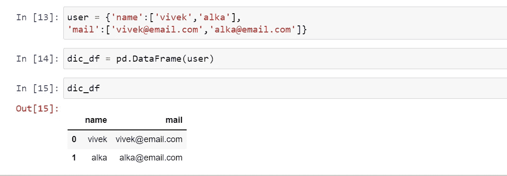

因此，数据框是键和值的集合，其中键是列，行是这些列的值。

现在，如果我们只想访问电子邮件，那么我们可以访问类似于字典。

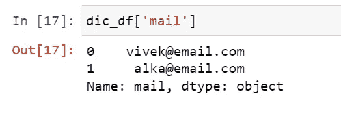

但是如果你检查值的类型，那么你将得到序列的结果，检查下面的代码。

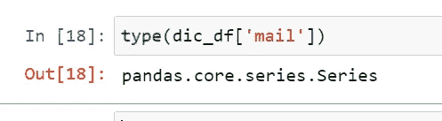

所以它以“pandas.core.series.series”的形式出现，这意味着 pandas 中的 Series 是行的数据。所以我们可以说一个数据帧是多个序列的容器。

现在，如果我们想要访问多个列，那么我们可以将列名作为一个列表传递。

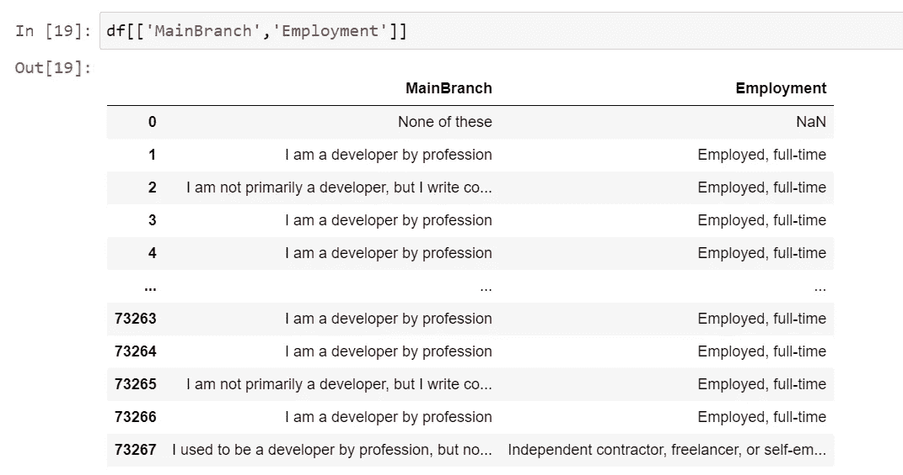

类似地，如果我们想要访问所有的列名，我们可以使用相同的列。

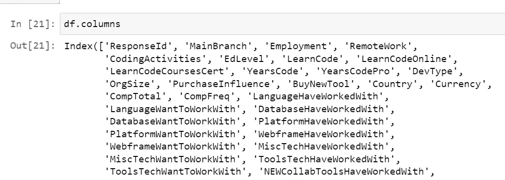

现在，如果我们想从数据帧中访问行，那么我们有两个方法‘loc’和‘iloc’。我将在我的下一篇博客中解释这两者之间的确切区别，我将在那里讨论这个指数。

“iloc”表示整数位置，因此，如果您想要基于索引访问行，我们可以使用“iloc”来实现同样的目的。

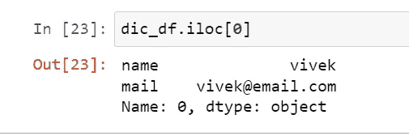

它将从数据框中返回第一行，如果我们想要一个行列表作为输出，那么我们可以通过索引传递这个列表。

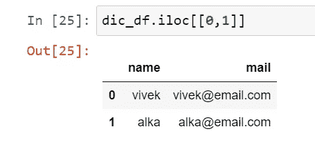

此外，如果我们想要一个列以及行，那么我们可以在“iloc”中将列索引作为第二个参数传递，如果您想要列的列表，那么我们可以将列表作为第二个参数传递。

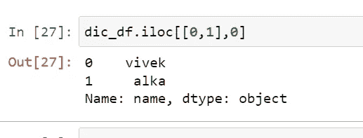

因此，这里我们只得到数据集中的第一列和两行。

现在，我们将使用“loc”检查一个类似的示例，这里我们需要传递列标签而不是列索引，它将对标签进行操作(将在下一篇博客中详细讨论)。

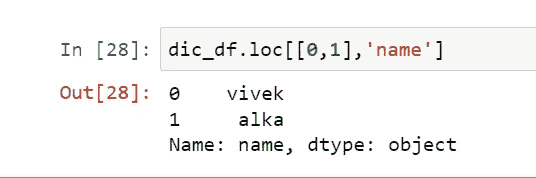

现在，我们将检查切片以过滤数据，它类似于列表切片，唯一的区别是这里最后一个值是包含的，但在列表切片中是排他的。

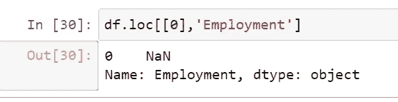

这里，我们获取就业列的第一行，如果我们想要访问前三行，那么我们可以使用带切片的代码。

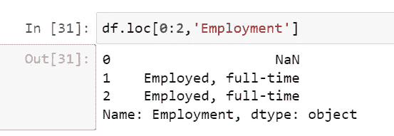

类似地，对于该列，如果我们还想显示接下来的几列，我们也可以提到它。

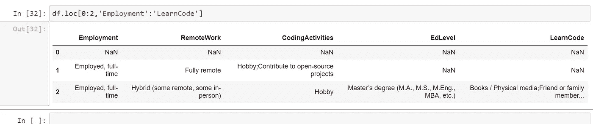

在下一篇博客中，我们将继续对数据帧和数据系列进行高级过滤和查询。