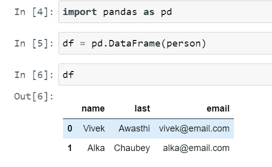

# Python 熊猫教程— 3

> 原文：<https://medium.com/codex/python-pandas-tutorial-3-5909b53ee973?source=collection_archive---------10----------------------->

在本教程中，我们将详细介绍索引，以及如何在数据框中设置、重置和使用索引。

在上一个教程中，我们使用“person”字典创建了一个数据框，下面是数据。

因此，在左侧，我们有一个标题包含从 0 开始的数字的列。那是熊猫提供的默认指数。

除了默认索引，如果您想将任何其他列作为数据框的索引，我们可以在数据框中使用“set_index”方法来实现。

在这里，我们将电子邮件设置为数据框的索引，这就是为什么它会以粗体显示在左侧。

如果您使用“df”再次打印数据帧，下面是输出。

在输出中，显然没有进行任何更改，它与之前的输出相同，因此在 Pandas 中，我们可以设置索引并检查输出，但它不会修改实际的数据帧，因此如果您想要修改数据帧，我们必须将“inplace=True”作为第二个参数传递。

现在，我们可以使用索引作为电子邮件来访问数据框。

而且，如果我们打印数据框的索引，我们能够以电子邮件的形式查看值。

此外，如果我们使用“loc”方法使用整数索引并尝试访问数据，我们将会得到一个错误，因为整数索引不再可用于数据帧。但是使用“iloc”，我们仍然可以对数据帧使用整数位置。

此外，如果我们不小心设置了索引并想要重置它，我们可以使用“reset_index”方法，并且如果我们想要实现更改，需要传递“inplace=True”。

现在，我们将切换回使用 Stackoverflow 调查结果创建的更大的数据框。

因此，当从 excel 创建数据框时，我们可以通过将额外的参数作为“index_col”传递来设置索引。

同样，我们将导入' schema.csv '文件并创建索引。

现在，如果我们想使用排序索引，我们可以使用“sort_index”方法，如果我们想实现，那么我们可以传递“inplace=True”。

在下一篇教程中，我们将使用 pandas 来介绍高级过滤器和查询。