# Python 熊猫教程— 4

> 原文：<https://medium.com/codex/python-pandas-tutorial-4-9a2431642f54?source=collection_archive---------13----------------------->

本教程将介绍 Pandas 的过滤，使用条件来过滤行和列。

我们有一个使用字典创建的数据框，它包含三列——第一列、最后一列和电子邮件。

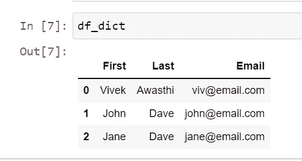

现在，我们要过滤数据，其中 Last 等于' Dave '，所以我将创建一个变量，并将条件与姓氏放在一起，下面是输出。

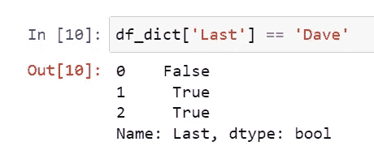

因此，我们得到的输出是意想不到的，我们想要一个包含所有数据的数据框，其中姓氏等于“Dave ”,但我们得到的不是相同的值，而是一个包含 True 和 False 值的布尔值列表。

为了获得预期的数据，我们需要将这个条件直接传递给我们的数据框，或者我们将这个输出存储在一个变量中并将其传递给数据框，这两种方式都可以。

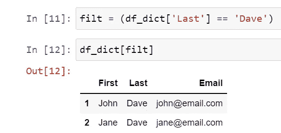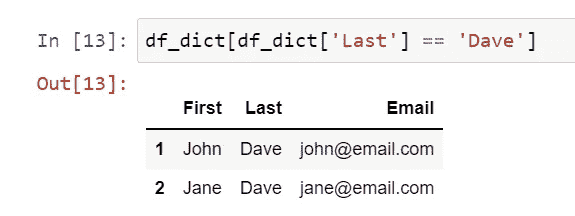

现在，我们将借助“and”和“or”运算符添加更多的条件，这里我们将用“&”表示“AND”，用“|”表示“OR”。

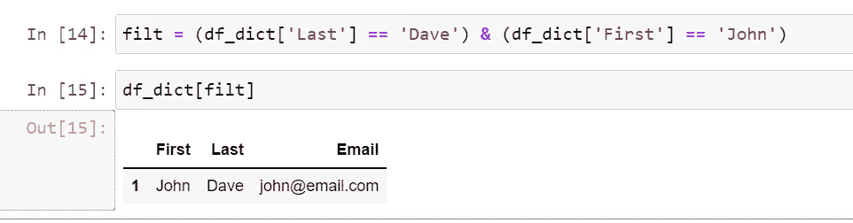

同一个过滤器也可以与' loc '一起使用，使用' loc '的唯一好处是，我们可以将列名与条件一起传递，以获得特定的列数据。

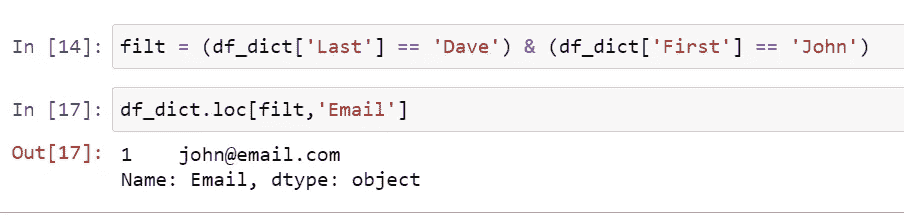

如果我们想要这个过滤器的相反结果，那么我们可以在我们的过滤器中添加一个' ~ '符号，而不是修改条件，这样它将忽略过滤器并提供相反的结果。

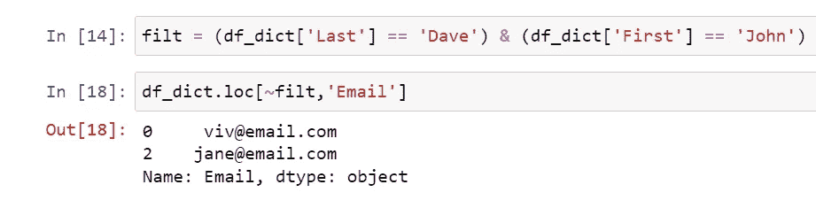

现在，我们将使用 Stackoverflow 调查数据筛选出一些条件，在数据中，我们有一列“ConvertedCompYearly”显示年薪，让我们筛选出年薪超过 70000 的受访者。

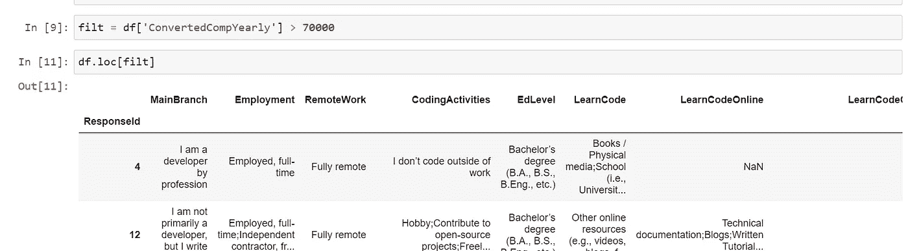

为了得到结果，整洁干净地过滤掉一些列，取 Country、LanguageHaveWorkedWith、ConvertedCompYearly 和 Currency。

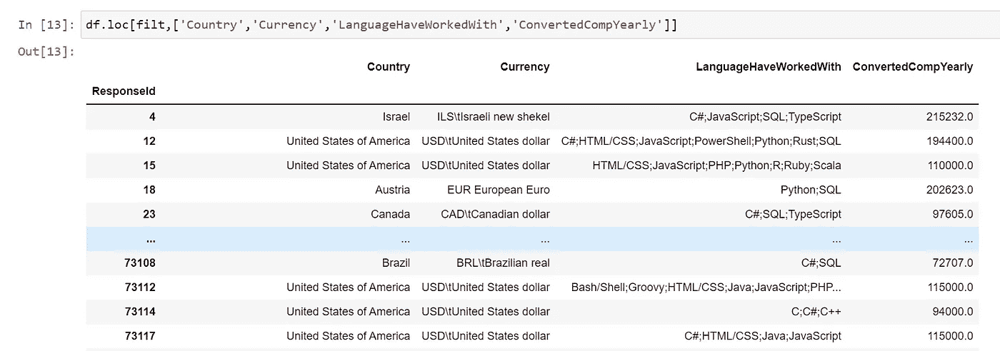

现在，我们有工资高于 70000 的数据，并且只有几列需要显示。

如果我们想要添加条件，其中我们想要得到响应国家是印度或美国的结果，而不是将其放入条件中并使其太大，我们将使用 isin()方法并传递国家列表。

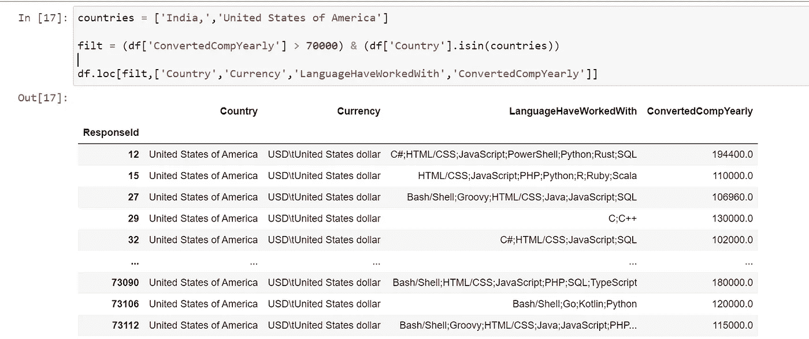

现在，我们想过滤掉语言中包含 Python 的结果，好的一面是我们可以使用 String 方法来执行一些操作。

所以我们可以使用 contains 方法并检查包含 Python 的结果。

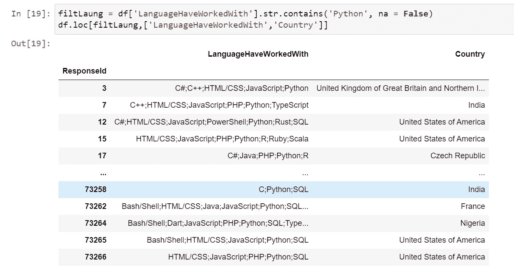

在下一篇文章中，我们将更新行和列，同时修改数据框中的数据。