# 熊猫的数据分析

> 原文：<https://medium.com/codex/python-pandas-tutorial-42be3e827e2a?source=collection_archive---------2----------------------->

## 数据科学教程

## 如何对熊猫进行数据分析的指南？


[JESHOOTS.COM](https://unsplash.com/@jeshoots?utm_source=medium&utm_medium=referral)在 [Unsplash](https://unsplash.com?utm_source=medium&utm_medium=referral) 上拍照

[熊猫](https://pandas.pydata.org/)是 Python 最重要的库之一。可以使用 Pandas 进行数据分析和数据预处理。在这篇文章中，我将讨论以下主题:

*   加载数据集
*   探索数据集
*   使用 loc 和 iloc 方法选择
*   整理
*   使用系列
*   过滤
*   分组

让我们开始吧！

[](https://www.youtube.com/c/TirendazAcademy/videos) [## 蒂伦达兹学院

### Tirendaz Academy 是一个在线教育平台，在数据科学、人工智能、机器…

www.youtube.com](https://www.youtube.com/c/TirendazAcademy/videos) 

# 用熊猫加载数据集

我将在这篇文章中使用的数据集是视频游戏销售额。该数据集包含销量超过 100，000 份的视频游戏列表。

> 你可以从[这里](https://www.kaggle.com/code/tirendazacademy/video-game-sales-anaysis-with-pandas)找到数据集和笔记本。

在加载数据集之前，让我们导入 pandas 库。

```
import pandas as pd
```

数据分析最重要的阶段之一是加载数据集。您可以在 Pandas 中使用 read.csv 方法加载数据集。让我们使用 read_csv()方法加载数据集。

```
games = pd.read_csv("vgsalesGlobale.csv")
```

如果需要，我们可以使用 index_col 参数指定一个索引列。让我展示这个。

```
games = pd.read_csv("vgsalesGlobale.csv", index_col = "Name")
```

# 探索数据集

您可以使用 head 方法查看数据集的第一行。让我们看看数据集的前 5 行。

```
games.head()
```

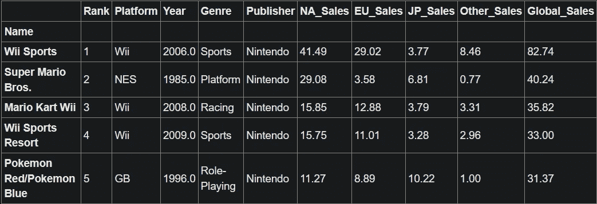

熊猫有两种数据结构；系列和数据框架。Excel 等由行和列组成的数据结构称为 *DataFrame。*数据帧可以包括不同的数据结构，如数字或分类。另一种数据结构是由单列组成的系列。

使用 tail 方法可以看到数据集的最后几行。

```
games.tail()
```

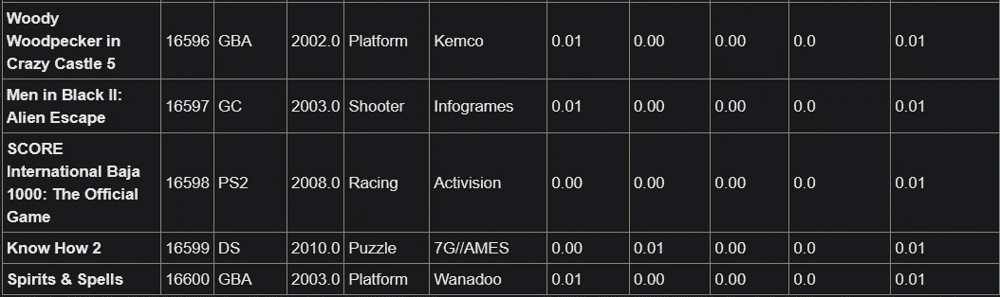

默认情况下，显示最后 5 行。您还可以看到最后 10 行。

```
games.tail(10)
```

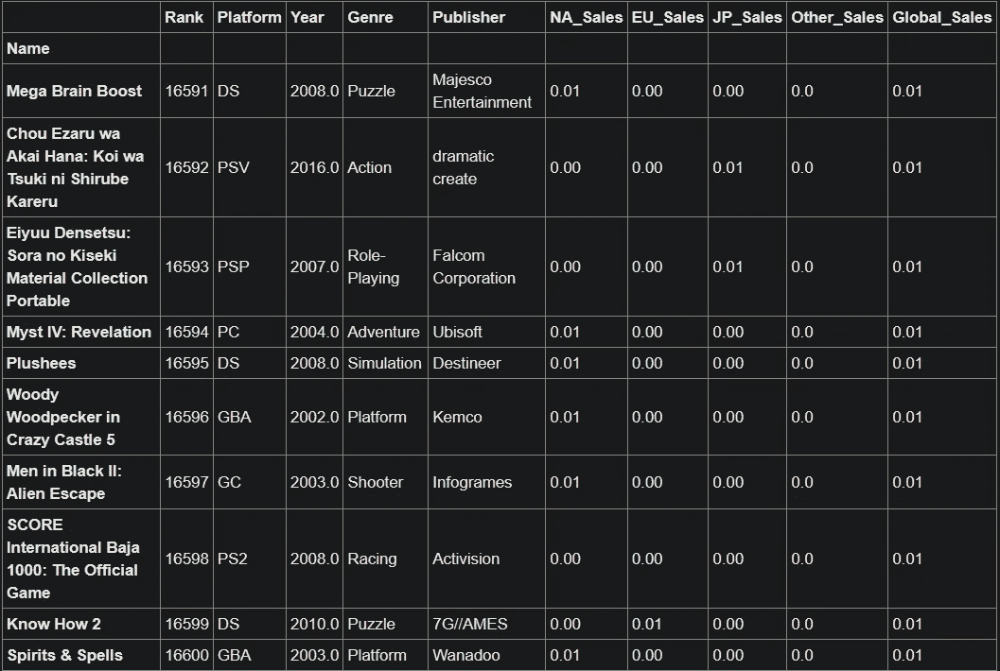

让我们用 len 方法来看看数据集的行数。

```
len(games)# Outout: 
16598
```

您可以使用 shape 属性查看数据集的形状。

```
games.shape# Outout: 
(16598, 10)
```

您可以看到具有 dtype 属性的列的数据类型。

```
games.dtypes
```

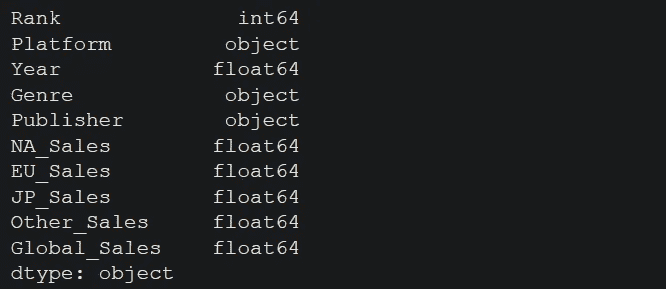

# 使用 loc 和 iloc 方法选择

使用 iloc 方法可以看到数据集中的任何一行。假设我们想看第 300 行。注意，我将在 iloc 方法中写 299，因为在 Python 中索引是从零开始的。

```
games.iloc[299]
```

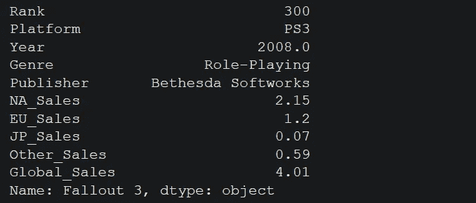

没有人不知道超级马里奥的游戏。让我们用一个索引标签来选择这个游戏。您可以为此使用 loc 方法。

```
games.loc["Super Mario Bros."]
```

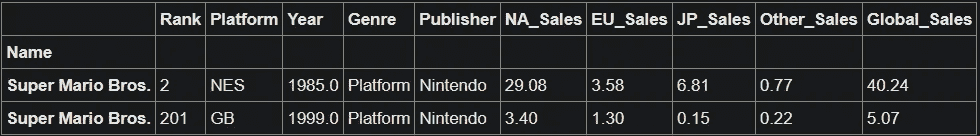

在数据集中，有两种超级马里奥游戏，分别制作于 1985 年和 1999 年。

# 整理

现在让我们使用 sort_value 方法按年份对游戏进行排序。

```
games.sort_values(by = "Year").head()
```

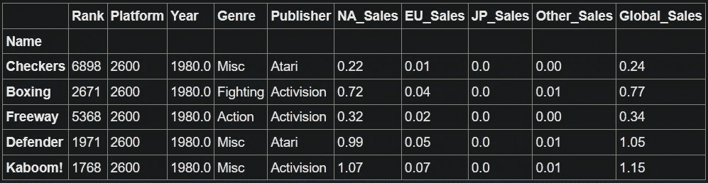

您可以使用 ascending 参数按降序对值进行排序。让我把这个论点设为假。

```
games.sort_values(by = "Year", ascending = False).head()
```

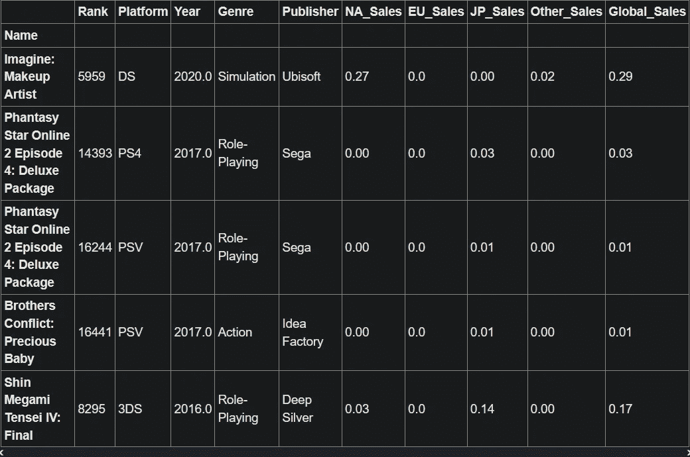

您也可以按两列排序。让我们按年份和流派列对数据集进行排序。

```
games.sort_values(by = ["Year","Genre"]).head()
```

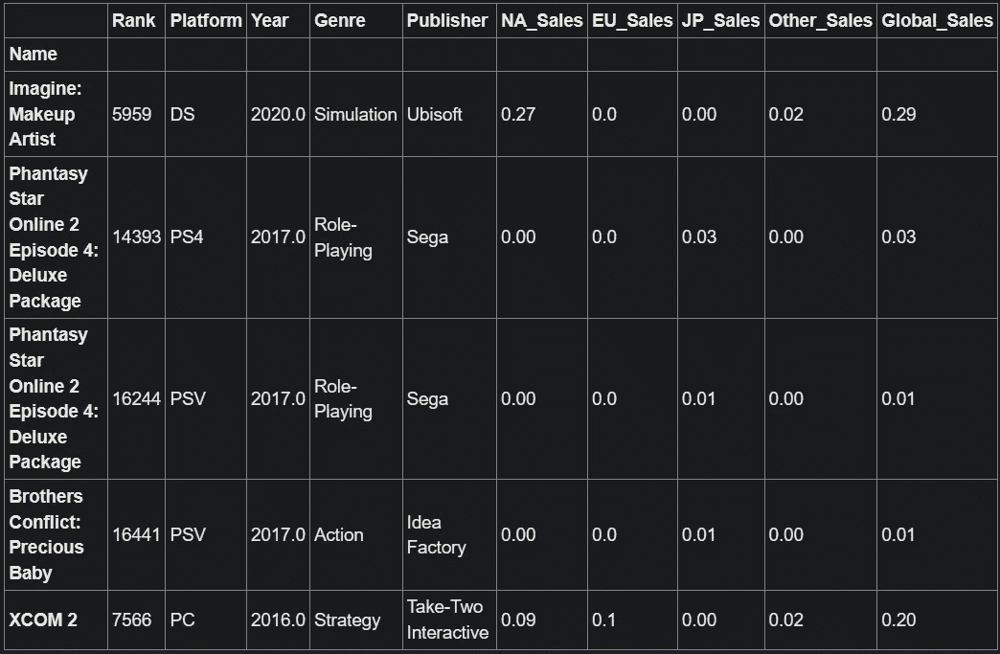

您还可以按索引对数据集进行排序。

```
games.sort_index().head()
```

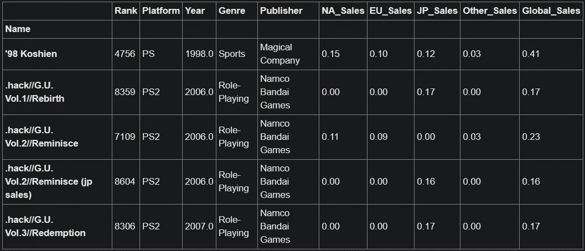

因此，数据集中的索引按字母顺序排列。

# 使用系列

您可以在数据集中选择一列。例如，让我们看看 publisher 列的前十行。

```
games["Publisher"].head(10)
```

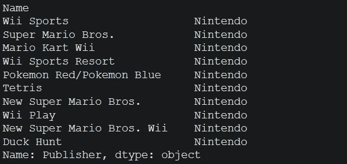

# 过滤

有时，您可能希望根据某些标准筛选行。例如，让我们看看类型为动作的行。

```
games[games["Genre"] == "Action"]
```

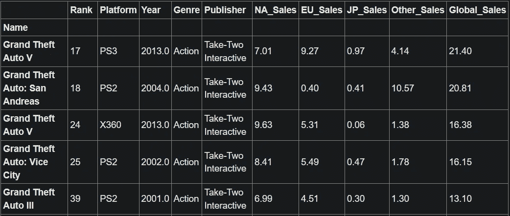

有一个过滤的方法。让我展示这个。首先，我将把过滤器赋给一个变量。

```
games_by_genre = games["Genre"] == "Action"
```

接下来，让我们根据这个变量进行筛选。

```
games[games_by_genre].head()
```


我得到了与上面相同的结果。现在让我们用 2010 年制作的游戏来创建一个标准。

```
games_in_2010 = games["Year"] == 2010
```

现在让我们根据这两个标准进行筛选。

```
games[games_by_genre & games_in_2010]
```

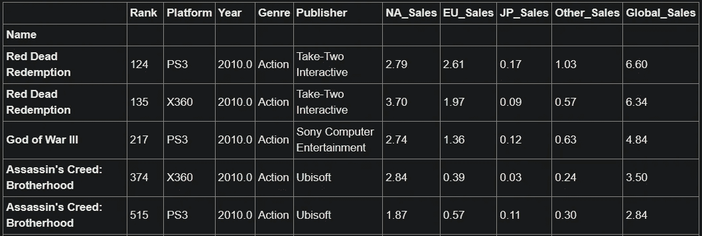

还可以看到 2010 年制作的游戏或者动作类的。你可以用管子做这个。

```
games[games_by_genre | games_in_2010]
```

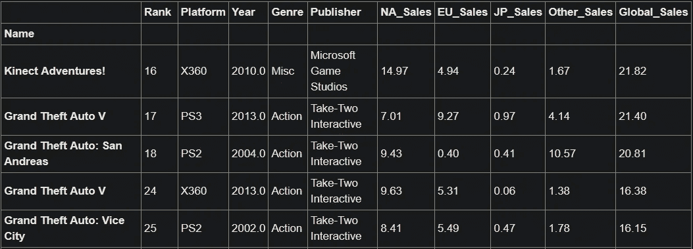

您还可以看到大于或小于某个值的值。比如我们看看 2015 年以后做的游戏。首先，让我们创建我们的标准。

```
after_2015 = games["Year"] > 2015
```

现在让我们用这个变量来过滤。

```
games[after_2015]
```

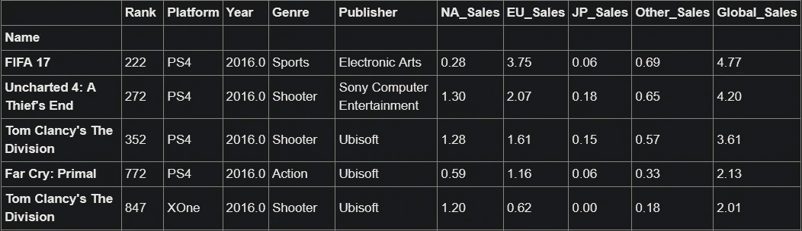

也可以指定某个范围作为标准。例如，让我们看看 2000 年至 2010 年间的比赛。

```
mid_2000s = games["Year"].between(2000, 2010)
```

现在让我们用这个变量来过滤。

```
games[mid_2000s]
```

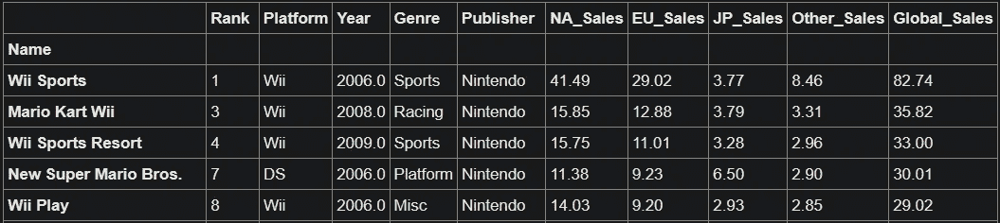

您也可以按索引进行筛选。例如，让我们看看包含运动单词的游戏名称。请注意，str 命令用于使用字符串方法。首先，让我们用 str.lower 将索引的标题转换成小写，然后用 contains 方法查找其中包含 sport 的名称。

```
sport_in_title = games.index.str.lower().str.contains(“sport”)
```

现在让我们用这个变量来过滤。

```
games[sport_in_title]
```

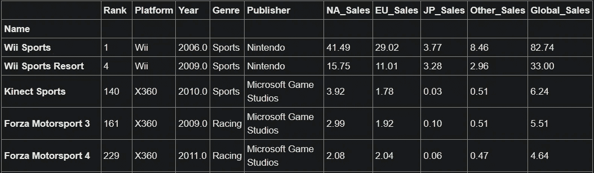

您可以在数据集中找到数值列的统计信息。例如，让我们找出全球销售额的平均值。

```
games["Global_Sales"].mean()#Output:0.537
```

# 分组数据

您可以使用 groupby 方法进行分组。比如让我们按流派列分组。首先，让我们创建组对象。

```
genres = games.groupby("Genre")
```

现在让我们看看全球销售的总价值。我要用求和的方法。

```
genres["Global_Sales"].sum()
```

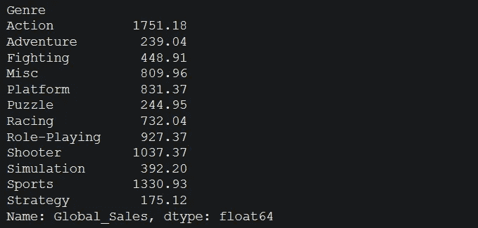

您可以使用 sort_values 方法对值进行排序。

```
genres["Global_Sales"].sum().sort_values(ascending = False)
```

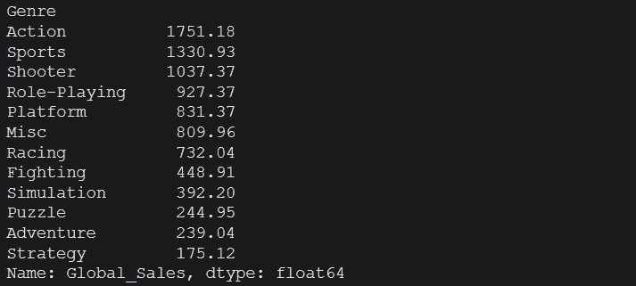

# 结论

Pandas 是 Python 中最常用的数据预处理库。熊猫有更多的方法。你可以用熊猫像玩球一样玩数据。你可以在这里找到这个笔记本[。](https://www.kaggle.com/code/tirendazacademy/data-anaysis-with-pandas)

就是这样。我希望你喜欢它。感谢阅读。别忘了关注我们的[YouTube](https://www.youtube.com/channel/UCFU9Go20p01kC64w-tmFORw)|[GitHub](https://github.com/tirendazacademy)|[Twitter](https://twitter.com/TirendazAcademy)|[Kaggle](https://www.kaggle.com/tirendazacademy)|[LinkedIn](https://www.linkedin.com/in/tirendaz-academy)*👍*

*[](/geekculture/8-best-seaborn-visualizations-20143a4b3b2f) [## 8 个最好的 Seaborn 可视化

### 使用企鹅数据集与 Seaborn 一起动手绘制统计图。

medium.com](/geekculture/8-best-seaborn-visualizations-20143a4b3b2f) [](/geekculture/6-steps-to-become-a-machine-learning-expert-5a1f155f7207) [## 成为机器学习专家的 6 个步骤

### 成为机器学习专家需要知道的一切。

medium.com](/geekculture/6-steps-to-become-a-machine-learning-expert-5a1f155f7207) 

如果这篇文章有帮助，请点击拍手👏按钮几下，以示支持👇*