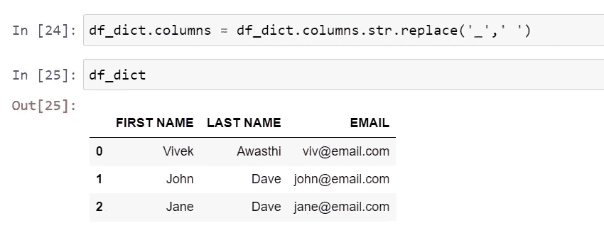
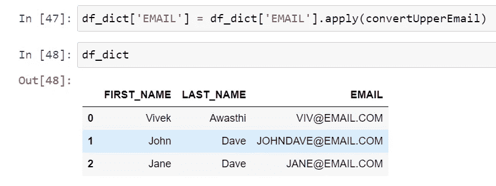

# Python 熊猫教程— 5

> 原文：<https://medium.com/codex/python-pandas-tutorial-5-c695ba8d3f6d?source=collection_archive---------12----------------------->

本教程将介绍更新行和列——修改数据帧中的数据。

这是我们使用字典创建的数据框。

现在，我们想将列名从 first 更新为 first_name。要完成这个动作，熊猫有几种可能的方法。下面是几个例子。

在本例中，我们为数据框分配了一个新的列名，当我们为所有列传递值时，这将起作用，但是如果我们想更新一些列，那么我们必须使用“rename”方法。

在 rename 方法中，我们需要将列名作为键-值对传递，旧值应该在左边传递，新值应该在右边传递。如果我们希望更改在数据框中生效，还需要传递 inplace = True。

如果我们需要将所有列的名称都改为大写或小写，为了达到同样的目的，我们可以使用列表压缩。

此外，如果我们想在列名中用空格替换' _ '，反之亦然，那么我们可以使用' str.replace '方法来实现同样的目的。

在下一个例子中，我们将更新行中的值，有几种方法可以执行这个操作，所以让我们逐个检查。

在这里，首先，我们使用条件标识了行，然后传递新值，并在第二行中更新。

此外，如果我们只想更新几个值，而不是整行，那么我们可以在“loc”中指定列和新值。

此外，我们还有一个方法“at”来更新行中的单个值，我们也可以使用“loc”来更新。但是我更喜欢用‘loc’而不是‘at’。

现在，如果我们想要更新多行，在 Pandas 中有多种可能的方法，我们将从一个简单的方法开始，而不是寻找更高级的方法。假设我们希望所有的电子邮件地址都转换成小写，下面是同样的例子。

我们已经找到了所有的电子邮件值，并使用' str.lower()'方法将它们转换为小写。

现在，我们将介绍一种用于更新数据框或数据系列的更高级的方法。

1.  **apply()** — Pandas.apply 允许用户传递一个函数，并将其应用于 Pandas 系列的每个值。它适用于数据帧和序列，但两者的行为是不同的。让我们检查几个带有系列的示例，然后我们将讨论数据框架。

这里，我们将“len”函数应用于 email 列，它返回每个值的长度，而不是预定义的函数，我们可以创建自己的函数，并使用 apply()传递相同的函数。

我们制作了一个将值转换为大写字母的函数，我们在序列中传递相同的值，它以大写字母返回值，但在数据框中没有更新，为了更新相同的值，需要在左侧传递列名。

同样，对于简单的需求，我们也可以用 apply()传递 lambda 函数。

让我们在数据框中使用 apply()方法并验证结果。

这里，我们得到的结果有点出乎意料，它不是得到数据框中每个值的长度，而是返回列和列中存在的元素数量。

**所以序列中的 apply()函数应用序列中的每个值，数据帧中的 apply()函数应用数据帧的每个序列。**

2.**apply map()**—apply map()函数用于将函数应用于数据帧，不适用于序列。下面用 applymap()检查 len()函数示例。

因此，现在它对数据框的每个值应用一个函数并提供结果。同样，我们也可以使用 applymap()尝试 lower()或 upper()示例。

3. **map() —** map()仅适用于系列，用于将系列值替换为其他值。让我们看看下面的例子。

在这个例子中，我们替换了第一个名字系列中的两个值，但是这里要注意的一点是，我们没有替换的第三个值被转换为 NaN，意思是不是一个数字，这实际上是我们不想要的。我们希望替换这两个值，并保持第三个值不变。为了实现同样的代替 map()，我们可以使用 replace()方法。

4. **replace()** — replace()用于将数据帧的值动态替换为其他值。

在下一篇博客中，我们将讨论在数据框中添加/移除行。