# Python 熊猫教程— 6

> 原文：<https://medium.com/codex/python-pandas-tutorial-6-f284cdfcf62?source=collection_archive---------8----------------------->

本教程将介绍在数据框中添加和移除行和列。

下面是我们在本例中使用的数据框。

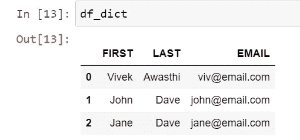

假设，我们想在这里添加一个名为“Full_Name”的新列，并将第一列和最后一列的值合并为全名。首先，合并两列，然后我们将创建一个新列并赋值。

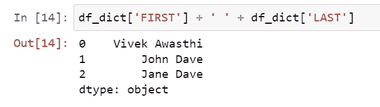

我们已经合并了这两列，并在两个值之间放置了一个空格，现在我们将创建一个新列并分配序列。

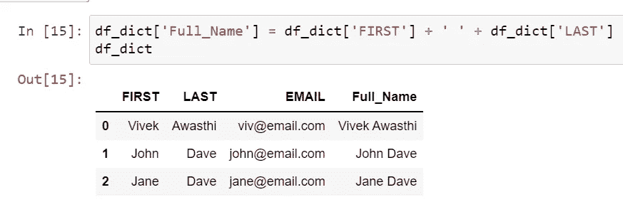

现在，我们不需要第一列和最后一列，我们希望删除它们，因为我们已经创建了一个名为 Full_Name 的新列，我们可以使用 drop 方法执行该操作。

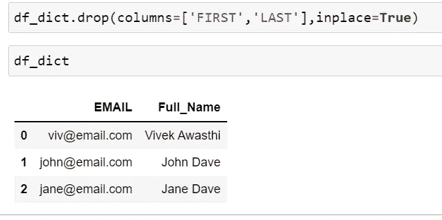

在 drop 方法中，在第一个参数中，我们已经传递了我们想要删除的列的列表，如果我们要删除一个列，那么我们可以直接传递列名。

如果我们希望在数据框中进行更改，那么我们必须传递 inplace = True。

在下一个场景中，我们希望再次创建名和姓列，这次我们将使用 Full_name。

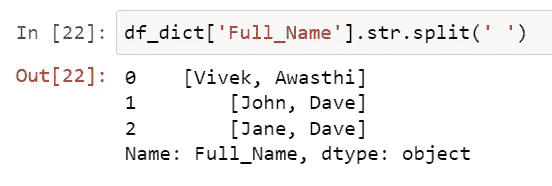

在这里，我们已经使用 split 方法拆分了全名列，现在我们在 pandas 中又多了一个参数“expand ”,所以如果我们在 split 方法中传递“expand=True ”,我们将获得作为数据帧的结果。

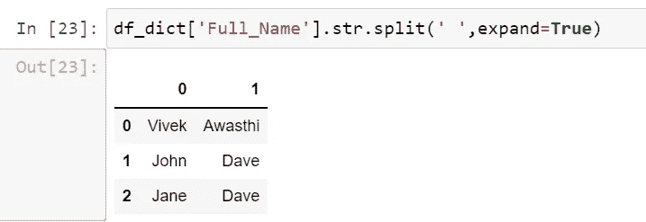

现在，我们将此数据框分配给列，并为名和姓创建列。

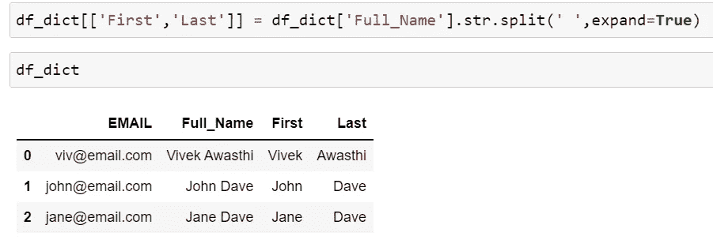

这将再次为名和姓创建两个新列。

现在，我们将向数据框添加行，对于添加行我们可以使用 concat()方法。concat 用于连接两个 DataFrame 对象。

首先，创建一个只有两个名字的新数据框，然后我们将在现有的数据框中联系相同的数据框。

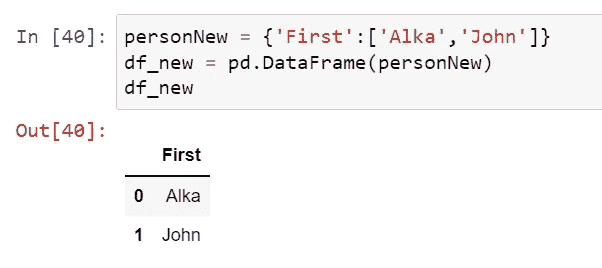

现在我们将‘df _ new’数据帧与我们现有的数据帧联系起来。

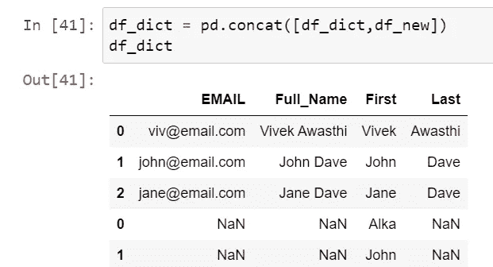

因此，它与我们现有的数据框连接在一起，但是如果您检查了不正确的索引，为了纠正这种情况，我们可以将“ingnore_index=True”作为第二个参数传递。

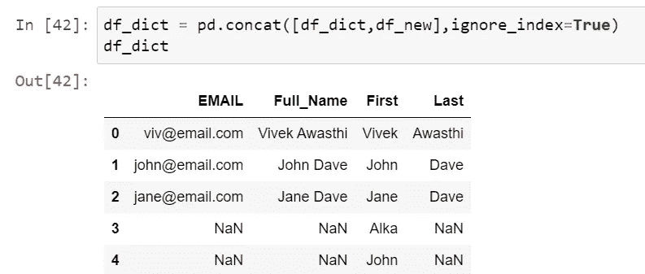

现在，如果我们想要删除该行，我们可以使用 drop 方法执行相同的操作，使用 index 和 inplace= True 作为第二个参数。

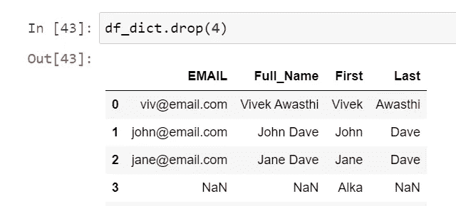

此外，我们可以使用条件找到索引，并在 drop 方法中传递相同的内容，下面是一个相同的示例。

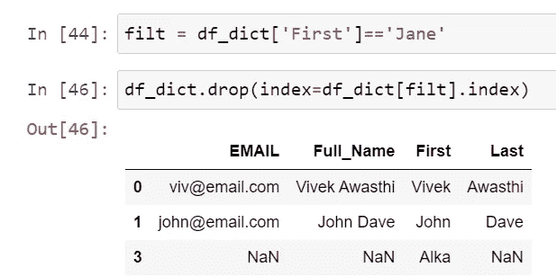

在下一个教程中，我们将讨论数据排序。