# Python 熊猫教程— 7

> 原文：<https://medium.com/codex/python-pandas-tutorial-7-fc36c8ed824f?source=collection_archive---------13----------------------->

本教程将介绍数据框和系列的排序。

下面是我们在本教程中使用的较小的数据框。

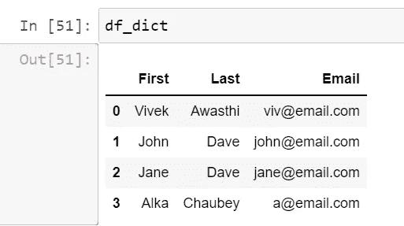

现在，我们希望根据姓氏对数据框进行排序，因此我们可以使用 sort_values()方法进行同样的操作。

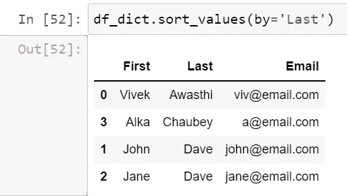

它将按升序对数据帧进行排序，但是如果我们想按降序排序，那么我们可以传递 ascending=Flase 作为第二个参数。

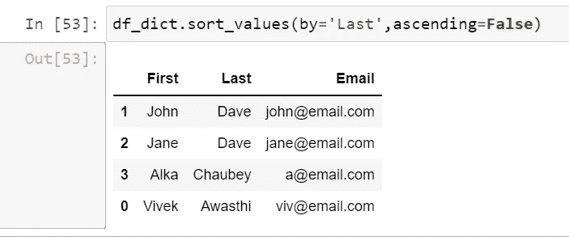

现在我们的需求变得复杂了，首先，我们想先按姓氏排序，然后按名字降序排序。因此，我们可以传递列的列表，而不是传递单个值作为第一个参数。

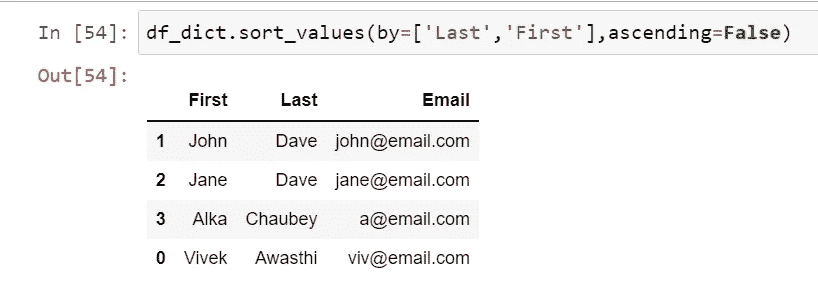

为了增加更多的变化，现在我们想使用姓氏降序排序，然后使用名字升序排序，所以现在我们将为升序参数传递一个布尔列表。

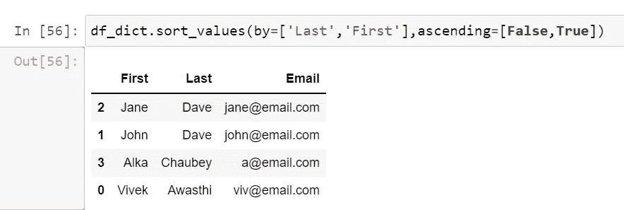

此外，我们可以使用索引以及 sort_index()方法对数据帧进行排序。

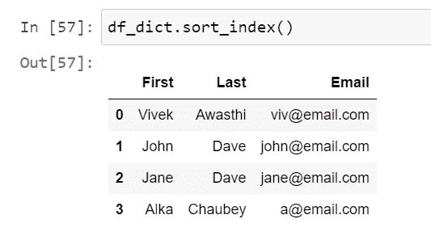

sort_values 方法也可用于序列，所以如果你想对特定的序列进行排序，而不是整个数据框，我们也可以使用 sort_values()方法。

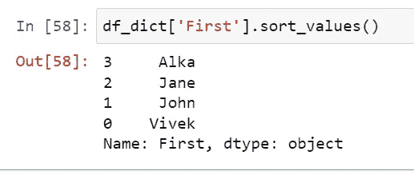

现在，我们将切换到更大的数据集，即 StackOverflow 调查结果，并在那里执行一些操作。

在下一个例子中，我从数据集中对国家进行排序，我还想以降序获取工资，这意味着高工资将排在第一位。

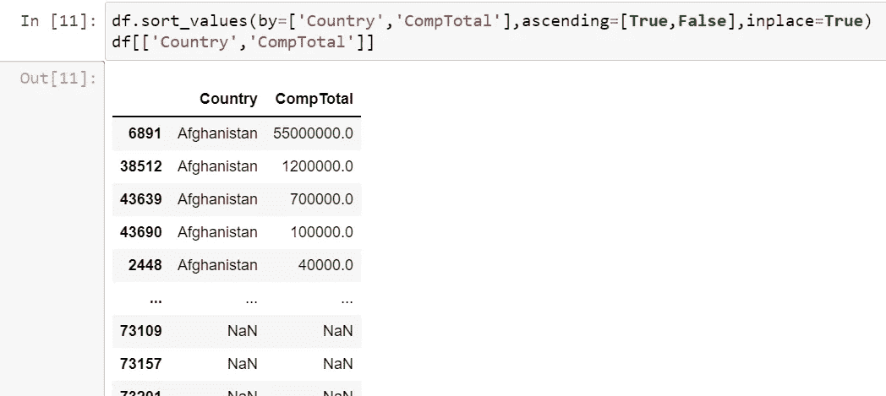

现在，我们只想显示前 10 行，而不是整个数据，这可以使用 head()方法来执行。

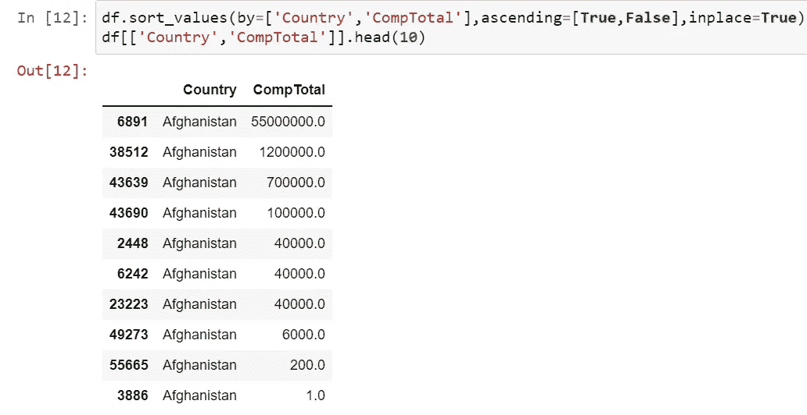

类似地，tail()方法将对最后一条记录起作用。现在，如果我们想从调查中得到 10 份最高的薪水，那么我们可以使用 largest()方法。

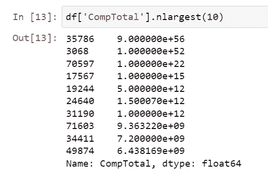

此外，我们可以对数据框使用 nlargest()或 nsmallest()，在这里我们将获得整个数据以及薪水。

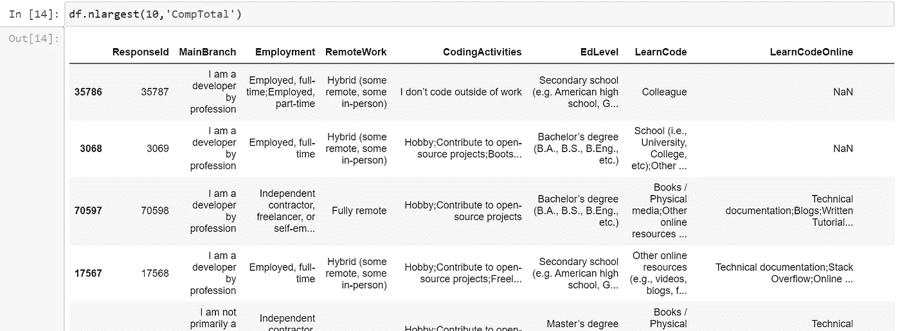

在下一个教程中，我们将讨论分组和分析熊猫的概念。