# Python 熊猫教程— 8

> 原文：<https://medium.com/codex/python-pandas-tutorial-8-7ecc1bc2355a?source=collection_archive---------17----------------------->

本教程将涵盖分组和聚合，以分析和探索数据。

在开始分组之前，首先，了解一些我们将进一步使用的基本概念，然后我们将开始对数据进行分组，并开始我们的分析。

我们在数学中听到的均值、中值和众数，我们将在这里使用，因此为了修正概念，算术平均值**是通过将数字相加并将总和除以列表中的数字数得到的。这就是通常所说的平均值。**中值**是从最小到最大排序的列表中的中间值。**模式**是列表中出现频率最高的值。**

现在，切换到我们的 StackOverflow 数据，找到平均工资、中位数工资和众数工资。

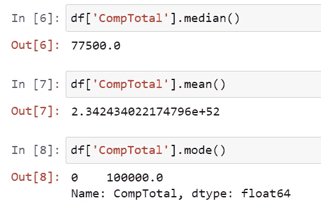

现在，如果我们将 median()函数传递给数据框，而不是一个系列，那么它将找到数据框中的所有数字列，并显示中间值。

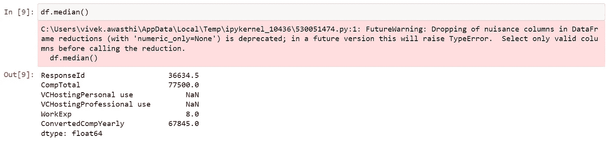

我们得到这个警告是因为它已经贬值，在未来的版本中不可用。

现在，我们将检查 count()和 values_count()之间的差异，当您想要查找与指定列相关的列中出现的有效值的频率时，应该使用 count()，而 value_counts()应该用于查找一个系列的频率。

假设我们要检查性别数据，从调查中，我们可以找到相同的 value_counts()。

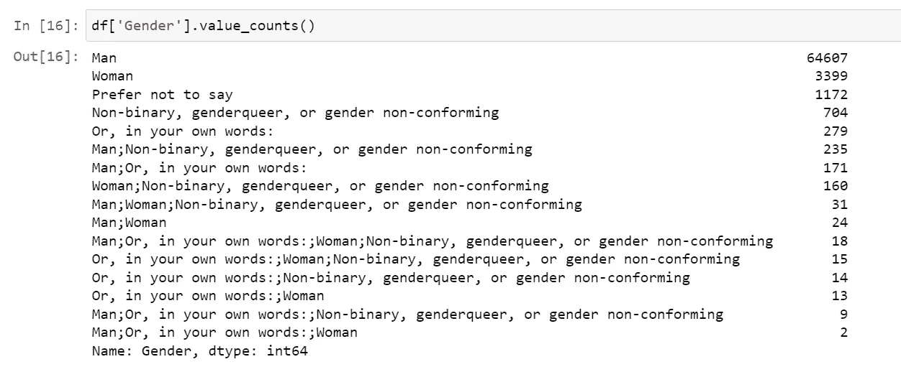

现在，回到使用 groupby()对 pandas 进行分组，所以如果您检查 pandas 中 groupby()的定义，它会说——group by 操作涉及拆分对象、应用函数和组合结果的某种组合。这可用于对大量数据进行分组，并对这些组进行计算操作。

因此，为了清楚地理解它，首先从拆分数据开始，然后我们将理解应用函数和组合数据。

让我们按照国家来划分数据，并检查参与调查的人所在的国家。

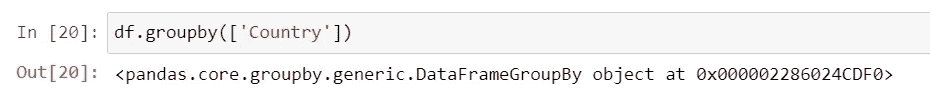

所以，它返回给我们一个 groupby()的对象，用同样的方法把它赋给变量，用 get_group()方法访问值。

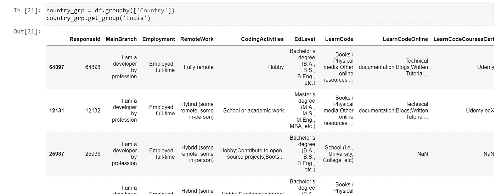

因此，我们得到的输出在这里没有什么特别的，我们得到的数据类似于我们为国家创建过滤器并访问数据框时得到的数据。

但是，为了理解这种差异，让我们应用一个函数，这里的函数是我们想要来自所有参与调查的国家的开发人员的体验。需要注意的一点是，在前面的例子中，我们已经使用 groupby()创建了 country_grp 变量。

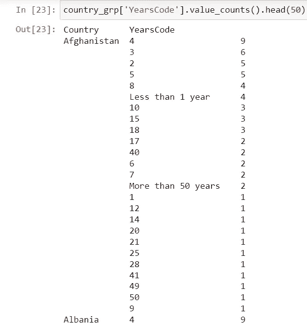

现在，我们不是针对一个国家，而是针对所有国家的开发者的体验。

现在，如果我们想要检查印度的数据，那么我们可以使用 loc 将印度作为参数传递并获取数据，而不是创建一个新的过滤器。

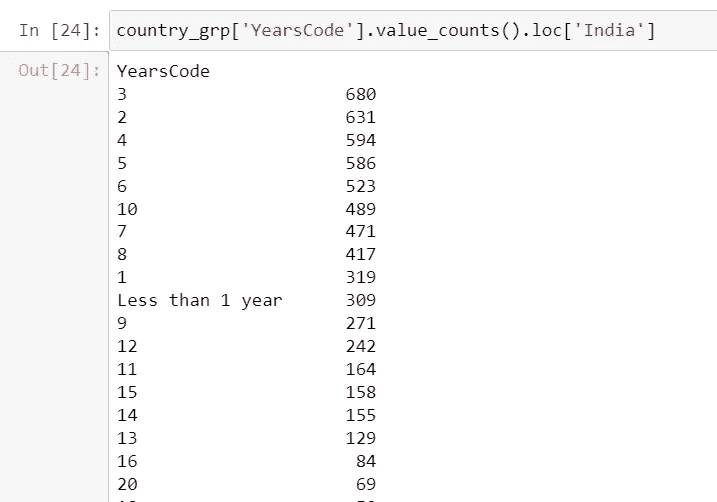

如果我们想要百分比而不是数字，我们可以传递 normalize = True 作为参数。

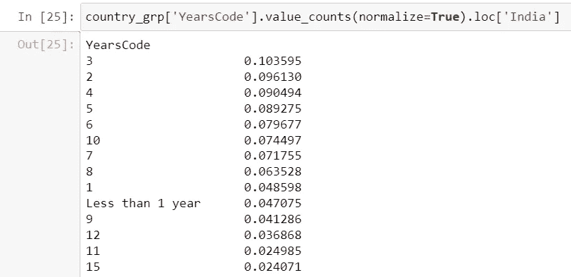

现在，如果我们想计算印度的工资中位数，我们可以使用这个对象。

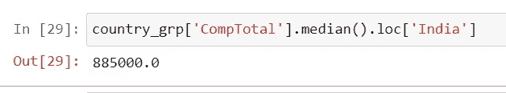

现在，我们需要找到平均工资和中位数，要运行多个聚合函数，我们可以使用 groupby 和 **agg** 方法。

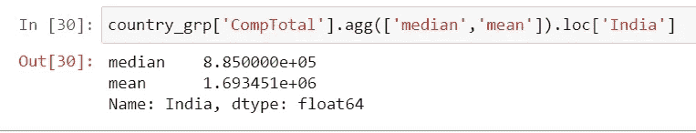

此外，我们可以对 groupby 对象使用 apply()函数，因此，如果我们想检查调查数据中有多少人知道 python，我们可以使用 apply 函数，并传递一个 lambda 函数来找出值。

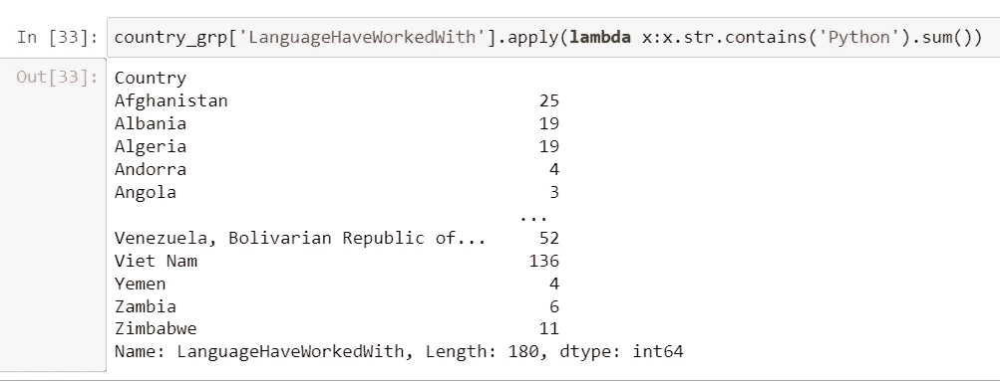

因此，我们应用了一个函数，并使用 contains 方法找到 Python 语言，sum()函数将提供总计数，这里需要注意的一点是 sum()函数也适用于布尔值，并提供了解 Python 的总人数。

但这只是信息的一半，要得到这个国家知道 Python 的人的百分比，首先，我们需要找到回答者的数量，然后我们将找到知道 Python 的人的百分比。

我们先来看看回答者的数量。

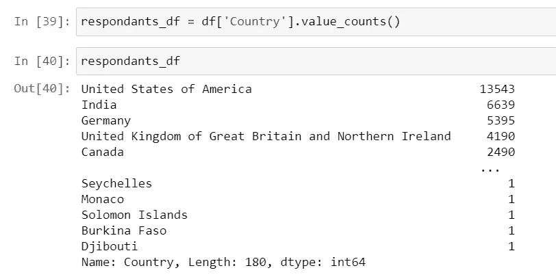

现在，我们将找到了解 Python 的人数，这是我们在前面的示例中能够找到的。

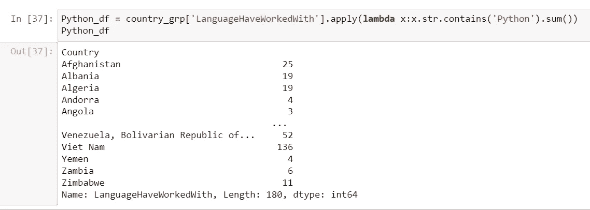

让我们使用 contact 方法连接两个数据框，并创建一个新的数据框。

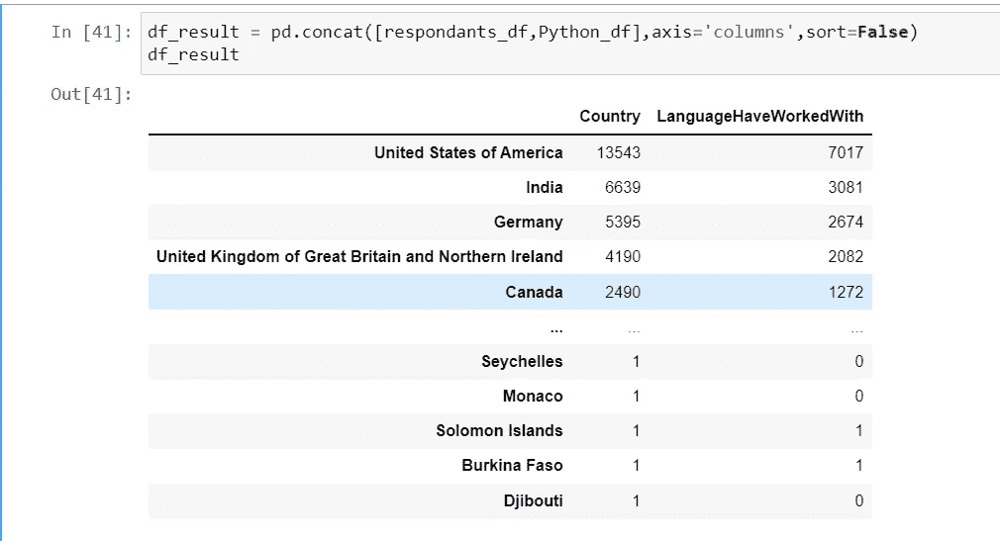

现在，我们得到了更合适的结果，参与调查的人数以及了解 Python 的人数。

现在我们想计算知道 Python 的人的百分比，我们可以创建一个新列并获取值。

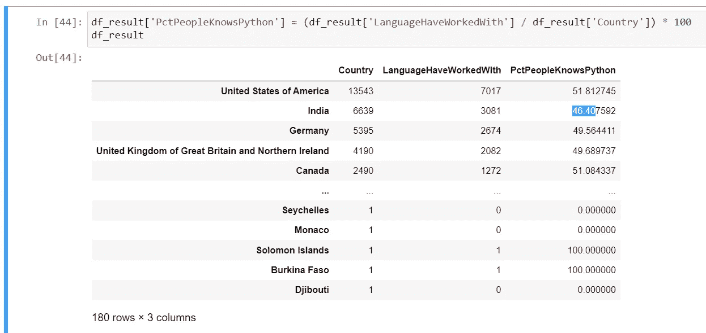

在下一个教程中，我们将讨论清理数据——转换数据类型和处理缺失值。