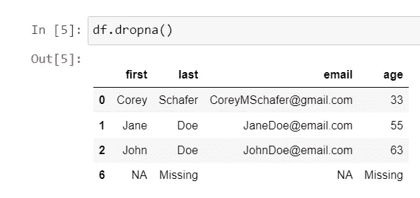

# Python 熊猫教程— 9

> 原文：<https://medium.com/codex/python-pandas-tutorial-9-ad33fdc92659?source=collection_archive---------7----------------------->

本教程将涵盖清理数据—转换数据类型和处理缺失值。

我们使用一些缺失值、NAN 值和自定义缺失值创建了以下数据框。

为了处理丢失的值，我们在 pandas 中有 dropna()方法，我将首先运行这个方法，然后我将解释所有相同的默认参数。

为了理解 dropna()是如何工作的，让我们研究一下 dropna()方法用来删除数据的默认参数。

这两个参数是 dropna()的默认参数，axis='index '意味着默认情况下它将在行中搜索，因此如果任何行有丢失的数据，它将删除它，我们也可以更改为列，但默认情况下它是行。

how='any '表示如果任何一列中有丢失的数据，它将删除该行。我们可以将其更改为“all ”,这意味着只有当所有列都有缺失数据时，它才会删除该行。

因此，与之前的结果相比，现在我们得到了更多的行。

现在，如果数据在任何列中有任何缺失值，我们可以指定列名，而不是删除数据，因此如果想要删除没有电子邮件 id 的数据。我们可以用子集参数来实现。

这里,“how”属性值无关紧要，因为我们只检查单个列，所以如果我们传递“any”或“all ”,我们将得到相同的输出。

现在，我们有一些复杂的需求，我们希望删除那些没有姓氏或电子邮件的行，然后我们可以将一个列列表传递给我们的子集。

如果您注意到，在第六行中，我们有一个自定义的“NA”或“Missing”值尚未删除。为了移除这些值，根据我们创建数据框的方式，我们在这里使用字典创建了数据框，稍后我将展示一个 CSV 文件示例。

因此，我们已经用 NumPy NaN 值替换了所有“NA”和“Missing”值，现在如果我们运行 dropna()方法，这些数据将从数据框中移除。

我们还可以将 NaN 值填充到某个默认字符串或默认数字中，为此我们可以使用 fillna()方法。

因此，我们已经将所有的 NaN 值填充到默认字符串中，我们还有一个方法 isna()，如果值为 NaN，它将返回 true，否则返回 false。

现在，我们需要计算平均年龄，所以如果我们直接在列中运行 mean()函数，我们将得到一个错误。

这是一个很大的错误，但是在最后，它说我们不能把 str 和 int 连接起来。

因此，我们首先使用 dtypes 检查年龄列的数据类型，然后将 str 转换为 float 来计算平均值。

现在，当我们使用 CSV 创建数据框时，我们将切换到 StackOverflow 调查数据，并检查如何处理 NA 或缺失值。

因此，我创建了一个 na 值列表作为 na_vals，我们需要在创建数据框时传递一个参数，它将忽略 Na 或缺失值。

现在，我们想要计算开发人员的经验平均值，但是在应用该函数之前，如果我们检查该列中的唯一值，我们将得到 String、int 和 NaN 值的混合。

所以，我们不能直接套用，意思到这一栏。因此，首先我们需要转换该数据中可用的两个字符串值，然后我们将执行 mean。

因此，我使用替换方法将“不到 1 年”转换为零，将“超过 50 年”转换为 52。

现在，我们可以使用 mean()方法找到经验的平均年份。

在下一个教程中，我们将讨论如何处理日期和时间序列数据。