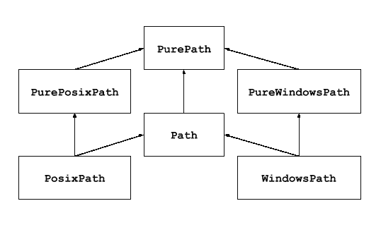
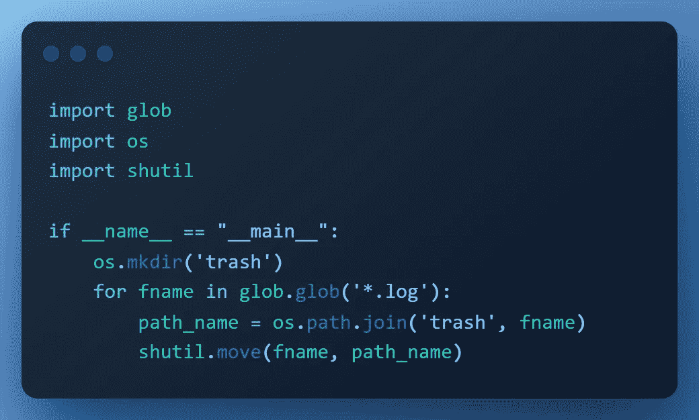
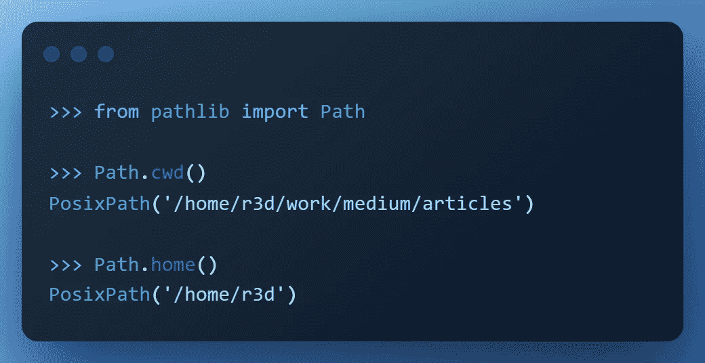
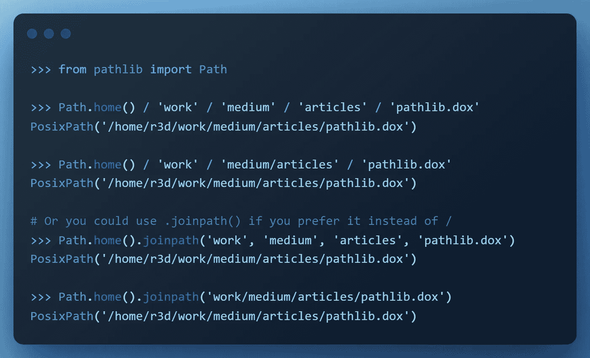
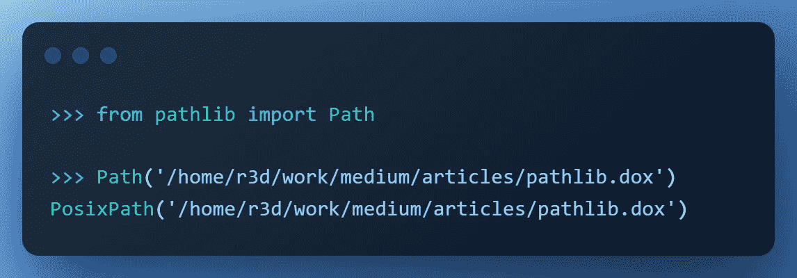
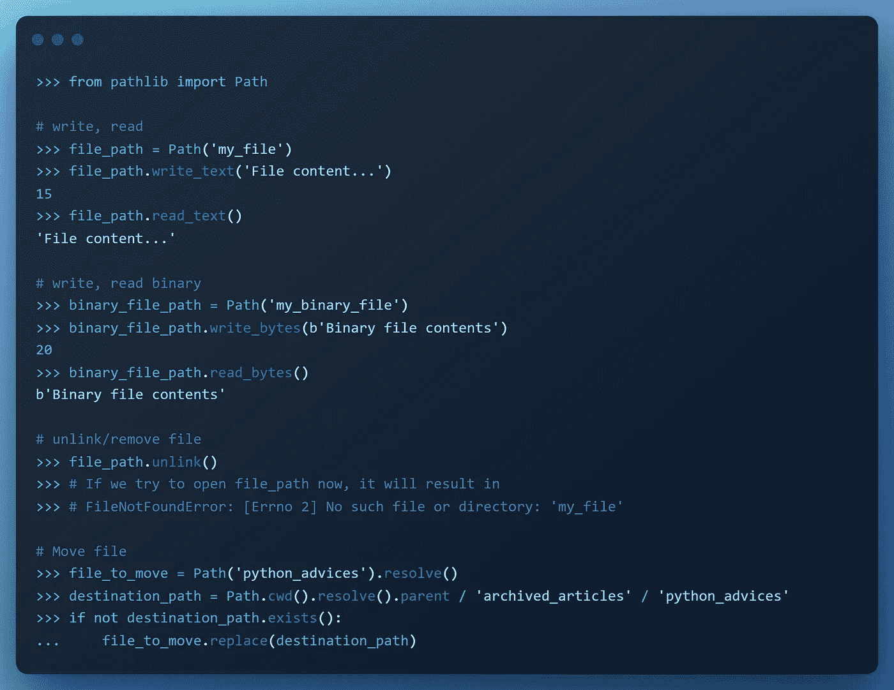
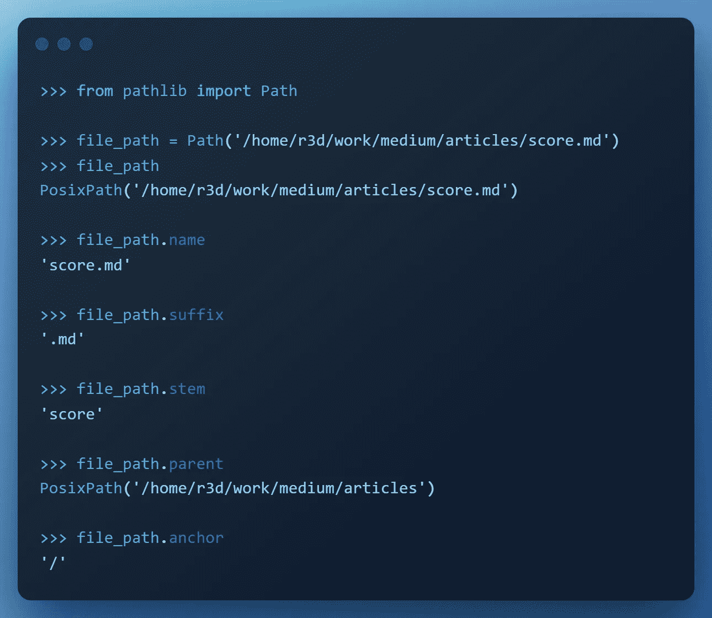
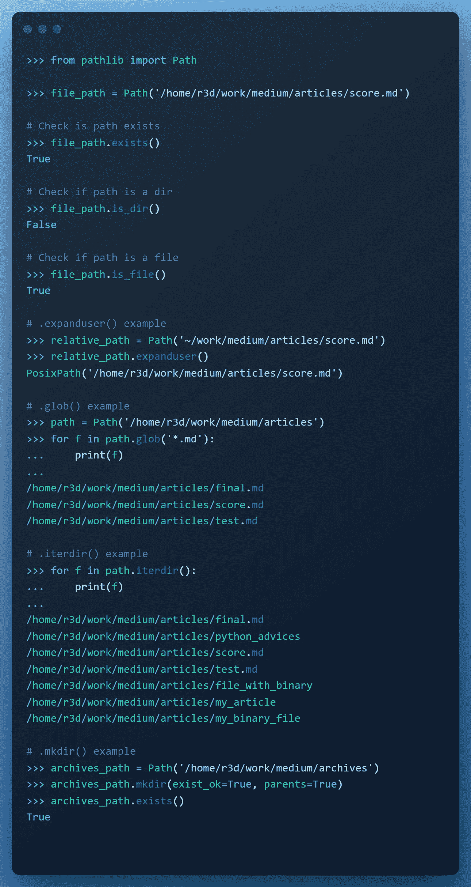
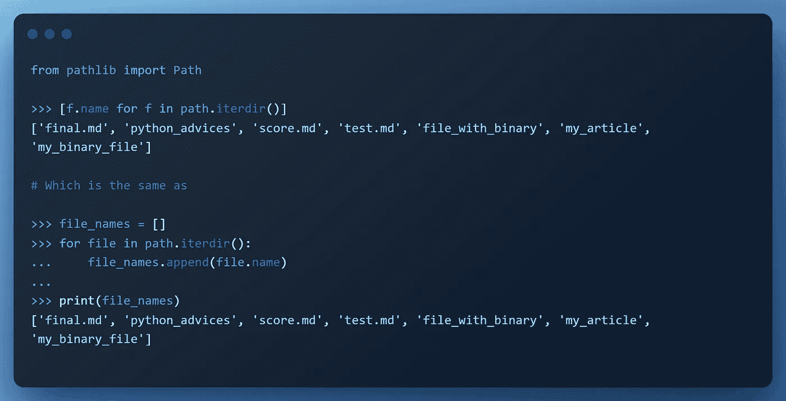

# python path lib——操作系统模块的替代方案

> 原文：<https://medium.com/codex/python-pathlib-an-alternative-to-the-os-module-3dcde93bf7df?source=collection_archive---------5----------------------->

作为一名程序员，我经常将路径作为工作的一部分。既然你在这里，我想你也是。在本文中，我将试图说服您使用`pathlib`。

*我想指出的是，这篇文章更适合于初级程序员或者那些刚刚开始使用 Python 和处理文件路径的人。然而，每个人都欢迎阅读它，学习新的东西或回忆被遗忘的东西。*

好吧…让我们来看看好东西。

# 什么是 pathlib，为什么要使用它？

为了回答第一个问题，官方文件指出:

> 这个模块提供了表示文件系统路径的类，其语义适用于不同的操作系统。路径类分为纯路径和具体路径，纯路径提供没有 I/O 的纯计算操作，具体路径继承纯路径，但也提供 I/O 操作。

换句话说，**纯路径**和**具体路径**是代表两种不同类型的路径对象的两个类，`pathlib`将文件系统路径分成这两种类型。

*   **Pure**:*Pure path*， *PurePosixPath* ， *PureWindowsPath*
*   **具体** : *路径，PosixPath，WindowsPath*

虽然具体路径允许您在文件路径上控制和执行写操作，但是纯路径提供了管理和操作文件路径的工具，而不需要这样做。

或者换一种说法，纯路径是具体路径的子类。它添加进行系统调用的输入/输出操作，并从父类继承操作。

现在是第二个问题:*为什么*你会使用它？

在我看来，**`pathlib`**模块比** `os.path` **模块的方法更直接、更实用，从而提高了代码的可维护性和简单性。**然而，这将在以下示例中更详细地讨论。**

**让我们看一个例子:**

****注意！**我们需要 Python 版本≥ 3.4 才能使用 Pathlib。**

**假设我们有 **N** 个文件需要移动到特定的文件夹。**

****

**CentOS Linux | Python 3.6 |示例 1**

**我们注意到的第一件事是，我们需要三次导入来将这些文件移动到另一个文件夹。如果`trash`目录碰巧已经存在，则引发`FileExistsError`。**

**相同的例子，但使用`pathlib`**

****

**CentOS Linux | Python 3.6 |示例 1**

**`Path.replace(*target*)`将文件重命名到给定的目的地，并返回一个指向目标的新路径实例。`parents=True`将确保根据需要创建该路径的任何缺失父路径。如果`exist_ok`为真，`FileExistsError`异常将被忽略。**

**在实践中我们可以用`pathlib`做什么？**

# ****创建路径****

**尽管介绍了各种风格的模块，你可能只需要`pathlib.Path`类。创建路径有几种不同的方法。**

*   **例如，我们可以使用模块提供的`.cwd()`和`.home()`方法。**

****

*   **使用特殊操作符`/`**

****

*   **从字符串表示形式显式创建**

****

# **读取、写入、移动和删除文件**

*   **`.read_text(*encoding=None, errors=None*)`:以字符串形式返回指向文件的解码内容**
*   **`.read_bytes()`:返回指向文件的二进制内容作为 bytes 对象**
*   **`.write_text(*data, encoding=None, errors=None, newline=None*)`:以文本方式打开指向的文件，写入*数据*，关闭文件。同名的现有文件被覆盖。**
*   **`.write_bytes(*data*)`:以字节模式打开指向的文件，向其中写入*数据*，关闭文件。同名的现有文件被覆盖。**
*   **`.replace(*target*)`:将该文件或目录重命名为给定的*目标*，并返回一个指向*目标*的新路径实例。如果*目标*指向已存在的文件或空目录，则无条件替换。**
*   **`.rename(*target*)`:将该文件或目录重命名为给定的*目标*，并返回一个指向*目标*的新路径实例。在 Unix 上，如果*目标*存在并且是一个文件，在用户有权限的情况下会被静默替换。在 Windows 上，如果*目标*存在，则会引发`FileExistsError`。*目标*可以是一个字符串或另一个路径对象。**
*   **`.unlink(*missing_ok=False*)`:删除文件或符号链接。**
*   **`.rmdir()`:删除目录**

**读写方法之所以如此方便使用，是因为它们处理文件的打开和关闭。**

**示例:**

****

# **有用的方法和属性**

**这是最常用属性的简短列表**

*   **`.name`:没有目录的文件名**
*   **`.suffix`:最终组件的文件扩展名，如果有的话**
*   **`.stem`:不带后缀的文件名**
*   **`.parent`:路径的逻辑父路径**
*   **`.anchor`:驱动器和根的串联**

****

**这是最常用方法的简短列表**

*   **`.exists()`:文件存在返回真，否则返回假**
*   **`.is_dir()`:检查路径是否为目录**
*   **`.is_file()`:检查路径是否为文件**
*   **`.expanduser()`:返回一个扩展了`~`和`~user`结构的新路径**
*   **`.glob()`:将给定的相对*模式*在该路径代表的目录中进行 glob，产生所有匹配的文件**
*   **`.iterdir()`:生成目录内容的路径对象**
*   **`.mkdir()`:在此给定路径下创建一个新目录**

****

# **一些实际例子**

*   **收集文件名——这可能是您必须做的事情**

****

*   **将文件移动到一个特定的目录中——这个目录您已经在开头看到过了**

****

# **结论**

**文件路径由 pathlib 中的对象表示，这使得使用它们更加容易。我们可以控制对象的所有组件，并且很容易从中提取出我们需要的东西。正如我已经提到的，pathlib 模块使用起来更简单、更方便。**

# **临终遗言**

**不要误解我:我并不反对`os`模块。Pathlib 更多的是个人喜好。会完美地完成同样的工作。我是一个主动学习者，写文章帮助我更好地理解事物。我希望这些文章对其他人有用。欢迎在评论区留下修改意见，我会尽最大努力把它们包括进来。**

**感谢您的阅读！**

# **参考**

** [## Python 3 的 pathlib 模块:驯服文件系统——真正的 Python

### 由于许多不同的原因，使用文件和与文件系统交互是很重要的。最简单的情况…

realpython.com](https://realpython.com/python-pathlib/)  [## 面向对象的文件系统路径 Python 3.10.5 文档

### 3.4 版本中的新功能。这个模块提供了用语义表示文件系统路径的类…

docs.python.org](https://docs.python.org/3/library/pathlib.html#pathlib.Path.write_bytes)  [## python Path——如何使用 Pathlib 模块并举例说明

### 每个操作系统都有不同的构造文件路径的规则。例如，Linux 使用正斜杠表示…

www.freecodecamp.org](https://www.freecodecamp.org/news/how-to-use-pathlib-module-in-python/)**