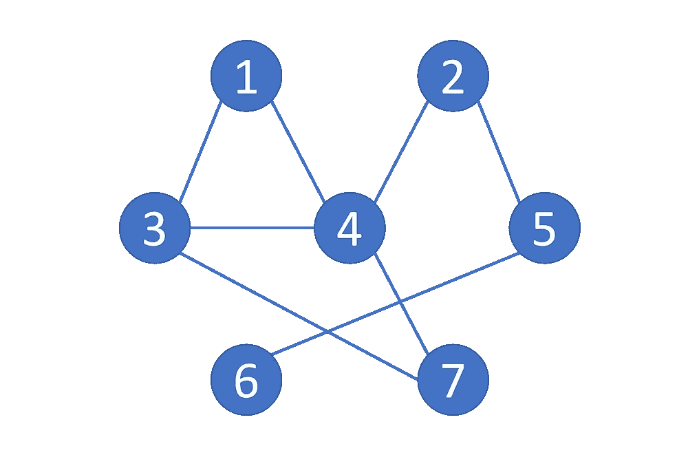
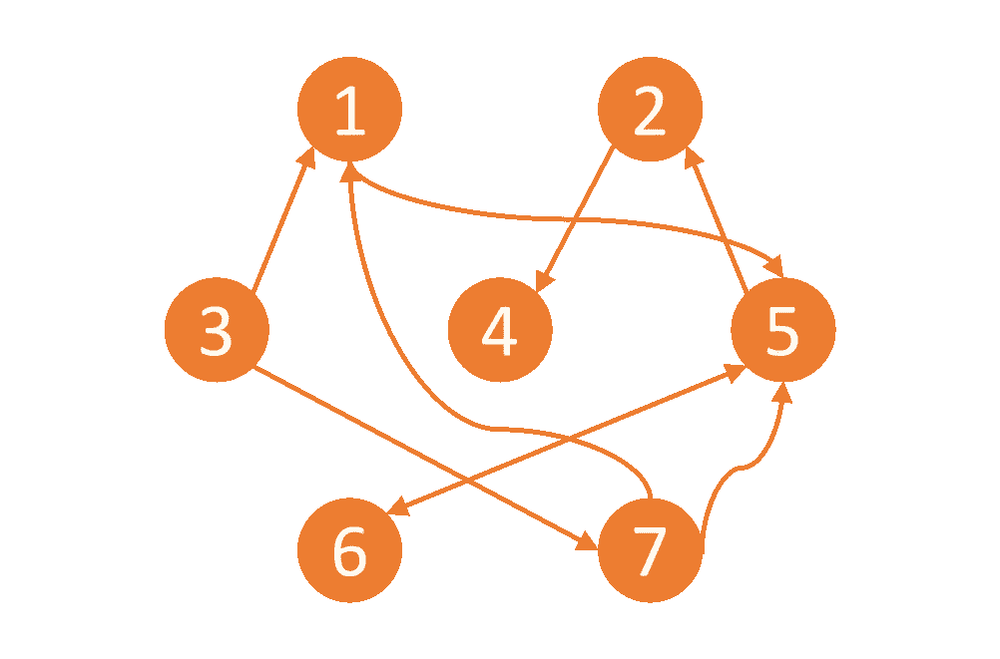
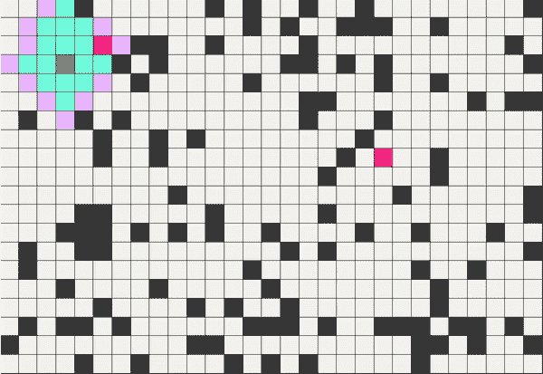
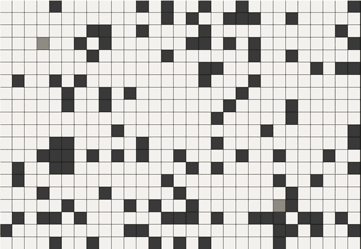
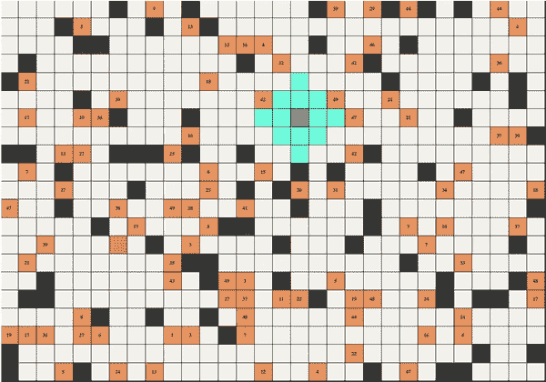
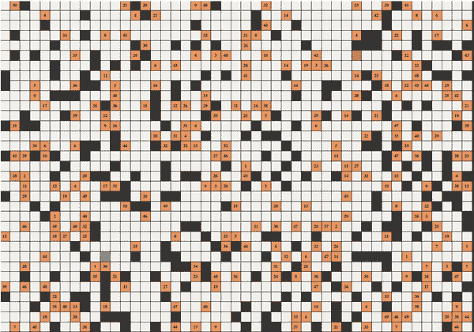

# Python 中的广度优先搜索、深度优先搜索、Dijakras 和 A*寻路算法

> 原文：<https://medium.com/codex/python-project-idea-graph-traversal-and-pathfinding-algorithm-visualisations-99595c414293?source=collection_archive---------4----------------------->

## Python 中的图遍历和寻路算法可视化

## 介绍

基于**图**的*编码挑战*通常出现在*亚马逊*、*谷歌*和*脸书*等科技公司的*技术面试*中。

本文提出了一个 Python 项目建议，用于学习**图遍历算法**。我在几年前完成了这个项目，这个想法源于 [TheBartR](https://www.youtube.com/user/TheBartR) 和 [Clément Mihailescu](https://github.com/clementmihailescu) 。

图片由[伊桑@seefromthesky](https://unsplash.com/@seefromthesky?utm_source=medium&utm_medium=referral) 在 [Unsplash](https://unsplash.com?utm_source=medium&utm_medium=referral) 上拍摄

# 项目描述

## 有向和无向图

寻路方法是*探索节点*之间路线的图形搜索算法。即寻路算法的*目标*是从**起点**节点移动到**终点**节点，**跟踪**到达目标的路径。

在这个项目中，我实现了四个关键算法；*广度优先搜索*、*深度优先搜索*、*迪杰斯特拉的*和 *A** (A 星)。网上有许多优秀的资源可以清楚地描述这些*基本概念*。

把一个图想象成由**节点**组成的*网络*。例如，图 1 说明了一个*无向*和一个*有向*图。

*   **无向图**与*无*方向*有联系*。每条边之间存在双向关系。
*   **有向**图在*顶点*之间有链接，带有*箭头*指示信息可以沿着**边**传播的方向。

图 1-无向图和有向图(图片由作者提供)

网格有效地充当了节点的网络。随着探索的进行，必须确定节点的过去、现在和未来`State`。要点 1 显示了封装了所有可能状态值的`enum`。

要点 1 —可能的状态

Gist 2 给出了包含`Node`类的 Python 代码。关键属性包括其**网格位置**、**周围元素列表**和当前`State`。

要点 2 —节点类

# 算法

**广度优先搜索(BFS)** 和**深度优先搜索** (DFS)是基本的图遍历算法。

BFS *在移动到下一层*之前遍历当前层的所有节点。Gist 3 给出了 BFS **迭代**算法的 Python 实现，该算法用于查找*网格*中两个节点之间的路径。

要点 3——广度优先搜索迭代解法

**编码面试挑战**通常会涉及这些技术中的任何一种，作为*第一步分析*。图 2 说明了运行中的 BFS 算法。

图 2-广度优先搜索(按作者分类的图片)

**DFS** 尽可能远地通过*节点*，直到到达*附近没有未访问节点*的节点。Gist 4 中提供了 DFS Python 求解器。

要点 4 —深度优先搜索求解器

要了解这些算法之间的比较，请参见 BFS 和 DFS 之间的[差异](https://www.geeksforgeeks.org/difference-between-bfs-and-dfs/#:~:text=BFS(Breadth%20First%20Search)%20uses,3.&text=BFS%20is%20a%20traversal%20approach,on%20to%20the%20next%20level.)。图 3 显示了 DFS。

图 3 —深度优先搜索(图片由作者提供)

## 最短路径

**Dijkstra 的**和 **A*** 寻找*最短路径*，这意味着他们计算出一对节点之间最*简洁的路线*。因此，它们在开始和结束节点之间识别出**最佳**路径。

*类似 *A** 的最短路径寻路方法的实际用例*包括*物流规划*和 *IP 路由*。

图 4 说明了 Dijkstra 的方法。**加权节点**存在于画布上，这给该技术增加了一层进一步的复杂性。以前的方法，BFS 和 DFS，*没有考虑重量*。

图 4 — Dijkstra 最短路径算法(图片由作者提供)

*A*算法通过**启发式函数**包含额外的信息来改进 Dijkstra* 过程，启发式函数确定接下来探索哪些路径。这种试探的一个例子是起点和终点之间的**欧几里德距离**。

这种**优化**导致更快*找到最短路径*。A*算法可以找到已知 *GPS 坐标*的单对位置之间的最短路径。图 5 显示了这种方法在一个比其他样本大得多的网络*上的**效率**。*

图 5 — A* (图片由作者提供)

**A*** 和 **Dijkstra 的**算法或多或少是一样的，除了 A*使用了*启发式*。因此，这两种算法都在同一个`class`中实现，并带有一个`flag`来指示需要使用哪一种算法。请参阅 Gist 5 中的代码了解这两种方法。

要点 5 — **A*** 和**迪杰斯特拉的**算法

## 结论

本文介绍了四种图遍历算法的 Python 代码和**可视化**。理解这些机制对于*工程*和*计算机科学学生*来说是有价值的，因为他们经常出现在**编码面试**中。

如果这个项目**想法**让你感兴趣，那就去看看[排序算法可视化](https://towardsdatascience.com/5-sorting-algorithms-in-python-c7ece9df5dd6)。这些项目对任何对编程和计算机科学感兴趣的人都很有价值。

 [## Python 中的 5 种排序算法

### 使用 Python 实现选择、冒泡、插入、合并和快速排序算法

towardsdatascience.com](https://towardsdatascience.com/5-sorting-algorithms-in-python-c7ece9df5dd6) 

我经常提到 *Python* ，因为那是我的编程语言偏好。然而，如果你有不同语言的技能，这些项目在你喜欢的任何语言中都是可行的。

动画是投资组合演示的一个很好的补充。它展示了项目结果，并说明了如何实现算法的理解。该项目的*代码*存储在 [**GitHub**](https://github.com/ad-1/PathfindingVisualisation) 中。

 [## GitHub-ad-1/pathfindingvisualization:用 Python 可视化的图遍历算法，使用…

### 使用 Tkinter 在 Python 中可视化的图遍历寻路算法。算法包括广度优先搜索…

github.com](https://github.com/ad-1/PathfindingVisualisation)  [## 通过我的推荐链接加入媒体-安德鲁·约瑟夫·戴维斯

### 阅读安德鲁·约瑟夫·戴维斯(以及媒体上成千上万的其他作家)的每一个故事。您的会员费直接…

medium.com](/@andrewdaviesul/membership) 

> 如果您对 Python、工程和数据科学感兴趣，请随时关注和查看我的其他文章。

我希望你找到了有用的东西。感谢您的阅读。

## 参考

[1]第四章。寻路和图搜索算法——马克·尼达姆的[图算法，艾米·e·霍德勒](https://learning.oreilly.com/library/view/graph-algorithms/9781492047674/)