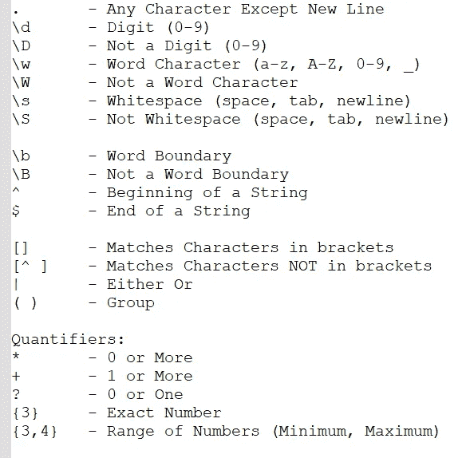

# Python re 模块

> 原文：<https://medium.com/codex/python-re-module-e0feac601764?source=collection_archive---------10----------------------->

正则表达式(RegEx)是定义搜索模式的字符序列。Python 有一个内置的“re”模块来处理同样的问题。

在开始重新模块之前，让我们了解一下普通字符串和原始字符串之间的区别，因为我们将在“重新”模块中使用原始字符串。

Python 原始字符串是通过在字符串前面加上“R”或“R”来创建的。Python 原始字符串将反斜杠(\)视为文字字符。当我们想要一个包含反斜杠的字符串，并且不希望它被当作转义字符时，这是很有用的。

让我们看看下面代码中的区别。

```
#Print with Normal String

print('\tName')

#Print with Raw String

print(r'\tName')Output-
   Name
\tName
```

所以在上面的例子中，\t 被认为是一个制表符，但在原始字符串中，它将只被打印为' \t '。

要使用正则表达式，首先，我们需要创建一个模式，它将找到我们想要的匹配，然后使用 finditr()方法执行操作，让我们检查下面的代码。

```
import re

sentence = 'My little son now has started learning abc in school'
pattern = re.compile(r'abc')
matches = pattern.finditer(sentence)

for match in matches:
    print(match)
Output-
<re.Match object; span=(39, 42), match='abc'>
```

在上面的例子中，我们已经写了一个匹配小“abc”的模式。在这个字符串中,“abc”将出现在从 39 到 42 的索引号上。因此它将返回带有索引号的匹配。

下面是所有模式的列表。



下面我们来逐一探讨几个模式。'.'匹配除新行之外的任何字符。

```
import re

sentence = 'school'
pattern = re.compile(r'.')
matches = pattern.finditer(sentence)
for match in matches:
    print(match)
Output-
<re.Match object; span=(0, 1), match='s'>
<re.Match object; span=(1, 2), match='c'>
<re.Match object; span=(2, 3), match='h'>
<re.Match object; span=(3, 4), match='o'>
<re.Match object; span=(4, 5), match='o'>
<re.Match object; span=(5, 6), match='l'>
```

\d '用于仅匹配 0-9 之间的数字。下面是相同的代码。

```
import re

sentence = 'school123'
pattern = re.compile(r'\d')
matches = pattern.finditer(sentence)
for match in matches:
    print(match)
Output-
<re.Match object; span=(6, 7), match='1'>
<re.Match object; span=(7, 8), match='2'>
<re.Match object; span=(8, 9), match='3'>
```

相反的' \D '用来匹配非数字。在正则表达式中，大写字母否定小写字母正在执行的运算。

```
import re

sentence = 'school123'
pattern = re.compile(r'\D')
matches = pattern.finditer(sentence)
for match in matches:
    print(match)
Output-
<re.Match object; span=(0, 1), match='s'>
<re.Match object; span=(1, 2), match='c'>
<re.Match object; span=(2, 3), match='h'>
<re.Match object; span=(3, 4), match='o'>
<re.Match object; span=(4, 5), match='o'>
<re.Match object; span=(5, 6), match='l'>
```

“B”用于检查单词边界，而“\b”用于检查非单词边界。当需要单独匹配一系列字母或数字时，单词边界特别方便。或者当您希望确保它们出现在字符序列的开头或结尾时，这很有用。

```
import re

sentence = 'school schoolschool'
pattern = re.compile(r'school\b')
matches = pattern.finditer(sentence)

for match in matches:
     print(match)
Output-
<re.Match object; span=(0, 6), match='school'>
<re.Match object; span=(13, 19), match='school'>
```

它匹配学校两次，因为第二个学校在字符串末尾不包含空格。

'^'用于匹配字符串的开头。下面是相同的代码。

```
import re

sentence = 'My little son now has started learning abc in school'
pattern = re.compile(r'^My')
matches = pattern.finditer(sentence)

for match in matches:
     print(match)
Output-
<re.Match object; span=(0, 2), match='My'>
```

类似地，使用' $ '来匹配字符串的结尾。

```
import re

sentence = 'My little son now has started learning abc in school'
pattern = re.compile(r'school$')
matches = pattern.finditer(sentence)

for match in matches:
     print(match)
Output-
<re.Match object; span=(46, 52), match='school'>
```

[]'匹配括号中的字符，假设如果我们在括号中提到'[a-zA-Z]'，它将匹配小写 A 到 Z 和大写 A 到 Z 之间的任何字母。

```
sentence = 'My little son now has started learning abc in school'
pattern = re.compile(r'[A-Z]')
matches = pattern.finditer(sentence)

for match in matches:
     print(match)
Output-
<re.Match object; span=(0, 1), match='M'>
```

字符串中只有一个大写字母“M ”,因此它只返回一个匹配项。相反'[^]用来匹配字符，不在括号中。

```
sentence = 'My little son now has started learning abc in school'
pattern = re.compile(r'[^a-z\s]')
matches = pattern.finditer(sentence)

for match in matches:
     print(match)
Output-
<re.Match object; span=(0, 1), match='M'>
```

这将忽略所有小写字母和空格，因此只返回大写字母“M”。

“()”代表组，假设我们有多个邮件域，我们希望匹配只包含 Gmail 和 Yahoo 的电子邮件 id。所以我们可以用()'来表示同样的意思。

```
str = """
vivek@gmail.com
vivek1@yahoo.com
vivek2@outlook.com
"""

pattern = re.compile('.+(gmail|yahoo)+\.(com)')
matches = pattern.finditer(str)
for match in matches:
     print(match)
Output-
<re.Match object; span=(1, 16), [match='vivek@gmail.com](mailto:match='vivek@gmail.com)'>
<re.Match object; span=(17, 33), [match='vivek1@yahoo.com](mailto:match='vivek1@yahoo.com)'>
```

在同一个例子中，如果我输入' * '而不是'+'，它将返回所有三封电子邮件，因为' * '表示 0 或更大，所以它将打印 outlook.com。

```
import re
str = """
vivek@gmail.com
vivek1@yahoo.com
vivek2@outlook.com
"""

pattern = re.compile('.+(gmail|yahoo)*\.(com)')
matches = pattern.finditer(str)
for match in matches:
     print(match)
Output-
<re.Match object; span=(1, 16), [match='vivek@gmail.com](mailto:match='vivek@gmail.com)'>
<re.Match object; span=(17, 33), [match='vivek1@yahoo.com](mailto:match='vivek1@yahoo.com)'>
<re.Match object; span=(34, 52), [match='vivek2@outlook.com](mailto:match='vivek2@outlook.com)'>
```

在下一个示例中，我们将电子邮件 id outlook.com 更改为 outlook.edu，因此如果我们运行相同的代码，我们将得到两个匹配，因为最后一个中的“com”是强制的。

```
import re
str = """
vivek@gmail.com
vivek1@yahoo.com
vivek2@outlook.edu
"""

pattern = re.compile('.+(gmail|yahoo)*\.(com)')
matches = pattern.finditer(str)
for match in matches:
     print(match)
Output-
<re.Match object; span=(1, 16), [match='vivek@gmail.com](mailto:match='vivek@gmail.com)'>
<re.Match object; span=(17, 33), [match='vivek1@yahoo.com](mailto:match='vivek1@yahoo.com)'>
```

在这里我们可以使用？当它匹配 0 或 1 时使其可选。

```
import re
str = """
vivek@gmail.com
vivek1@yahoo.com
vivek2@outlook.edu
"""

pattern = re.compile('.+(gmail|yahoo)*\.(com)?')
matches = pattern.finditer(str)
for match in matches:
     print(match)
Output-
<re.Match object; span=(1, 16), [match='vivek@gmail.com](mailto:match='vivek@gmail.com)'>
<re.Match object; span=(17, 33), [match='vivek1@yahoo.com](mailto:match='vivek1@yahoo.com)'>
<re.Match object; span=(34, 49), match='vivek2@outlook.'>
```

在上面的例子中，我们现在得到了三个匹配，但是没有得到“edu ”,因为它不属于这个组。

现在我们还有一个场景，我们需要按照下面的格式匹配电话号码。

```
str = """
999-4568-123
897-3258-325
698-7548-654
"""
```

它包含数字'-'符号，所以我们可以使用' \d '来匹配数字，下面是代码。

```
import re
str = """
999-4568-123
897-3258-325
698-7548-654
"""

pattern = re.compile('\d\d\d-\d\d\d\d-\d\d\d')
matches = pattern.finditer(str)
for match in matches:
     print(match)
Output- 
<re.Match object; span=(1, 13), match='999-4568-123'>
<re.Match object; span=(14, 26), match='897-3258-325'>
<re.Match object; span=(27, 39), match='698-7548-654'>
```

所以它匹配电话号码，但我们需要多次键入' \d '，这可能会导致错误。

为了避免这种情况，我们可以使用' {} '来传递确切的数字，就像在第一个'-'之前一样，因为' \d '出现了三次，所以我们可以写成-' \ d { 3 } '

```
import re
str = """
999-4568-123
897-3258-325
698-7548-654
"""

pattern = re.compile('\d{3}-\d{4}-\d{3}')
matches = pattern.finditer(str)
for match in matches:
     print(match)
Output-
<re.Match object; span=(1, 13), match='999-4568-123'>
<re.Match object; span=(14, 26), match='897-3258-325'>
<re.Match object; span=(27, 39), match='698-7548-654'>
```

使用这个 now 代码变得更加易读，并提供相同的结果。

现在检查 group 和 sub 的示例。

```
import re
str = """
www.google.com
www.yahoo.com
www.gmail.com
"""

pattern = re.compile('(www.)?(\w+)?(\.\w+)')
matches = pattern.finditer(str)
for match in matches:
     print(match)
Output-
<re.Match object; span=(1, 15), match='[www.google.com'](http://www.google.com')>
<re.Match object; span=(16, 29), match='[www.yahoo.com'](http://www.yahoo.com')>
<re.Match object; span=(30, 43), match='[www.gmail.com'](http://www.gmail.com')>
```

这里我们有 3 个网站，我们的模式匹配所有三个。但是作为输出，我们只需要“google.com”并删除“www”

所以在我们的正则表达式中，我们有三组首先匹配‘www’(www。)，第二个是 google 这样的名字— (\w+)，第三个是域名— (\。\w+)。

因此，如果我们希望在结果中有任何特定的组，那么我们可以使用 group 方法。

```
import re
str = """
www.google.com
www.yahoo.com
www.gmail.com
"""

pattern = re.compile('(www.)?(\w+)?(\.\w+)')
matches = pattern.finditer(str)
for match in matches:
     print(match.group(2))
Output -
google
yahoo
gmail
```

这里 index 从 1 开始，所以第二个索引是 name。我们还有一个子方法，可以提供多个组序列并过滤结果。

```
import re
str = """
www.google.com
www.yahoo.com
www.gmail.com
"""

pattern = re.compile('(www.)?(\w+)?(\.\w+)')
matches = pattern.finditer(str)
sub_Pattern = pattern.sub(r'\2\3',str)
print(sub_Pattern)
Output-
google.com
yahoo.com
gmail.com
```

这里，我们传递子模式中的组序列 2 和 3，并获得预期的输出。

关于。match()-re 的一个函数将搜索正则表达式模式并返回第一个匹配项。RegEx Match 方法只在字符串的开头检查匹配。因此，如果在第一行中找到匹配，它将返回 match 对象。但是如果在其他行中找到匹配，RegEx Match 函数返回 null。

```
import re
str = "My little son now has started learning abc in"
#Matching at begining of the string
pattern = re.match('My',str)
print(pattern)
#Matching at the middle of the string
pattern = re.match('started',str)
print(pattern)
Output-
<re.Match object; span=(0, 2), match='My'>
None
```

因此，如果我们想在一个完整的字符串中进行匹配，那么我们可以使用 search()而不是 match()。

```
import re
str = "My little son now has started learning abc in"
#Matching at begining of the string
pattern = re.search('My',str)
print(pattern)
#Matching at the middle of the string
pattern = re.search('started',str)
print(pattern)
Output-
<re.Match object; span=(0, 2), match='My'>
<re.Match object; span=(22, 29), match='started'>
```