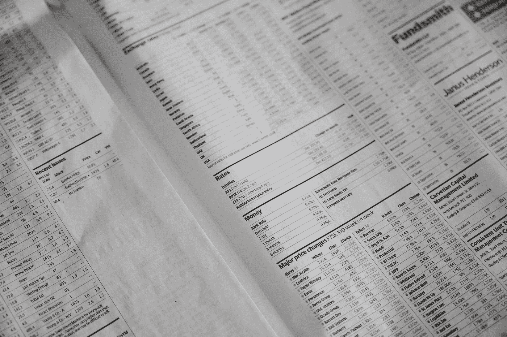

# Python:股票数据抓取

> 原文：<https://medium.com/codex/python-stock-data-scraping-295830011e14?source=collection_archive---------4----------------------->

## [法典](http://medium.com/codex)

由[安妮·斯普拉特](https://unsplash.com/@anniespratt?utm_source=unsplash&utm_medium=referral&utm_content=creditCopyText)在 [Unsplash](https://unsplash.com/s/photos/stock-scraping?utm_source=unsplash&utm_medium=referral&utm_content=creditCopyText) 上拍摄

# 概观

数据是新的资产！在本文中，我将介绍使用 Python 从互联网上抓取数据以用于您的数据项目的基本原理。

有许多用于 web 抓取的 Python 库。您可以将[请求](https://2.python-requests.org/en/master/)库与 [BeautifulSoup](https://www.crummy.com/software/BeautifulSoup/bs4/doc/) 、 [lxml](https://lxml.de/) 或 [Parsel](https://parsel.readthedocs.io/en/latest/) 或类似 [scrapy](https://scrapy.org/) 、 [Selenium](https://www.selenium.dev/) 的框架一起使用，或者两者的组合…