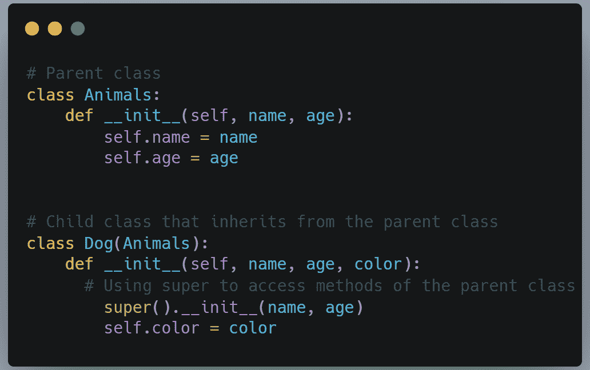
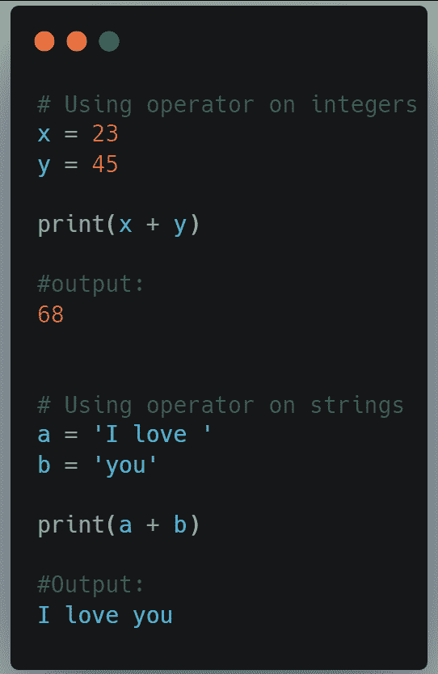
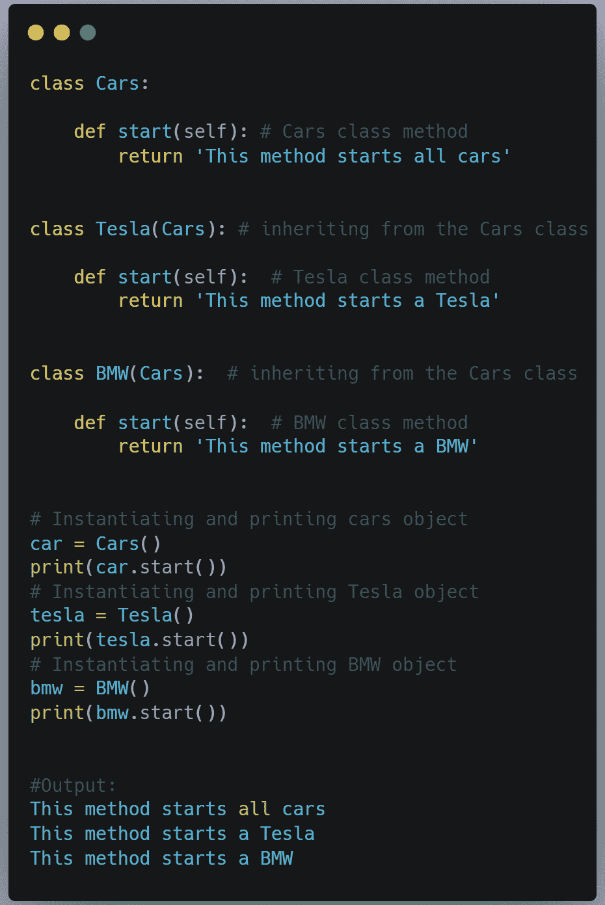
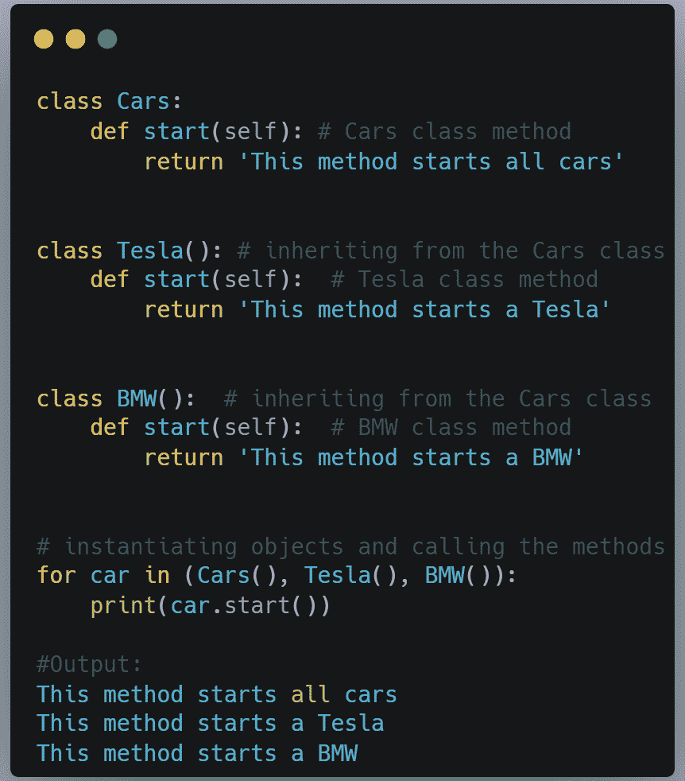
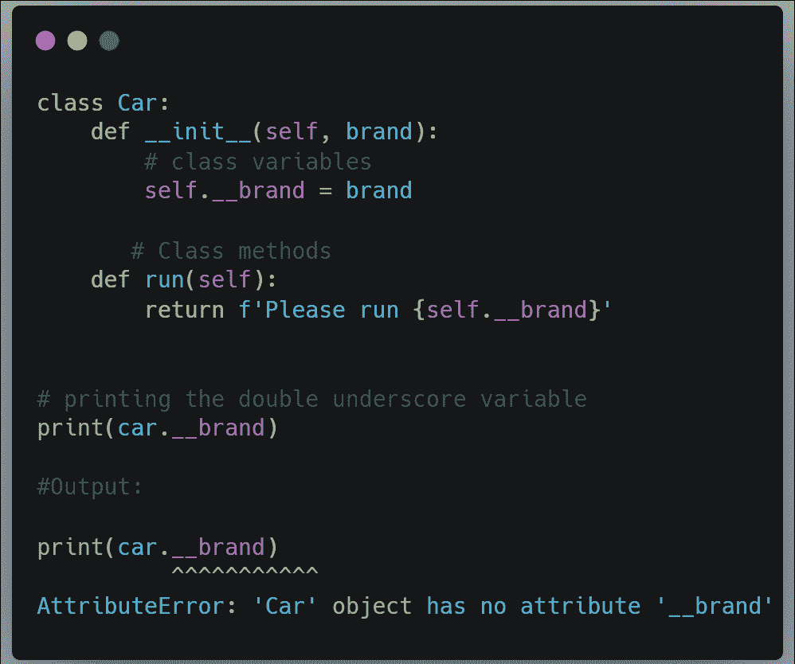
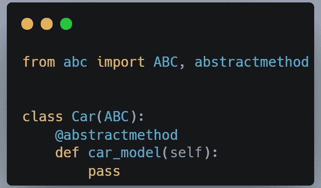
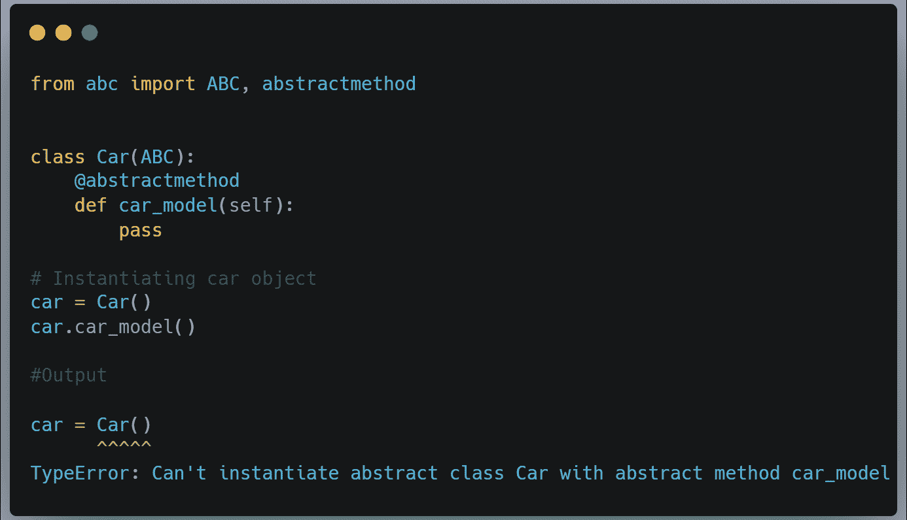
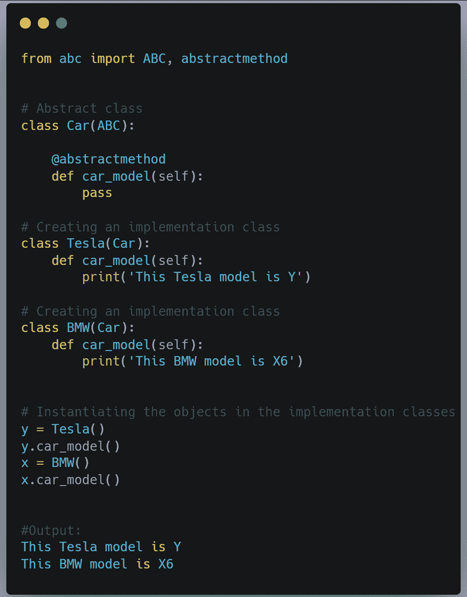
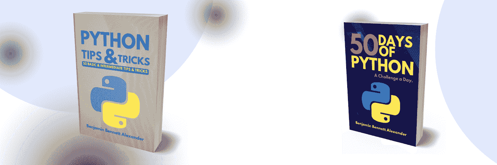

# Python:面向对象编程的四大支柱

> 原文：<https://medium.com/codex/python-the-four-pillars-of-object-oriented-programming-f6058d5471ba?source=collection_archive---------4----------------------->

Oliver Sjö strö的照片:[https://www . pexels . com/photo/photo-of-woman-wearing-abaya-1122407/](https://www.pexels.com/photo/photo-of-woman-wearing-abaya-1122407/)

Python 是一种面向对象的编程语言。Python 中的一切都是对象。像其他面向对象的语言一样，当使用类创建对象时，有四(4)条基本原则来编写干净简洁的代码。这些原则被称为面向对象编程(OOP)的四大支柱。这四个支柱是继承、多态、封装和抽象。在本文中，我们将探索面向对象编程的这四个支柱。

# 遗产

在 Python 中，可以创建一个继承另一个对象的方法和属性的对象。这叫继承。在继承中，有父类和子类。子类继承父类的属性和方法。下面是一个在 Python 中创建对象时如何实现继承的例子。

在这段代码中，有 Animals 类，它是基类或父类；然后是 Dog 类，也就是 child 类。你会注意到子类把父类作为参数(名字 Animals 在子类的括号之间)；这基本上就是继承是如何实现的。子类继承父类的属性和方法。在上面的代码中，子类使用 super()方法继承了实例变量——name 和 age。因此，我们不是在子类中重新创建这些变量，而是简单地从父类中继承。继承有助于创建可重用的代码，并使我们的代码更加简洁。

# 多态性

多态仅仅意味着“多种形式”。在 Python 中，这意味着你可以有一个可以以不同方式使用的函数或对象。我们以加法运算符(+)为例；我们可以用它来添加数字，但我们也可以用它来连接字符串。下面是两个例子:

在 OOP 中，多态性可以通过继承来实现。子类的方法将与父类的方法同名。当用子类对象调用时，子类方法重写从父类继承的方法。这种实现称为方法重写。下面，我们有一个名为 Cars 的父类，以及从父类继承而来的子类。注意，所有的类(基类和子类)都有相同的方法 start。然而，子类中的 start 方法已经被修改以适应那个子类的“需求”。因此，如果我们需要修改父方法以适应子类的需要，继承中的多态性是有用的；同时仍然保持对父类方法的访问。

但是，请注意，多态性也可以在没有继承的情况下实现。这意味着即使这些类没有显式地链接到父类，我们仍然可以对类方法使用相同的名称，并且实现将获得与上面相同的结果。请参见下面修改后的代码:

# 包装

封装是通过将数据及其方法封装在一个“胶囊”或单元中使数据私有的过程，这样就不能在该单元之外对其进行访问或修改。这是通过将类中的变量设为私有来实现的。在 Python 中，我们可以通过在变量名前加双下划线“__”来使变量私有。在下面的代码中，我们有一个名为 brand 的变量。我们给名字(__brand)加了一个双下划线，使它成为私有的。现在，当我们试图访问函数外部的变量(print(car。__brand)，我们得到一个属性错误，因为变量 __brand 现在是私有的，不能从类外部修改或更改。

如果您不想将数据设为私有，可以将其设为受保护。要使变量受到保护，只需在变量前加一个下划线“_”。但是，可以在类外部访问和修改受保护的数据。添加单个下划线只是通知可能使用您的代码的其他程序员带有下划线前缀的变量受保护且不应被修改的一种常规方式。

# 抽象

OOP 的第四个支柱是抽象。抽象就是通过对用户隐藏不必要的细节来保持过程的简单。想到一辆车；让汽车继续行驶的实际机制对用户来说是隐藏的。知道如何驾驶汽车是很重要的；但当你开车时，知道引擎盖下发生了什么并不一定重要。抽象就是对用户隐藏代码的内部机制。这降低了代码的复杂性，并确保我们只关注重要的东西。

在 OOP 中，抽象是通过创建接口类(基类)和实现类(子类)来实现的。我们可以使用内置的 abc 模块创建一个接口类。下面，我们创建一个名为 Car 的抽象类。

在上面的代码中，我们借助 abc 模块中的 ABC 类创建了抽象类(接口类)。@abstractmethod 是抽象方法的装饰器。抽象类及其修饰方法仅用于声明，不用于实现。记住这只是一个接口类；实现类将在后面介绍。不能实例化抽象类的对象；您将得到一个错误。见下文:

既然我们已经创建了抽象类，现在我们可以创建实现抽象类的类了。实现类将具有与抽象类相同的方法名。实现类中的方法将覆盖抽象类中的方法。在下面的代码中，我们创建了 Tesla 和 BMW 类作为抽象类的子类。下面是完整的代码:

所以在上面的代码中，抽象类设置了一个标准，即每个 car 子类都应该有一个模型——car _ model(方法)。这是由子类(特斯拉和宝马)实现的。基本上，抽象类确保了重点是应该实现什么(也就是说，每辆车都应该有一个模型)，而不是如何实现。实现留给了子类。

# 结论

这些是面向对象编程的四大支柱。感谢您的阅读。如果你还不是订阅者，请分享这篇文章，鼓掌，评论并订阅邮件列表。你也可以在 [Twitter](https://twitter.com/RealBenjizo) 和 [LinkedIn](https://www.linkedin.com/in/benjamin-b-phiri-45267b154/) 上关注作者。

………………………………………………………………………………………

Python 提示技巧。点击[这里](https://benjaminb.gumroad.com/l/oxwkh)。Python 50 天:一天一个挑战。点击[这里](https://benjaminb.gumroad.com/l/zybjn)

