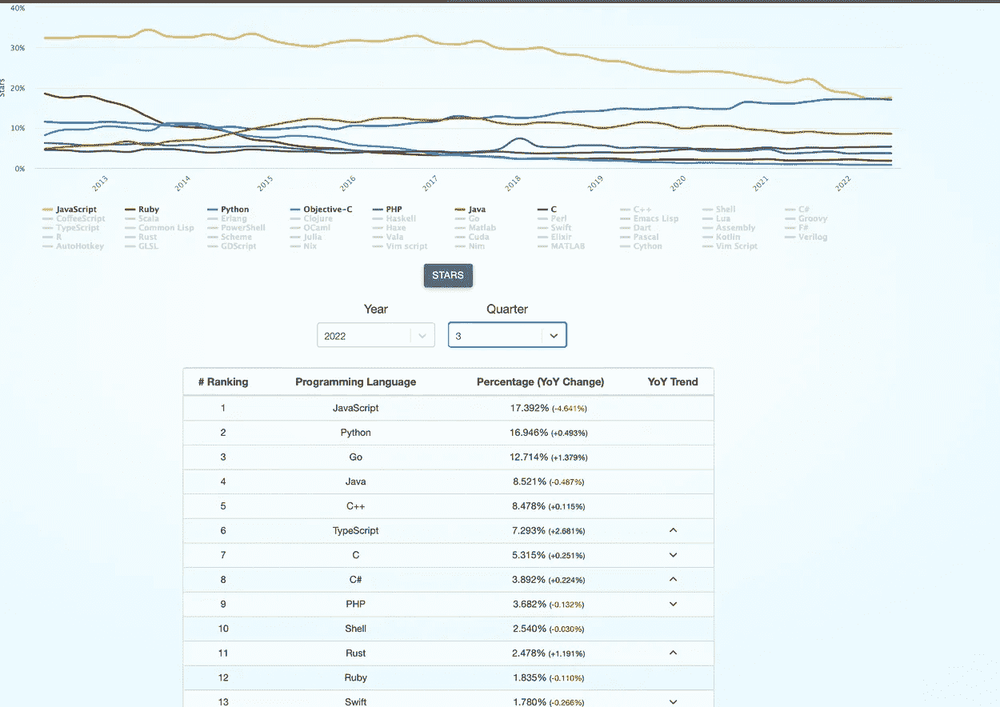
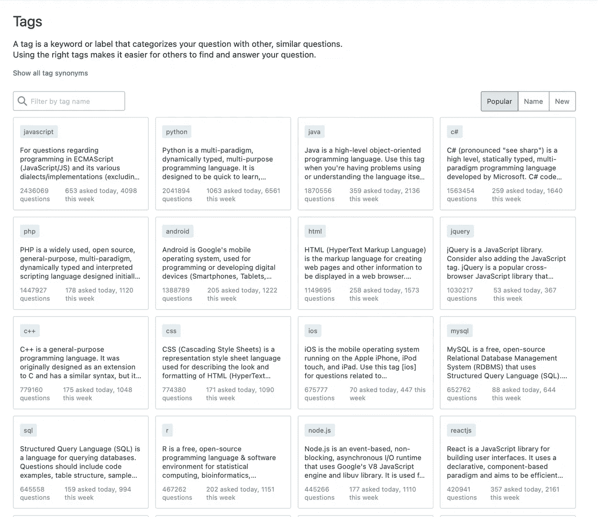
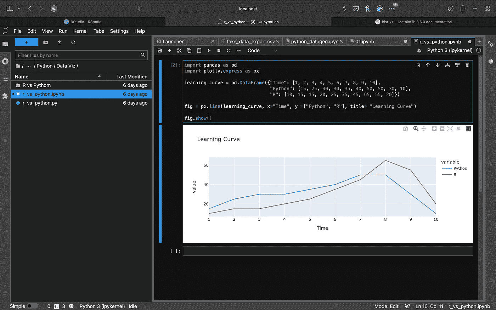
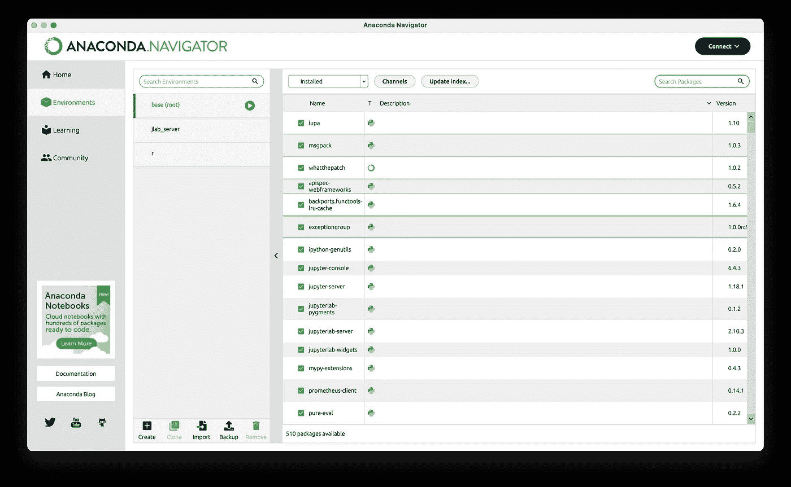
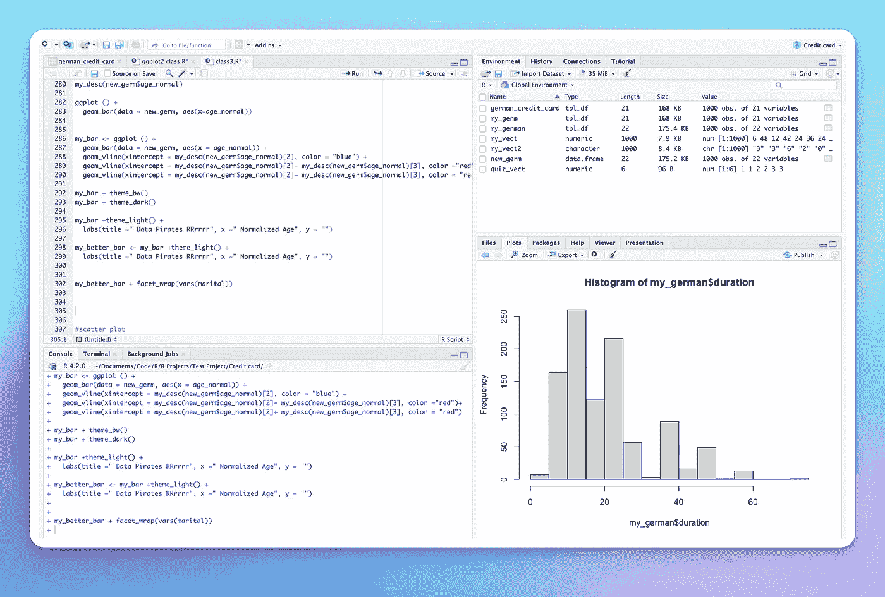

# Python vs R:哪种数据科学语言最适合你？

> 原文：<https://medium.com/codex/python-vs-r-which-is-the-right-data-science-language-for-you-2f4fab4cdb25?source=collection_archive---------6----------------------->

作者的 Python Vs R 图形。

*数据科学是科技行业发展最快的领域之一。考虑要使用的最佳语言总是很重要的，并且随着该领域的当前发展，这从未如此重要。Python 和 R 是数据科学中使用的两种流行的编程语言。在本文中，我将比较 Python 和 R 在数据科学方面的特性、速度和应用。这种比较将帮助您决定哪种语言更适合您的数据科学应用程序。*

# 数据科学的编程语言:

数据科学是一个广阔的领域，包含用于创建、收集、存储和分析大量数据的各种方法和工具。有许多不同的方法来分析数据，但最有效的方法是通过编程。数据科学家需要学习至少一门语言来保持竞争力。

Python 是一种高级编程语言，免费、开源，主要用于通用编程、科学计算和软件开发。r 是一种通用编程语言，侧重于统计计算和图形。这两种语言都有庞大的社区，并且可以访问大量的数据科学软件包。

# 计算机编程语言

Python 是一种高级的解释编程语言，旨在让您更快地工作，并集成所有开发工作流。Python 可以执行各种各样的编程任务，包括 web 开发、应用程序开发、脚本编写和数据科学。可读性强，语法清晰。

世界上最流行的数据科学语言是 Python。这是因为它很容易学习，并且有许多用于数据争论、Web 抓取、统计、可视化、机器学习和深度学习的库。这种多功能性和灵活性与简单的语法相结合，使 python 成为发展最快和第二受欢迎的编程语言。

# 包装

**数据处理和统计**

*   [NumPy](https://numpy.org/)
*   [熊猫](https://pandas.pydata.org/)

**机器学习和深度学习**

*   [Scikit-learn](https://scikit-learn.org/stable/)
*   [张量流](https://www.tensorflow.org/learn)
*   [Keras](https://keras.io/)
*   [统计模型](https://www.statsmodels.org/stable/index.html)

**数据可视化**

*   马特普罗特里布
*   [Seaborn](https://seaborn.pydata.org/)
*   [散景](https://docs.bokeh.org/en/latest/)

**网页抓取**

*   [刺儿头](https://scrapy.org/)
*   [美汤](https://www.crummy.com/software/BeautifulSoup/bs4/doc/)

# r 编程语言:

r 是一种开源的科学编程语言，为机器学习、图形、统计和数据科学而设计。它具有出色的数据处理和可视化能力，最常用于统计分析和科学计算。

它是一种免费的开源编程语言，最初是由 Ross Ihaka 和 Robert Gentlemen 在 20 世纪 70 年代设计的。r 为数据分析提供了一个大的、一致的、集成的工具集合。由于其统计能力，它是科学和研究团体中最受欢迎的语言。

# 包装

**分析与探索**

*   [tidyr](https://tidyr.tidyverse.org/)
*   [deplyr](https://dplyr.tidyverse.org/)
*   [ggplot2](https://ggplot2.tidyverse.org/)
*   [字符串](https://stringr.tidyverse.org)

**报告和仪表板**

*   [rmarkdown](https://rmarkdown.rstudio.com/)
*   [闪亮的](https://shiny.rstudio.com/)
*   [flexdashboard](https://rstudio.github.io/flexdashboard/index.html)

**建模和预测**

*   [张量流](https://tensorflow.rstudio.com/)
*   [潮汐模型](https://www.tidymodels.org/)
*   [火花球](https://spark.rstudio.com/)

# Python vs R

# 用户、社区和支持

进入 2023 年，Python 似乎比 r 更受欢迎。Python 有一个庞大的社区，每天都有越来越多的开发人员加入进来。

Python 是 Github 中第二受欢迎的存储库，也是栈溢出中第二受欢迎的标签。

作者 GitHub 流量截图。

从图片中可以看出，R 甚至不在 GitHub 的前 15 大趋势中。

作者 StackOverflow 主题截图。

我们可以在堆栈溢出上看到类似的语言列表。这是因为 R 在开发者中并不流行。大多数 R 用户是学生、研究人员或科学家。

R 的专业用户基础导致了数据科学的最佳社区之一的发展。r 还拥有一个强大的工具、包和其他基础设施的生态系统，专门为数据科学而设计。r 把它的源代码和包放在“cran”中。

我逐渐明白的是，大多数 R 用户不是开发人员。他们是学生、研究人员、科学家和分析师。这使得

# 语法和学习曲线

Python 被广泛认为是最容易学习的编程语言。它是一种高级语言，语法非常简单，类似于英语口语。另一方面，r 有一个独特的语法。从未编写过代码的非程序员可能会发现它非常简单，因为它类似于数学公式和逻辑。

我将用一个 if 语句来演示这两种语言的语法:

***R 中同样的代码看起来是这样的:***

正如我们所见，两种语言都有非常基本的语法。程序员或开发人员可能会发现更高级的 R 包比 python 更难学。这是因为它的语法不同于大多数其他编程语言。

# 速度和性能

就处理速度而言，Python 比 R 快得多。r 也是一种低级语言。Python 作为一种高级语言，可以用更短、更简单的代码以更快的速度运行。所以，说到速度，python 是明显的赢家。

# 应用和使用案例

Python 和 r 之间有许多相似之处。两者都是开源语言，提供了广泛的特性和功能。这两种语言都有广泛的用途，广泛用于数据分析、数学、统计和编程。然而，这两种语言之间也有一些差异。

进入 2023 年，Python 似乎是总体上更受欢迎的语言。Python 有一个庞大的社区，每天都有越来越多的开发人员加入进来。这有助于创建大量的库和框架，让您可以完成任何事情。Python 用于各种各样的应用，从 web 开发、软件和应用程序开发、自动化、脚本、数据科学等等。它非常灵活，几乎可以应用于任何用例。Python 也有 Jupyter 笔记本，这是用 python 运行数据科学代码的很好的工具。笔记本让我们在单独的块中运行代码。这有助于轻松测试和排列代码。它也是一个很好的报告工具。Jupyter 笔记本也可以运行 R 和 Julia 代码。

作者 JupyterLab 截图。

Anaconda 是另一个很棒的工具套件，是最流行的数据科学发行版

阿纳康达导航截图作者。

它附带了 conda 包管理器和 Anaconda-Navigator GUI 工具，用于管理您的数据科学环境。Anaconda 也支持 r。

而 Python 是一种用于各种应用的通用语言。r 以其统计和数学能力而闻名。当涉及到一般编程和其他应用程序时，它的可用库更少。这意味着您可能需要为几个用例构建自己的库。这是 R 不如 Python 流行的一个很好的原因。然而，R 有许多为科学和统计用途而构建的库和特性。它还具有更好的可视化和报告功能，这有助于设计在视觉和功能方面远远优于 python 的仪表板。R 还有 R-studio IDE，它被认为是最好的统计分析工具之一。

作者 R-Studio 截图。

R studio 是一个专门为科学用途而构建的 IDE。R 也有专门的库，比如 Shiny 和 R markdown，用于仪表板和报告。

# 做出正确的选择。

毫无疑问，Python 和 R 是最常用的数据科学编程语言。r 仍将在研究人员和科学家中更受欢迎。而 Python 由于其易用性、灵活性和处理能力将继续流行。适合您的数据科学语言取决于您的工作职能。

如果你想要一种几乎可以在任何地方应用的语言，那就选择 python 吧。如果你想找一个更注重研究的职位，R 是显而易见的选择。

当谈到大数据和机器学习时，Python 是首选语言，因为它能够以更快的速度处理和处理大量数据。我决定专注于 Python，因为这打开了更多的机会和职业前景，并让我创建和构建几乎任何类型的程序。但作为一名数据分析师，我决定兼职学习 R，因为它有很好的分析应用程序，有助于构建更好的视觉效果和报告。