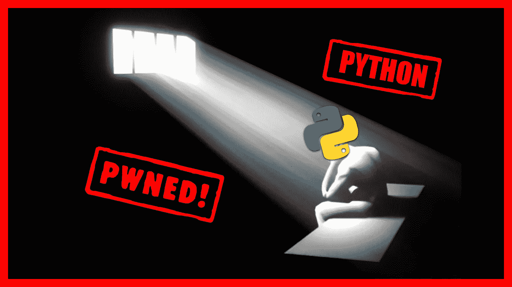

# Python 过去、现在和将来都是易受攻击的编程语言(黑客喜欢这一点)

> 原文：<https://medium.com/codex/python-was-is-and-will-always-be-vulnerable-programming-language-and-hackers-love-this-fab5cfa744f1?source=collection_archive---------4----------------------->

## 虽然很悲伤，但这是真的…🤚😔

在过去的几个月里，你可能已经读过关于在 Python 编程语言中发现的严重安全漏洞的新闻。这些漏洞的问题在于，它们可能**允许黑客接管系统，甚至不会被**发现……