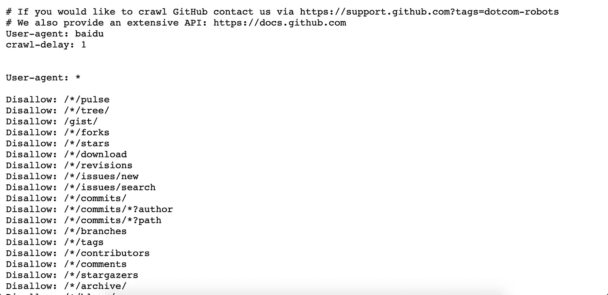
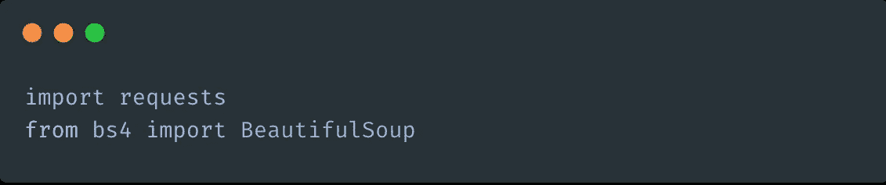
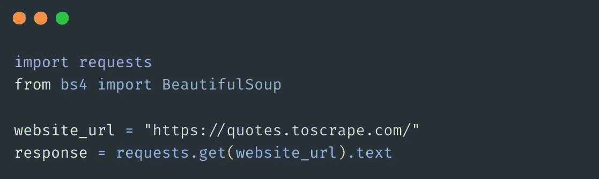
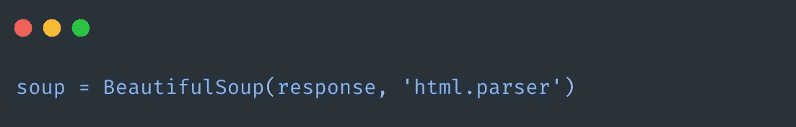
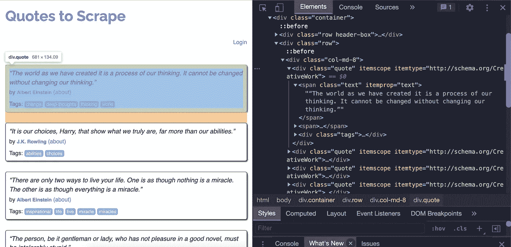
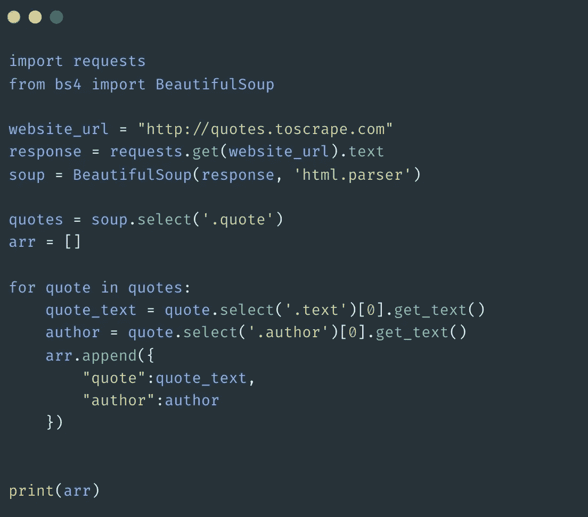
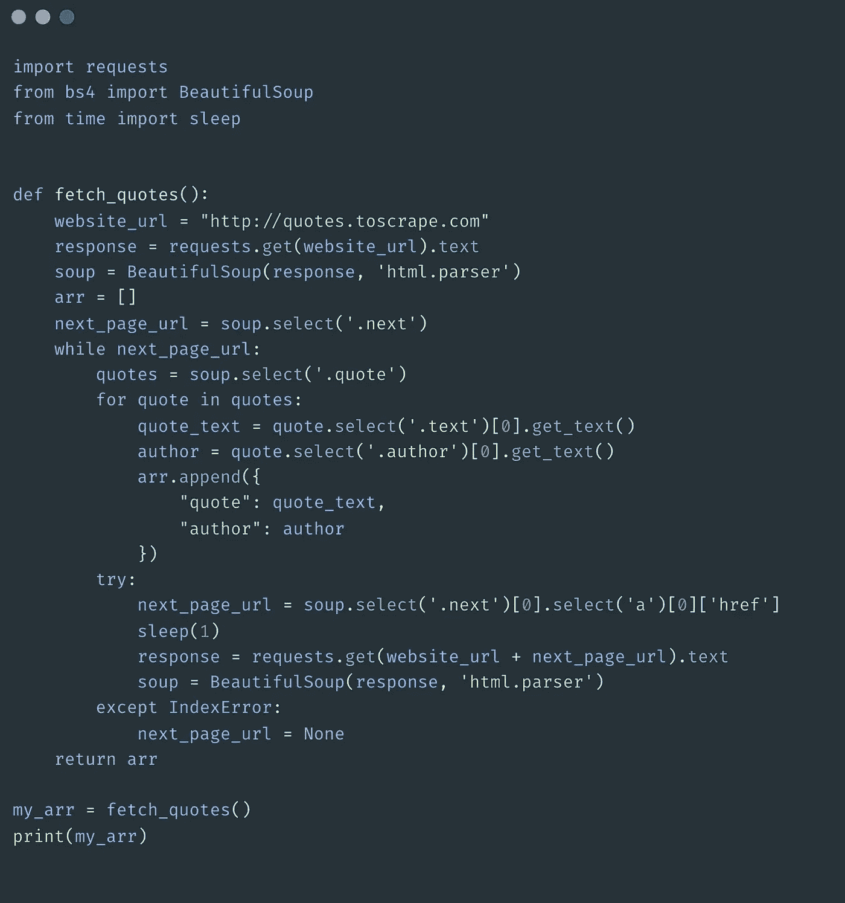
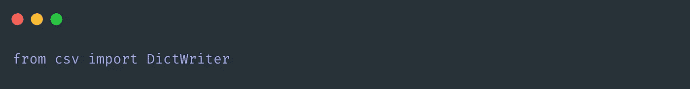
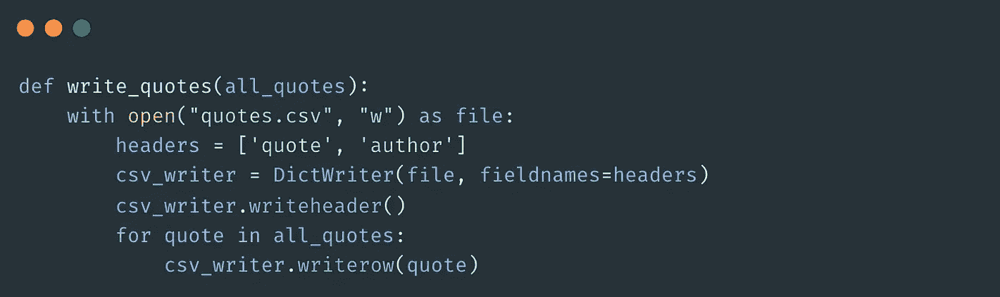
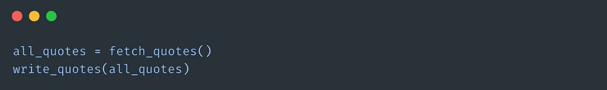

# 使用 BeautifulSoup 的 Python 网页抓取

> 原文：<https://medium.com/codex/python-web-scraping-using-beautifulsoup-ad2f111b48a2?source=collection_archive---------9----------------------->

图片由作者通过 [Canva](https://www.canva.com/) 提供

H ello 世界！在本文中，我们将探究 python 中 web 抓取的本质。但是首先，重要的是要知道网络抓取实际上意味着什么，为什么我们应该关心它。

想象你正在一个电子商务网站上尝试分析数据。您需要来自该特定网站的数据能够被访问，以便对您的代码进行操作。一种典型的方法是向网站的 API 端点发出请求，获取您想要的数据。但是这并不总是可能的，因为有些网站并没有给我们提供一个好的 API。还有一些情况下，你必须付费才能访问 API。那么我们该如何着手呢？这就是网络抓取派上用场的地方。

网络抓取让我们可以快速、轻松地从网站上获取我们想要的数据。就像我提到的，当你要找的网站没有提供任何 API 来提取需要的数据时，这是非常有用的。

这并不是说没有关于网络抓取的问题。事实上，立法机构也参与了网络抓取的话题，因为当恶意抓取时，会导致知识产权被盗或不公平的竞争优势。这意味着从一个网站获取数据并用这些数据构建另一个网站是不合法的。下面给出了一些经验法则，当你不得不刮的时候，你可以遵守。

*   如果你能找到一个可以获取你想要的数据的公共 API，总是使用那个 API 而不是抓取。
*   如果你想弄清楚网站对不允许抓取哪些内容的要求，你可以在开始抓取之前查阅 **robot.txt** 文件。您可以通过在网站 URL 中添加 *'/robot.txt'* 来查看该文件。例如，[下面是](https://github.com/robots.txt)GitHub 版本的文件。看起来是这样的:

*   始终确保以合理的速度请求数据。您可以在请求之间添加一点时间间隔来实现这个目标。
*   始终保持礼貌，获取你绝对需要的数据，而不是像年终大甩卖一样什么都拿。

现在让我们深入了解网络抓取实际上是如何完成的。在 python 中，我们使用一个名为 [bs4](https://pypi.org/project/bs4/) 的模块来获取 BeautifulSoup，它是这个模块的一部分。此外，我们确实需要[请求](https://pypi.org/project/requests/)模块来实际发送 HTTP 请求。一旦安装了 bs4 和 requests 模块，就可以如下所示导入它们，

首先，您必须向预期的 URL 发出请求，并获得响应体。有很多网站只是用来刮的，[报价刮](https://quotes.toscrape.com/)和[书籍刮](https://books.toscrape.com/)不一而足。在这个演示中，我将使用报价刮网站。您需要像这样发出请求并保存响应，

我们得到的响应是一个*字符串*，所以我们不能以我们想要的方式访问或操作它。下一步是通过传递得到的响应来创建 BeautifulSoup 的实例。

如果您使用 devtools 检查[报价来抓取](https://quotes.toscrape.com/)，您可以看到每个报价的详细信息都放在一个 div 下，该 div 的类为“quote”

在为每个报价识别容器的 CSS 选择器之后，您所要做的就是选择它们。可以这样做，

*。select()* 返回一个数组，即使只有一个结果。在这种情况下，我们有一个 div(引号)数组。我们可以遍历刚刚创建的引号数组，提取每个引号和作者或者我们想要的任何内容。最后*将每条记录作为字典添加到另一个数组中，以便于使用。*

报价文本位于类别为*“文本”*的范围内。带有类别*‘author’*的小标签中的作者姓名。我们用*。get_text()* 方法获取元素的 innerText。使用 tailing print 命令，你可以在一个数组中看到网站首页的所有引文和作者。

但更多时候，我们需要从网站的所有可用页面中提取数据，对吗？我们希望一次又一次地点击“下一步”按钮，并获得所有页面中的所有可用数据，而不仅仅是一个页面。

这是如何做到的:

首先我们需要定位下一个按钮*或*类似导航到当前页面的下一页。然后，我们选择下一个 URL，并继续抓取数据，直到下一个 URL 不再存在(这意味着我们在最后一页)。

获取所有可用报价的最终代码如下所示，

在上面的例子中，为了重用，我把所有东西都包装在一个函数中。此外，通过引入函数，我们可以仅在需要时通过调用函数来重复抓取，而不是每次运行文件时都运行抓取过程。

请注意，我通过添加 *sleep(1)* 在 try 块中的每个请求之间添加了 1 秒的间隔，以避免对服务器造成不良影响。当我们进行网络抓取时，这是一个很好的实践。

如果您愿意，也可以将结果保存到一个 *csv 文件*中，

首先你需要从' *csv* 模块中导入' *DictWriter* :

然后你可以写一个小函数，接受我们生成的引号数组，并把它写到一个 *csv 文件中。*

最后，您可以像这样执行这两个函数来生成包含所有引用和作者的 *csv 文件*。

我希望你清楚地了解什么是网络抓取，以及它是如何完成的。下次见！