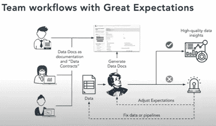
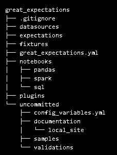
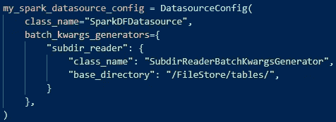
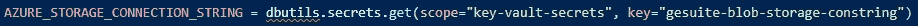
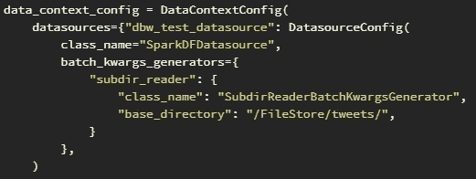
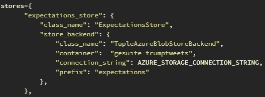
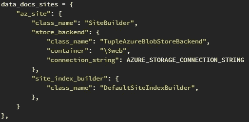
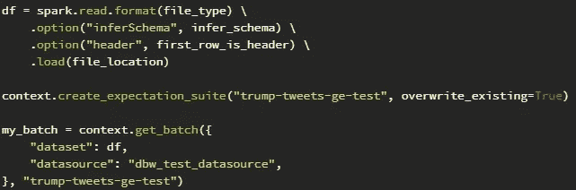
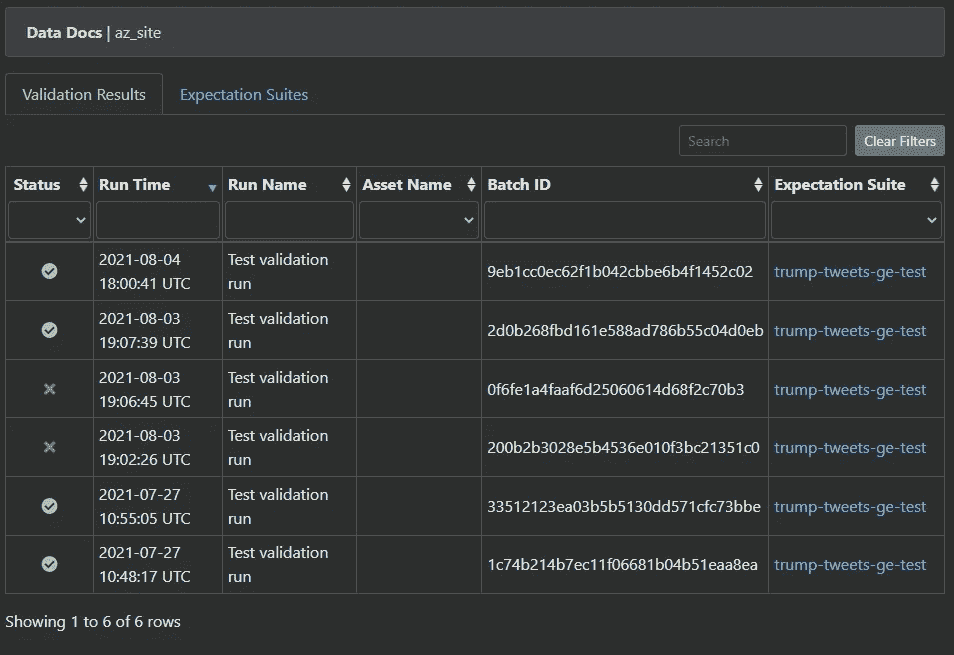

# Azure 数据块上的 Pythonic 数据(管道)测试

> 原文：<https://medium.com/codex/pythonic-data-pipeline-testing-on-azure-databricks-2d27d3b5d587?source=collection_archive---------3----------------------->

## 有没有想过如何在不建立全面的企业级数据质量解决方案的情况下，以有效的方式测试数据和数据管道？

Python 为单元测试代码提供了很多很棒的包。这样，您就可以检查您的管道代码是否正在运行。您当然可以使用 fixtures 来隔离单元测试，并且不要让单元测试依赖于变化的数据。但是，您如何检查您更改的数据转换是否会影响您的机器学习模型预期的数据管道结果？

前段时间，我在 Medium 上写了[这篇](https://towardsdatascience.com/great-expectations-ef9059f04995)关于开源 Python 包[的价值的博客文章](https://greatexpectations.io/)。

当时，我是一名顾问，在一个机器学习项目上为我的客户提供支持。我们使用了大量的内部数据源。当我们开始这个项目时，目标是快速原型化产品，并将智能部分开发为界面。我们将原始源中的所有数据复制到一个数据湖中。当然，在早期勘探阶段，我们既没有合适的管道，也没有接口合同。

对于实时 ML 模型，我们使用 Kafka 流中的数据，这些数据来自客户使用的移动应用程序。有一天，我们的模型发疯了，我们花了一些时间才弄明白发生了什么。appdev 团队更改了应用的源代码，导致数据混乱。因为我们是唯一真正消耗这些数据的团队，所以我们是唯一受到影响的人。

我们需要一个快速解决方案来防止这个问题再次发生。因为我们是 Python 的人，所以我们想给远大前程一个机会。最小环境的设置在几天内就完成了。我们没有失望。

现在我经历了类似的设置，但是我和客户一起在 Azure 上设置他们的 ML 架构。从我早期的项目中，我知道 Great Expectations 需要通过一个 yaml 文件来建立和配置，并且产生的工件(expectation suites，validation runs，DataDocs)也存储在一个文件系统中。所以对我来说，在像 Azure Databricks 和 Azure Machine Learning 这样的云服务上设置这似乎有点笨拙，我花了一些时间研究如何在托管环境中实现这一点。

《远大前程》的一个精彩特性是数据文档，以及这个特性为团队带来的机会。

图片取自远大前程 YouTube 频道。

DataDocs 不仅是所用数据的文档，或者显示数据验证的结果，还可以作为数据契约使用。主题专家、数据科学家和数据工程师可以在同一页面上工作，以确保数据得到充分理解，并确保数据质量。

在我看来，这在 MLOps 管道中特别有趣，除了测试代码本身之外，您还需要测试管道代码、数据漂移，并验证您从其他数据源或供应商处获取的数据。

好吧，但是在我们进入实质之前，我想告诉你我是如何使用这个包的！我把远大前程看做一个框架，挑出我觉得有用的东西。所以当我使用 Spark 工作时，我只配置数据源来提供我以后可以使用的元数据信息。我主要是手动加载一批数据，然后将 Spark 数据帧放入 batch_kwargs(或者……在新的 API 中)。

*💻在博客文章的末尾找到附加的代码。*

一个远大前程项目的建立有两种方式。如果您运行的系统已经准备好了文件系统，请选择第一种方式。从 great-expectations init 开始创建配置框架，并相应地配置您的 DataContext。

使用文件系统时，使用高期望值时产生的文件夹结构。

当您在托管系统上运行时，比如云中的 PaaS，您可能并不总是有可用的 CLI 或文件系统来方便地持久存储文件夹。使用 Azure Databricks 或 Azure Machine learning，理论上你可以访问 CLI 或文件系统(就像 ADB 上的 DBFS 或 AML 计算实例上的 Linux)。但这似乎不是最佳选择，因为在云中，您最好使用其他选项，比如有一个更集中的位置来存储您的配置和工件。

我从观看 YouTube 上的[网上研讨会](https://youtu.be/pq5CBea12v4)开始，并在文档中找到了许多有用的材料([如何在没有 YML 文件的情况下开始](https://docs.greatexpectations.io/en/latest/guides/how_to_guides/configuring_data_contexts/how_to_instantiate_a_data_context_without_a_yml_file.html)，[如何在数据块上运行](https://docs.greatexpectations.io/en/latest/guides/how_to_guides/configuring_data_contexts/how_to_instantiate_a_data_context_on_a_databricks_spark_cluster.html))。

如前所述，我喜欢指定数据的位置以使其作为元数据可用，但不想使用 ExecutionEngine 为我生成一批数据。稍后我将手动执行该操作。

数据源的最小配置。

我使用 Azure Key Vault backed scope 来管理我的秘密。结合 Azure Databricks 或 AzureML，做到这一点非常容易。这是我在使用配置作为代码时的一个优势。

使用密钥库支持的作用域来管理机密。

在使用 yaml 文件来配置 DataContext 的情况下，您可以使用一个没有签入 git 存储库的 [secrets 配置文件](https://docs.greatexpectations.io/en/latest/guides/how_to_guides/configuring_data_contexts/how_to_use_a_yaml_file_or_environment_variables_to_populate_credentials.html#how-to-guides-configuring-data-contexts-how-to-use-a-yaml-file-or-environment-variables-to-populate-credentials)，或者使用与 Azure Key Vault 相同的[方法。](https://docs.greatexpectations.io/en/latest/guides/how_to_guides/configuring_data_contexts/how_to_populate_credentials_from_a_secrets_store.html#how-to-guides-configuring-data-contexts-how-to-populate-credentials-from-a-secrets-store)

让我们从数据源的配置开始。我希望稍后在 DataDocs 中使用该配置作为元数据，但不一定希望使用 ExecutionEngine 加载一批配置，我稍后将手动执行。

数据上下文的配置。

我想在 Azure Blob 存储上存储我所有的工件(期望、验证)。

将配置设置为在 Azure Blob 存储上存储预期。

数据文档也将被推送到 Azure Blob 存储器，但是我们将使用\$web 容器来托管静态网站。

数据文档的配置

手动创建一批数据(火花数据帧)…

加载一批数据。

…我们开始吧。让我们创造一些期望。您可能需要查看文档或尝试一下。这是不言自明的。所以我们只是跳到下一个阶段。保存期望套件之后，我们可以运行一个验证或者创建一个检查点。我们将使用 run_validation_operator 根据一批数据来验证一批数据。它将进行验证运行，将生成的工件推送到存储区，并更新 DataDocs。

不要忘记代码版本。

最后，浏览数据文档并查看验证结果。

最后一个注意事项: [Cookiecutter](https://cookiecutter.readthedocs.io/) 在您有大量数据源和需要检查每个转换步骤的复杂数据管道时非常有用。

在下一篇博客文章中，我们将看看 [Delta Live Tables](https://docs.microsoft.com/en-us/azure/databricks/data-engineering/delta-live-tables/) ，看看这个新的(预览)数据块特性如何对管道测试有用。

在 Azure 数据块上运行 Great Expectations 管道测试的完整代码。