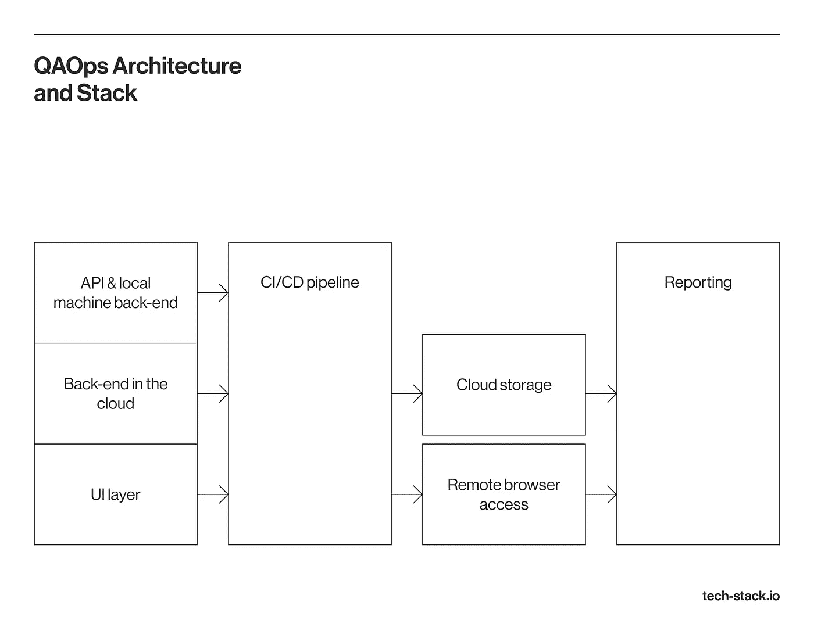

# QAOps:连续交付系统中的质量保证

> 原文：<https://medium.com/codex/qaops-quality-assurance-in-continuous-delivery-systems-ea8b4aaeb9e3?source=collection_archive---------11----------------------->

*作者:* [*维塔利多洛托夫*](https://www.linkedin.com/in/vitalii-dolotov/)*[*Techstack*](https://tech-stack.io/)*

**

*在常见的范例中，专门的 QA 团队只关注产品质量。随着产品和交付产品的团队之间的竞争加剧，QA 团队已经开始增强现有的流程。QAOps 是一种新的测试方法，能够实现高效的质量保证过程。*

*与 DevOps(涉及紧密联系的开发和 it 基础设施运营团队)类似，QAOps 变得至关重要，因为它将质量保证、IT 运营和软件开发流程集成为一个高效且紧密结合的流程。这是关于[确保 QA 成为你的 CI/CD 管道的一部分](https://tech-stack.io/services/software-testing?utm_medium=medium&utm_source=codex&utm_campaign=blog_distribution)以及他们在整个软件开发生命周期中的持续合作。*

**

# *QAOps:这是什么？*

*为了更详细地解释质量保证中的这种趋势，让我们来看几个对 QAOps 的正确和错误的定义。*

> *DevOps 和 QAOps 之间的关键区别可以定义如下:后者专门关注远程测试用例执行的基础设施。*

*这个基础设施允许团队在 CI/CD 平台上运行自动测试并获得报告。不能脱离 CI/CD 渠道单独构建 QAOps 基础设施和流程。*

***QAOps 不是专精，也不是团队角色** *。* QAOps 是一种实践，一种培养健康优质产品创造文化的方法论。在这种情况下,“健康”意味着产品的复杂性不会对流程效率产生负面影响。随着复杂性的增长，QAOps 变得越来越必要，这可能需要自动化测试专家或专门的 QAOps 专业人员的参与来解决问题。*

*从事 QAOps 工作的工程师的职责不仅包括 QA 自动化框架的开发，还包括配置远程自动化测试运行、收集有关其流程的数据、报告以及通过通信渠道分发结果。*

# *QAOps 流程细节*

*上述影响源于传统的 QA 框架无法在敏捷产品团队中保持高效。*

> *QAOps 驱动的过程旨在整合产品交付管道每个阶段的测试实践。*

*QAOps 框架基于左移范式。与瀑布式的过程不同，测试比传统的范例要早一个阶段发挥作用。促成左移范式成功的因素包括环境标准化、构建和部署自动化，以及测试自动化。*

# *何时引入 QAOps？*

*当团队决定引入 QAOps 时，通常有两种情况。*

1.  ***CI/CD 产品基础设施没有针对自动化质量保证进行优化。**当需要引入和配置 QAOps 流程时，精通 QAOps 的自动化 QA 工程师或包括 DevOps 团队和自动化 QA 团队在内的串联结构可能非常合适。CI/CD 熟练程度与 QA 自动化的结合为优秀的 QAOps 流程奠定了基础。*
2.  ***测试基础设施非常复杂，**这要求 QA 自动化工程师在配置、维护或增强它方面有深厚的知识。这种复杂性成为产品发展的瓶颈。在这种情况下，QAOps 工程师或任何了解 DevOps 的自动化工程师都是流程转换的先锋。*

# *Techstack 案例*

*我们的产品团队通常没有专门的 QAOps 工程师。然而，我们随时准备在必要的时候加入进来，因为我们有 [QA 自动化，DevOps 专业知识](https://tech-stack.io/services/development-consulting?utm_medium=medium&utm_source=codex&utm_campaign=blog_distribution)，团队内部顺畅的沟通，以及对新挑战的渴望。*

*在大多数情况下，一个独特的 QAOps 角色在项目中的参与时间有限，而我们寻求与合作伙伴和团队成员的长期关系。这就是为什么我们倾向于确保 QAOps 来自不同协作部门的辛勤工作，而不是短期雇佣专业人员。此外，流程配置中的持续需求更有利于拥有非常大的产品团队和大量流程要运行的产品。*

# *QAOps 架构和堆栈*

**

*每个 QAOps 框架层的技术堆栈，通常采用以下工具:*

*   ***CI/CD 渠道**:詹金斯，团队城市。*
*   ***云基础设施** : Docker containers、AWS、数字海洋、Azure。*
*   ***远程浏览器访问** : LambdaTest，Selenium，Katalon，BrowserStack。*
*   ***性能:** JMeter，K6，Octoperf。*
*   ***举报**:倾城、举报门户、数据狗。*

# *QAOps 立足的四大支柱*

*除了架构和技术栈之外，该框架还建立在几个核心原则之上。*

*   ***可扩展性。**应该揭示应用程序性能中隐藏的瓶颈，以确保它可以扩展。为了根据应用程序的定制需求调整测试，QA 工程师和开发人员一起定义测试类型，以及它们的频率和数量。*
*   ***自动化**。如果你不能自动化，你就不能扩展。使用自动化测试方法在产品开发的不同阶段节省时间，允许您减少运行常用测试的需要，例如手工回归、非功能性测试。*
*   ***并行化。**您可以同时进行多个测试过程，并提供更快的质量保证速度。通过手动和自动测试，您可以跨系统特性和模块并行测试。*
*   ***整合**。现在，当您应用前面的三个支柱时，实现 QAOps 的最后一步是将质量保证活动隐含到持续交付管道中。将开发和基础设施操作与 QA 相结合的最常见方法之一是让开发人员编写测试用例。*

# *摘要*

*QAOps 现在对于自动化交付管道的团队来说是必不可少的。随着产品、人员和流程数量的增长，选择合适的基础设施和系统架构进行扩展变得越来越重要。一旦引入，CI/CD 管道中的 QAOps 流程将节省测试工作并降低产品成本。*

**原载于 2022 年 3 月 16 日*[*https://tech-stack . io*](https://tech-stack.io/?utm_medium=medium&utm_source=codex&utm_campaign=blog_distribution)*