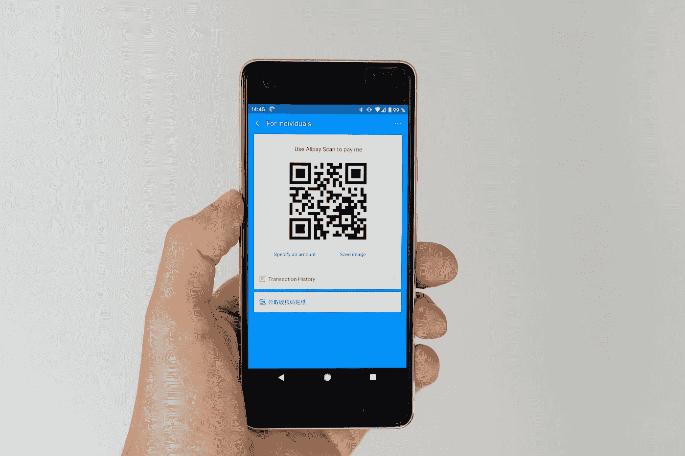

# 如何在 Swift 中创建二维码

> 原文：<https://medium.com/codex/qr-codes-are-simple-in-swift-6d203ebc3f5b?source=collection_archive---------2----------------------->

## [法典](http://medium.com/codex)

## 快速了解如何在您的应用中生成二维码。

由[马库斯·温克勒](https://unsplash.com/@markuswinkler?utm_source=medium&utm_medium=referral)在 [Unsplash](https://unsplash.com?utm_source=medium&utm_medium=referral) 上拍摄

二维码是可以存储信息的条形码。你可以用智能手机摄像头扫描二维码。二维码可以打开网站、打电话或发送电子邮件。二维码是营销和广告的绝佳工具。