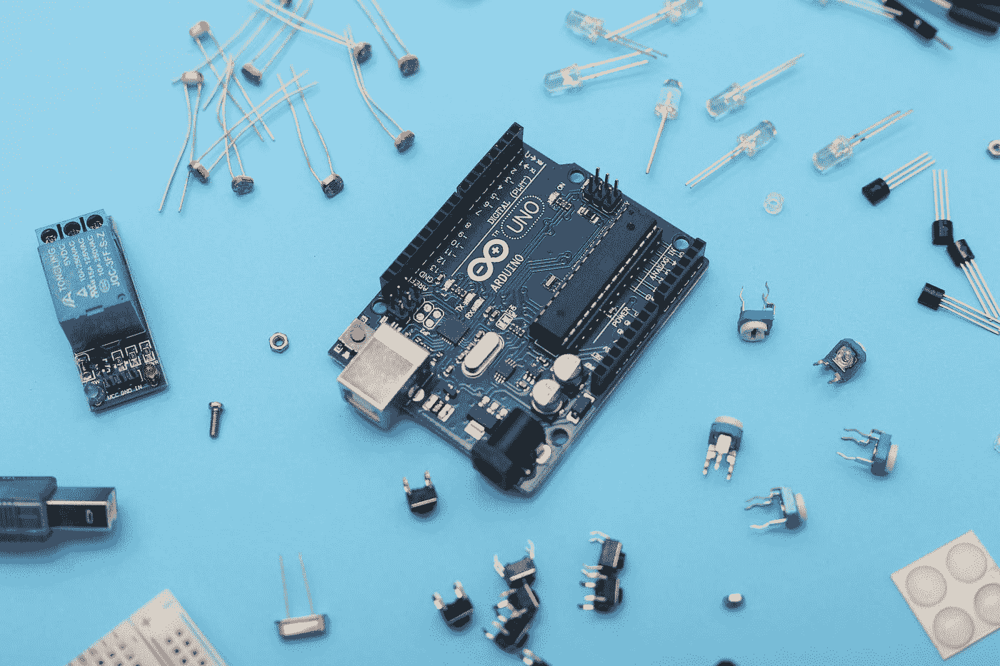
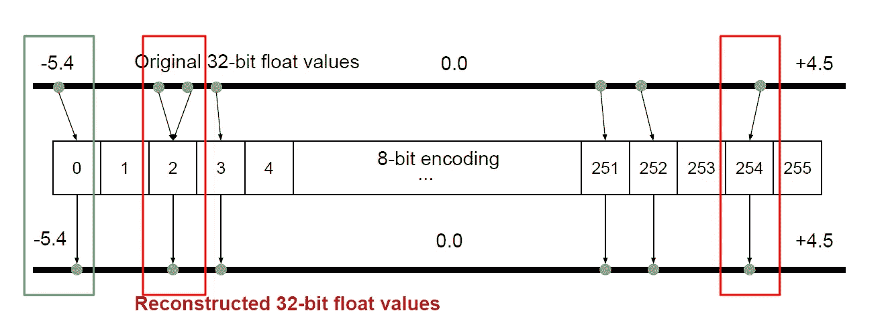
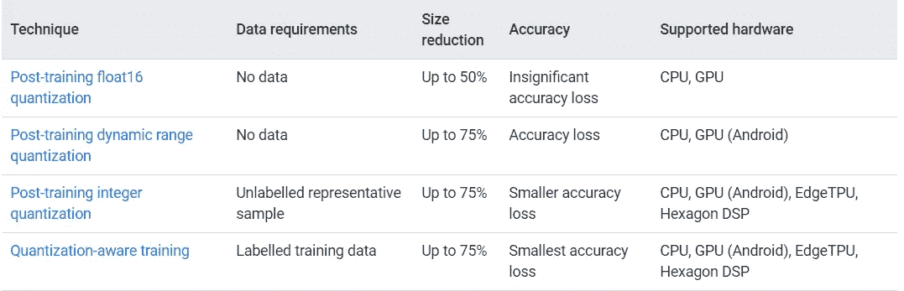
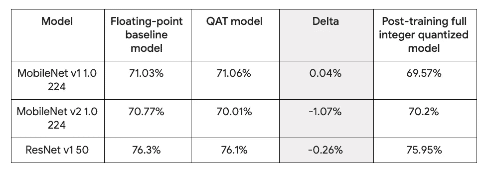

# TensorFlow 中的量化教程，像专业人士一样优化 ML 模型

> 原文：<https://medium.com/codex/quantization-tutorial-in-tensorflow-to-optimize-a-ml-model-like-a-pro-cadf811482d9?source=collection_archive---------4----------------------->

## 在 TensorFlow 中解释和实现量化感知训练和训练后量化



萨汉德·巴巴里在 [Unsplash](https://unsplash.com?utm_source=medium&utm_medium=referral) 上的照片

如果我告诉你，你可以使用量化等技术在这个只有 256 kb RAM(内存)和 1MB Flash(存储)的微型嵌入式设备上运行机器学习应用程序，会怎么样？

印象深刻，对吧？

在某些情况下，与非量化的 ML 模型相比，通过量化，我们甚至会有一个**稍微好一点的精确度**。但稍后会详细介绍。

在这一点上，我希望我可以用这个小小的介绍让你对量子化感到兴奋。在这篇博文中，你将了解到:

*   什么是量子化？
*   量化有什么好处？
*   量子化是如何工作的？在这里，我们将在 TensorFlow 中做训练后整数量化和量化感知训练的教程
*   什么时候应该使用哪种量化技术？

TensorFlow 中的量化教程，像专业人士一样优化 ML 模型

# 定义

量化是一种优化，可以降低模型参数所用数字的精度。例如，在 TensorFlow 中，模型的参数默认为 32 位浮点数。

由于这是一个相当技术性的定义，让我们更形象地说明量化:



机器学习中的量化

我们有一个想要压缩的模型:

*   我们的模型层的权重分布在-5.4 和+4.5 的范围内，这是你在这里看到的(第一)条线。这意味着当前所有的权重都是 float(32)类型。
*   在量化中，我们将每个层的最小和最大值存储在 int(8)中。所以，我们说-5.4 是 0，+4.5 是 255。
*   接下来，通过表示范围内最接近的固定值，将-5.4 到+4.5 之间的所有 float(32)权重压缩为一个八位整数。

从图中可以看出，红色单元格表示量化过程中损失了一些精度。例如，两个不同的值(如-4.87 和-4.86)可能由相同的 int(8)值表示，这意味着如果我们反转量化，它们将被重构为一个 float(32)浮点值。显然，这导致了准确性的降低。

那么，为什么量子化是如此流行和重要的技术呢？


照片由 [Ales Nesetril](https://unsplash.com/@alesnesetril?utm_source=medium&utm_medium=referral) 在 [Unsplash](https://unsplash.com?utm_source=medium&utm_medium=referral) 上拍摄

# **量化的好处**

*   **闪存(存储)大小:**从 32 位移动到 8 位导致内存减少 4 倍。
*   **RAM(内存)大小:**较小的模型在运行时使用较少的 RAM，这释放了内存供应用程序的其他部分使用。此外，这可以转化为更好的性能和稳定性。
*   **延迟:** Int8 (v. fp32)格式大大减少了使用模型进行推理的计算量，从而降低了延迟。此外，延迟优化对功耗有显著影响。
*   **便携性权衡:**在嵌入式系统中，为了获得更高的效率，通常会牺牲便携性。一些嵌入式设备不支持浮点值，这是使用量化的另一个重要原因。


阿诺德·弗朗西斯卡在 [Unsplash](https://unsplash.com?utm_source=medium&utm_medium=referral) 上拍摄的照片

# 量子化是如何工作的？

有两种主要的量化形式:

*   训练后量化
*   量化感知训练


由[克里斯托弗·高尔](https://unsplash.com/@cgower?utm_source=medium&utm_medium=referral)在 [Unsplash](https://unsplash.com?utm_source=medium&utm_medium=referral) 上拍摄的照片

# 训练后量化

## 理论



训练后量化:TensorFlow 提供的技术比较([来源](https://www.tensorflow.org/lite/performance/model_optimization)

如图所示，这是 TensorFlow 自己提供的比较，有三种方法可以使用训练后量化来量化模型(第 1–3 行)。由于训练后整数量化(第三行)是最准确的，并且大小减少了 75%，这就是我将向您展示的技术。

训练后整数量化是一种优化策略，将**所有权重和激活输出**从 32 位浮点数转换为最接近的 8 位定点数。训练后整数量化(第 1–2 行)中使用的其他技术将一些数据留在浮点中。

## 张量流

使用 TensorFlow Lite 转换器将经过训练的浮点 TensorFlow 模型转换为 TensorFlow Lite 格式时，可以使用此技术对其进行量化。

在[这个 Colab 教程](https://github.com/superintelligence-lab/tensorflow_model_optimization)中，我们将训练一个 MNIST 模型，将其转换为 Tensorflow Lite 文件，并使用训练后整数量化对其进行量化。然后，我们将检查转换后的模型的准确性，并将其与原始模型进行比较。


奥斯卡·伊尔迪兹在 [Unsplash](https://unsplash.com?utm_source=medium&utm_medium=referral) 上的照片

# 量化感知训练

## 理论

**量化感知训练不是在训练后应用量化技术，而是在训练期间引入量化误差作为噪声** **。**它是总损失的部分，优化算法试图将其最小化。因此，该模型学习对量化更鲁棒的参数。

## 张量流

TensorFlow Keras 提供了一个用于量化感知训练的 API，有助于训练具有量化感知的模型。

以下是量化整个 Keras 模型的必要操作:

```
import tensorflow_model_optimization as tfmot

model = tf.keras.Sequential([
   ...
])
# Quantize the entire model.
quantized_model = tfmot.quantization.keras.quantize_model(model)

# Continue with training as usual.
quantized_model.compile(...)
quantized_model.fit(...)
```

[这个 Colab](https://github.com/superintelligence-lab/tensorflow_model_optimization) 将训练一个有和没有量化感知训练的模型，并比较它们的准确性。


照片由[内特·格兰特](https://unsplash.com/@nateggrant?utm_source=medium&utm_medium=referral)在 [Unsplash](https://unsplash.com?utm_source=medium&utm_medium=referral) 上拍摄

# 你应该使用哪种量化技术？

在这篇 2020 年 [TensorFlow 博客文章](https://blog.tensorflow.org/2020/04/quantization-aware-training-with-tensorflow-model-optimization-toolkit.html)中，比较了三种流行模型的准确性，分别使用浮点值、量化感知训练或训练后整数量化。QAT 准确度数字是用默认 TensorFlow Lite 配置训练的。



TensorFlow 提供的不同量化技术的准确性比较([来源](https://1.bp.blogspot.com/-y2x7mevzJcA/XozZJ2pnjkI/AAAAAAAAC6Y/jg00dVQJLx4wFx7eNz0gOY4gdLRSs3H_wCLcBGAsYHQ/s1600/Screen%2BShot%2B2020-04-07%2Bat%2B12.48.34%2BPM.png))

这种比较真正说明了量化和准确性的所有要点，这真的很重要。

*   首先，你可以看到，在大多数情况下，量化感知训练在准确性方面优于训练后整数量化。这也是为什么这种量化技术最常用的原因。
*   第二个重要观察是**量化感知训练有时甚至比浮点基线模型**更准确，正如您在 MobileNet v1 中看到的。这也是我在这篇博文开头提到的。
*   最后，第三个观察结果是，虽然训练后整数量化在准确性方面通常较差，但仍有一些例外，正如您在 MobileNetv2 中看到的那样。尽管如此，这种情况非常罕见。

*我希望你能从 TensorFlow 的这些量子化教程中获得一些新的见解。让我知道，你还对哪些 ML 主题感兴趣！*

来源:

[1]tensor flow 模型优化，[https://www . tensor flow . org/lite/Performance/Model _ Optimization](https://www.tensorflow.org/lite/performance/model_optimization)[2]tensor flow 模型优化工具包量化感知训练—性能与准确性，2020 年 4 月 8 日，[https://blog . tensor flow . org/2020/04/Quantization-Aware-Training-with-tensor flow-Model-Optimization-Toolkit . html](https://blog.tensorflow.org/2020/04/quantization-aware-training-with-tensorflow-model-optimization-toolkit.html)