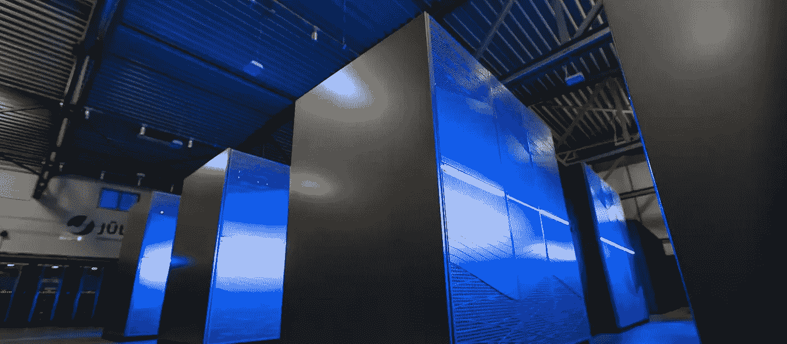
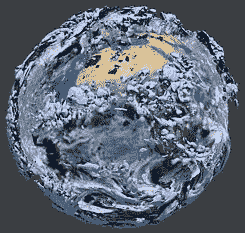
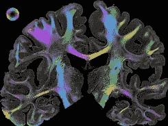
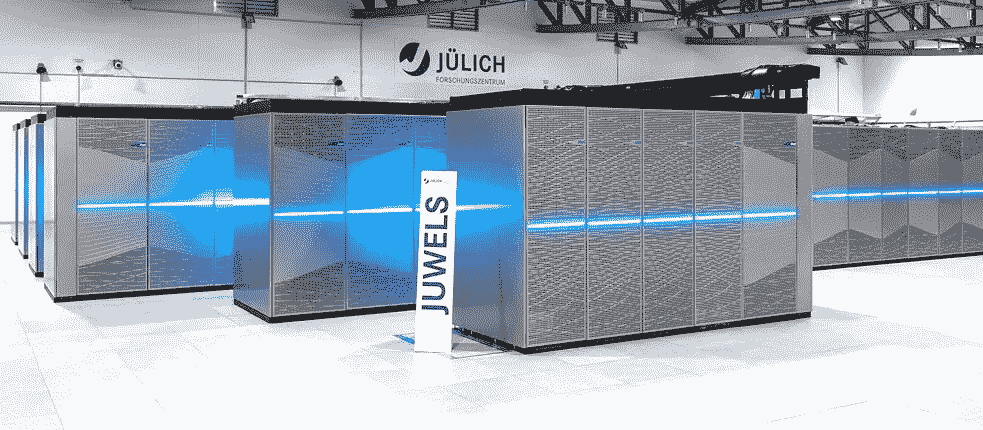

# 数字化的未来:量子和神经形态计算

> 原文：<https://medium.com/codex/quantum-and-neuromorphic-computing-35d1927e0db1?source=collection_archive---------23----------------------->

## 数字计算能力

照片(细节):Forschungszentrum jülich/Sascha Kreklau

无论是自动语音识别、自动驾驶汽车还是医学研究，我们对计算能力的需求都在不断增长。然而，提高微芯片性能的可能性将很快达到极限。那么，我们该何去何从呢？

*伊娃·玛利亚·费尔斯*

50 多年前，半导体制造商英特尔的创始人、工程师戈登·摩尔预言，在可预见的未来，我们的数字设备的容量将每两年翻一番。这是因为硅微芯片上的晶体管数量每两年翻一番是可能的。这意味着在相同的空间内，计算能力提高了一倍，而成本只增加了一点点。在接下来的几十年里，科技公司确实设法定期将硅芯片的计算能力提高一倍，推动了快速的技术进步。但这种情况会持续下去吗？超级计算专家 Estela Suarez 解释了为什么摩尔定律不会永远有效，尽管发展将继续快速。以及为什么这对医学、交通和气候预测的进步如此重要。

*Estela Suarez 教授博士。照片(详情):Forschungszentrum jülich/Ralf-Uwe Limbach*

Estela Suarez 教授 Estela Suarez 博士，根据 1965 年以来的“摩尔定律”,技术进步是一个不变的事实。但是现在我们听说这个原则将达到极限。这是为什么呢？

物理限制是个问题:不可能让芯片中的结构像电路一样无限小。在某个时刻，我们将达到原子的大小——而这，最迟，将是终结。

**微芯片优化的终结是否也意味着性能提升的终结？**

小型化的终结意味着我们将少了一种提高性能的方法。所以，我们必须使用其他策略。还有其他优化方法可以给我们带来更高的计算能力，并且与微芯片上结构的大小没有直接关系。例如，许多应用程序都存在一个问题，即如何以足够快的速度将数据从内存传输到处理器。他们不断地等待数据，然后继续处理。正在开发新的存储技术来解决这个问题。它们提供更大的带宽，因此可以更快地访问数据。这提高了计算能力，因为在相同的时间内可以执行更多的操作。但即使是这种策略，最终也会在某个时候达到极限。这就是为什么研究人员和技术公司总是在寻找全新的方法来使未来的计算机更加强大。

**为什么进一步提高计算能力非常重要？您能否举例说明只有计算能力不断提高，才能开发和部署的应用或技术？**

超级计算机被用来准确预测气候条件随时间的变化。照片(细节):Forschungszentrum Jülich，EZMW / Herwig Zilken，Olaf Stein

超级计算机被用来准确预测气候条件随时间的变化。在科学领域，我们希望使用计算机来分析日益复杂的现象，以便得出正确的结论。这些现象必须以更高的精度来模拟，这增加了我们对更高计算能力的需求。天气和气候模型就是一个例子。他们从各种不同的来源获得数据，并考虑到许多相互关联的方面:从大气化学和海洋动力学到地球表面不同区域的地理和植被。所有这些甚至更多不同但相互关联的方面都需要模拟，以准确预测气候条件随时间的变化。今天，即使在最强大的计算机上，这些计算也要花费数周到数月的计算时间。具体而言，这意味着更高的计算能力将实现更准确的预测，这反过来将有助于防止天气灾难，并采取更有针对性的措施来缓解气候变化。

**这还适用于其他哪些领域？**

今天的计算机还不能创造一个完整的人脑模拟，尽管这可能有助于决定性地提高我们对神经疾病的理解。照片(细节):Forschungszentrum jülich/Markus Axer

今天的计算机还不能创造一个完整的人脑模拟，尽管这可能有助于决定性地提高我们对神经疾病的理解。在医学等其他研究和工业领域也有类似的情况:今天的计算机还不能模拟整个人脑，尽管这可能有助于决定性地提高我们对神经疾病的理解。药物开发还需要高计算能力，以更快地确定活性成分的正确组成。超级计算机也被用来识别制造更环保产品所需的新材料。语言模型的发展也需要越来越强大的计算性能。这些已经在我们日常生活的许多地方使用，比如手机、汽车和智能电视。

**在 Forschungszentrum Jülich，你正在研究量子技术，这将为一些过程提供更高的计算速度。它会带来什么样的可能性？**

这种方法不仅在研究机构，而且在全世界范围内都在大力推行。我们与之合作的大型 IT 公司，如谷歌，也在关注此事。量子计算机可以比标准计算机更快地解决某些问题，因为它们以完全不同的方式进行计算。它们使用量子物理的特性，允许更紧凑的数据存储和更快的某些操作的执行。量子计算机不一定在每个应用上都比“标准”数字计算机好。但是它们非常有效，特别是对于优化问题，比如在多维参数数组中寻找最小值。导航是这类问题的一个实际例子:当你在 GPS 系统中输入一个目的地时，设备中的计算机会计算出最佳路线，并将距离、速度限制、当前交通状况和其他因素考虑在内。这是一个典型的优化问题，在量子计算机上运行要比在普通计算机上快得多。使用量子计算机来计算一个人去度假的路线是过分的。但想象一下未来，数百万辆处于自动驾驶模式的汽车必须以协调的方式在德国的道路上行驶，以尽快将每位乘客送到目的地。这将需要巨大的计算能力，这可能只有量子计算机才可行。

迄今为止，没有一台量子计算机在研究之外被使用。我们离量子技术真正可用还有多远？

今天的量子技术与 20 世纪 40 年代普通计算机的水平相当。有一些原型系统已经显示出非常有希望的结果，但是我们仍然在与不可靠性和计算错误作斗争。软件环境也仍处于起步阶段。我们习惯于为普通计算机提供的许多实用工具，如高度优化的编译软件、定制库和调试器，还不能用于量子计算机。算法开发也是任重道远。

*未来的流动性？自动驾驶需要巨大的计算能力。照片(细节):土坯*

**未来的流动性？自动驾驶需要巨大的计算能力。还有什么其他方法或想法可以提高数据处理能力，它们的发展有多快？**

神经形态计算是另一项创新技术。这是建造一台模仿大脑工作方式的计算机的概念。我们的大脑在完成数学运算方面速度不是很快，但由于神经元之间的大规模网络，它在学习和识别各种观察结果之间的联系方面效率极高。我们的大脑在执行模式识别或语言学习等任务时，需要的能量比传统计算机少得多。神经形态计算机正试图实现这些能力，并将其应用于数据处理。

当前的预测是什么？专家认为未来几年和几十年技术发展的速度会有多快？他们的预测基于什么样的假设？

目前的趋势是走向多样化。我们认为，孤立地使用单一的技术解决方案无法推动和实现进步。例如，这是我们多年来在超级计算机发展中看到的趋势。超级计算机越来越多地结合不同的计算和存储技术，以最大的效率实现最高的性能。单个组件的技术发展非常活跃，全新的方法不断涌现。因此，该领域研究的一个目标是有效地互连各种组件。在 Jülich 超级计算中心，我们正在开发一个模块化的超级计算架构，在这个架构中，我们致力于将不同的方法整合为超级计算机中的模块。我们还致力于将传统计算机与量子计算机结合起来。

目前欧洲最快的超级计算机，JUWELS，位于 Forschungszentrum Jülich。照片(细节):福尔斯琼森特鲁姆·于利希/威廉·彼得·施耐德

## 作者

Eva-Maria Verfürth 是一名记者、公关顾问和翻译。她是在线杂志“十二点后喝茶”的创始人和主编，也是通信机构 Bunny Island GmbH 的董事总经理。

翻译:莎拉·史密森·康普顿

版权所有:正文:[歌德学院，伊娃-玛利亚·韦尔斯](https://www.goethe.de/en/index.html?wt_ca=22cc)。本作品采用[知识共享署名-相同分享 3.0 德国](http://creativecommons.org/licenses/by-sa/3.0/de/deed.en)许可协议进行许可。

2022 年 5 月

*原载于*[*https://www . Goethe . de*](https://www.goethe.de/prj/lqs/en/art/22982454.html)*。*