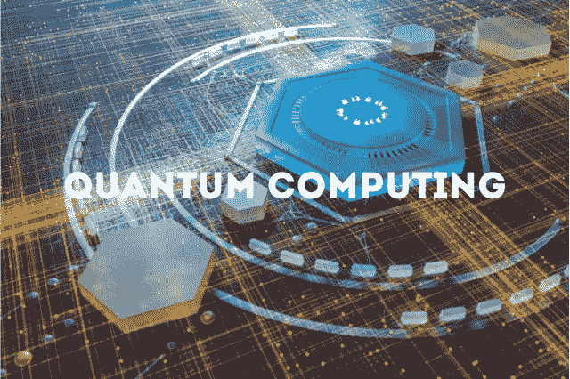

# 量子计算可能会彻底改变网络安全

> 原文：<https://medium.com/codex/quantum-computing-could-revolutionize-cyber-security-2955b47414ec?source=collection_archive---------40----------------------->

量子计算有可能彻底改变网络安全。传统计算机受到每秒钟能执行的计算次数的限制。这是因为他们使用了经典力学，而经典力学是我们目前理解物理学的基础。经典力学受到在任何给定时间可以处理的位数的限制。

然而，量子力学允许我们一次处理多个比特，这意味着量子计算机可以同时进行多个计算。这意味着量子计算机有可能比传统计算机强大得多——这一优势可以用于网络安全应用。

# 量子计算如何革新网络安全？

量子计算在网络安全方面的潜在应用非常广泛。最明显的应用是“[量子密码术](https://cyberhubintelligence.com/quantum-computing-threat-to-cybersecurity/)”量子密码术使用编码在光子(光的粒子)上的密钥来加密信息。光子的独特性质使得它们几乎不可能被篡改或拦截而不被接收器检测到(除非你有非常大的预算)。

此外，另一个应用是破解加密密钥和密码，这将允许黑客访问敏感数据，如信用卡号码或私人信息，如社会安全号码，而不必手动尝试每一种可能的组合。安全行业也可以使用量子计算比今天的传统方法更快更准确地检测恶意软件——这包括反病毒软件，它依赖于模式识别软件，该软件扫描文件中已知的恶意软件签名，如果它们匹配一个或多个这些签名，就会阻止它们运行；以及入侵检测系统(IDS ),用于监控网络流量中的可疑活动，如数据包嗅探或漏洞扫描。

# 量子计算算法

有几种算法已经在现实世界中使用。这些算法显示出巨大的潜力，随着计算机变得更加先进，它们甚至会变得更加强大。

量子计算中使用的第一种算法叫做**肖尔算法**。这个算法允许你非常快速地将大数分解成它们的质因数，这是密码学的一个重要部分。正如我们之前提到的，这可能被攻击者用来破解加密方法，如 RSA 或 ECC ( [椭圆曲线加密](https://csrc.nist.gov/Projects/Elliptic-Curve-Cryptography))。

量子计算中使用的另一种算法是 **Grover 的搜索算法**，它可以非常快速地找到数据库中隐藏的东西，如果它真的存在的话(尽管它不会告诉你它在哪里)。攻击者可以利用这一点来查找存储在您的计算机或网络上的密码或其他敏感数据，而不必单独对每个密码进行暴力攻击(这将花费更长的时间)。

> ***参见:*** [***量子计算对网络安全的威胁***](https://cyberhubintelligence.com/quantum-computing-threat-to-cybersecurity/)

# 结论

我们生活在一个高度互联的世界，这就是为什么网络安全是许多人最关心的问题。量子计算有可能彻底改变网络安全，改变数十年的加密方法。随着量子计算的发展，网络安全专家和程序员关注这一点非常重要，因为随着量子计算的出现，破解今天的加密代码可能会变得更加容易。

## **这篇文章最初发表在** [网络中心情报博客](https://cyberhubintelligence.com/quantum-computing-could-revolutionize-cyber-security/)