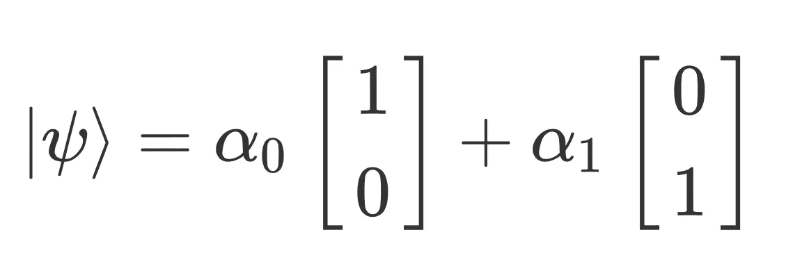
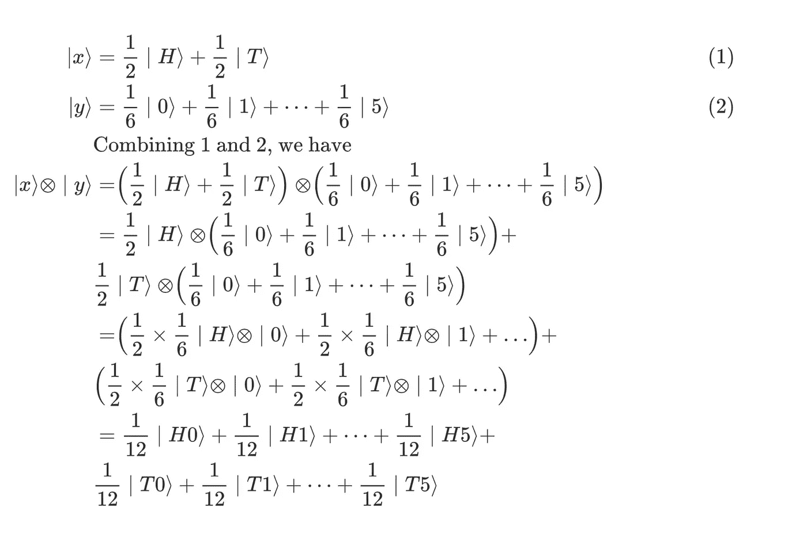
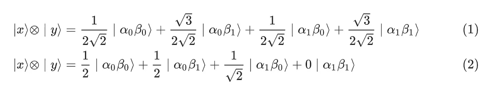
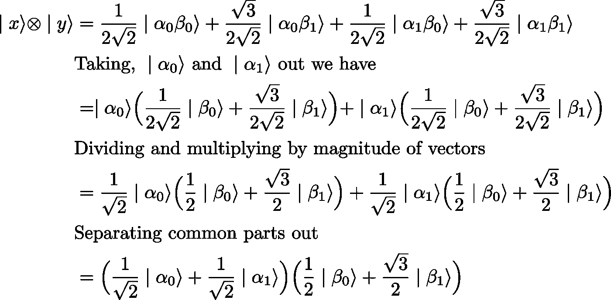
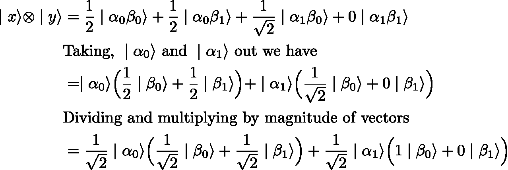

# 量子纠缠

> 原文：<https://medium.com/codex/quantum-entanglement-e5d4f0bedeab?source=collection_archive---------11----------------------->

Marc Sendra Martorell 在 [Unsplash](https://unsplash.com/s/photos/pair?utm_source=unsplash&utm_medium=referral&utm_content=creditCopyText) 上拍摄的照片

## 在这篇文章中

*   介绍
*   模拟纠缠
*   纠缠与非纠缠量子位
*   理解纠缠量子比特
*   结论

## 介绍

量子力学是解释宇宙基本组成部分行为的最有趣和公认的方式之一。然而，它也预言了许多奇怪现象的存在，如叠加、纠缠和传送。这篇文章是关于量子纠缠及其背后的数学。

我先告诉你这是什么？然后遵循一个严格的数学模型，特别是模拟两个纠缠系统。但是在我们开始之前，我假设你已经熟悉线性代数:向量，矩阵，向量的大小，单位向量，线性组合和向量(或矩阵)的点积。

人们常说，当她的孩子受伤时，母亲总是知道这件事，不管他们之间的距离有多远。也许她和她的孩子有某种宇宙联系，也可能只是巧合。量子力学，也许很奇怪，预测了亚原子粒子之间的类似现象，这些亚原子粒子要么来自同一个源头，要么是分裂的碎片。当其中一个粒子被改变时，它会改变其兄弟粒子的属性，无论它们之间的距离如何，这意味着它们以某种方式“纠缠在一起”。然而，这导致了两个问题。第一个问题是，很明显，这可能吗？第二，如果这确实是可能的，那么以某种方式，信息从一个粒子立即传播到另一个粒子，比光还快，这违反了狭义相对论。仅仅因为这个原因，许多物理学家就抛弃了这种想法，直到它被实验证明是可能的。无论如何，这不是本文的主题，我也不会深入探讨，因为我们假设它存在于自然界。

## 模拟纠缠

量子纠缠的数学解释归功于尼尔斯·玻尔和沃纳·海森堡。我们将追随他们的脚步。量子系统由量子位组成。量子位是一种通用位，与经典位不同，它可以同时处于多种状态，除非并且直到它被测量，然后它会使其中一种状态崩溃。我们将量子位表示为向量，并将它们可能的结果表示为向量空间的基础。以一枚硬币为例，它可以有头或尾在上面，但是，当它在空中翻转时，硬币的状态是不确定的，它是头和尾的叠加，各有 50%的机会出现。如果我们让ℝ空间的标准基向量[1 0]和[0 1]表示头部和尾部，α表示硬币的概率幅度(概率的平方根)在它们中的任何一个中，那么这可以表示如下

二维向量空间中的量子位

这叫做狄拉克符号，在量子力学中经常使用。既然我们已经了解了什么是量子位，我们就可以把两个量子位结合起来，或者取它们的张量积。设∣x⟩和∣y⟩分别是掷硬币和掷骰子的两个量子位，那么我们可以用张量积将这些系统组合如下:

两个量子位的张量积

这个组合量子位具有硬币和骰子矢量空间的所有可能结果。例如，它有 83.3%的概率处于硬币上有头像而骰子上有 6 的状态。

## 纠缠与非纠缠量子位

让我们再次假设，我们被给予一些任意的量子位∣ x ⟩和∣ y ⟩的组合，但是具有稍微不同的概率振幅。这里的方程(1)表示组合系统，它是不纠缠的，而方程(2)是纠缠的。请注意它们各自概率振幅之间的差异，它们是纠缠和未纠缠量子位的原因。

相同量子位的两种不同配置

我们说量子位元的组合是纠缠的，当且仅当外部基底和内部基底的机率振幅不同。比如在方程(1)中，设 *r =* 1/2√2 *，s =* √3/2√2 *，t = 1/2√2* 和 *u =* √3/2√2，则明确 *r × u = s × t* (自己查)。但是，在等式(2)中这是不正确的，因此等式(2)是纠缠的，而等式(1)不是。

设量子位 x 属于爱丽丝，y 属于鲍勃，假设爱丽丝要测量她的量子位。为了找到她和鲍勃量子位的最终状态，我们需要对方程(1)进行一些代数操作。

未纠缠的量子位

这意味着当 Alice 测量她的量子位时，它以 50%的概率坍缩为 1 或 0，而 Bob 的量子位保持不受影响，即 Bob 的量子位的概率振幅保持不变。

## 理解纠缠量子比特

现在让我们对等式(2)进行同样的计算，但是这次我们不能将等式分成两组，这是因为它们之间存在纠缠。

纠缠量子比特

这个结果可能看起来很普通，但它所显示的是非常不可思议的。它表明，当 Alice 测量她的量子位，并且它跳到一个状态时，Bob 的量子位的概率幅度也改变了。事实上，万一她的量子位跳到状态α(一)，他的量子位跳到β(零)。我喜欢思考这个结果的一种方式是，它就像条件概率一样；如果她得到 0，那么他有 50%的概率得到 0 或 1，否则他有 100%的概率得到 0，这是一个例外，即使两个量子位在宇宙的不同末端，这种情况也会发生。

好了，这就是这篇文章的全部内容。希望，它让你对量子力学和量子信息有点好奇。我已经尽力让事情变得尽可能简单。当然，要理解这一点需要理解线性代数，这是这门学科的核心。

在下一篇文章中，我们将研究如何使用纠缠态进行比光速更快的通信(实际上，我们将证明这一点是错误的),以及一个安全的密钥共享协议 BB84 协议。您可以通过我的电子邮件地址向我发送您的评论或问题。感谢您的阅读。

*本文首发* [*此处*](https://sites.google.com/view/dvendator/home)

*参考文献*

1.  [哥本哈根解读](https://www.google.com/url?q=https%3A%2F%2Fen.wikipedia.org%2Fwiki%2FCopenhagen_interpretation&sa=D&sntz=1&usg=AOvVaw2795qog3AMnkD769vKibes)
2.  [约翰·斯图尔特·贝尔](https://www.google.com/url?q=https%3A%2F%2Fen.wikipedia.org%2Fwiki%2FJohn_Stewart_Bell&sa=D&sntz=1&usg=AOvVaw3g36HnD6v2nse_Wix60agV)
3.  [贝尔不等式](https://www.google.com/url?q=https%3A%2F%2Fen.wikipedia.org%2Fwiki%2FBell%2527s_theorem&sa=D&sntz=1&usg=AOvVaw3y3P7938uOQ4yPitESdZKq)
4.  克里斯·伯恩哈特的《量子计算为每个人服务》
5.  [量子计算和量子信息教科书，艾萨克·庄和迈克尔·尼尔森著](https://g.co/kgs/SSfRXn)