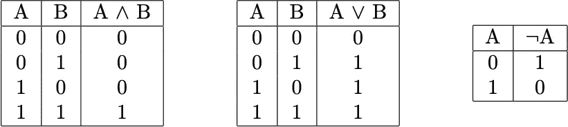
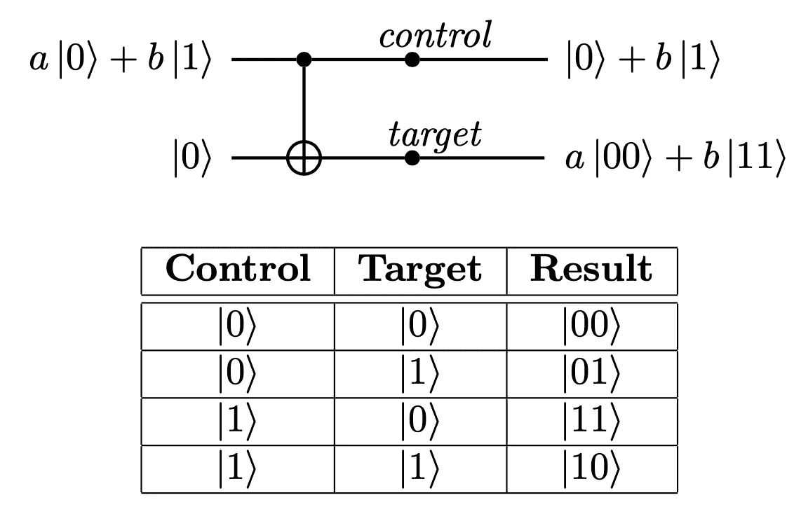
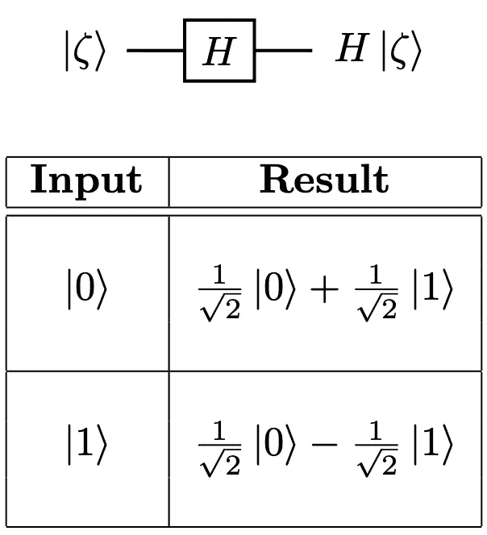
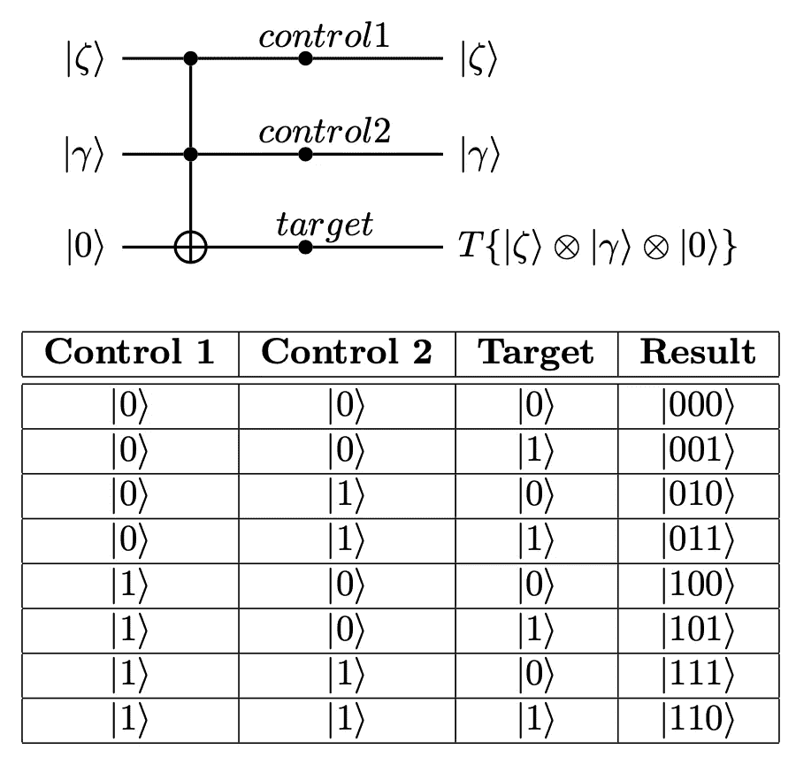
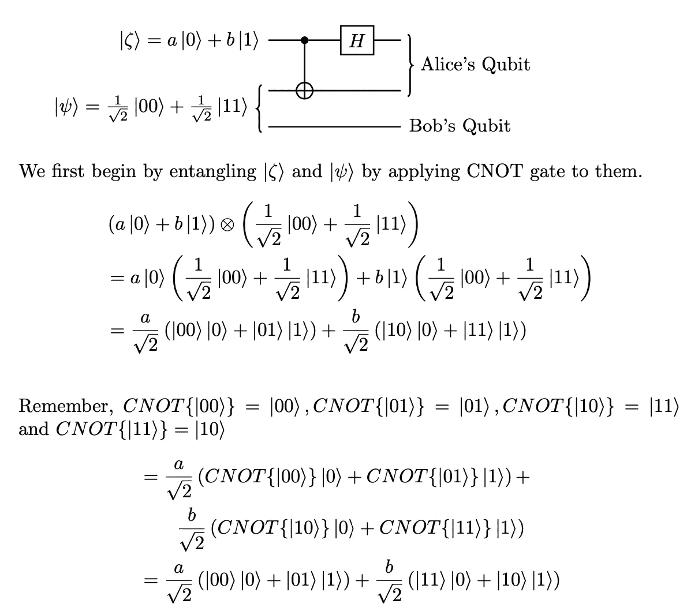
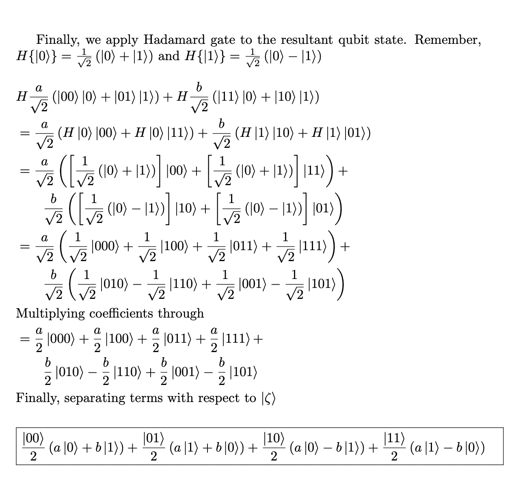

# 量子门和电路

> 原文：<https://medium.com/codex/quantum-gates-circuits-8cfdf293615b?source=collection_archive---------8----------------------->

在 [Unsplash](https://unsplash.com/s/photos/quantum-computer?utm_source=unsplash&utm_medium=referral&utm_content=creditCopyText) 上 [Manuel](https://unsplash.com/es/@manueljota?utm_source=unsplash&utm_medium=referral&utm_content=creditCopyText) 拍摄的照片

## 在这篇文章中

*   介绍
*   可逆计算与经典计算
*   经典门和通用门
*   量子门
*   组合门形成电路
*   结论
*   练习和参考

## 介绍

门是计算的基本构件。它们是数理逻辑的物理表现。门被组合起来形成电路，电路又变成芯片，最后成为计算设备。

在这篇文章中，我们将研究经典门和量子门。我们的主要焦点将是量子门，它们的数学表示和实现。我们还将简要了解可逆计算的概念，以及它与量子计算的关系。

## 可逆计算与经典计算

电脑已经成为我们生活的一部分。我们甚至在早上使用智能手机(现代时代的咖啡)之前都不会思考。此外，我们从来没有停下来想一想处理命令消耗了多少能量(除非你是硬件设计师，否则你不会这样做)。但是，**罗尔夫·威廉·兰道尔**想要改变这种情况，当他在 IBM 工作时，他计算出一次比特擦除操作需要的能量是 ln(2)的量；其中 k 是[玻尔兹曼常数](https://en.wikipedia.org/wiki/Boltzmann_constant)，T 是散热器的温度，单位为开尔文。计算机在一秒钟内完成无数次这样的运算；消耗了比朗道尔计算的多得多的能量。计算机的另一个问题是，随着我们在每个芯片上添加越来越多的晶体管，我们最终将触及材料的物理极限来传导电子，尽管管道的横截面将变得比粒子(电子)本身的横截面更小。

可逆计算基于这样一种思想，即在任何时刻，给定系统的当前状态，我们可以确定性地找到系统到达该状态所经过的一系列状态。简而言之，可逆计算机可以通过反向操作回到初始状态。想象一下，可逆计算机擦除了一个位(实际上他们从来不这样做)，然后它逆转了最后的操作，这意味着它从来没有擦除这个位，因此，它从来没有消耗任何能量(或影响熵)，瞧，我们有了一台比经典计算机效率 100%的计算机(当然，在现实世界中没有什么是 100%)。可逆计算机的另一个优势是，它们基于粒子的量子力学特性，因此我们不用设计新材料，而是使用自然界用来计算的材料。

这是关于这个主题的一个非常简短的讨论，我将在以后的文章中更详细地讨论它。

## 经典门和通用门

在研究量子门之前，让我们先了解一些经典的量子门。经典逻辑门基于我们的推理方法，包括 AND、OR 和 NOT 等运算，主要作用于 TRUE(1)和 FALSE(0)。“与”和“或”门都是二元运算，即至少需要两个输入才能工作，而“非”是一元(一)运算。

为了研究经典逻辑门，我们建立真值表。真值表是由 n-1 列真值的所有可能组合组成的表，而第 n 列包含运算的输出。以下是与门、或门和非门的真值表。

与、或与非逻辑门的真值表

并且仅当两个输入都为真时才为真，或者当任一输入为真时为真，并且最后不是简单地将输入假反转为真，将真反转为假。这些门本质上是原始的，这意味着所有其他逻辑门都可以用 AND+NOT (NAND)或 NOT+OR (NOR)门来构建，因此，它们被称为**通用门**。

之前，我们继续讨论量子门。我想指出一个关于经典逻辑门的重要事实，那就是它们本质上是不可逆的，除了 NOT gate。例如，假设门为“与”,输出为 0，则有三种可能输入，即(00，01，10)意味着您无法确定原始输入。

## 量子门

在量子计算中，我们实际上没有门的概念，只有 T2 算子 T3。算符是可以应用于可观察/可测量的东西，意味着可以观察或测量的量，包括例如粒子的动量、自旋和电荷。每一个这样的量都有一个与之对应的运算符，这意味着它们的数量是无限的。但是，谢天谢地，我们不需要全部都学。

在我们继续学习操作符之前，让我们先学习如何使用它们和符号。所有运算符都必须具有以下属性:

1.  **可逆性**:对一个向量应用两次运算符，必然产生同一个向量。如果是任意量子算符，那么*【â(â(∣α⟩】)****=****â(∣ψ⟩)=∣α⟩*。
2.  **线性:**线性是线性代数的核心性质之一。它指出算子可以分布在两个或多个向量的线性组合上。例如，*â(α∣ψ⟩+β∣γ⟩)=α**â∣ψ⟩+βâ∣γ⟩，*其中α和β为概率振幅。

现在，我们已经了解了算子必须满足的性质，我们可以继续研究它们的表示，最后是应用。算子可以用*外积*或*矩阵*的形式表示。在本文中，我们将只使用矩阵表示。

我们将研究的所有算子都是二维复向量空间。我们将学习同一性、CNOT、哈达玛和托弗利门(我将门和算符作为同义词使用)。

1.  **身份**:身份门是最简单的 most 门，它简单地返回输入给它的信息。例如，*î(∣ψ⟩)= ∣ψ⟩.*
2.  CNOT:CNOT 是受控非门的简称。它由一个控制位和一个目标位组成。如果控制位为 1，则反转目标位。

CNOT 门

3.**阿达玛门**:阿达玛门用于将量子比特置于叠加态，即每种可能性的概率为 50–50 的状态。它和 CNOT 门一起，经常被用来构建纠缠和解开量子位的电路。

4.托夫里门:托夫里门[托马索托夫里](https://en.wikipedia.org/wiki/Tommaso_Toffoli)发明，是一种通用逻辑门，因此可以用来构建多种电路。简单来说，它是一个 CNOT 门，有两个控制位和一个目标位。

## 组合门形成电路

最后，我们将通过构建一个传送回路来结合我们目前所学的一切。在量子力学和量子计算中，我们没有复制的特权，而是传送(酷吧！).量子位的状态从一个位置传送到另一个位置，源失去它，而目的地得到它(有点像移动操作)。电路非常简单，它包括两个门，一个 CNOT 和 Hadamard 门，三个量子位，一个未知状态∣ζ⟩(我们将传送)，两个纠缠态，最后是两方 Alice 和 Bob。电路如下进行:

我们首先将未知量子比特与爱丽丝和鲍勃共享的那一半纠缠对纠缠在一起，在它们之间应用 CNOT，未知量子比特作为控制比特。然后，Alice 将 Hadamard gate 应用于影响 Bob 的纠缠对的状态的未知量子位(现在，与其他量子位纠缠在一起)。

用纠缠对纠缠未知量子比特

决赛成绩

之后，电路继续进行，Alice 测量她的量子位并与 Bob 分享结果，特别是她告诉他，她从以下集合中得到哪个量子位{∣00⟩、∣01⟩,∣10⟩、∣11⟩}.例如，如果爱丽丝的量子位处于∣00⟩态，那么鲍勃的纠缠对处于 a∣0⟩+b∣1⟩态，否则，她的量子位处于∣10⟩态，那么他必须将泡利-Z 门应用于 a∣0⟩-b∣1⟩，才能将 a∣0⟩+b∣1⟩带回来。

这种在传统信道上共享信息的要求在光速的约束下限制了最大数据传输速度。

## 结论

在这篇文章中，我们接触了一些新的话题:可逆计算，量子门，我们还学习了一些重要的量子逻辑门，并把它们组合起来构成隐形传态电路，最后，我们用一些简单的数学计算结果。我们做了很多。在下一篇文章中，我们将实现密集编码和纠错。你可以随时评论你的改正和建议。

感谢您的阅读！

*演习*

1.  用 NAND 实现 AND、OR 和 NOT 门，证明 NAND 门是通用的。
2.  证明托夫里门是普适的。
3.  我在这篇文章中介绍的所有量子门本质上都是可逆的。
4.  研究泡利盖茨即。I，X，Y，z。
5.  给定∣x⟩⟨x∣为 1，表明外积∣0⟩⟨ 0∣+∣1⟩⟨1∣代表恒等运算符，而∣0⟩⟨ 1∣+∣1⟩⟨0∣代表非门。
6.  寻找将外积形式转换为矩阵符号的关系。

*参考文献*

1.  [哥本哈根解读](https://www.google.com/url?q=https%3A%2F%2Fen.wikipedia.org%2Fwiki%2FCopenhagen_interpretation&sa=D&sntz=1&usg=AOvVaw2795qog3AMnkD769vKibes)
2.  [约翰·斯图尔特·贝尔](https://www.google.com/url?q=https%3A%2F%2Fen.wikipedia.org%2Fwiki%2FJohn_Stewart_Bell&sa=D&sntz=1&usg=AOvVaw3g36HnD6v2nse_Wix60agV)
3.  [贝尔不等式](https://www.google.com/url?q=https%3A%2F%2Fen.wikipedia.org%2Fwiki%2FBell%2527s_theorem&sa=D&sntz=1&usg=AOvVaw3y3P7938uOQ4yPitESdZKq)
4.  [克里斯·伯恩哈特的《量子计算为每个人服务》一书](https://g.co/kgs/qXaeWX)
5.  [量子计算和量子信息教科书，艾萨克·庄和迈克尔·尼尔森著](https://g.co/kgs/SSfRXn)

*你可以评论你的练习答案或者发邮件给* [*我*](mailto:eruditoguerrero@gmail.com) *。*