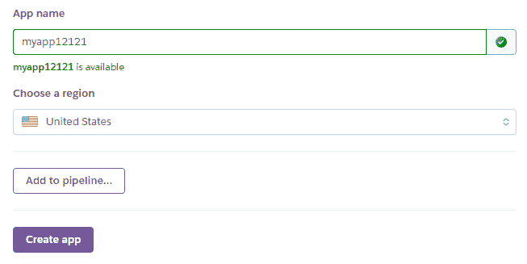
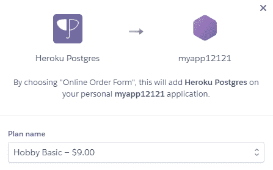
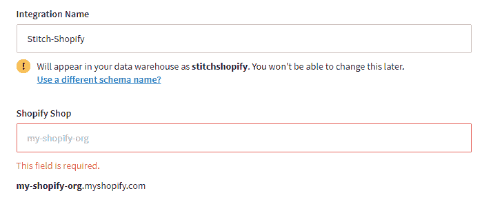
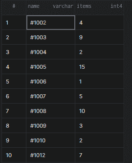
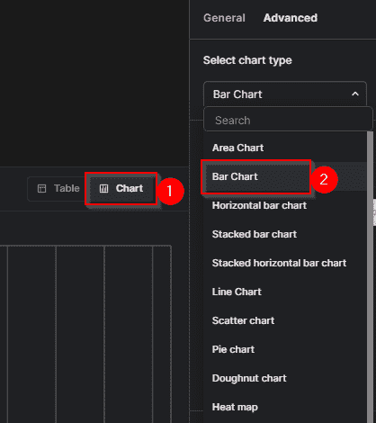
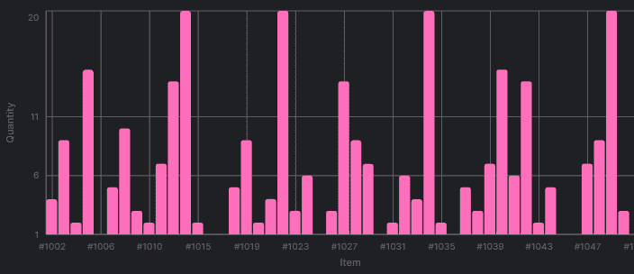

# 在 Postgres 中查询 Shopify 数据

> 原文：<https://medium.com/codex/querying-shopify-data-in-postgres-c5de2cac8519?source=collection_archive---------7----------------------->


# Shopify 简介

Shopify 是一家 SaaS 公司，致力于简化建立和运营在线业务的流程。使用 Shopify 的企业可以在 Shopify 中访问有关其产品、订单、客户等重要信息。在大多数情况下，企业希望提取这些数据，并将其与其他数据合并到一个中央数据库中。在本文中，我们将讨论如何将数据从 Shopify 迁移到 Postgres。

# **创建 Postgres 数据库**

您需要有一个 Postgres 数据库，您将在其中存储您的 Shopify 数据。您可以直接从 Postgres 创建数据库，其中您将使用`CREATE DATABASE database_name`命令。例如，要将数据库命名为 *shopify* ，请运行以下命令:

```
CREATE DATABASE shopify;
```

该命令将在几秒钟内创建数据库。

您还可以使用 [Heroku 的](https://www.heroku.com/postgres)数据库即服务平台来创建 Postgres 数据库实例。首先，创建一个 Heroku 帐户，你会看到“创建新应用程序”屏幕。按照屏幕上的说明创建应用程序。



创建应用程序后，单击“资源”。搜索“Postgres”

使用 Heroku 的免费计划，您无法完全提取足够多的行，因此选择“Hobby Basic(＄9/月)”。



在你的插件列表中点击 Heroku Postgres 打开你的仪表板。单击“设置”选项卡，然后选择“查看凭据”。稍后会要求您提供这些凭据。

## **将您的 Shopify 数据迁移到 Postgres**

我们的目标是将关于 Shopify 订单的数据迁移到 Postgres 数据库。现在我们的 Postgres 数据库已经准备好了，我们将使用一个 [ETL(提取、转换、加载)服务](https://www.stitchdata.com/vs/)将 Shopify 订单数据拉入数据库。这三个 ETL 函数使我们能够从一个数据库中提取数据，并将其加载到另一个数据库中。

好的一面是有很多 ETL 工具可以使用。例子包括 Stitchdata 和 [Fivetran](https://fivetran.com/connectors/shopify) 。当您扩展时，后者将对您有好处，因此，我们将使用 Stitchdata。

注册一个 Stitchdata 帐户。点击顶部的“目的地”标签，选择“Postgres”。输入您的 Postgres 数据库的凭据。有关这部分过程的截图，请参考我们关于将 [Stripe 连接到 Postgres](https://arctype.com/blog/stripe-payments-sql-postgres/) 的文章。

接下来，您应该在 [Shopify 和 Stitchdata](https://www.stitchdata.com/integrations/shopify/) 之间创建一个集成。点击“集成”选项卡，然后选择“Shopify”。输入整合的详细信息，包括 Shopify 商店的 URL:



Stitchdata 将开始提取您的 Shopify 数据，并将其加载到 Postgres 中。这个过程不到一个小时。

## **查询您的 Shopify 数据**

当 Stitchdata 加载数据时，您可以花时间探索它的结构。为此，您可以使用不同的 SQL 客户端工具，

下载正确的 SQL 客户端工具，并将您的 Heroku 数据库添加到其中。然后，您可以使用 SQL 的“SELECT *”语句来查询在您的数据库中创建的表。例如，以下 SQL 查询显示了客户发出的订单:

```
SELECT * FROM shopify.orders;
```

该语句将返回添加到数据库 *shopify* 的*订单*表中的数据。

# **可视化数据**

数据可视化有不同的解决方案。Arctype 可以免费使用，并具有内置的仪表盘工具，可以快速[构建可视化效果](https://arctype.com/blog/sales-dashboard/)。

Arctype 将要求您建立与 Heroku Postgres 数据库的[连接。然后，您可以开始从表中提取数据并将其可视化。](https://arctype.com/postgres/setup/heroku-postgres)

例如，让我们创建一个条形图，显示不同客户订购的商品数量。

首先，让我们编写一个 SQL 查询来获取订单名称以及每个订单对应的商品数量:

```
SELECT name, items FROM orders;
```

该查询将返回一个类似如下的表:



要根据这些数据生成条形图，请单击“表格”按钮旁边的“图表”按钮。接下来，单击右侧的“选择图表类型”下拉按钮，然后选择“条形图”。



您将在 Arctype 屏幕的右下角看到一个写有“将列拖动到此处”的部分。

将其中一列拖到 x 轴，将另一列拖到 y 轴。将生成如下所示的条形图:



要更改生成的图表类型，请单击“选择图表类型”下拉按钮，然后选择所需的图表类型。

# **结论**

Shopify 平台让个人建立和运营在线业务变得更加容易。运营 Shopify 业务时，你的店铺会产生大量数据。您需要提取这些数据，并将其与其他数据合并到一个中央数据库中，以便对您的业务做出有意义的决策。您可以使用一个 ETL 工具(如 Stitchdata)来提取您的 Shopify 数据，并将其加载到您选择的数据库(如 Postgres)中。然后，您可以使用 Arctype 等工具来查询数据并根据数据创建可视化效果。