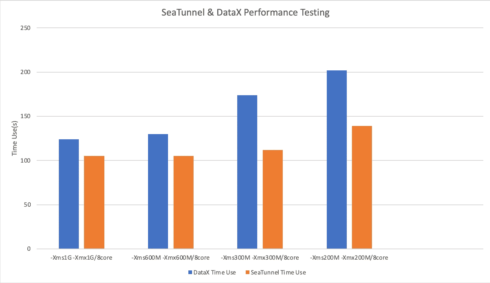
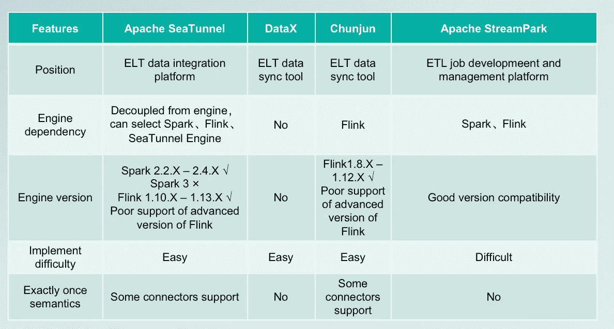

# 快速启动阿帕奇海底隧道

> 原文：<https://medium.com/codex/quick-start-apache-seatunnel-aca9ef6c90c7?source=collection_archive---------6----------------------->

朝田，阿帕奇海底隧道(孵化)PPMC &委托人

今天我将从 0 到 1 介绍 Apache SeaTunnel(孵化)，主要从以下六个方面。

1.数据集成概念的简要概述。

2.海底隧道简介。

3.介绍海底隧道的基本原理和结构演变。

4.比较目前市场上一些流行的数据集成工具，解释为什么我们要重新发明轮子，因为现在市场上已经有这么多的数据集成工具了。

5.通过案例演示展示 SeaTunnel 的强大功能。

6.介绍一下 SeaTunnel 的路线图，包括我们目前在做什么，未来想做什么。

# 数据集成概述

在介绍数据集成之前，我们首先要问一个问题，**什么是数据集成？**说起来，数据集成就是将不同来源格式和特征的数据在逻辑上或物理上集中起来，为企业提供全面的数据共享。企业可以通过高度集中的数据快速做出一系列分析和决策，实现数据利用的价值。

公司的每个业务部门负责不同的业务线，每天都会产生海量的数据。如果这些数据得到有效的集中和处理，企业可以通过这些数据获得更多的商业机会。

那么第二个问题，**我们为什么需要做数据整合？**在一个企业中，由于开发时间或开发部门不同，往往会有多个异构的信息系统同时运行在不同的软硬件平台上。这些系统的数据源相互独立又相互靠近，导致系统间的数据沟通、共享、集成困难，形成了“信息孤岛”。数据集成可以有效地合并和集成异构数据源，打破“信息孤岛”。

以某银行为例。该银行可能同时拥有营销业务和信贷业务。如果信贷业务想从营销业务中获取数据，那是不可能的，因为不同的业务部门可能使用不同的技术栈，有些数据存储在数据仓库中，比如 Greenplum 或者 Oracle，有些数据存储在 Hadoop 集群中，那么如何共享不同数据库的前期数据呢？这时候就需要数据集成层来做这些事情。我们需要建立一个中间层，将数据规范化、统一化，导入到相应的数据仓库中。这样我们每个业务部门都会从其他部门获取数据，更好的实现数据的价值。

先说数据集成中的几个核心概念，也就是我们常说的 ETL。ETL 中的 e 代表 extract，数据抽取；t 是 Transform，代表数据转换；l 代表 Load，数据加载。

ETL 是整个数据集成中最重要的三个步骤。在旧的数据集成架构中，更多的是 ETL 架构。以 Flink 和 Spark 分布式计算引擎为例，它们拥有非常强大的计算能力，同时在转换方面，提供了许多方便易用的运算符来进行数据清理和转换。

整个数据处理就是提取数据，然后在计算引擎端进行数据转换，也就是说数据在数据集成层进行转换，然后加载到目标 Sink 端。

这种方法的缺点是什么？即当数据抽取量较大时，所有的数据计算压力都放在数据集成层，会给数据集成层造成巨大的负担，所以我们需要更多的计算资源，计算过程中的容错也比较困难。

为了解决这些问题，并且随着技术的发展，源和宿数据库对应的计算能力增加了，利用它们的计算能力转换数据的效率提高了。渐渐的，数据集成的架构从 ETL 变成了 ELT，T 的数据操作被上推或者下移到对应的源端或者宿端。

这样做的好处是，第一，避免了源端和宿端的资源浪费，可以用它们来优化自己保存的数据，以提高数据转换的效率。第二个好处是减少数据集成中间层的压力，因为在提取数据后，我们不需要转换数据，这将避免内存丢失。而将提取的数据直接加载到对应的目标端，会使得数据整合更加高效。

# Apache SeaTunnel 简介

让我们看看 SeaTunnel 是做什么的。SeaTunnel 是一个非常易用的超高性能分布式数据集成平台，支持海量数据同步。由中国工程师开发，捐赠给阿帕奇基金会；SeaTunnel 的名字灵感来源于小说《三体》中摧毁数千艘战舰的坚不可摧的水滴。

**阿帕奇海底隧道的特点**

首先，SeaTunnel 最大的一个特点就是简单易用，不需要开发。用户可以通过学习配置文件快速开发当前的数据任务。

二是升级架构，整合批处理和流。现在，我们可以管理流作业和批处理作业。

第三，支持异构多数据源。从架构图中可以看出，SeaTunnel 支持 HDFS、Hive 和 JDBC 等数据源，以及 Kafka、Pulsar 和 CDC 等流数据源。

同时，SeaTunnel 还支持无缝接入多个计算引擎，如 Spark2.4.X+和 Flink1.13.X 计算引擎。社区的开发路线图将支持更高版本的计算引擎，我们期待更多的人加入进来，为使 SeaTunnel 变得更好做出贡献。

此外，SeaTunnel 是模块化和插入式设计。整个框架通过 SPI 将插件动态加载到框架中。如果企业有定制需求，可以使用预留接口快速实现满足其业务需求的插件。

值得注意的是，SeaTunnel 发布了一款自主研发的计算引擎。这款计算引擎主要针对缺乏大数据资源的用户，因为旧架构 SeaTunnel 只能依靠 Spark 或 Flink 计算引擎运行。但目前 SeaTunnel 已经完全从计算引擎中解构出来，有了它的计算引擎，大大降低了部署成本，提高了易用性。

最后，SeaTunnel 最大的特点是已经无缝连接 CDC，可以支持 CDC 同步。

# 原则和架构演变

接下来，我们来谈谈 SeaTunnel 的核心原则和底层架构演进。

## 核心设计原则

SeaTunnel 设计的核心是在设计模式中使用“控制反转”或“依赖注入”，主要概括为以下两点:

1.  上层不依赖底层，都依赖抽象；
2.  流程代码和业务逻辑应该分离。整个数据处理过程大致可以分为以下几个过程:输入->转换->输出。对于更复杂的数据处理，它本质上是这些行为的组合:

这三个术语熟悉吗？它代表了我们刚刚谈到的数据集成中的核心概念。ETL 就是基于这些高度抽象的行为，然后丰富其插件，定制业务处理流程。

然后，在我们丰富了这些数据处理过程之后，我们可以使用这三种行为来组合不同的有向无环图，以丰富整个数据处理过程。

## 核心原则

接下来我就来说说 SeaTunnel 的核心原理。SeaTunnel 将数据处理的各种行为抽象成插件，使用 Java SPI 技术进行动态注册。设计思想保证了框架的灵活扩展。基于以上理论基础，数据的转换和处理也需要统一的抽象。例如，众所周知的异构数据源同步工具 DataX 也对数据的单个记录进行了统一抽象。

在 SeaTunnel 架构系统中，由于 Spark 和 Flink 两大分布式计算框架，框架已经为我们做好了数据源抽象的工作。Flink 的 DataStream 和 Spark 的 DataFrame 对于访问数据源已经是高度抽象的了。在此基础上，我们只需要在插件中处理这些数据抽象。同时，借助 Flink 和 Spark 提供的 SQL 接口，我们还可以将每个处理后的数据注册为一个表，方便用 SQL 处理，减少代码开销；在最新的 SeaTunnel 架构中，SeaTunnel 提供了它的类型抽象来与引擎解耦。

## 建筑进化

纵观海底隧道架构的演变过程，我们目前正在做的事情之一是将架构从 v1 改造和升级到 v2。

对于 V1 版本，SeaTunnel 本质上是一个 ETL 平台。V2 版本正朝着英语教学的方向发展。对于整个建筑和设计理念的讨论，我们可以参考[https://github.com/apache/incubator-seatunnel/issues/1608.](https://github.com/apache/incubator-seatunnel/issues/1608.)如果你有兴趣，可以了解一下海底隧道建筑演变的前世今生。

V1 建筑

在 V1 架构中，SeaTunnel 的连接器和异构数据强烈依赖于分布式计算引擎。对于不同的计算引擎，会有不同的 API 层。连接器也依赖于 Spark 和 Flink，已经开发的连接器本质上是 Spark 连接器和 Flink 连接器。

访问数据后，转换传入的数据，然后将其写出。虽然是这种设计理念下的低代码开发，但是很多细节是不需要考虑的，因为开源的 Spark 和 Flink 的连接器已经为我们解决了大部分问题，但其实这也是一个缺陷。第一，由于对计算引擎的依赖性很强，我们无法与引擎解耦，而且每当计算引擎升级到主要版本时，都需要进行大量的底层转换，难度相对较大。

V2 建筑

针对这些痛点，我们重构了 V2 版本。首先，V2 版本有自己的一套 API 和自己的一套数据类型，所以你可以不依赖任何引擎来开发你的连接器。访问的每一条数据都是 SeaTunnelRow，通过转换层，推送到对应的计算引擎。

从底层来说，我们的实现是统一的。为了适应不同的引擎版本，我们只需要开发不同的翻译层。即使引擎进行了大规模的 API 升级，我们只需要创建一个新的翻译层，旧版本完全不受影响。这是 V2 版本的最大好处。

另外，我们也在 V2 架构上做相应的 web 服务工作。我们有一些计划。首先，将有一个作业 IDE，也就是说，一个作业编辑页面，具有一系列高级功能，如智能提示、数据源管理等。二是会有作业设计器高级设计版本功能，可以用不同的数据源参数替换，也可以根据不同的需求实现，一个模板可以生成多个作业。

与此同时，我们还在规划我们的调度程序。社区已经访问了 Apache DolphinScheduler，并将很快在下一个版本中提供。

最后也是我们整个服务工作的重要一环，就是创建我们的 Alert 和相应的 Matrix 系统来做作业预警，收集推送作业指标，完整管理作业流程。

最后，我将总结和比较 V1 和 V2 架构的升级，以及我们所做的工作。

首先，在引擎依赖方面，V1 强烈依赖 Spark 和 Flink，而 V2 没有依赖，自带计算引擎，可以直接用于部署。

其次，就连接器实现而言，对于不同的引擎，V1 可能需要实现多次，而我们只需要用我们的 API 实现 V2 一次。

第三，升级 V1 引擎版本比较难，因为底层 API 与引擎高度耦合，而升级 V2 引擎版本比较容易，因为我们与引擎解耦了，针对不同版本开发了不同的翻译层。在连接器参数的统一方面，V1 针对不同的发动机会有不同的参数。V1 为此长期受到批评，而 V2 解决了这个问题。所有参数和功能统一，降低用户使用和学习成本。

最后，在自定义分片逻辑方面，在 V1 架构下，由于强烈依赖 Spark 和 Flink 的连接器，部分分片逻辑已经在底层实现，数据提取效率不高，除非更改 Spark 的源代码，然后重新编译，否则无法更改分片逻辑。对于这一点，V2 可以自定义分片逻辑，我们可以自由发挥想象力，数据提取效率可控，可以根据不同的业务需求进行修改。

## V2 建筑的新特点

建筑升级后，V2 建筑有了一些新的特点。

*   多版本、多引擎支持
*   支持多个版本的 Flink 引擎，完美支持 Flink 的检查点进程
*   支持 Spark 微批量处理模式，支持聚合提交功能
*   自研引擎 SeaTunnel Engine，专为数据同步场景设计的引擎。凭借其内部引擎，这些企业缺乏大数据生态系统，或者为追求数据同步最佳体验的用户提供了可选的解决方案

基于这些特性，SeaTunnel 实现了三项优化。首先，它支持源/转换/接收的并行处理，以提高吞吐量性能。其次，它支持分布式快照算法、两阶段提交和等幂写，实现从源到汇的一次语义，并保证无数据丢失，以及断点续传等高级功能。第三，基于引擎提供的实时处理或微批处理实现低延迟。

## 海底隧道发动机性能试验

我们还与 DataX 进行了性能测试比较。在同样的千万级作业下，我们对比了不同并发和堆内存下的性能。结果表明，SeaTunnel 引擎比 DataX 花费的时间少得多，特别是在 200 MB 的小内存中。在这种情况下，SeaTunnel 引擎表现非常出色，性能比 DataX 高出 30~40%。

# 数据集成工具比较

下面是我们常用的一些数据集成工具的比较，也回答了你的问题，我们为什么要重新发明轮子？

对比的工具有大家都比较熟悉的 DataX，也有大家可能不太熟悉的戴书云的春军。改名前叫 FlinkX，最近刚入驻阿帕奇孵化器的 StreamPark(原名 StreamX)。

首先，从定位上来说，Apache SeaTunnel 是一个数据集成平台而不是一个简单的工具。未来会提供很多平台服务，改善运营流程和运营生命周期。但 DataX 和春军目前只是工具，不提供服务。

所有这些以 ELT 为核心的数据同步工具或平台。StreamPark 定位为 ETL 作业管理开发平台，主要分为两部分，Flink 作业的管理，提供快速开发 SDK，减轻开发者的开发压力。

有了 StreamPark 提供的 SDK，可以快速做 Flink 作业或者 Spark 作业，减少代码开发量，从定位上来说是不一样的。

第二，在发动机依赖方面，SeaTunnel 对发动机进行了解耦，我们可以选择自己的发动机，包括 Spark 发动机或者 Flink 发动机。DataX 也是独立于引擎的，因为它是纯 Java 开发的，也就是你安装打包，然后部署运行，前提是有 Java 环境。

春军对 Flink 的依赖性很强，需要基于 Flink 的组件进行二次开发和连接器优化。

StreamPark 的定位是开发管理平台，同样依赖于引擎。引擎版本支持方面，SeaTunnel 目前只支持 Spark 2.2.X — 2.4.X，正在支持 Spark 3，Flink 目前支持 1.10.X — Flink 1.13.X，更高版本支持也在测试稳定性，因为升级更高版本的 Flink 的 API 比较麻烦。

DataX 没有引擎依赖，是纯 Java 版本，所以对引擎版本没有要求。

春军目前支持 Flink1.8.X — Flink1.12.X，但对更高版本的支持较差。

StreamPark 在这方面做的很好，支持 Flink 1.16 作业的管理，Spark 的作业管理也在开发中。

从部署难度来看，SeaTunnel、DataX、Chunjun 的部署相对容易，因为它们不涉及后端和前端的部署或者数据库的要求。它们本质上是一个工具，一旦安装了 Java 环境，就可以在安装后运行，并配置环境变量。

对于 StreamPark 来说，因为是前端和后端的项目，所以部署和维护比较困难。在精确一次性语义方面，由于 SeaTunnel 在 V2 架构中完美支持 Flink 的检查点流程，在 ST Engine 中也支持更细粒度的检查点，所以有些连接器支持一次性语义，但 DataX 不支持。

因为春军也依赖于 Flink 的检查点，所以也支持一次性语义。StreamPark 本身是 ETL 作业的开发和管理平台，可以保证作业的正常状态，但不支持数据同步或数据处理。

经过多维度的对比，我们看到了每个工具的优缺点，也回答了为什么要做 SeaTunnel 的问题，因为现在的一些工具不能满足所有的需求，所以我们借鉴别人的经验，做出一个更好的工具。

Data X 是 2017 年开源的工具。5 年后，依然流行。这可以看作是数据集成的一种新思路和新趋势。随着大数据技术的不断进步和发展，我希望我们的技术也能进步，所以我们会打造这样一个平台来回馈大家。

# 海底隧道功能演示

接下来是一个简单的 SeaTunnel 功能演示。

# 海底隧道路线图

最后，看看 SeaTunnel 的发展路线图，包括目前的一些工作和计划。

## 当前工作

连接器的访问和优化

最高优先级是连接器的访问和优化。虽然已经有 80 多个连接器，但在性能、具体代码和逻辑方面仍有优化的空间，因此我们将重点优化连接器，添加更多的配置参数，并以更详细的方式控制操作过程。

**海底隧道-网络服务开发**

第二个是我们现在正在进行的基于 Web 服务的 SeaTunnel 开发。这个工具已经成型，但不是一键就能部署的。我们的目标是让它开箱即用，你可以拖拽完成数据集成、数据迁移、数据同步、数据监控等一系列数据集成任务。

**海底隧道发动机优化**

第三，SeaTunnel Engine 发布了第一个 MVP 版本，支持集群和单机模式。目前我们已经让它的性能比 DataX 提升了 30~40%，但我相信这不是我们的瓶颈。未来，我们可以在数据传输和整个过程中做更多的工作来提高性能。

## 继续推

1.  **优化指标监控系统**

目前，SeaTunnel 在获取当前操作流程的进度方面相对较弱，我们将在未来重点改进这一点。

如果您有相关工作的想法或经验，欢迎加入我们，与我们共同构建指标监控体系。

**2。脏数据收集、流量控制**

目前，当连接器正在转换数据或报告写入错误时，整个操作将停止。但是它不应该停止。之所以会出现这种情况，是因为在整个数据访问过程中，各种数据都被录入了，但是数据清洗并没有达到预期的目标。这些脏数据的收集应该由系统来处理，并及时进行提醒。

另一个目标是控制流量，因为现在很多客户的机器可能都在云上，云上会有带宽限制。目前，SeaTunnel 的带宽在工作时会满，我们将在未来增加流量控制功能。

**3。自动创建表并监控模式变化**

自动创建表格也是很多用户的痛点。比如出库表有五六十个字段，为这五六十个字段写建表 SQL 很累。我们计划支持自动创建表，这也是接收器端的一个开关。如果用户想自动创建一个表，就打开它，如果不想，就关闭它。

为 CDC 方案设置了监控方案变更。目前，如果模式发生更改，必须通知后续的同步行为，并且必须进行一些更改。

**4。支持 Spark3，Flink1.14+**

我们将积极推动对更高版本计算引擎的支持，像支持 Spark3 和 Flink1.14+。

虽然计算引擎已经与 Spark 和 Flink 解耦，但仍然需要站在巨人的肩膀上，站在技术的前沿，让数据整合更加顺畅。

最后，我们的愿景是成为世界级的数据集成平台。如果您需要与我讨论数据集成或海底隧道设计理论或功能需求，欢迎与我们交流。