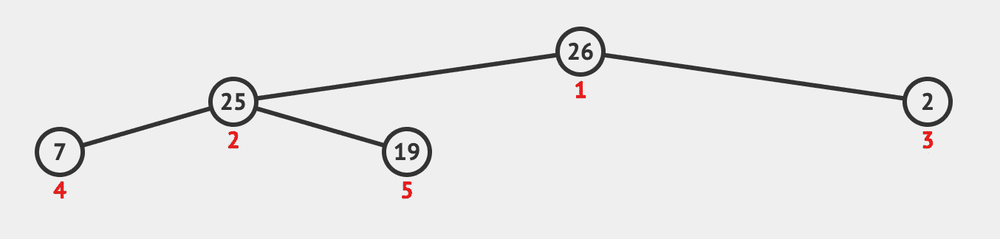
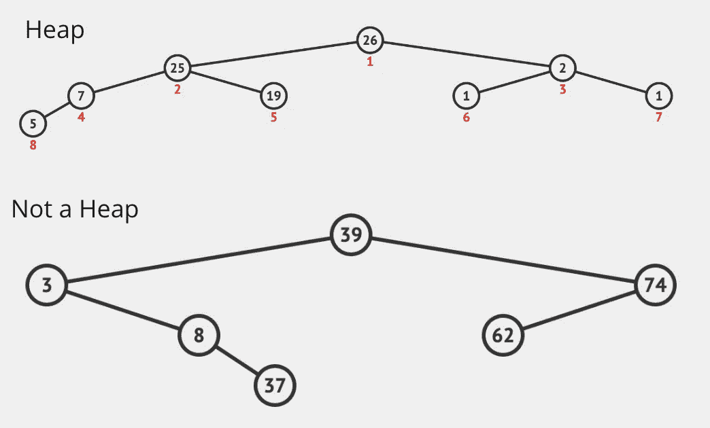
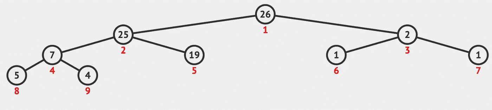
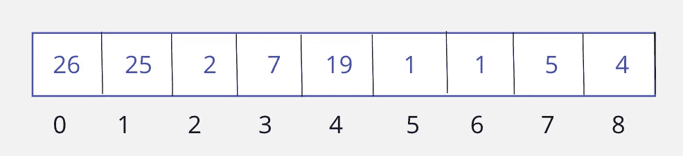

# 使用 Python 快速启动优先级队列和堆

> 原文：<https://medium.com/codex/quick-start-to-priority-queue-and-heap-with-python-b97a276e3077?source=collection_archive---------13----------------------->


Gabriella Clare Marino 在 [Unsplash](https://unsplash.com?utm_source=medium&utm_medium=referral) 上拍摄的照片

# 优先队列

从优先级队列开始，我们先来了解什么是简单队列，它与优先级队列有什么不同。

你能想到你不得不排队，等着轮到你买比萨饼，或者可能是要上一辆公共汽车？你现在站的是一个队列。一个简单的队列，第一个加入的人也是第一个离开的人。因此，FIFO(或先进先出)线性数据结构。

现在想象一下，如果在同一个队列中，有一个名人加入会怎么样？或者可能是你们国家的总统？那个人现在会站在队伍的末尾等待轮到他吗？嗯，在这种情况下，你可能希望他们比你先走，尽管事实上他们是最后加入的。

这是一个优先级队列，队列中的每个数据都有特定的优先级，优先级最高的数据先出去，然后是第二个，依此类推。

# 履行

从上面的例子可以看出，一个简单的队列不能用来实现一个优先级队列，其中每个数据都与某个权重相关联。到目前为止，优先级队列就像一个抽象的数据类型，必须单独实现才能得到想要的顺序。

> **注:**优先级队列只支持可以相互比较的数据。也就是说，应该可以从最低优先级到最高优先级或从最高优先级到最低优先级对数据进行排序。

优先级队列的经典实现可以是二进制堆。

# **二进制堆**

顾名思义，在二进制堆中，每个节点最多有两个子节点。听起来和二叉树差不多？二叉堆是一种特殊的二叉树，其中每个节点的顺序都很重要。用哪种方式，让我们找到下面这些:

*   每个节点的优先级都高于其子节点。在下图中，红色数字代表节点的优先级。



*   每个堆都是一个完整的二叉树，这意味着除了最后一级，树中的每一级都应该有最大数量的节点。



*   新节点的插入总是从左到右发生，并且仅在最后一级(或者当最后一级完成时，在新的下一级)。在插入后违反堆属性的情况下，必须进行交换来满足它。

> 例如，如果我们尝试向上述有效堆中插入 4:



*   有两种类型的堆:

1.  ***最大堆*** *—在这种情况下，节点从顶层的较大值到底层的较小值排序。*
2.  ***最小堆*** *—在这种情况下，节点从顶层的较小值到较低层的较大值排序。*

*   堆的根节点总是包含在最大堆的情况下具有最高优先级或最大值的元素，或者在最小堆的情况下具有最低值的元素，当从堆中弹出时，首先移除这些元素。

# 堆的表示:

堆通常可以用数组来表示。


上面的堆可以表示为:



现在，阵列实施需要注意以下几点:

> -这里我们可以清楚地看到，对于索引 **i** 处的每个节点，子节点位于 **(2*i + 1，2*i +2)**
> 
> -索引 **i** 处节点的父节点是 **(i-1)//2**
> 
> -为了区分叶节点和内部节点，我们有:如果 **n** 是数组的长度，那么如果 **2*i+2 < = n** ，则索引 **i** 处的任何节点都是内部节点。否则它是叶节点。

# 二进制堆上的操作

我们现在可以在二进制堆的帮助下实现优先级队列需求，但是在极少数情况下，我们需要自己从头开始编写整个实现。因为大多数编程语言中已经有很多库提供了预构建的堆，所以知道它如何工作以及如何使用实现来获得我们想要的输出通常就足够了。

在本文中，我们将通过 Python 3 库 **heapq** 来实现堆，并对它们的主要功能做一个概述。

## 健康:

从 Heapify 开始，就是**从二叉树**创建堆数据结构的过程。最小堆或最大堆都可以用这个过程创建。

在插入或删除节点后，这个过程也在内部用于维护堆属性。该过程的时间复杂度为 **O(logn)** 。

## 堆弹出或删除:

这是从堆中取出元素的过程，其中根节点总是首先被删除。

删除从用要删除的根节点替换最后一个元素开始，然后将最后一个节点堆在其正确的索引中。
该过程采用**向下**逼近，时间复杂度为 **O(logn)。**

## 堆推送或插入:

这是向堆中插入新值的过程，总是发生在最后一级，从左到右的顺序。在违反堆属性的情况下，可以对树进行堆化，并且该过程使用时间复杂度为 **O(logn)** 的 **PercolateUp** 方法。

# 一个简单的 Python 实现

```
from heapq import heappush, heappop,heapify
heap = [26,19,7,4,2,25,5,1,1]heapify(heap)
print("The heap is :\n>>> ",heap)heappush(heap,9)
print("After inserting 9 \n>>> ",heap)root = heappop(heap)
print("The popped value: ",root)
print("The left over heap: \n>>> ",heap)
```

注意:默认情况下，创建的堆是最小堆。如果需要 max-heap 实现，我们可以使用这个库，或者将我们的值乘以-1:

```
[https://pypi.org/project/heapq_max/](https://pypi.org/project/heapq_max/)
```

希望，这有助于堆入门！干杯！