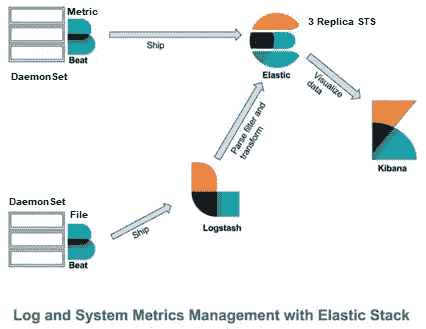

# 快速麋鹿

> 原文：<https://medium.com/codex/quickelk-a65c7f5dfee0?source=collection_archive---------2----------------------->


[https://miro . medium . com/max/875/1 * 779 cspzo _ tgeyyv5 z8 nag . JPEG](https://miro.medium.com/max/875/1*779CspzO_Tgeyywv5z8nag.jpeg)

在 Kubernetes 控制的 Docker 平台上部署 ELK stack (Elasticsearch、Logstash、Kibana)和支持服务的快速代码。

[点击此处](https://github.com/vvickky007/QuickELK)获取代码。

## 先决条件

*   Kubernetes 集群至少有 3 名工作人员，负责管理 3 个 Elasticsearch 节点。
*   基于 Docker 的容器运行时环境。
*   Helm 已安装并配置为访问 Kubernetes 集群主服务器进行部署。
*   Ansible 已安装并配置为运行行动手册。
*   Kubernetes worker 上有足够的资源用于整个部署。
*   需要在 Kubernetes 上配置外部负载平衡器(如 Metal LB ),以便从负载平衡器服务访问 Kubernetes GUI。

## 考虑

托管在官方“Docker.elastic.co”上的 docker 映像是有效的，用于 ELK 部署。以下是 docker repo:

*   弹性搜索:docker.elastic.co/elasticsearch/elasticsearch
*   基巴纳:docker.elastic.co/kibana/kibana
*   docker.elastic.co/beats/filebeat
*   docker.elastic.co/logstash/logstash
*   metricbeat:docker.elastic.co/beats/metricbeat

## 使用的工具和技术

*   Kubernetes: Kubernetes，也称为 K8s，是一个用于自动化部署、扩展和管理容器化应用程序的开源系统。
*   Docker: Docker 是一组平台即服务产品，使用操作系统级虚拟化来交付称为容器的软件包中的软件。
*   Ansible: Ansible 是一个开源软件供应、配置管理和应用程序部署工具，支持代码形式的基础设施。
*   Helm: Helm 帮助您管理 Kubernetes 应用程序——Helm Charts 帮助您定义、安装和升级最复杂的 Kubernetes 应用程序。
*   Elasticsearch: Elasticsearch 为所有类型的数据提供近乎实时的搜索和分析。无论您有结构化还是非结构化的文本、数字数据或地理空间数据，Elasticsearch 都能以支持快速搜索的方式高效地存储和索引这些数据。
*   Logstash: Logstash 是一个免费开放的服务器端数据处理管道，它从大量来源获取数据，对其进行转换，然后将其发送到 Elasticsearch。
*   Kibana: Kibana 是一个免费开放的用户界面，可以让你可视化你的 Elasticsearch 数据并浏览 Elastic Stack。
*   无论您是从安全设备、云、容器、主机还是 OT 收集日志，Filebeat 通过提供一种轻量级的方法来转发和集中日志和文件，帮助您将简单的事情变得简单。
*   Metricbeat:轻量级指标运送器从您的系统和服务中收集指标。从 CPU 到内存，从 Redis 到 NGINX，等等，Metricbeat 是一种发送系统和服务统计信息的轻量级方式。
*   Github: GitHub，Inc .是一家使用 Git 进行软件开发和版本控制的互联网托管提供商。它提供了 Git 的分布式版本控制和源代码管理功能，以及它自己的特性。

## 安装和使用

**目标架构图**



[https://miro . medium . com/max/533/1 * dfda 68 mo 9 nptmg 4 censgxw . png](https://miro.medium.com/max/533/1*dfda68mO9NPtMg4CensGXw.png)

**通过 Ansible 安装**

克隆“QuickELK”项目，确保所有先决条件都已到位。选择需要创建此堆栈的 Kubernetes 名称空间。如果名称空间不存在，将自动创建。为堆栈选择一个舵部署名称。从克隆目录内部运行以下命令。

```
# ansible-playbook main.yaml -e namespace=<Namespace for Deployment> -e stackname=<Name of Stack> -e chartpath=elk-stack Example:
# ansible-playbook main.yaml -e namespace=ezsinam1 -e stackname=mystack -e chartpath=elk-stackOutput: 
 [WARNING]: provided hosts list is empty, only localhost is available. Note that the implicit localhost does not match ‘all’PLAY [localhost] *****************************************************************************************************************************************************TASK [Check the Namespace Exist.] ************************************************************************************************************************************
fatal: [localhost]: FAILED! => {“changed”: true, “cmd”: “kubectl get ns ezsinam1”, “delta”: “0:00:00.136403”, “end”: “2021–10–27 14:11:27.742760”, “msg”: “non-zero return code”, “rc”: 1, “start”: “2021–10–27 14:11:27.606357”, “stderr”: “Error from server (NotFound): namespaces \”ezsinam1\” not found”, “stderr_lines”: [“Error from server (NotFound): namespaces \”ezsinam1\” not found”], “stdout”: “”, “stdout_lines”: []}TASK [Create Namespace if NOT exists.] *******************************************************************************************************************************
changed: [localhost]TASK [debug] *********************************************************************************************************************************************************
ok: [localhost] => {
 “ns.stdout_lines”: [
 “namespace/ezsinam1 created”
 ]
}TASK [Deploy the ELK Stack.] *****************************************************************************************************************************************
changed: [localhost]TASK [debug] *********************************************************************************************************************************************************
ok: [localhost] => {
 “chart.stdout_lines”: [
 “NAME: mystack”,
 “LAST DEPLOYED: Wed Oct 27 14:11:28 2021”,
 “NAMESPACE: ezsinam1”,
 “STATUS: deployed”,
 “REVISION: 1”,
 “NOTES:”,
 “1\. Get the application URL by running these commands:”
 ]
}PLAY RECAP ***********************************************************************************************************************************************************
localhost : ok=4 changed=2 unreachable=0 failed=1
0
```

**通过 Helm**
安装克隆“QuickELK”项目，确保所有先决条件都已到位。选择需要创建此堆栈的 Kubernetes 名称空间。如果名称空间不存在，将自动创建。为堆栈选择一个舵部署名称。从克隆目录内部运行以下命令。

```
# helm install <Stack Name> elk-stack — namespace <Namespace for Deployment> — create-namespace
```

**通过 Helm/Ansible**
安装特定的 ELK 栈版本，更新文件“ELK/elk-stack/Chart.yaml”，键值“appVersion”到特定版本的 ELK 栈。目前，我们已经从版本“6.8.20”配置了整个堆栈安装。

```
apiVersion: v2
appVersion: 6.8.20 # Update Specific version of ELK stack, Automatically all components will be installed with selected version.
…
…
```

**通过 Kubectl**
进行安装验证运行以下命令进行部署验证，提供上一步中提供的名称空间。

```
# kubectl get all -n <Namespace for Deployment>Example:
# kubectl get all -n ezsinam1Output:
NAME READY STATUS RESTARTS AGE
pod/elasticsearch-logging-0 1/1 Running 0 4m7s
pod/elasticsearch-logging-1 1/1 Running 0 4m7s
pod/elasticsearch-logging-2 1/1 Running 0 4m7s
pod/filebeat-4kc6r 1/1 Running 0 4m7s
pod/filebeat-5b9pz 1/1 Running 0 4m7s
pod/filebeat-cxwpj 1/1 Running 0 4m7s
pod/filebeat-fqth7 1/1 Running 0 4m7s
pod/filebeat-mgtts 1/1 Running 0 4m7s
pod/filebeat-rdgx8 1/1 Running 0 4m7s
pod/filebeat-rgxmc 1/1 Running 0 4m7s
pod/kibana-logging-58db4c758f-gbb6k 1/1 Running 2 4m7s
pod/logstash-deployment-5b4879b9f7–4zwnr 1/1 Running 0 4m7s
pod/metricbeat-6kp4k 1/1 Running 0 4m7s
pod/metricbeat-dqf7c 1/1 Running 0 4m7s
pod/metricbeat-gj78v 1/1 Running 0 4m7s
pod/metricbeat-kgbfg 1/1 Running 0 4m7s
pod/metricbeat-ngb9q 1/1 Running 0 4m7s
pod/metricbeat-tw7zb 1/1 Running 0 4m7s
pod/metricbeat-x4tv4 1/1 Running 0 4m7sNAME TYPE CLUSTER-IP EXTERNAL-IP PORT(S) AGE
service/elasticsearch-logging ClusterIP 10.108.33.4 <none> 9200/TCP 4m7s
service/kibana-logging LoadBalancer 10.108.8.123 10.64.109.113 5601:30316/TCP 4m7s
service/logstash-service ClusterIP 10.105.7.173 <none> 5044/TCP 4m7sNAME DESIRED CURRENT READY UP-TO-DATE AVAILABLE NODE SELECTOR AGE
daemonset.apps/filebeat 7 7 7 7 7 <none> 4m7s
daemonset.apps/metricbeat 7 7 7 7 7 <none> 4m7sNAME READY UP-TO-DATE AVAILABLE AGE
deployment.apps/kibana-logging 1/1 1 1 4m7s
deployment.apps/logstash-deployment 1/1 1 1 4m7sNAME DESIRED CURRENT READY AGE
replicaset.apps/kibana-logging-58db4c758f 1 1 1 4m7s
replicaset.apps/logstash-deployment-5b4879b9f7 1 1 1 4m7sNAME READY AGE
statefulset.apps/elasticsearch-logging 3/3 4m7s 
```

**集成验证**
验证 ElasticSearch 的索引，以验证与 filebeat、logstash 和 metricbeat 的集成。

```
# curl <elasticsearch-logging clsuetrIP Service IP>:9200/_cat/indicesExample:

# curl 10.108.33.4:9200/_cat/indices
yellow open logstash-2021.07.08 sxXdBTWZSt6dIaDB4s_QLQ 5 1 218 0 388.2kb 388.2kb
yellow open logstash-2021.08.05 H37edbWUT4enUQfF — -t_A 5 1 6 0 62.7kb 62.7kb
yellow open logstash-2021.09.05 vuQnUkGMTLWy85c9LSr-SA 5 1 681 0 458.8kb 458.8kb
yellow open logstash-2021.07.05 Im1jancJQlWfwUiC8h0vKw 5 1 717 0 773.6kb 773.6kb
yellow open logstash-2021.07.02 b9AFqpcTTkW5nmqoqaCsig 5 1 27535 0 6.6mb 6.6mb
yellow open metricbeat-6.8.20–2021.10.27 iiVkm-lMQwKT6ElVwpukGw 5 1 17020 0 12.9mb 12.9mb
…
…
```

MetricBeat 和 LogStash 索引应该可见。此外，您可以选择一个索引并使用下面的命令检查数据。

```
Example:
# curl 10.108.33.4:9200/logstash-2021.07.08/_search
```

**安装清理**
删除整个部署提供创建这个栈的 Kubernetes 名称空间。该命名空间将被自动删除。此外，提供创建的堆栈的 helm 部署名称。

在命令下运行。

```
# ansible-playbook clean.yaml -e namespace=<Namespace of Deployment> -e stackname=<Name of Deployed Stack>

Example:
# ansible-playbook clean.yaml -e namespace=ezsinam1 -e stackname=mystackOutput:
 [WARNING]: provided hosts list is empty, only localhost is available. Note that the implicit localhost does not match ‘all’PLAY [localhost] *****************************************************************************************************************************************************TASK [Remove the ELK Stack.] *****************************************************************************************************************************************
changed: [localhost]TASK [debug] *********************************************************************************************************************************************************
ok: [localhost] => {
 “chart.stdout_lines”: [
 “release \”mystack\” uninstalled”
 ]
}TASK [Delete the Namespace.] *****************************************************************************************************************************************
ansible-playbook clean.yaml -e namespace=ezsinam1 -e stackname=mystackchanged: [localhost]TASK [debug] *********************************************************************************************************************************************************
ok: [localhost] => {
 “ns.stdout_lines”: [
 “namespace \”ezsinam1\” deleted”
 ]
}PLAY RECAP ***********************************************************************************************************************************************************
localhost : ok=4 changed=2 unreachable=0 failed=0
```

## 备份策略

*   Elasticsearch: Snapshot 是从正在运行的 Elasticsearch 集群中获取的备份。您可以拍摄整个集群的快照，包括其所有数据流和索引。您也可以只为集群中的特定数据流或索引拍摄快照。在创建快照之前，您必须注册快照存储库。快照可以存储在本地或远程存储库中。远程存储库可以驻留在亚马逊 S3、HDFS、微软 Azure、谷歌云存储和其他由存储库插件支持的平台上。
*   Kibana:仪表板和配置对 Kibana 来说很重要，仪表板可以导出，源代码控制可以管理。配置可以在 PV 或 NFS 上进行外部备份。其余的实例可以被视为 Cow。
*   Logstash: Logstash 将充当日志源和弹性搜索之间的中间层，不需要特定的备份措施。请保留其配置的备份。可能会被当成一头牛。
*   Metricbeat: Metricbeat 将充当度量源和弹性搜索之间的中间层，不需要特定的备份措施。请保留其配置的备份。可能会被当成一头牛。
*   Filebeat: Filebeat 将充当日志源和弹性搜索之间的中间层，不需要特定的备份措施。请保留其配置的备份。可能会被当成一头牛。

## 部署限制

*   这是一个 POC，低资源被分配给在此活动下创建的 Kubernetes 对象。对于实时生产设置，需要增加分配给 Kubernetes 对象的资源以获得更好的性能。
*   此部署中没有使用 PVC。我们可能需要连接 PVC 来提高冗余性和健壮性。
*   就绪性和活跃性也没有集成，可能会考虑在未来的生产中推出。
*   Filebeat/MetricBeat 可以附加到任何应用程序容器上，作为将日志/指标转发给弹性搜索的辅助工具。本概念验证中未涵盖。
*   这是一个快速的学习，在你产品化之前，把它作为你基本理解的参考。

[](https://faun.to/bP1m5)

加入牧神: [**网站**](https://faun.to/i9Pt9) 💻**|**|[**播客**](https://faun.dev/podcast)**🎙️**|**[**推特**](https://twitter.com/joinfaun) 🐦 **|** [**脸书**](https://www.facebook.com/faun.dev/) 👥**|**[**insta gram**](https://instagram.com/fauncommunity/)**📷| [**Facebook 群**](https://www.facebook.com/groups/364904580892967/)**🗣️**|**[**LinkedIn 群**](https://www.linkedin.com/company/faundev) 💬 **|** [**松弛**](https://faun.dev/chat) 📱 **|** [**云原生** **新闻**](https://thechief.io) 📰 **|** [**更有**](https://linktr.ee/faun.dev/) **。********

****如果这篇文章有帮助，请点击拍手👏按钮几下，以示你对作者的支持👇****