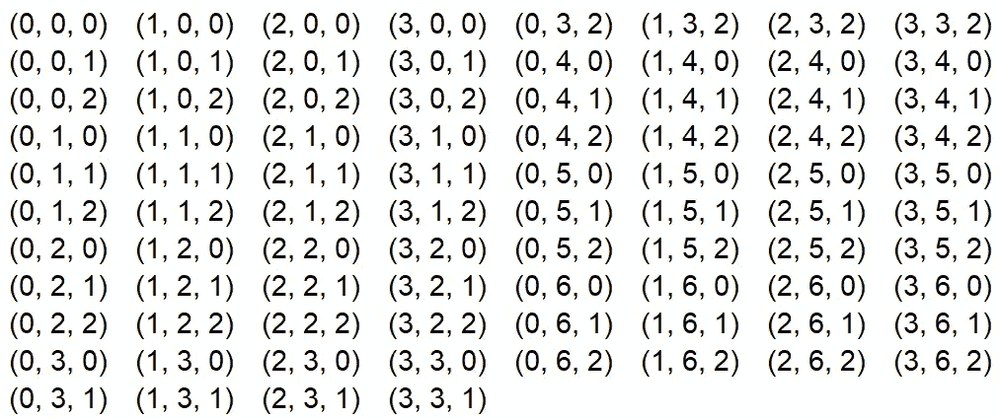

# 在 Python 中快速生成组合动作空间

> 原文：<https://medium.com/codex/quickly-generate-combinatorial-action-spaces-15962118e508?source=collection_archive---------14----------------------->

## 许多组合优化问题具有对应于子集的笛卡尔积的作用空间。学会用几行代码生成它们。

为状态(3，6，2)生成一组可行的操作。该集合包含所有元素范围的笛卡尔积。[图片由作者提供]

当处理商业环境中的强化学习问题时，我们通常会处理动态资源…