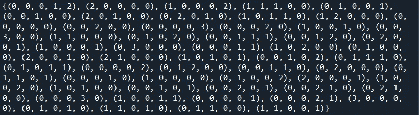

# 用 Python 快速生成组合状态空间

> 原文：<https://medium.com/codex/quickly-generate-combinatorial-state-spaces-in-python-c53decab2bdd?source=collection_archive---------8----------------------->

## 部署 itertools 来有效地为组合优化问题生成状态空间。该方法首先生成一组组合，然后计算每个组合的所有排列。

生成的组合状态空间示例，状态维度为 5，最大向量和为 3。状态空间是使用 Python itertools 库生成的