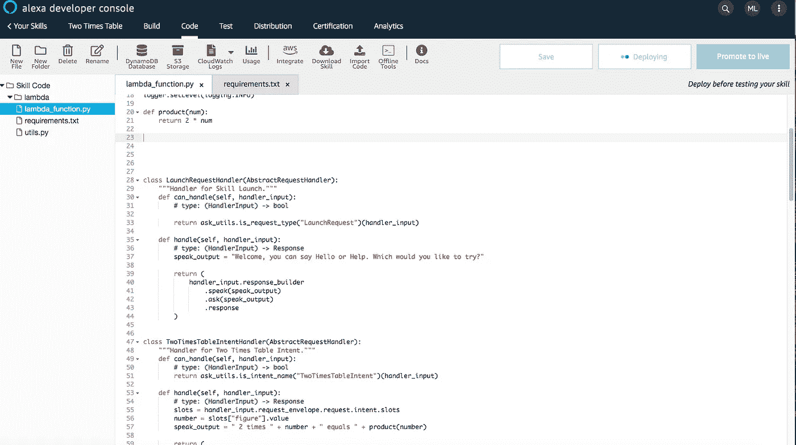

# Python 中的快速入门基础循序渐进 Alexa 技能开发

> 原文：<https://medium.com/codex/quickstart-basic-step-by-step-alexa-skill-development-in-python-f9a13a9c11a9?source=collection_archive---------4----------------------->


安德烈斯·乌雷纳在 [Unsplash](https://unsplash.com?utm_source=medium&utm_medium=referral) 上拍摄的照片

本教程将帮助您了解 Alexa 开发者控制台创建技能所使用的工作流程。本教程创建了一个简单的乘法表技巧，旨在帮助一年级和二年级学生学习乘法表，它只是给他们答案。这项技能将受益于添加解释，但不会在这里进入这方面。本教程旨在通过帮助您理解获得最佳结果所需的顺序工作流程，帮助您快速获得创建技能的信心。

*本技能教程不包含 InSkillPurchasing。这将在另一个教程*中讨论。

我们开始吧。

创建一个 Alexa 开发者账户，如果你还没有的话。创建或登录到您的帐户后，您将看到您的用户控制面板，如下图所示。

欢迎来到您的仪表板。找到并点击创建技能按钮开始。


给你的技能起个名字。您可以稍后对此进行更改，但这是继续操作所必需的。在本教程中，我们正在创造一个回答“2 x 6 是什么”或知道 2 乘法表或乘法表的技能。

我们将这个技能命名为“二乘表”,这是一个合适的、信息丰富的名称。


默认语言是英语(美国)，但是您可以更改它以适合您的区域设置。我将把它保留为英国(美国)。


命名技能

我们的技能是一个自定义模型，这意味着我们正在从头开始构建它，所以我们将从一个“Hello World”模板开始。这让我们有了一个干净的画布，并专注于将所有东西放在一起。

接下来，选择自定义


一旦你知道了所有的东西是如何组合在一起的，你就可以尽情地冒险了。培养一种技能来填满你的浴缸或者弄清楚妈妈什么时候回家。

因为我们使用的是 Python，所以选择 Python，然后返回到页面顶部，选择 create skill。


然后创造技能。这将创建我们开始发展技能所需的所有文件。现在不要担心其他任何事情。


单击“创建技能”来创建所有必需的文件。

还有一件事，你可以选择一个模板，增加一些代码到你的技能。大部分代码可以在 Alexa Github 上找到，所以你只需要在浏览器中打开另一个标签。对于这项技能，我们是从零开始，所以我们将选择该选项，这将为我们提供一个很好的“Hello World”模板来使用。


然后点击“继续模板”选项，这将带来一个加载屏幕。让它发挥它的魔力，这将持续大约一分钟，然后您将可以访问您的开发环境。


工作很神奇。非程序员称之为自动，程序员称之为数据结构和算法。

欢迎使用您的 IDE。


选项，选项，选项

它真的很有条理、有序且易于操作，所以我们从左上角的栏开始。

首先，祈祷。这是你的用户会对你的技能说的话，以激活或赋予它生命。

确保它对你的用户来说是直观的，也就是说，它对你的技能的本质来说是自然的。实现这一点最简单的方法是想象你是一个用户，你希望如何与这项技能互动？你会说什么来调用它？在本教程中，我们知道孩子们会使用这个技巧，所以我们必须想象什么对他们来说最方便。


孩子最喜欢说的是“二乘法表”，而不是“二乘法表”。他们的句子不复杂，直截了当。

所以我们用“二乘法表”。当输入技能调用名称时，确保全部是小写字母——“两倍表”。

输入技能调用的名称，然后单击“保存模型”和“构建模型”。在对模型进行任何更改后，总是单击这些按钮来推动您的更改。


单击保存模型保存您的更改，然后构建模型将更改推送到技能。

成功


您将收到显示您状态的通知。

## 互动模式

单击以展开并查看您的选项。


这是你的魔法发生的地方，或者你教你如何交谈的技巧。我们将从理解意图开始，这是整个操作的基础。

**意图**

这些是用户对你的技能的期望，即“你对我的技能有什么意图？”

用户想用你的技能完成什么。

在这种情况下，用户想要得到 2 次表的答案，因此他们的意图是 2 次表的答案。为了保持所有内容的组织和整洁，我们在每个意图名称的末尾添加了“意图”一词。

**two timestable intent**

别担心，很多场合你都不用打这个。

点击意图，你会看到你的技能当前可用的意图或选项。这些是模板中创建的默认意图。


技能附带的默认意图。

我们对 HelloWorldIntent 事件感兴趣。单击将打开示例话语或用户可能说的话的链接来激活这个 hello world 内容。


用户可以说你好，你好，嗨等等

用户可以说你好，你好或嗨来激活这个意图，它将根据代码作出回应。这些被称为示例话语。

它们是技能所倾听的，以便采取行动或做出回应。在我们的例子中，一个示例话语是“2 乘以 3 是多少”。我们必须想象这一部分，就像作家想象角色之间的对话一样。这是你站在用户的立场上，想象他们会对你的技能说些什么。这完全是想象力的问题。

因为我们的技能输入会有所不同，这意味着用户不会总是要求 2 乘以 3。他们可能会要求 2 乘以 10 或 2 乘以 4，我们必须能够给他们正确的答案，即插槽的位置。

## 时间

这是“变量”的另一种说法。

在同一页面上，向下滚动，您将看到页面的这一部分“意图槽”


单击第 1 行“名称”列下灰色的“创建”选项来命名您的插槽。你可以随便叫它什么，但是要记得给你的变量起个好名字。


一个名为“数字”的槽。

接下来我们必须给它分配一个类型。在 OOP 中，这将是一个 int，string，double 或任何其他自定义类型。如果您单击“插槽类型”选项下的下拉菜单，您会注意到内置的插槽类型。有时候你可以在这里找到你需要的东西，例如，如果你正在编写一个返回电影女主角名字的技能，内置的槽时间亚马逊。Actor 和 AMAZON.movies 会帮你完成目标。

在这种情况下，我们需要 1 到 12 之间的整数，因为标准的 2 乘法表介于 1 和 12 之间。我们可以利用亚马逊。满足此要求的编号槽。


或者，我们可以创建自己的自定义插槽类型，以便我们的用户可以专注于学习与他们相关的 1 到 12 之间的表格。否则他们可能会分心，开始问 2 乘以 2000，这浪费了学习时间。这是一个设计决策，你将会从用户的最大利益出发做出很多这样的决策。

下面是一个例子，说明我们如何创建一个有限的自定义插槽类型。我们称它为“无花果”。


创建新的插槽类型

接下来，单击栏中的“插槽类型”选项，这将打开控制面板来创建插槽类型。注意你已经有了亚马逊。列出插槽类型编号，因为您正在使用它。您正在使用的每种插槽类型都会在此列出。


单击“添加插槽类型”开始创建您自己的自定义插槽类型，并给它一个合适的名称。“二”似乎足够合适了。你可以认为这是 OOP 中的一个类名。


接下来添加你的技能期望得到的价值。在本教程中，我们期望 1 到 12 之间的任何数字。


所有这两个值。

在本教程中我们不会关心同义词。回到地狱世界。


选择“二进制”插槽类型，将其分配给“fig ”,这样您的代码就可以访问这些新信息。你简化了代码，只关注从 1 到 12 的数字，而不是大量的数字。


现在您已经知道了如何创建插槽。我们将创建 TwosTimesTableIntent，并在本例中为其提供有限的自定义类型。这是一个设计决定，旨在确保孩子不会分心，并专注于学习 1 至 12 岁之间的乘法表。

单击下面以蓝色突出显示的 Intents 选项。


接下来，单击仪表板上的“添加意向”选项，这将打开一个新的屏幕，允许您添加新的意向。记住，意图就是你想要完成的事情。


您将在“创建自定义意向”下的输入框中键入您的意向名称。这将在整个代码中使用，以引用意图并允许与您的技能进行交互。你可以认为这是赋予你的技能一种执行任务的能力。


对于这个例子，我们将把意图称为 TwoTimesTableIntent。我们将使用“NameIntent”命名约定来保持代码易于理解和可重用。这使技能的能力，知道两次表，非常有用的每一个一年级和二年级。

键入您的意图后，单击右侧的“创建自定义意图”按钮创建意图。您将进入该屏幕，该屏幕显示了您现在可以输入示例话语的仪表板。

示例话语是用户在与技能互动时会说的短语。站在用户的角度想象自己是很有帮助的，如果你在使用这项技能，你会说什么？


因为这项技能是为一年级和二年级学生设计的，我们可以想象他们的短语会直接且直奔主题。

“2 乘以 3 是多少”

" 2 乘以 4 "

Alexa，2 乘以 5 是多少？

" 2 乘以 8 是"

"请给我 2 乘以 8 "

我们将输入这些话语并使用这些槽。

但是首先我们将再次创建插槽来容纳变量。每个槽与一个意向唯一关联。插槽允许我们的用户改变数字，否则我们会硬编码他们，这不是最好的做法。


输入您的插槽名称

接下来，单击“插槽类型”选项，这将允许我们选择我们的插槽类型。


单击“添加插槽类型”并输入插槽类型的名称。这将允许您在意图中引用它。我们称我们的数字。


然后输入期望值。这是用户将说出的可能不同的值的列表。因为我们的技巧集中在二乘法表，我们知道用户可以询问 1 到 12 之间的任何数字，所以我们输入这些数字作为我们的预期变量。

如果用户说 13 或任何没有包含的数字，我们将在代码中处理，告诉用户他们只能选择 1 到 12 之间的任何数字。


一旦我们输入了所有的槽值，您的仪表板应该如下所示。


我们不会为这项技能添加同义词，因为这些数字在英语中只能用一种方式表达。如果这是一种瑜伽技能，你可以在这个词的后面加上其他的引用。山式也被称为山式，山是同义词，技能听这些，知道用户的意思是山式，并给出一个适当的回应，如代码所写。

一旦我们有了槽值，我们通过点击“Intents”选项并选择“TwoTimesTableIntent”返回到 TwoTimesTableIntent。


现在我们可以完成设置了。


首先向下滚动到意图对话框，键入插槽变量的名称，我们将称之为 figure，因为我们需要一个数字。按回车键，它将被添加到您的意图槽。


接下来，我们选择插槽类型。每个插槽必须有一个类型，我们的类型是我们在插槽类型选项中创建的图形类型。单击第一行中插槽类型下的下拉菜单，自定义选项“数字”将可用。选择它，现在技能知道哪些数字期待。


我们可以完成话语。

让我们输入“2 乘以 4 是多少”之前的第一句话。因为用户可以使用任何数字组合来询问这个问题，所以我们将使用我们的槽或变量来表示这个值可以变化。

我们使用花括号来访问这个槽，这会显示与这个意图相关联的现有槽。在我们的例子中，我们创建了与人物数据相关联的人物槽。单击它以选择它并添加右花括号。


用户将说出单词“times ”,我们将它理解为乘法。我们可以将它添加到样本话语中，并添加另一个数字作为时隙，因为它也可以变化。

这就是它的样子。


接下来，我们添加用户将与技能交互的所有其他话语或方式，这是我们上面的示例话语。单击“+”符号会将新的话语添加到列表中。


最后，导航到 Intents 选项，从列表中找到 HelloWorldIntents。单击“删除”以删除对它的任何引用。一旦您删除了 HelloWorldIntent，保存您的模型并构建它。您将收到一个通知，显示您的构建成功。我们现在可以在大脑或 python 代码上工作，并把所有东西整合在一起。


单击仪表板顶部导航栏中的“代码”链接。


这将调出您的代码。我们使用 lambda_function.py 文件，该文件将包含所有代码。如果您有任何 python 库，您将把它们添加到 requirements.txt 文件中。


我们将使用 HelloWorldIntentHandler 类作为我们自己的类的起点。在 lambda_function.py 模块中，向下滚动到第 40 行，这是 HelloWorldIntentHandler 的开头。


我们将修改这个类来满足我们的需求，因为 HelloWorldIntent 已经不存在了，如果您部署它，代码将会抛出错误。

让我们从修改名称开始。删除处理程序类名的“HelloWorld”部分。


我们将遵循命名约定，将处理程序称为“TwoTimesTableIntentHandler”。


接下来，我们需要将每个类处理程序与其适当且正确的意图相关联。这个类处理程序将我们的代码连接到我们之前构建的意图。在这种情况下，我们希望这个处理程序连接到 TwoTimesTableIntent，所以在第 44 行，我们将修改 return 语句的参数，要求实用程序模块返回 TwoTimesTableIntent。

确保意图名称与模型中的名称相匹配，否则将引发错误。说到错误，您可以从上面的导航栏中单击 CloudWatchLogs 来获得代码的详细分析，也可以在代码中使用 print 语句进行调试。您还可以在 CloudWatchLogs 中查看它们的输出，该选项位于代码和测试链接下方的导航栏中。


接下来我们到第 46 行，在函数 def handle(self，handler_input)中，这是所有神奇的事情发生的地方，任何实用函数都将在这里被调用。你可以认为这是你技能的大脑。

在我们的例子中，我们需要接受数字、执行乘法并返回答案的技能。

让我们从技能如何接收用户输入开始。

```
slots = handler_input.request_envelope.request.intent.slots
```

这行代码创建了一个字典变量 slots，当用户说 2 乘以 4 时，它从 slots 中获取数据。话语与我们之前创建的样本话语列表中的正确话语相匹配，并且数字 2 和 4 被存储为键值槽对。

将这行代码添加到第 48 行，就在函数定义之后。您的代码应该是这样的。


现在，我们可以访问用户所说的内容，以获得他们希望我们相乘的数字。第 49 行显示了新的代码行。我们将他们想要的数字乘以 2，并存储在 number 变量中。


现在我们有了数字，我们可以创建一个名为 product 的效用函数，它将找到 2 和用户想要的任何数字的乘积。滚动到 lambda_function.py 文件的顶部。单击第 20 行并按 enter 键，直到有足够的空间来创建一个新函数。


在第 20 行写下函数名，它看起来会像下面这样。


接下来我们将删除第 21 行，传递并编写执行乘法并返回乘积的代码。


一旦我们有了效用函数，我们就可以在代码的任何地方使用它。编写函数来执行一项任务始终是最佳实践，并且可以保持代码的整洁、可重用和易于调试。

向下滚动到 TwoTimesTableIntentHandler 类，将光标放在第 57 行，让我们调用刚刚创建的产品函数并获取产品。

在我们的例子中，我们将在 speak_output 字符串中执行这个计算，这个字符串是技能返回给用户的短语。


现在，技能将响应用户的请求，告诉他们产品。

单击保存，然后单击部署。这将把所有的变化都推到模型中，并允许我们测试到目前为止的技能。



接下来，我们需要将对象添加到文件的底部。复制并粘贴您的类处理程序的名称，向下滚动到文件的底部，在那里您将找到类对象。


找到以前的 HelloWorldIntent 并用我们新的类处理程序替换它。


现在我们已经将我们的类对象添加到技能可以处理的处理程序列表中。我们可以测试一下技能。单击保存并部署以推送更改。

单击导航菜单中的“测试”选项打开仿真器。


点击下拉菜单并选择“开发”


这将允许我们测试技能。


像用户一样调用你的技能，你可以键入或说出。记住你的祈祷在这里找到。单击导航栏中的“Build ”,然后单击“Invocation ”,将显示此屏幕。我们的用户说“两次表”


我们在测试环境中键入或说出它。


请注意，启动或欢迎词仍然与我们的技能无关，我们将很快改变这一点。现在，我们想确保当我们要求乘法时得到答案。

比如说 2 乘以 5 来调用 TwoTimesTableIntent。


这是我们目前的产品，这是不正确的，因为 2 乘以 5 是 10。让我们纠正这一点。糟糕的老师时刻。


发生这个错误是因为 number 的类型是 string，所以我们必须在乘法之前将其转换为 int。在第 21 行，将 num 变量转换为 int。int(数字)。


然后在第 57 行，将结果转换回一个字符串，这样它就可以被连接起来。保存并部署。


当我们测试时，我们得到正确的输出。这项技能将成为一名优秀的教师。


现在，我们可以修改欢迎消息，使其信息丰富，并针对技能进行更正。

单击“代码”链接并找到 LaunchRequestHandler(…)类。这是通向你技能的大门，是进入的点。您可以在这里为您的用户和追加销售添加说明。

找到 speak_output 变量。我们将改变这一点，以反映我们的技能能力。

***speak_output = "您好，欢迎来到您的二次表。你今天需要哪种产品？你可以说 2 倍的数字，我就帮你。”***

现在这个技能有了更多的上下文。它还帮助用户理解如何与技能互动。向你的用户阐明如何最好地运用你的技能是很重要的。

您可以添加。[要求(重新提示](https://github.com/alexa/skill-sample-python-first-skill/tree/master/module-2))提供额外的技能用法说明。

现在我们有了一个更有意义的互动。


本教程到此结束。

您已经学习了如何使用核心构件构建基本技能。在你的技能可以被认证之前有一些修改，并且你可以添加许多其他选项来扩展你的技能，天空是无限的。

本教程是一个起点，它已经给了你足够的知识来理解如何开始以及从这里向哪个方向前进。你可以阅读 [**API**](https://developer.amazon.com/en-US/alexa/alexa-skills-kit/get-deeper/dev-tools-skill-management-api) 以获得更详细的技术解释，并深化你的内容，如添加技能产品，保持意图开放以创建流程，改变技能的声音。

你可以创造无限的东西。

勇往直前，创造奇迹。