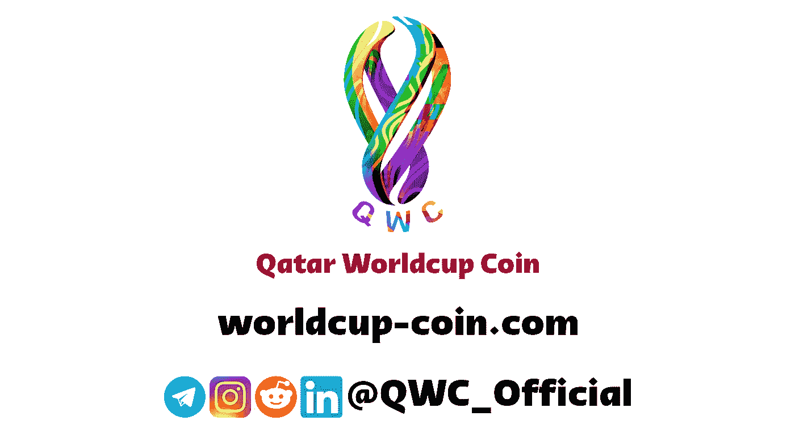

# QWC 将在元宇宙举办 2022 年卡塔尔世界杯

> 原文：<https://medium.com/codex/qwc-to-bring-qatar-worldcup-2022-on-metaverse-1444afc31684?source=collection_archive---------9----------------------->

[英国黑科技](https://unsplash.com/@ukblacktech?utm_source=medium&utm_medium=referral)在 [Unsplash](https://unsplash.com?utm_source=medium&utm_medium=referral) 上的照片

如果用一个词来定义 2020 年是 NFT，那么毫无疑问，元宇宙的卡塔尔世界杯将是定义今年的词。现在的问题是，元宇宙到底是什么，我们为什么要关心它？

你可以通过使用虚拟现实(VR)、增强现实(AR)，甚至游戏名称或平台(如堡垒之夜或 Roblox)进入一个被称为元宇宙的数字世界。元宇宙是一个在线 3D 环境网络。

除了可以在元宇宙上学或上大学，甚至找工作，你还可以在那里购买所有你喜欢的品牌和商品。不仅如此，如果你是卡塔尔足球世界杯的狂热粉丝，你会更有优势！

[**卡塔尔世界杯硬币**](https://www.worldcup-coin.com) **这次冒险将足球世界杯直播给元宇宙的所有球迷。**

## 那么，在元宇宙直播是什么感觉？

卡塔尔足球世界杯的直播给人一种革命性的体验。这不仅仅是看比赛，而是拍摄比赛，这在普通的电视或笔记本电脑屏幕上是不可能的！

此外，[卡塔尔世界杯硬币](https://www.worldcup-coin.com)建立了体育场和基础设施，让你能够有第一手的体验。迷惑？

嗯，你几乎可以在体育场内实时旅行！因此，这更像是比赛的一部分——而不是在远离体育场的地方观看。

元宇宙流媒体的潜力是巨大的。这是因为元宇宙现在被认为是全球技术发展的下一个阶段，也因为这个未被发现的领域可能允许新水平的创造力。

## 这对各种体育组织有什么影响？

由于客户和支持者更多地参与到虚拟环境中，体育组织需要接受这种转变，以保证他们的品牌能够在新的世界中茁壮成长。

在元宇宙，人们可以与其他玩家和商业伙伴一起，尽情发挥他们的虚拟想象力，以开发新的故事，并发现传播这些故事的最有效方法。

最成功的体育组织已经使用了这种与追随者交流的新方法。卡塔尔世界杯硬币 [(QWC)](https://www.worldcup-coin.com) 将在元宇宙建造一座体育场，以便在一个全新的环境中举办现场比赛。

还有各种独特的座椅配置！

最近，美国足球大联盟与绿园体育建立了合作伙伴关系，以合作开发元宇宙环境，提高球迷的参与水平。

同样，这也是 QWC 将要做的事情！

如果俱乐部建造更多像训练中心和博物馆这样的虚拟空间，球迷们将能够定期与他们喜爱的球员见面和交谈。

https://youtu.be/sHulBNh8MWI

简而言之，俱乐部和联盟可以利用元宇宙产生新的权利和新的知识产权，这两者随后都可以由各自的组织货币化。

## 拿走

鉴于我们在足球中看到的实际上是更大的社会变化的一面镜子，很难准确预测未来事情会如何发展。然而，重要的是要记住，不久前，付费电视的模式被认为是有争议的，其成功似乎值得怀疑。

不久前，在互联网上广播的想法似乎是一个技术上的白日梦。之后，第二个屏幕，第三个屏幕，现在我们有了元宇宙。完全不是不可能。

更多信息请查看我们的电报频道和群组

[电报频道](https://t.me/qwc_official)

[电报组](https://t.me/qwcofficial)