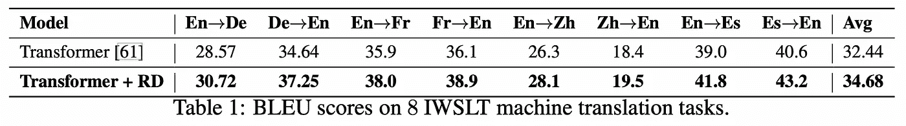
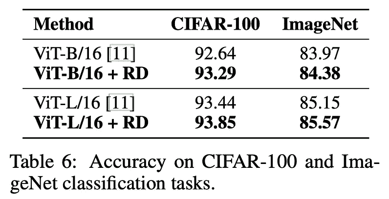

# R-Drop，提高辍学率的简单方法

> 原文：<https://medium.com/codex/r-drop-a-simple-trick-to-improve-dropout-d6f0bb64f302?source=collection_archive---------0----------------------->

[Zoltan·塔斯](https://unsplash.com/@zoltantasi?utm_source=medium&utm_medium=referral)在 [Unsplash](https://unsplash.com?utm_source=medium&utm_medium=referral) 上的照片

深度学习到处都在使用，但它们经常过度拟合训练数据，并且不能推广到看不见的样本。各种正则化技术防止这种过拟合。Dropout 是最流行和最强大的正则化技术之一，无论网络架构和任务类型如何都可以使用。它是通过在训练期间简单地从神经网络中删除一定比例的隐藏单元来实现的。

作者提出了一种简单而强大的正则化技术:R-Drop，旨在利用辍学的随机性。在各种任务和数据集上的实验表明，R-Drop 是普遍有效的。它甚至在 WMT14 翻译数据集上用 vanilla Transformer 模型实现了 SOTA。

在本帖中，我们将讨论:

*   R-Drop 正规化训练管道。
*   R-Drop 理论分析。
*   大量实验中 R-Drop 效应的分析。
*   有趣的方面来看 R-Drop。

[*官方论文:R-Drop:神经网络的正则化辍学*](https://arxiv.org/pdf/2106.14448.pdf)

## R-Drop 正则化

方法简单。在每个训练步骤中，每个数据样本都要经过一个模型两次。每一遍由不同的子模型处理，子模型通过丢弃进行采样。通过最小化两个输出之间的双向 KL 散度，训练两个输出分布 P1(y | x)和 p2(y | x)一致。所以与传统交叉熵训练的区别在于:

*   一个训练样本对数据进行两次检查。
*   双向 KL 发散被添加到损失项中。

**辍学可以被视为在每个训练步骤中创建不同的子模型*

最终损失项如下式所示，它结合了负对数似然损失(交叉熵)L_NLL 和双向 KL 散度 L_KL。在两侧测量 KL 散度:KL(P1，p2)，KL(p2，P1)并计算平均值。α是控制 L_KL 的权重系数。

在代码中，训练管道可以描述为:

作者建议，为了节省训练成本，输入小批量 x '是([x，x])的串联，并且推理实际上不被调用两次。

## 理论分析

好的，到目前为止还不错。但是为什么最小化一个额外的 KL 散度项会对模型的正则化产生影响呢？作者提供了一个理论分析，表明 L_KL 项限制了网络中参数的自由度。我们将从定义符号开始。

h (x):具有输入 x 的 NN 的第 *l* 层的输出。

ξ:从伯努利分布 B(p)中抽取的随机向量。

Dropout 可以表示为 h _ξ (x) = (1/p) ξ ⊙ h (x)，其中⊙是按元素的乘法运算符。神经网络表示为:

现在，让我们进入证明。首先，之前已知，与不使用压差相比，通过控制模型的雅可比矩阵(Colin 等人，2020 年)，使用压差(L_NLL)最小化损耗*限制了模型的复杂性。我希望在以后的文章中更详细地回顾这篇论文。*

作者证明了对于全连接的神经网络，例如多层感知器和变压器，双向 KL 发散损失的约束等价于约束网络的所有参数相等。

考虑仅在*一个*隐藏节点处彼此不同的两个子结构 P1 和 P2。只包含在 P1 的隐节点是 h_i，只包含在 P2 的节点是 h_j，当我们约束 KL(P1 || P2)=0 时，这等于 P1(y|x) = P2(y|x)，h_i=h_j 对于 prior to hold 应该为真。因此，当 h_i=h_j 时，KL(P1 || P2)最小

这可以扩展到更一般的压差和架构。更严格的证明，参考原论文附录 B 节。

总之，优化混合损失 L 的约束优化问题寻求一个模型，该模型能够以最小的参数自由度最小化损失 L_NLL，从而避免过拟合并提高泛化能力。

## 消融研究

作者建议进行实验，以更好地了解 R-Drop 的影响，并调整一些超参数，以找到 R-Drop 的最佳形式。实验在 IWSLT14 De→En 语言翻译数据集上进行。我们关注数字。

1.  R-Drop *真的*有助于调整吗？

与许多其他正则化技术类似，该模型在训练集上收敛缓慢，但最终最优结果在保留数据上更好。即使当相对于时间作图以考虑来自 R-Drop 的训练成本的增加时，具有 R-Drop 的模型在可忽略的时间段之后也足够好。

2.如果我们每 k 步应用 R-Drop 而不是每次都应用呢？

作者在每 k={1，2，5，10}个训练步骤中应用 R-Drop 进行实验，并在下图中显示结果。虽然训练速度稍快，但这种方法不是很有效，而且网络很容易过拟合。

3.如果我们在每个训练步骤中使用两个以上的输出分布会怎么样？

作者对 3 个输出进行了比较实验，得到 BLEU 分数为 33.30，与 2 个输出的基本设置的 33.25 相近。这种收益不值得计算成本的增加。结果表明 R-Drop 已经具有足够强的正则化能力。

4.如果我们改变每一次考试的辍学率呢？

例如，P1 可以从 0.1 的小辍学率抽样，而 P2 从 0.3 的辍学率抽样。虽然实验仅限于单个基准，但结果并不令人印象深刻。

4.权重系数α的不同值。

在各种实验中使用了非常不同的α值。对于翻译，α=5 被发现是最佳的，而α <1 is used for most other tasks. Reasonably, the value of α depends on how easy overfitting happens, which then depends on the model and data size of each task. Note that the effects of different values of α are significant and is worth searching the correct value of α when applied to a different setting.

Results of different α on translation with vanilla transformer.

## Experiments & Results

The authors provide experiments on 4 NLP and 1 CV task including:

*   Neural machine translation(NMT): 6 dataset
*   Abstractive summarization: 1 dataset
*   Language understanding: 8 dataset
*   Language modeling: 2 dataset
*   Image classification: 2 dataset

Experiments for NMT are done on both low-resource and rich-resource translation tasks. The low-resource scenario is evaluated on the IWSLT translation dataset and the high-resource scenario is evaluated on the WMT translation task. The vanilla transformer model was used as the backbone.

Results on Low-resource Neural machine translation

R-Drop shows significant improvements in all sub-tasks of the two datasets. Surprisingly, when combined with R-Drop, even the vanilla transformer surpasses all complex models and achieves SOTA performance in the WMT dataset.

The GLUE benchmark of language understanding includes 8 different text classification or regression tasks. The BERT-base and RoBERTa-large pre-trained models are used as the backbone. Results are as the table below:

For the regression task STS-B, the authors train the model with an MSE loss that replaces the bidirectional KL loss.

Left: abstractive summarization, Center: language modeling, Right: Image classification w/ViT

R-Drop also demonstrates similar positive results in summarization, language modeling, and image classification tasks using transformer-based backbones.

## Conclusion & Thoughts

In the *结论*，作者引用

> …在这项工作中，我们重点关注基于变压器的模型。我们将把 R-Drop 应用于其他网络架构，如卷积神经网络。

…是不是只有我觉得在结论中写这个很奇怪？评估 R-Drop 与 deep CNNs 等非变压器网络架构结合使用时的性能会很有意思。不像 MLP 或变形金刚在整个网络主干中大量使用丢弃，用于图像分类的 CNN 通常仅在卷积特征提取器和全连接层之间使用一次丢弃。这可以使 P1 和 P2 之间的差异小得多，并减少 KL 损失项。可能有一些对策，如在 CNN 主干网上增加分层分支，使 R-Drop 有效。

另一件有趣的事情是测试当 R-Drop 与其他正则化技术一起应用时，性能是如何受到影响的。好处会重叠还是叠加？

在查看 R-Drop 的 [Github repo](https://github.com/dropreg/R-Drop) 时，我发现了一个有趣的问题，即 KL 损失项在训练期间下降非常快:

作者回答说

> 至于你的问题，不同的任务可能会得出不一致的结论。例如，在 NMT 任务中，KL 损失从 0.7 减少到 0.15。在我看来，判断 R-DROP 有效性的一个可能的标准是一个子模型 adapt dropout 是否对训练有重大影响。例如，KL 损失将在没有 R-Drop 的基线中逐渐增加。

但我认为这是值得注意的。我认为我们可以通过利用这种现象(只是我脑海中的一些东西)来加速培训管道。我首先想到的是每 k 步应用 R-Drop，而不是每一步都应用 R-Drop，作者发现这会损害性能。无论如何，这是一个值得注意的有趣观察。

这篇论文的一个特别之处是描述得很好的强有力的实验，这些实验是一致的和公平的。大量的实验让我(可能还有其他研究人员)对 R-Drop 的有效性产生了信任，并使这些观点更有说服力。我感受到了在研究论文中做好实验的重要性。