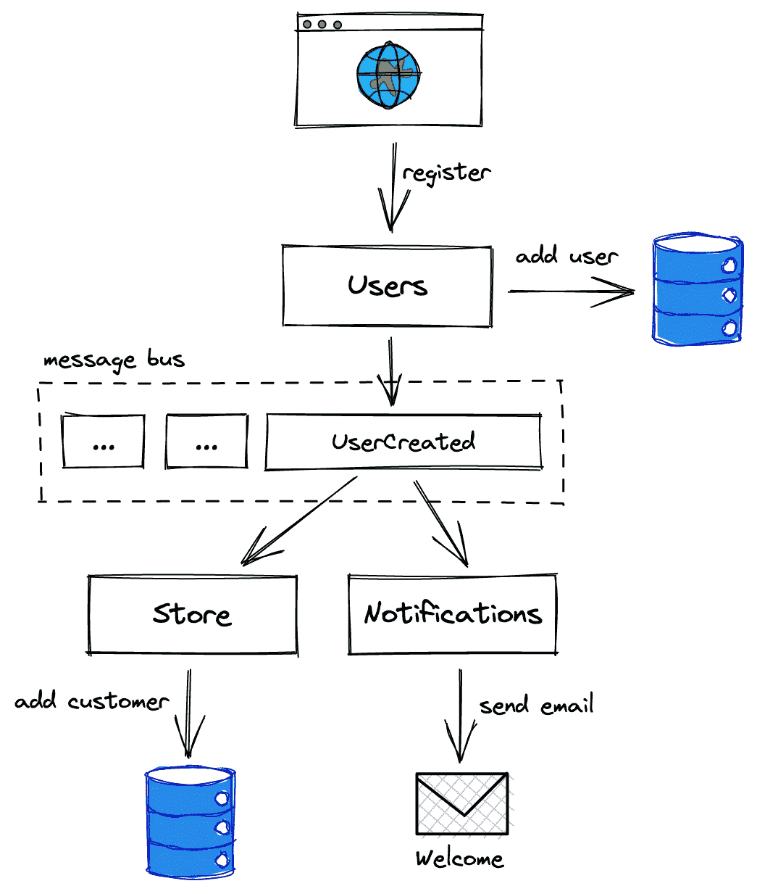
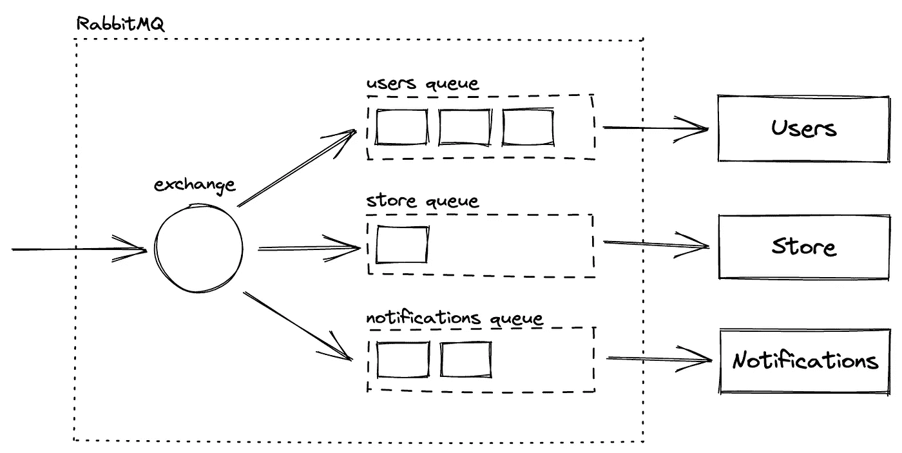
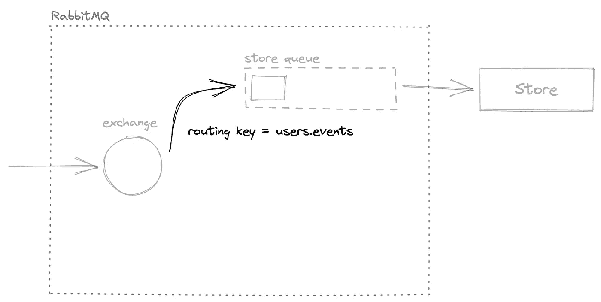
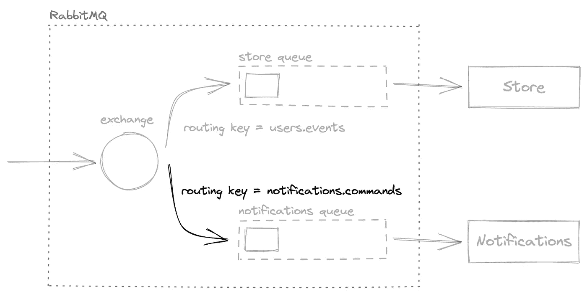

# 微服务架构中的 RabbitMQ

> 原文：<https://medium.com/codex/rabbitmq-in-microservice-architecture-86704b27a269?source=collection_archive---------8----------------------->

*由阿列克谢·古列耶夫&* *玛丽·摩尔撰*[大郎](https://shakuro.com/blog/rabbitmq-in-microservice-architecture)


Linde Raats 的插图

在处理大型应用程序时，开发人员经常会遇到不同的问题。结构越大，越难支撑。随着时间的推移，所有的问题可能会像滚雪球一样越滚越大，处理起来会更加困难。

微服务架构并不是一个新话题，但最近越来越受欢迎。这种开发风格将一个巨大的应用程序作为服务的集合。团队意识到，为了扩大规模，有效地消耗资源，并能够保持大型软件的代码库可管理，将整体结构分成小块是很重要的。在这种情况下，每个小组都专注于自己的领域，开发与产品的其余部分松散连接的解决方案，同时保持自己工作的一致性。

关键问题是如何让这些部件相互对话。一般来说，有两种方法可以做到这一点——借助各种消息代理的同步和异步。比如 [RabbitMQ](https://www.rabbitmq.com/) 。

在本文中，我们将讨论这两种交流方式，以及它们的优缺点。我们还将详细讨论流行的消息代理，并了解开发人员如何将其实现到微服务架构中。

# 同步通信

在这种情况下，我们从一个服务直接调用另一个服务，请求信息或进行更改。必须收到对请求的响应，执行才能继续。这就是你在一个单一的应用程序中处理任务的方式(在一个链中一个接一个地调用函数)。它通常被认为是一种快速而“肮脏”的方法，在清晰度方面有很大的好处。

基本上，您是在用远程调用替换本地函数调用。您知道正在调用什么，并且不需要走额外的路程来使 API(及其客户端)支持异步通信。

然而，这条道路充满了障碍:

*   如果每个服务都覆盖了 99.9% [SLA](https://en.wikipedia.org/wiki/Service-level_agreement) (服务级别协议)，那么对于每个外部调用，SLA 都会不断下降。在某个时候，您发现自己在某些端点上从每年最多几分钟的停机时间变成了几个小时；
*   您必须处理阻塞的调用、重试、回退和缓存；
*   客户端在等待复杂请求的回复时可能会超时；

几乎不可避免的是，您将被迫处理分布式事务。这不是一个直接的结果，但是因为你的架构的目标是同步的，你会想要在几个服务中做原子的改变。这是一个典型的分布式 monolith，并不比您计划淘汰的原始 monolith 应用程序好多少。事实上，更糟糕的是。

# 异步通信

这种开发方法是关于使用一个中央总线来通知所有相关方应用程序内部发生的事件。这是你最终找到大多数关于微服务的书籍的地方。微服务架构的思想在于各个部分相互独立。把它们想象成完全专注于单一功能的微小巨石。

但是，如果它们都通过直接调用相互连接，那么它们比单个应用程序更好吗？他们不是。事实上，在一个软件中实现这一切会更好、更快、更有弹性、更易于管理。

为了支持分离和松散耦合，服务应该使用间接消息进行通信。这些大多是事件，但有时需要发送命令来请求操作。

*   命令指示服务采取某些操作。一个简单的例子是定期发出命令的预定动作(在星期日下午 5 点启动每周报告)。特定的服务监听命令，接收并使用它们。如果您觉得命令引入了依赖性，您可以决定用“**weekly report required**”事件替换“ **CreateWeeklyReport** ”命令。这样，您可以让调度程序不知道哪个服务将准备报告。它将打破依赖。还有其他选择，你需要找到最适合手头任务的方法。
*   事件陈述系统中的变化(用户创建、添加评论、完成订单等)。).这种类型的消息由服务本身发出，由其他人监听。

处理报告看起来像连锁反应。一个事件被处理并触发新的事件，直到应用程序的所有相关任务都完成。例如，当您决定在应用程序中注册一个新客户端时，您可以向用户服务发送一个 API 请求，其中包含名称、电子邮件和其他信息。注册成功后，服务发出一个“**用户创建的**”事件，该事件被博客(它在其数据库中注册了一个新作者)、一个通知服务(它向这个新用户发送一封欢迎电子邮件)等侦听。它们中的每一个都可以发出自己的事件并触发更多的处理程序。

# RabbitMQ vs .卡夫卡

在这里，我们来了解一个重要的问题:我们如何交付这些事件。到这个时候，应该很明显，这个机制是整个应用程序的大动脉。它应该是可靠和快速的。一个巨大的结构将充满在众多服务之间来回穿梭的流程。

有几个久经考验的解决方案可以解决这个问题。为了做出明智的决定，web 开发人员需要仔细研究和考虑它们。他们都有自己的利基。有两种流行的消息代理:

*   **卡夫卡**。如果你正在读这篇文章，很可能你已经听说过这个故事。有关于它的书籍、课程和会议。 [Kafka](https://kafka.apache.org/) 是一个消息总线，与市场上的数百种工具集成良好。绝对值得考虑。尤其是当您想要长时间存储事件时(如果不是无限期的话)。
*   **RabbitMQ** 是一个开源软件，是高级消息队列协议( [AMQP](https://www.amqp.org/) )的一个小型且非常快速的实现。顺便说一下，Kafka 不支持这个协议。它是一个消息代理，其概念类似于邮箱和队列，有一个或多个消费者连接到它们。消息进入交换机，并通过路由规则被定向到特定的队列。它与卡夫卡的一个重要区别是 RabbitMQ 是以消费者为中心的，而卡夫卡是以生产者为中心的。该消息总线通过确认机制(自动或手动)跟踪消费者接收和处理的内容。对您来说，这意味着您不需要存储指向最后处理的事件的指针。技术人员会帮你处理。

# 如何使用 RabbitMQ

最后，我们来到了文章的核心部分。在这里，我们将看到 RabbitMQ 是如何在应用程序中作为代理实现的。

想象一下，我们有一个小小的电子商务应用程序。我们根据服务的领域将其结构分为几个服务:

*   **用户服务**注册未来的客户，以便他们可以登录并使用产品。
*   **商店服务**允许经理在目录中填入产品，并在顾客浏览商品和下订单时管理库存。我们可以进一步分解这个过程，将目录从库存、购物车和订购系统中分离出来，但是让我们保持简单。
*   **通知服务**监控事件并向用户发送电子邮件。

您可能已经注意到，在商店部分，我们称人们为“顾客”和“经理”(而不是“用户”)。这是他们在商店环境中的身份。以这种方式看待事情很重要。是的，您可以使 Users 服务中的用户 ID 与 Store 部分中的客户 ID 相匹配，或者如果您愿意，您可以在那里有一个“ **user_id** ”字段。重要的是你要遵循你的商业语言，但那是另一天的话题。

如前所述，这些进程本身可以被视为微小的应用程序。它们有一个目的，可以相互独立地发挥作用。

用户服务是软件中所有客户端的列表。他们注册并登录，更改他们的个人资料，重置密码，做人们用他们的帐户做的所有事情。我们也可以在那里为他们定义和分配角色。或者，管理员可以这样做，也可以查看用户列表，编辑他们的个人资料，删除他们，等等。当状态改变时，用户服务发出事件("**用户创建的**"、"**用户更新的**"、"**角色授予的**"等等。).发射什么和字段是什么是你和团队其他成员决定的。

商店服务允许经理在客户列出产品和下订单时处理目录和库存。但是如何添加或删除经理和客户呢？这就是事件发生的地方。当客户端出现在系统中时，我们希望将它们添加到商店服务数据库中，并监听来自用户的事件，做笔记。

通知团队还关注新用户事件，并向他们发送欢迎电子邮件，详细说明如何设置他们的密码以及接下来的步骤。



现在，让我们看看如何用 RabbitMQ 设计这一切。我们将从消息格式开始。

# 信息

消息总线并不真正关心它传输什么数据。它可以是文本或二进制。您有大量的选择，但是我们建议坚持使用传统的纯文本格式(至少在开始时),原因有很多。最主要的是，你将能够轻松地阅读，记录和发布信息手动没有任何特殊的工具。当然，发送二进制包会给你带来更快的速度，但是除非你正在构建一些高负载的系统，否则调试和跟踪的困难可能会抵消这种好处。

下面是一条典型的“**用户创建的**消息:

```
{
  "id": "d0482898-5a6f-4c90-95d8-aecb35f3bf2d",
  "name": "UserCreated",
  "time": "2022-11-09T09:36:15Z",
  "data": {
	"user_id": "e31e52ed-3f84-414a-a03a-55356dcc01aa",
	"user_name": "John Smith",
	"email": "john@smith.name",
	"roles": ["store_manager"]
  }
}
```

它由几个部分组成:

*   “ **id** ”是消息本身的标识。如果您的服务不是自然幂等的(可以安全地多次处理相同的消息),并且需要某种东西来标识处理过的数据，那么这个字段将非常方便。RabbitMQ 有“至少一次”交付模型，这意味着(在边缘情况下)相同的消息可以交付多次，您的工作是确保它不会破坏东西；
*   **名称**是事件或命令的名称；
*   “**时间**显然是生成该消息的时间；
*   “**数据**才是掌握实际核心的东西。字段集应该由所有感兴趣的团队很好地定义，并存储在某个地方以供参考(即使它是一个文本文件)。它也可以是 JSON，如示例所示。有时 JSON 模式被用来描述每个消息的格式。那么它可以被用于验证输入的传输。我们还看到其他开发团队使用集中式存储库产品来存储和导航消息目录。

下一步是弄清楚如何将信号从生产者传递给消费者。

# 路由消息

RabbitMQ 具有丰富的路径功能。你可以在官方文档中读到它们。我们选择为每个服务建立一个队列，并通过路由键将消息从中央交换中心发送给它们。



这是我们需要的:

*   用于发送传输的交换机；
*   每个服务接收这些消息的队列。在电子商务案例中，它们的名字分别是“**商店**”和“**通知**”。队列是必需的，因为 RabbitMQ 向每个队列传递消息，但不检查是否所有的消费者都收到了消息。这意味着，如果我们将存储和通知连接到同一个队列，只有其中一个会随机接收数据。

使用路由关键字可以很容易地将邮件从 exchange 定向到队列。假设当一个服务发送某个事件时，它用路由关键字“**<”service-name>将信息传递给交换机。事件**”。对此流程中的事件感兴趣的任何其他服务都需要使用相同的密钥将其队列绑定到交换。它就像交换和队列之间的虚拟连接，告诉我们的消息代理将带有特定标记的传输引导到特定的队列。

路由关键字的格式是任意的。使用上述格式的键，我们可以通过创建交换和带有键" **users.events** "的" **store** "队列之间的绑定来声明 Store 想要消费来自用户的事件。这就是全部的代价。



当向服务发送命令时，我们使用相同的原理。这一次，开发人员创建了目标流程和交换之间的绑定，但是使用了稍微不同的路由键来表示命令是预期的—“**<服务名>”。命令**”。

例如，通知可能需要一个明确的命令来发送每周报告。在这种情况下，我们使用“ **notifications.commands** ”键在交换和“ **notifications** ”队列之间创建一个绑定。现在，该用这个路由标记向交换机发送命令消息了。数据将被传送到“**通知**队列。



# 使用 RabbitMQ 消息总线的技巧

与消息代理打交道通常很容易。然而，有一些问题是网络开发者应该知道的:

*   RabbitMQ 遵循“至少传递一次”的原则，这意味着同一条消息可能会被传递多次。有两种方法可以解决这个问题。您可以使处理程序幂等，这样它们就可以处理同一个传输两次，而不会破坏整个过程。或者，确保记录下你处理的信息，避免灾难。
*   如果 RabbitMQ(或任何其他代理)崩溃，将不会有任何数据交换。想出一个生存的策略。我们建议将事件与您的数据更改一起写入同一事务中的数据库，然后使用后台作业将这些事件发送到消息代理。这样，您将能够重试递送，直到总线可用。
*   避免使用同一个 RabbitMQ 用户帐户将您的服务连接到代理。这使得不可能:

1.  跟踪哪个服务启动(或关闭)及其实例的数量；
2.  微调队列权限；
3.  监控使用情况。

*   不要使用全新安装附带的来宾帐户。重要的是从第一天开始就用自定义密码和非默认密码替换它。

# 最后

我们只涉及了微服务架构的冰山一角。使用 RabbitMQ 作为应用程序中的消息总线，即使有大量的元素，也可以创建稳定的结构。提示将帮助您正确设计架构，从而使消息传递具有持久性和容错性。

由阿列克谢·古列耶夫&玛丽·摩尔创作

*原载于*【https://shakuro.com】