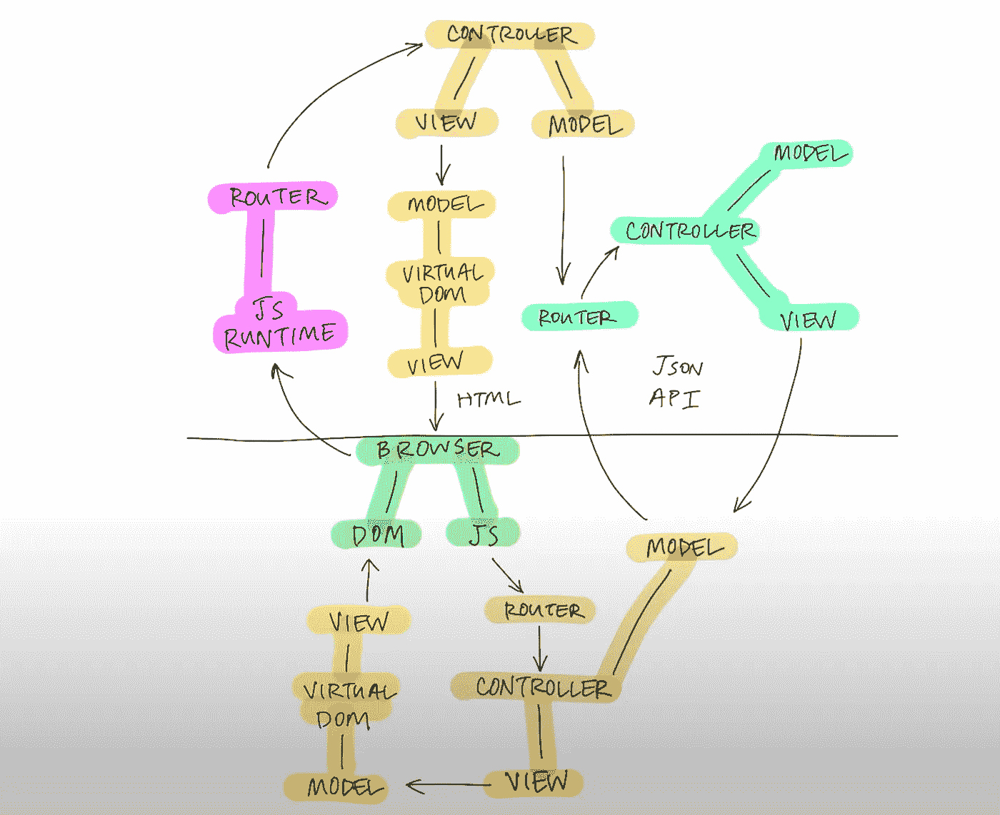
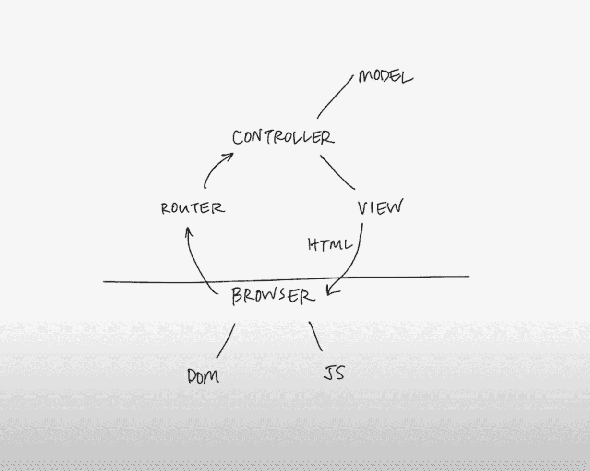

# Rails 和 hot wire——也许旧的方式并没有那么糟糕

> 原文：<https://medium.com/codex/rails-hotwire-maybe-the-old-ways-arent-that-bad-after-all-a08d41cfa308?source=collection_archive---------3----------------------->

在过去的几个月里，我一直在和一个朋友谈论开发一个 web 应用程序，这将有助于使舞蹈比赛组织者的生活变得更容易一些。舞蹈比赛可能是一件复杂的事情。你必须:

1.  处理付款，
2.  给舞蹈演员分配一个号码，
3.  将舞者的名字和号码写在提供给评委的评估表上，
4.  用选择的评价体系对舞者进行评价(没错，有多种方法)，
5.  拿回表格，尽快手动计算每个参与者的位置，
6.  将结果写在要展示的分数表上。

这整个程序，已经够复杂了，是我们的幸福之路。当然，复杂性是随着舞者有时可以随机地与一个或多个舞伴跳舞而演变的。有人可以在最后时刻加入比赛。但最令人紧张的是，一项舞蹈比赛通常有许多比赛，而且很可能有些比赛同时进行。如果我们有一个应用程序来简化这个过程会怎么样？但最重要的是，**你会用什么技术来开发这样一个应用程序？**

# 最适合您项目的堆栈是您能够负担的

让我们面对现实吧。**你遇到的大多数应用创意永远不会成为数百万美元的公司**。也不一定非要这样。世界上许多尚待解决的问题被忽略了。这意味着你可能会有一个小预算，因此，一个小团队。但是有一个小团队并不意味着有小野心，你已经准备好选择一个技术栈来开发一个闪亮的单页应用程序。好吧，事实是这样的:

# ReactJS 和 Angular 不是为你设计的。

单页应用程序(SPA)的想法很吸引人。您将服务器的部分逻辑转移到客户机上运行，并在需要时从服务器请求数据。这意味着您可以更新显示给用户的内容，而无需刷新页面。如今开发单页面应用程序最流行的框架是 React 和 Angular。但是事情是这样的:

> “任何设计系统(广义定义)的组织都将产生一个设计，其结构是该组织通信结构的副本。”
> 
> ——梅尔文·康威

这两家公司分别由脸书和谷歌这两个拥有数千名程序员的大型组织创建。尽管单页应用程序模型给 web 应用程序带来了活力，但它也带来了一些挑战。一家价值数十亿美元的公司有能力应对这些挑战。尽管如此，也许它会减缓一个更温和的冒险。例如:

*   SPAs 对于搜索引擎的优化是具有挑战性的，因为他们的爬虫倾向于不执行 JavaScript 代码。
*   它们起初需要时间来加载，并且倾向于依赖于许多必须在客户端下载的依赖关系。
*   他们**将逻辑一分为二**，迫使你在客户端和服务器端都处理模型-视图-控制器模式。

这导致您最终需要维护一个复杂请求/响应循环，可能如下所示:

图片由 Sam Stephenson (Basecamp)在 RailsConf 2016 上展示

# Rails 是为您设计的…

好吧，我已经听到你们中的一些人在屏幕后面大喊，准备停止阅读这篇文章。但如果没有一点争议，这就不是一篇好的评论。

Rails 是一个用 Ruby 编写的服务器端 web 应用程序框架，它是为中等规模的团队设计的。它是由大卫·海涅梅尔·汉森在 16 年前创建的。当时，他在一家名为 37signals(今天称为 Basecamp)的小公司工作，开发基于 web 的项目管理应用程序。

Rails 是一个固执己见的框架，这可能是它最好的特性之一。您告诉 Rails 您想做什么，它会负责“如何”去做。由于一切都是在服务器上呈现的，因此最终的请求/响应周期如下所示:

图片由 Sam Stephenson (Basecamp)在 RailsConf 2016 上展示

这意味着，就目前而言，Rails 属于多页面应用程序范例。但是让我们停下来欣赏一下这个范例。**很简单，像真的很简单**。浏览器向服务器发送请求。这一个被路由到适当的控制器，请求适当的数据从几个模板组装成一个 HTML 文件。然后，最终结果被发送回浏览器。

为了形象化这种简单性，让我们以 2015 年发布的 Basecamp 3 的开发为例。他们为此工作了 **18 个月**，创造了超过 **200 个屏幕**，并在**五个平台**上发布了服务:网络、macOS **、** Windows、Android 和 iOS。在一家尊重工作/生活平衡的公司里，这个团队只有十个人。

# Hotwire 也是！

但是你想要那个闪亮的单页应用程序，老实说，我不怪你。好吧，Rails 在某种程度上可以用新的 Hotwire 框架家族做到这一点。你猜怎么着？它是由 Basecamp 的团队(再次)为你设计的。前提很简单:你保持与 Rails 相同的逻辑，但是你的应用感觉像一个单页应用。为什么“感觉像”？因为所有的逻辑仍然在服务器端。Hotwire 最重要的框架:Turbo 使之成为可能。

最大的多页面范式问题是，每次点击链接浏览网站时，都必须刷新整个页面。 **Turbo 允许您仅刷新页面中需要刷新的部分**。当你的用户点击一个链接时，Turbo 将停止它，并向服务器发出一个类似 AJAX 的请求，请求一个新的 HMTL 页面。一旦接收到这个新页面，它就被合并到 DOM 中。您可以通过使用 Turbo 帧来定制这种行为，从而只请求您需要刷新的部分。

另一个有趣的功能， *Turbo Streams，*允许通过 WebSocket 进行更改。但我认为最重要的一个是 *Turbo Native* ，它**允许你开发一个 iOS 或 Android 应用程序，感觉像是 native** 。因为所有的事情都是在服务器端处理的，如果你的 web 应用已经可以响应了，你唯一要做的就是把应用的本地部分连接到你的 web 应用上。

因此，到目前为止，我们不需要任何定制的 JavaScript，但是假设我们需要编写一些。这就是刺激的来源，热线的第二个框架。 **Stimulus 允许你在 HTML 中加入控制器、目标和动作属性，并编写一个单独的 JS 文件来控制它**。这有点像做 jQuery，但是是 CSS 样式的，JS 和 HTML 是分离的。就像样式表一样，它将始终应用于具有适当属性的 HTML 元素，即使 Turbo 对页面进行了更改。不需要像 jQuery 一样初始化你的控制器。

# 简单是伟大的

让我们回到我们的舞蹈应用程序项目。我们问自己这样一个问题:**在我们的社区中，我们可以用来解决问题的最有效的框架是什么？**是哪一个让我们的项目变得现实，即使它永远是一个副业。我们相信 Rails 和 Hotwire 是我们的最佳选择。

我并不是说 Angular 或 React 这样的框架没有价值，因为它们确实有价值。它们极其强大和灵活，对于许多公司来说，使用它们是有意义的。

你可能希望我说我们选择使用 Rails 和 Hotwire 来开发我们的 web 应用程序。嗯，是也不是。几个月前，我们加入了 Lighthouse Labs 的 Web 开发训练营，开始编程。我们将使用 PERN 堆栈(PostgreSQL，Express，React & Node.js)为我们的最终项目开发应用程序。作为个人，我们确实相信使用那些流行的框架是很重要的，至少要理解它们。这将是我们的概念证明。但从长远来看，我们很可能会继续使用为我们设计的东西。

# 参考

*   编码技术。(2017 年 11 月 14 日)。 *Turbolinks:真不敢相信不是本土的*。https://www.youtube.com/watch?v=Xkjo7iKkQlY
*   康威，医学工程(1968)。委员会是如何发明的？*数据化*， *14* (4)，28–31。
*   *网络上的 HTML | hot Wire*。(未注明)。检索于 2021 年 4 月 2 日，来自[https://hotwire.dev/](https://hotwire.dev/)
*   米塔，西(未标明)。*2019 年谁给个关于 Rails 的 F***啊？*2021 年 4 月 2 日检索，来自[https://naturaily.com/blog/who-gives-f-about-rails](https://naturaily.com/blog/who-gives-f-about-rails)
*   刺激:为你已经拥有的 HTML 提供一个适度的 JavaScript 框架。(未标明)。检索于 2021 年 4 月 2 日，来自[https://stimulus.hotwire.dev/](https://stimulus.hotwire.dev/)
*   Turbo:单页 web 应用程序的速度，无需编写任何 JavaScript。(未标明)。检索于 2021 年 4 月 2 日，来自[https://turbo.hotwire.dev/](https://turbo.hotwire.dev/)
*   Vandgrift，B. (2021)。*反应轨:热线*。[https://www.beflagrant.com/blog/reactive-rails-hotwire](https://www.beflagrant.com/blog/reactive-rails-hotwire)