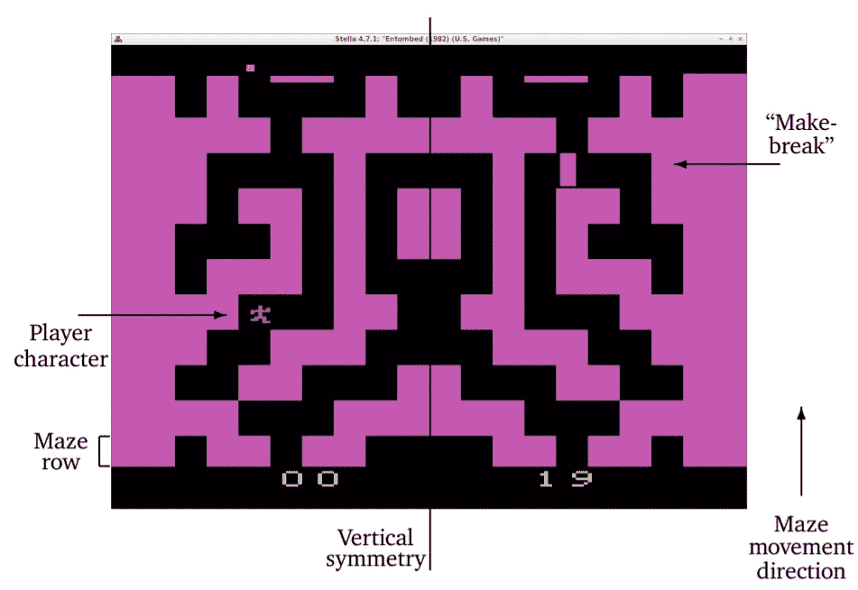
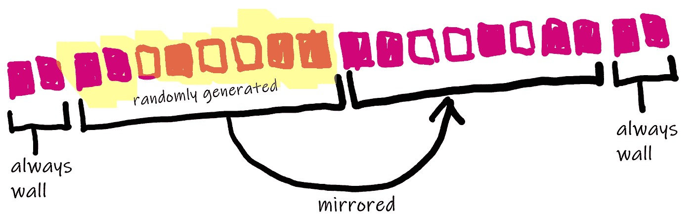
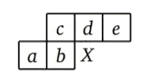
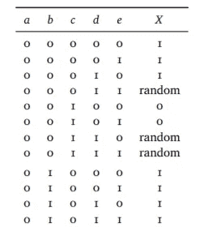
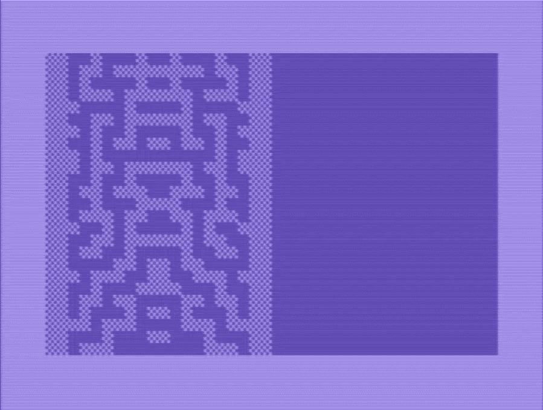

# 来自埋葬的随机迷宫

> 原文：<https://medium.com/codex/random-maze-from-entombed-8bb3b34e8f9b?source=collection_archive---------6----------------------->

## [法典](http://medium.com/codex)

## 从 Atari 2600 到 Commodore 64 的神秘算法

由于一个随机的 Twitter 列表，我发现了一篇有趣的论文，并且我已经意识到一个名为 *Archeogaming* 的研究领域的存在，该领域使用来自考古学、历史学和软件工程的方法和手段来剖析和分析古代视频游戏的设计和实现。

这篇论文是 [*埋葬:一个雅达利 2600 游戏*](https://doi.org/10.22152/programming-journal.org/2019/3/4) 的考古检查，并且是第一次，成功的(在我看来)尝试正式化研究领域。

这篇论文真的很有趣，读起来也很有趣，正如标题所示，它提供了对 Atari 2600 嵌入的视频游戏的实现的详细分析:我不会在这里详细介绍，因为这篇论文很好地解释了你需要知道的一切，但为了清楚起见，你只需要知道游戏是关于一个角色，由玩家驱动，必须跑过一个随机生成的迷宫。

强调随机这个词是因为在每个新游戏中拥有不同的迷宫将极大地有利于游戏的*可玩性，即适合或值得玩不止一次的事实。*

Atari 2600 的简单游戏机制演示

## 迷宫的新路线的产生

视频中清楚地显示了游戏的工作原理:玩家必须保持向下移动，同时迷宫向他滚动。迷宫由以下部分组成

该算法提供了一种简单的方法来生成新的迷宫线，只要它向上滚动。迷宫有 20 个街区宽，迷宫的每一行都有两个最左边和最右边的街区被一堵墙占据。



操场的图像(图像取自原始文件)

每一个新行都是上一行的函数，它必须填充该行剩余的 16 个块。另一个简化也为生成的迷宫增加了某种美感，即只生成了最左边的 8 个块，而其余的 8 个块都是相同的块，但是是镜像的:在下图中，您可以看到算法的示意图。



新线条的生成(我手写)

## 喝醉的深夜节目

每个新块的生成都考虑了该块的上下文。在下图中，您可以看到这是如何发生的:为了生成位置 *X* 的块，需要考虑位置 *a、b、c、d、e* 的块的内容。



生成块 X 的上下文是块 a、b、c、d、e 的内容(来自原始纸张的图像)

该算法使用一个表来决定块 *X* 中的内容。对于块的每个组合，该表都有一个条目。在下图中，您可以看到表格的前 12 行:



用于迷宫生成的神秘表格映射的摘录(原始论文中的完整表格)

值得注意的是，该表在论文中被称为*神秘表*，因为没有清晰的模式描述行是如何定义的，最初的程序员也无法回忆起他实际上是如何做的，因为*“他喝醉了，神志不清，他在昏迷之前用汇编语言写了一夜，但现在无论如何也记不起算法是如何工作的了”*

根据位置 *a、b、c、d、*和 *e* 中单元格的值，表格的每一行包含 0、1 或随机值:0 表示 *x* 单元格将包含空白空间，玩家的角色可以在其中行走；1 将在 *x* 单元格中生成一个墙块，random 将随机生成一个块或空间。

## 移植到 Commodore 64 Basic

在 21 世纪移植到 Commodore 64 Basic v2 是一项有趣的工作。在核心处，有一个神秘的表，它被呈现为一个从 C64 Basic 的`DATA`语句加载的数组。C64 版本的另一个细节是，它使用标准随机数生成器，而不是伪随机数生成器的实现，如论文中所述。

接下来你会发现纯 C64 Basic 的源代码:

```
10 DIM Z(31):FOR I=0 TO 31:READZ(I):NEXTI:?"{CLEAR}":S=1986:K=102
20 FOR I=0TO1:POKE 1984+I,K:POKE2003-I,K:NEXT I
30 FOR X=S TO 1993
40 A=-(PEEK(X-2)>32)*16:IF X=S THEN A=16
50 B=-(PEEK(X-1)>32)*8:IF X=S THEN B=0
60 C=-(PEEK(X-41)>32)*4:IF X=S THEN C=INT(RND(1)+.5)*4
70 D=-(PEEK(X-40)>32)*2
80 E=-(PEEK(X-39)>32)
90 V=Z(A+B+C+D+E):IF V=2 THEN V=(INT(RND(1)+.5))
100 IF V=1 THEN POKEX,K:POKE3987-X,K
110 NEXT X:SYS 59626:GOTO 20
120 DATA 1,1,1,2,0,0,2,2,1,1,1,1,2,0,0,0
130 DATA 1,1,1,2,0,0,0,0,2,0,1,2,2,0,0,0
```

第 10 行—用从第 120–130 行读取的数据初始化包含神秘表的数组`Z`。几个变量的初始化:`S`是算法生成的第一个位置(屏幕左下单元格右侧两个单元格)

第 20 行—在新生成的行的最左侧和最右侧绘制两个单元格条纹，该行始终是屏幕上的最低行

第 30 行—此处开始正确的绘图循环，其主体在第 110 行结束。通过查看 C64 屏幕存储器，在每一行上计算出 *a、b、c、d、*和 *e* 的值。这五个值组合在一个位串中，其值作为一个整数，用于索引以选择神秘表中的适当行，保存在数组`Z()`中。

第 40 至 80 行—计算字母 *a、b、c、d、*和 *e* 。请注意，第 40、50 和 60 行执行了一项特殊检查:如原始论文中所述，迷宫新线的最左侧单元的计算方式不同，因为 a、b 和 c 将与始终存在的两个单元条带(在第 20 行生成)相一致。在这种特殊情况下，这些值是 a=1，b=0，c 等于 0 到 1 之间的一个随机数。

第 90 行—通过添加 *a、b、c、d、*和 *e 来恢复适当的行`Z`。如果数组`Z()`的值为 2，则单元格可以随机为空或满。*

第 100 行——如果在前一行中，我们从表中的查找中得到 1 或者生成了 1，则绘制一个单元格:在这种情况下，地址为`X`的单元格用代码保存在`K`中的字符戳。

第 110 行—结束循环。`SYS`调用将只是向上滚动屏幕，增加一个空行。`GOTO`将重新开始绘制迷宫新线条的循环。

结果如下图所示，你的跑步(希望)会有所不同。



在仿真的 C64 上运行得到的迷宫的执行

# 结论

从这里开始，有几个提示:为了有一个紧凑的版本，并且可能参加 [BASIC TENLINER 竞赛](https://gkanold.wixsite.com/homeputerium/rules2021)，可以压缩代码。下面的代码就是一个例子(注意:在功能上不完全等同于前面的代码),它只运行了 5 行代码:

```
10dIZ(31):fOI=0TO31:rEZ(I):nE:?"{CLEAR}":S=1986:K=102:
20fOI=0TO1:pO1984+I,K:pO2003-I,K:nE:fOX=STO1993
40V=Z(-(pE(X-2)>32)*16-(pE(X-1)>32)*8-(pE(X-41)>32)*4-(pE(X-40)>32)*2-(pE(X-39)>32)):IFV=2tHV=INT(rN(1)+.5)
50IF V=1 THEN POKEX,K:POKE3987-X,K
60NEXT:SYS59626:gO20:dA1,1,1,2,,,2,2,1,1,1,1,2,,,,1,1,1,2,,,,,2,,1,2,2,,,
```

上面的代码仍然可以被压缩，甚至更多，为添加游戏逻辑留下了空间，这是一个功能完整的嵌入式克隆。