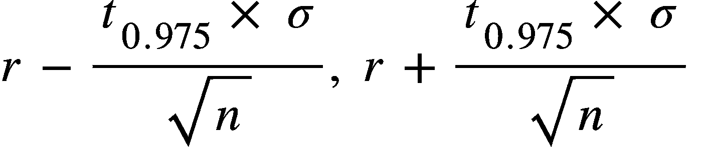

# 使用玻璃门评级和置信区间对班加罗尔的公司进行排名

> 原文：<https://medium.com/codex/ranking-companies-in-bangalore-using-glassdoor-ratings-and-confidence-intervals-a613ff8b97fb?source=collection_archive---------11----------------------->

**[**glass door 摄影大队**](https://www.flickr.com/photos/glassdoorphotos/)**BY gdlogo _ white 在**[**CC BY-ND 2.0**](https://creativecommons.org/licenses/by-nd/2.0/)**下授权。****

# **为什么求职是可怕的**

**找工作包括在 Linkedin 和其他类似网站上搜索，以确定去哪里申请。这常常令人沮丧，因为随着新公司的出现，通常很难判断一家公司有多“好”。**

**走进**玻璃门**，这是检验一家公司声誉的事实标准。一个正确对待员工的公司可能会胜过其他因素，如工作类型和薪酬。因此，在申请之前检查一家公司的玻璃门评级是至关重要的。**

**然而，如前所述，随着新公司不断涌现，有时你没有足够的信息来判断那家公司。**当一家创业公司的评级单一但很高时，你会怎么做？你如何将其与另一家平均评级不那么高但评级很高的公司进行比较？****

# **置信区间**

**我们可以使用一种叫做 c **置信区间**的统计成分，它帮助我们以 95%的置信度计算出，给定一家公司在`n`评论样本上的平均评级`r`，该公司的“实际”评级将位于哪个区间。**

**该范围由以下公式给出:**

****

**其中，`t`表示自由度的 95%置信度下的 t 分布值，σ是样本中评级的标准偏差。**

# ****公司排名****

**现在我们有了一个更好的方法来判断一家公司，即使它的评级更少。我们有一个工具来比较创业公司和大公司。**

**所以让我们继续吧。使用`BeautifulSoup`的一些网络抓取将帮助我们获得班加罗尔的公司列表(来自[这篇](https://en.wikipedia.org/wiki/Category:Companies_based_in_Bangalore)维基百科文章)和每个公司的评级(来自 Glassdoor 评论页面)。**置信区间将帮助我们获得一家公司的“实际”评级的下限**。**

**维基百科的文章有 133 家公司，其中 104 家被考虑。**

# **等级**

**公司的最终排名及其下限评级值:**

1.  **普拉蒂利皮(4.8)**
2.  **扫视网络(4.6)**
3.  **Zapr 媒体实验室(4.5)**
4.  **Zerodha (4.2)**
5.  **哈苏拉(4.2)**
6.  **Flipkart (4.1)**
7.  **印孚瑟斯(4.1)**
8.  **Wipro (4.0)**
9.  **MyGate (4.0)**
10.  **Intuit 印度公司(3.9)**

**前 10 名中缺失的一些知名公司是 Swiggy (3.9)、Myntra (3.7)、PhonePe (3.6)、Commonfloor (3.5)和 InMobi (3.5)。**

# ****关于刮擦的注意事项****

****我要感谢 Glassdoor 提供的数据。**为了确保我的请求不会让他们的服务器过载，我给每个公司刮了最多 1000 个评分(只有评分值，没有评论文本)。这可能会使结果有偏差。另外只考虑英文评论。**

# ****关于考虑的公司的说明****

**考虑的公司是维基百科文章中提到的公司。由于这不是一个详尽的清单，一些公司可能会被遗漏。**

# **关于抽样和置信区间的说明**

**结果可能会有进一步的偏差，因为对一家公司的评级样本不是简单的随机样本，而是一个方便的样本，因为公司的每个员工都没有相同的机会撰写 Glassdoor 评论。通过按员工类型对评论进行分组，并获得一个**随机多阶段聚类**样本(通过考虑员工类型的随机子集)或一个**分层随机样本**(通过从每种员工类型中随机抽取一个员工子集)，可以改进结果。**