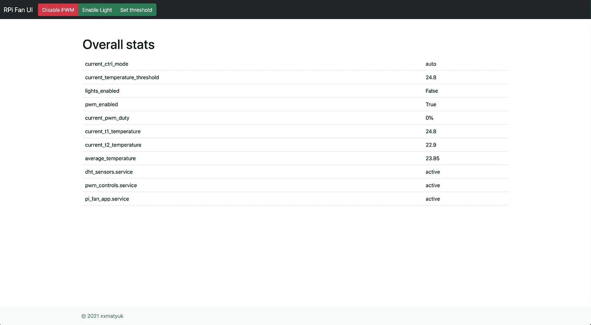
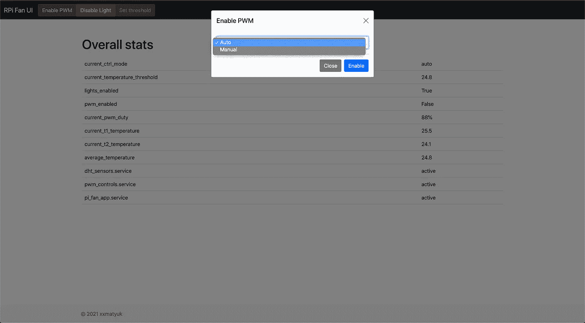
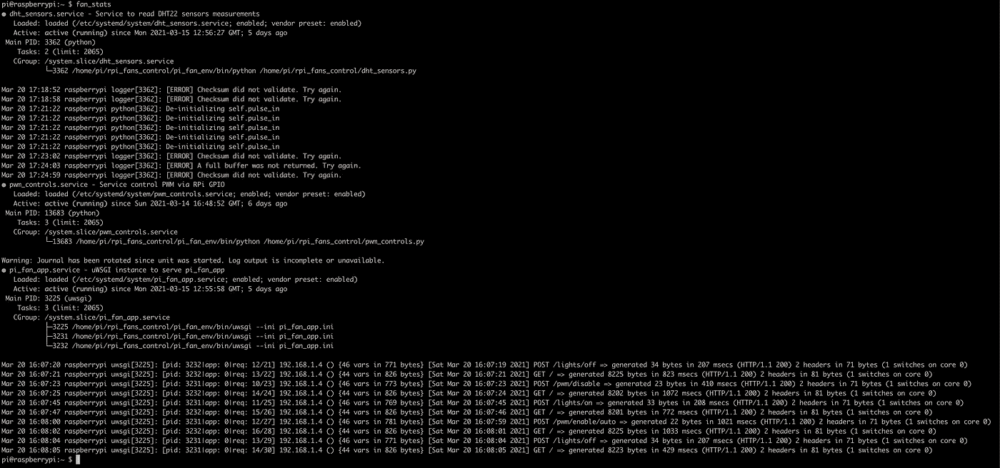

# 树莓 Pi 控制的笔记本电脑冷却垫。软件的故事。(第二部分。)

> 原文：<https://medium.com/codex/raspberry-pi-controlled-laptop-cooling-pad-the-software-story-part-ii-f8591e74e378?source=collection_archive---------19----------------------->

## [法典](http://medium.com/codex)


费多尔对那里发生的事情视而不见，因为实际上没有那么多好处。

好吧，好奇的网民们。在我的[上一篇文章](/swlh/raspberry-pi-controlled-laptop-cooling-pad-the-hardware-part-part-i-6a665c7bdf98)中，我们探索了如何创造性地重建普通笔记本电脑的内部。现在是时候控制这个生物了。但是在我们开始之前，让我们回顾一下我愿意处理的问题。这些事情是:

*   两个 **DHT22 传感器**我想从中读取测量值
*   我想要控制的那群 PWM 风扇
*   **灯**通过 RPi 的 **PWM** 连接，我也想对其进行控制

# 眼睛盯着球——唯一重要的是进球。

最终目标是使垫子能够自主运转:一旦垫子内部的温度升高，它的冷却器就会开始工作。如果能够切换到手动控制模式，并最终能够对风扇进行一些控制，那也将是非常棒的。更不用说开关灯的能力，以及在自主状态下查看事情进展的能力。就此而言，一些简单的用户界面也是一个理想的选择。

# 建筑。

一旦目标明确，我们就要想办法了。因为从我想出这个主意到我最终组装好这个东西大约用了一个月的时间，所以我决定让它尽可能简单，只要它能让项目向前发展。你有时可能会忘记自己在做什么，简单的解决方法就在那里。你只需要找到合适的。

正如已经说过的——UI 是一个选项，我从一开始就认为 ***Flask*** 是合适的工具。它不能也不应该存储状态。但是我需要存储一些状态。因此，在对 globals()进行了一些痛苦的实验后，我强烈地意识到——这不是一个选项。一些存储是非常需要的。于是我想到了 ***雷迪斯*** 。它将存储我需要的状态和一些设置，以便能够在飞行中改变它们。这也将允许我把我需要进一步阅读的温度测量值，并决定这是否是 r̶e̶l̶e̶a̶s̶e̶̶t̶h̶e̶̶k̶r̶a̶k̶e̶n̶启用球迷的正确时间。

所以要把它分解成几块:

*   Flask web app 为控件提供 UI 和 API。
*   **DHT 传感器应用程序**不断读取温度，并写入读取的任何内容。
*   **PWM 控制应用**读取温度测量值，启用/禁用风扇/灯，并查看任何设置/模式变化。

这三个人都在通过 ***Redis*** 互相交谈。所以我所需要的就是想出这三个，并进一步使它们变得神秘。到目前为止很简单，不是吗？现在，我不会在这里介绍如何设置 Redis 之类的东西——这从来都不是这篇文章的目的，尽管我已经完全准备好介绍这个项目的一些简洁的方面。因此，如果有人试图 DYI 类似的东西，这将是有益的。当然，我会提供所有的链接和资源，而我一直在精心制作它。当然还有带代码的回购。

# 组件。

现在，让我们更深入地了解它们。我更愿意从最重要的一个开始— ***Redis*** 。好吧，最终它们对任务都是至关重要的:没有温度测量——没有自主性，没有 PWM 控制——浪费测量等等。但是，即使他们都能做自己的事情，除非他们能相互交流，否则一切都毫无意义。所以 ***Redis*** 就是了。

## 雷迪斯。

同样，我不想浪费经验丰富的读者的时间设置步骤。我只是简单地按照这个指示去做，它确实对我很有效。对于刚接触 Redis 的人来说也是如此。

假设所有的设置步骤都完成了，让我们来看看我们的客户端。这里没有什么真正复杂的:我需要通过键设置一些值，并通过键获取一些值。值得一提的是 ***Redis*** 将值存储为字符串，所以你需要注意这一点。同样的，你也需要注意将要进一步阅读的内容。考虑到这一点，我的客户的要素是:

```
def _set(self, k, v):
    self._conn.set(k, v)def _get(self, k):
    return self._conn.get(k)def _get_typed_value(self, v, t):
    try:
        return t(v)
    except (TypeError, ValueError):
        return Nonedef set_value(self, k, v):
    if type(v) != str:
        v = str(v)
    self._set(k, v)
```

其中`_conn`本质上是:

```
redis.Redis(host=host, port=port, db=db, charset="utf-8", decode_responses=True)
```

这四个将 ***得到*** 它和 ***集*** 它以适当的方式照顾类型上的需求。剩下的只是我需要检索的不同数据类型的属性:

```
import settings...@property
def current_ctrl_mode(self):
    return self._get(settings.CURR_CTRL_MODE)@property
def current_pwm_duty(self):
    return self._get_typed_value(self._get(settings.CURR_PWM_DUTY), int)@property
def current_t1_temperature(self):
   return self._get_typed_value(self._get(settings.CURR_T1_TEMP), float)...
```

您明白了:无论何时属性都默认存储为字符串——没什么大不了的。在检索任何类型时也没有——只需传递类型就可以了。

完整的 ***Redis*** 客户端源代码在那里:

[](https://github.com/xxmatyuk/rpi_fans_control/blob/main/redis_client.py) [## xxmatyuk/rpi_fans_control

### 在 GitHub 上创建一个帐户，为 xxmatyuk/rpi_fans_control 开发做贡献。

github.com](https://github.com/xxmatyuk/rpi_fans_control/blob/main/redis_client.py) 

## DHT 传感器应用程序。

*蟒蛇 2.7+* 死了。不管你喜不喜欢，事实不在乎你的感受，2.7 的死就是事实。所以我在谷歌上搜索的第一个图书馆没有 *python3。X+* 实现。幸运的是，还有[另一个](https://github.com/adafruit/Adafruit_Blinka)。

从它的例子来看，您需要做的事情非常清楚:只需初始化一个传感器，向类构造函数提供一个 pin 号，您将传感器连接到这个 pin 号，然后只需获取相应的属性值。是啊，它默认为摄氏度，所以对不起，我的非公制朋友。

```
>>>import adafruit_dht
>>>dht = adafruit_dht.DHT22(pin)
>>>dht.temperature
13.12
```

不是火箭科学。但是请记住，虽然你是在和真实的物理世界打交道，传感器可能会出问题。放心会的。因此，在这两个步骤中的任何一步，它都可能抛出一个您可能想要处理的异常。在第一步`RuntimeError`可能会被抛出。这同样适用于第二个..再加上其他的。

```
from logger import logger...def _get_dht_sensor(pin):
    """Returns DHT sensor instance"""
    d = None
    try:
       d = adafruit_dht.DHT22(pin)
    except RuntimeError as e:
       d.exit()
       d = adafruit_dht.DHT22(pin)
       logger.error(str(e))
    return ddef _get_sensor_temperature(pin):
    """Gets tempreature mesure of a given sensor"""
    try:
        d = _get_dht_sensor(pin)
        if d:
            t = d.temperature
            d.exit()
        return t
     except Exception as e:
        logger.error(str(e))
        if d:
            d.exit()
```

两个关键功能。第一个尝试通过 pin 初始化传感器，第二个尝试读取温度。两者都试图捕捉可能发生的情况并记录错误。最终，这个不确定的循环将试图获取两个传感器的温度，如果足够幸运的话，将它放在一个合适的位置。在投票时间睡觉，然后再睡一遍。

```
import settingsfrom redis_client import RedisClient...redis_client = RedisClient()...def run_sensors_readings():
    while True:
        t1 = _get_sensor_temperature(settings.DHT_PIN_16)
        t2 = _get_sensor_temperature(settings.DHT_PIN_20)

        if t1:
            redis_client.set_value(settings.CURR_T1_TEMP, t1) if t2:
            redis_client.set_value(settings.CURR_T2_TEMP, t2) time.sleep(settings.DHT_POLLING_TIMEOUT_SECONDS)
```

完整的源代码可以在那里找到:

[](https://github.com/xxmatyuk/rpi_fans_control/blob/main/dht_sensors.py) [## xxmatyuk/rpi_fans_control

### 此时您不能执行该操作。您已使用另一个标签页或窗口登录。您已在另一个选项卡中注销，或者…

github.com](https://github.com/xxmatyuk/rpi_fans_control/blob/main/dht_sensors.py) 

## PWM 控制应用。

现在，由于我们有了 ***Redis*** ，Redis 客户端和 DHT 应用程序通过客户端将温度测量值写入 ***Redis*** 中，我们很有可能最终实现生物自动化。但是，在您自动化任何事情之前，有理由提前了解哪些事情应该在您的控制之下:

*   Pad 的操作模式:自动或手动。
*   灯的状态:开或关。
*   更精确的控制取决于操作模式。

但是在我们开始之前，让我们先了解一些基础知识。不管你想通过 RPi 的 **PWM** 控制什么，流程将保持不变:

*   您定义 RPi 的 **GPIO** 引脚的寻址
*   您用模式(输入或输出)和一些首字母(如果需要)设置 pin
*   你启动**脉宽调制**

下面是一个示例，说明我如何通过引脚 20 触发调制，默认占空比为 0%，稍后以 75%和 50 Hz 的频率启动调制:

```
>>>import RPi.GPIO as GPIO
>>>pin=20
>>>freq=50
>>>duty_cycle=75
>>>GPIO.setmode(GPIO.BCM)
>>>GPIO.setup(pin, GPIO.OUT, initial=GPIO.LOW)
>>>pwm = GPIO.PWM(pin, freq)
>>>pwm.start(duty_cycle)
```

本质上，这就是我运行风扇或开灯的方式。

现在，回到控制上来。该应用程序的目标是根据特定状态变化的逻辑启用/禁用 **PWM** 。可能发生的变化:

*   两个 DHT22 传感器的平均温度
*   控制模式设置(自动或手动)
*   风扇的占空比设置
*   温度阈值设置
*   灯光状态设置

同样的概念也适用于无限循环。在每次迭代的开始，我们会从*中得到所有必要的值。然后，我们将努力记住上面的任何状态是否已经改变，如果是，我们将采取相应的行动。*

*每个受控方面都有两个变量:当前值和新值。在每次迭代中，我们都会比较这些值，如果它们不相等，就意味着状态已经改变。因此，从外部改变状态实质上意味着设置新的值，该值将再次与当前值进行比较。*

*让我们直接看代码。在运行无限循环之前，我们需要做一些初始化:*

```
*# GPIO initials
GPIO.setmode(GPIO.BCM)
GPIO.setwarnings(False)# Redis client wrapper
redis_client = RedisClient()# Globals
fans = None
lights = None*
```

*然后，在这个循环中，我们阅读我们感兴趣的所有内容，例如:*

```
*# Get all valuespwm_enabled = redis_client.pwm_enabled
new_pwm_enabled = redis_client.new_pwm_enabled
lights_enabled = redis_client.lights_enabled
new_lights_enabled = redis_client.new_lights_enabled
curr_ctrl_mode = redis_client.current_ctrl_mode
new_ctrl_mode = redis_client.new_ctrl_mode
curr_pwm_duty = redis_client.current_pwm_duty
new_pwm_duty = redis_client.new_pwm_duty
curr_t1_temp = redis_client.current_t1_temperature
curr_t2_temp = redis_client.current_t2_temperature
curr_temp_threshold = redis_client.current_temperature_threshold
new_temp_threshold = redis_client.new_temperature_threshold*
```

*例如，灯光控制部件将如下所示:*

```
*# Lights state has changedif lights_enabled != new_lights_enabled:
    redis_client.set_value(settings.LIGHTS_ENABLED, new_lights_enabled)
    if new_lights_enabled == False:
        if lights:
            lights.start(0)
    else:
        GPIO.setmode(GPIO.BCM)
        GPIO.setup(settings.LIGHTS_PIN, GPIO.OUT, initial=GPIO.LOW)
        if not lights:
            lights = GPIO.PWM(settings.LIGHTS_PIN, settings.LIGHT_DEFAULT_FREQ)
        lights.start(settings.LIGHTS_PWM_DEFAULT)
    continue*
```

*这里发生的事情如下:假设状态已经改变，首先我们设置新的值在下一个迭代周期不走相同的路线，然后，根据改变，我们或者关灯或者开灯。*

*一个细心的人可能会问，如果我在最开始的时候就设置了 GPIO,那我为什么还要重新设置呢？好吧，答案听起来没那么工程化:你最好做就是了。有时 **GPIO** 行为不当，因此 init 在这里。出于同样的原因，我一开始就禁用了警告。*

```
*# PWM state has changedif pwm_enabled != new_pwm_enabled:
    redis_client.set_value(settings.PWM_ENABLED, new_pwm_enabled)
    if new_pwm_enabled == False:
        if fans:
            fans.stop()
        GPIO.cleanup()
        fans = None
    else:
        GPIO.setmode(GPIO.BCM)
        GPIO.setup(settings.FANS_PIN, GPIO.OUT, initial=GPIO.LOW)
        try:
            fans = GPIO.PWM(settings.FANS_PIN, settings.PWM_DEFAULT_FREQ)
        except RuntimeError as e:
            logger.error(str(e))
        fans.start(settings.PWM_DEFAULT_DUTY)
    continue*
```

*与上面的几乎相同:状态已经改变，设置新的值，然后记住新的状态，要么停止风扇并调用 **GPIO** 清理，要么进行设置并启动风扇。还有同样的安全措施 appleid。也请注意尝试——除了在粉丝中:它对我来说失败了几次，我觉得非常讨厌。尽管在调试过程中，下一个调用会工作得很好。所以只需记录错误并进行下一次调用。*

*我将跳过接下来的三个检查，因为它们对故事不太感兴趣，您可以在完整的代码示例中找到它们。唯一有趣的是，如果 pwm 状态变为 False，即禁用，则无需进行任何进一步的检查，这就是为什么它会在检查手动模式的新占空比之前放置，或者最终执行自动部分。说到这里:*

```
*# Auto modeif curr_ctrl_mode == settings.AUTO_MODE and curr_t1_temp and curr_t2_temp:
    avg_temp = (curr_t1_temp + curr_t2_temp)/2
    if fans:
        if avg_temp > curr_temp_threshold + 2:
            fans.ChangeDutyCycle(100)
            redis_client.set_value(settings.CURR_PWM_DUTY, 100)
    elif avg_temp > curr_temp_threshold+1:
        duty = settings.PWM_DEFAULT_DUTY + 5
        fans.ChangeDutyCycle(duty)
        redis_client.set_value(settings.CURR_PWM_DUTY, duty)
    elif avg_temp > curr_temp_threshold:
        fans.ChangeDutyCycle(settings.PWM_DEFAULT_DUTY)
        redis_client.set_value(settings.CURR_PWM_DUTY, settings.PWM_DEFAULT_DUTY)
    else:
        fans.ChangeDutyCycle(0)
        redis_client.set_value(settings.CURR_PWM_DUTY, 0)
    continue*
```

*主要的和丑陋的。但是这个意大利面条完成了它的任务。首先是它的工作方式，其次是为什么。如何通过检查我们是否运行正确的模式并从两个 DHT22 传感器获得两个测量值来解决。如果我们足够幸运，我们要么完全停止风扇，要么根据平均温度，设置相应的占空比值。我可能想出了一些更有智慧的东西，但我们已经到了为什么的问题。*

*在我开始自动化任何东西之前，我进行了几轮实验。首先，弄清楚这一切是否值得，意思是它是否真的变凉了。即使没有，我也不会告诉你，但它确实发生了。然后我找到了最低的 **PWM** 占空比值，低于这个值甚至打扰风扇都没有意义。然后，我检查了它如何在不同的设置下冷却，以得出算法方法。你需要明白，平均温度仍然在某种程度上接近真实温度。当笔记本电脑运行像在 docker 容器中模拟宇宙诞生这样的繁重任务时，它还会从室温加 1-1.5 度变化到 38 度以上。顺便说一下，都是摄氏温度。因此，即使这是一个有点丑陋的解决方案，它符合所有的项目目标，所以我不在乎。顺其自然吧。*

```
*# Do a clean-upatexit.register(_stop_pwm_control)if __name__ == "__main__":
    try:
        run_pwm_controls()
    except Exception as e:
        logger.exception(str(e))
        sys.exit(1)*
```

*这里唯一整洁的时刻是我定义了(查看完整代码)如果某些东西完全脱离了轨道，我在退出时调用的清理函数。*

*完整的源代码可以在那里找到:*

*[](https://github.com/xxmatyuk/rpi_fans_control/blob/main/pwm_controls.py) [## xxmatyuk/rpi_fans_control

### 在 GitHub 上创建一个帐户，为 xxmatyuk/rpi_fans_control 开发做贡献。

github.com](https://github.com/xxmatyuk/rpi_fans_control/blob/main/pwm_controls.py) 

## Web 应用程序。

如果没有 API 和一些 UI 来查看在自我控制下发生了什么，那将是一个遗憾。因为它只是一堆端点加上一个单屏页面， ***烧瓶*** 工作得非常好。互联网上有一大堆信息，几乎所有方面都有例子或文档，甚至两者都有。所以我不想在这里花太多时间。只是一些美好的瞬间。我会在故事的底部去掉所有有用的链接。

```
def _set_and_wait(k, v):"""Sets the given value provided by key and wait until it"s set or failed."""
    try:
        redis_client.set_value(k, v)
        start = datetime.now()
        delta = 0
        while delta < app.config["SET_AND_WAIT_TIMEOUT"]:
            time.sleep(app.config["POLLING_INTERVAL"])
            if getattr(redis_client, k) == v:
                return True
            delta = (datetime.now() - start).seconds
    except Exception as e:
        logger.error(str(e))
```

这确保了值是真正设置好的，否则我们就彻底搞砸了。我们稍后将在 UI 中用到它。

例如，我们的照明路线及其逻辑:

```
@app.route("/lights/on", methods=["POST"])
def lights_on():
    """Turns light on""" if not redis_client.lights_enabled:
        if not _set_and_wait(app.config["NEW_LIGHTS_ENABLED"], True):
        return _get_error_response(app.config.get("UNABLE_TO_SET_PROP_MSG").format(app.config["NEW_LIGHTS_ENABLED"])) return _get_response(app.config["LIGHTS_ON_MSG"])return _get_response(app.config["NO_ACTION_MSG"])
```

这里，只有在没有采取任何行动或者成功设置了新值的情况下，我们才返回成功响应。如果由于某种原因我们失败了，抛出一个错误响应。这同样适用于我们的其他 API 端点:

*   /get-平均温度
*   /pwm/enable/
*   /PWM/禁用
*   /PWM/设置温度阈值/<threshold></threshold>
*   /pwm/set-duty/
*   /PWM/停止-风扇
*   /灯/开着
*   /灯/关
*   /stats

UI 非常简单，建立在 bootstrap 和一些普通的 js 之上，通过 API 发送请求。这里我们的设置和等待逻辑也在起作用:只有当值真正被设置时，页面才被重新加载以显示正确的按钮颜色。



一页纸。

为了说明按钮的颜色逻辑和启用用户界面:



启用自动模式。

完整的源代码可以在那里找到:

[](https://github.com/xxmatyuk/rpi_fans_control/blob/main/pi_fan_app.py) [## xxmatyuk/rpi_fans_control

### 在 GitHub 上创建一个帐户，为 xxmatyuk/rpi_fans_control 开发做贡献。

github.com](https://github.com/xxmatyuk/rpi_fans_control/blob/main/pi_fan_app.py) 

不确定你是否达到了阅读的这个阶段:长阅读的标准在过去几年里已经发生了巨大的变化，平均的注意力持续时间也是如此。我想指出:你和大多数人不一样，如果你还和我在一起，所以谢谢你！是时候把它完全放下了。

# 放在一起。



守护进程正在做他们邪恶的工作。所有的错误都被处理了。

现在我们已经准备好了所有的关键组件，让我们在守护进程中一个接一个地运行它们。在我们开始之前，从 python 的角度来说，显然这个项目有一些要求。我将它们全部收集在众所周知的 python 需求文件中，创建了虚拟环境，然后安装了所有的库。完整的清单并不令人印象深刻，但我们已经尽力保持简约:

```
uwsgi
flask
redis
adafruit-circuitpython-dht
pystemd
systemd
```

## DHT 传感器服务。

```
[Unit]
Description=Service to read DHT22 sensors measurements
After=network.target[Service]
User=pi
Group=pi
WorkingDirectory=<CODE_PATH>
Environment="PATH=<VENV_PATH>/bin"
ExecStart=<CODE_PATH>/dht_sensors.py
Restart=on-abort[Install]
WantedBy=multi-user.target
```

## PWM 控制服务。

```
[Unit]
Description=Service control PWM via RPi GPIO
After=network.target[Service]
User=pi
Group=pi
WorkingDirectory=<CODE_PATH>
Environment="PATH=<VENV_PATH>/bin"
ExecStart=<VENV_PATH>/bin/python <CODE_PATH>/pwm_controls.py
Restart=on-abort[Install]
WantedBy=multi-user.target
```

## Web 应用服务。

```
[Unit]
Description=uWSGI instance to serve pi_fan_app
After=network.target[Service]
User=pi
Group=www-data
WorkingDirectory=<CODE_PATH>
Environment="PATH=<VENV_PATH>/bin"
ExecStart=<VENV_PATH>/bin/uwsgi --ini pi_fan_app.ini[Install]
WantedBy=multi-user.target
```

一切都很简单，但我觉得后者需要详细说明。如上所述，我会附上我使用的链接，所以不会浪费太多时间在安装解释。

我们在 uwsgi 上用 Nginx 运行我们的 web 应用程序，因此两者都需要设置:

```
[uwsgi]module = wsgi:appmaster = true
processes = 2socket = pi_fan.sock
chmod-socket = 660
vacuum = truedie-on-term = true
enable-threads = true
```

你需要知道的是，它将创建一个套接字，这个套接字将在 ***Nginx*** 设置中进一步使用:

```
server {
    listen 8080;
    server_name fancy.pod.server.name;location / {
        include uwsgi_params;
        uwsgi_pass unix:<CODE_PATH>/pi_fan.sock;
    }
}
```

这样，我会将所有传入的请求路由到:8080 到我漂亮的小网络应用程序。所有相应的安装文件都在 repo 中，所以可以随意查看。

[](https://github.com/xxmatyuk/rpi_fans_control/tree/main/services) [## xxmatyuk/rpi_fans_control

### 在 GitHub 上创建一个帐户，为 xxmatyuk/rpi_fans_control 开发做贡献。

github.com](https://github.com/xxmatyuk/rpi_fans_control/tree/main/services) 

# Outro。

所以，我们都做得很好！你的是阅读，我的是做所有的休息，我们在这里弥补！酪酪有人可能会问:*“伙计，一份试卷都没写。你没测试过吧？”。*那是痛苦而合法的。当然，我测试过，但 100%是手动的。因此，在下一部分中，我将讨论如何用测试覆盖它，如何(不可避免地)根据测试进行重构，以及如何设置本地预提交挂钩或如何设置自己的管道。或者两者都有。敬请期待，感谢您的关注！

# 使用了非常有用的链接:

1.  [https://www . digital ocean . com/community/tutorials/how-to-serve-flask-applications-with-uswgi-and-nginx-on-Ubuntu-18-04](https://www.digitalocean.com/community/tutorials/how-to-serve-flask-applications-with-uswgi-and-nginx-on-ubuntu-18-04)
2.  [http://raspi . TV/2013/rpi-gpio-0-5-2a-now-has-software-PWM-how-to-use-it](http://raspi.tv/2013/rpi-gpio-0-5-2a-now-has-software-pwm-how-to-use-it)
3.  [https://www . instructables . com/PWM-Regulated-Fan-Based-on-CPU-Temperature-for-Ras/](https://www.instructables.com/PWM-Regulated-Fan-Based-on-CPU-Temperature-for-Ras/)
4.  [https://trstringer.com/systemd-logging-in-python/](https://trstringer.com/systemd-logging-in-python/)
5.  https://pypi.org/project/pystemd/
6.  【https://flask.palletsprojects.com/en/1.1.x/ 
7.  [https://realpython.com/python-redis/](https://realpython.com/python-redis/)
8.  [https://learn . ada fruit . com/DHT-moisture-sensing-on-raspberry-pi-with-gdocs-logging/python-setup](https://learn.adafruit.com/dht-humidity-sensing-on-raspberry-pi-with-gdocs-logging/python-setup)*