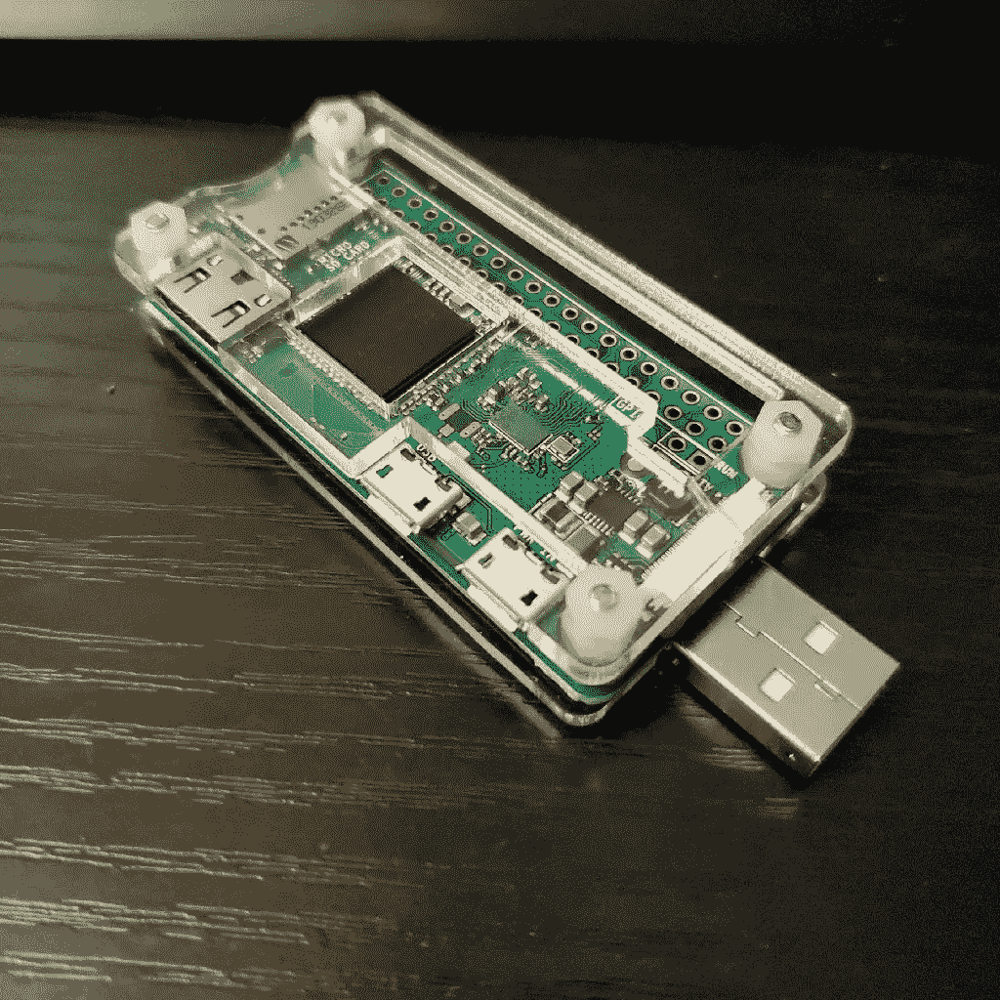

# 树莓派零密码小偷

> 原文：<https://medium.com/codex/raspberry-pi-zero-password-thief-cb2bea8d6dc0?source=collection_archive---------0----------------------->

另一个用于物理渗透测试的 Pi Zero W 黑客工具



你为什么不想把一台小电脑插到一台大电脑上呢？

# 要求

这个项目需要一个 Raspberry Pi Zero W，一个 [USB-A 附加板](https://www.amazon.com/gp/product/B07BK2BR6C/)，一个 Micro SD 卡。你还需要一台电脑来配置 SD 卡和 Pi。这不是一个昂贵的项目，总成本约为 35 美元，取决于你从哪里获得你的零件。

```
**The article is**…
```