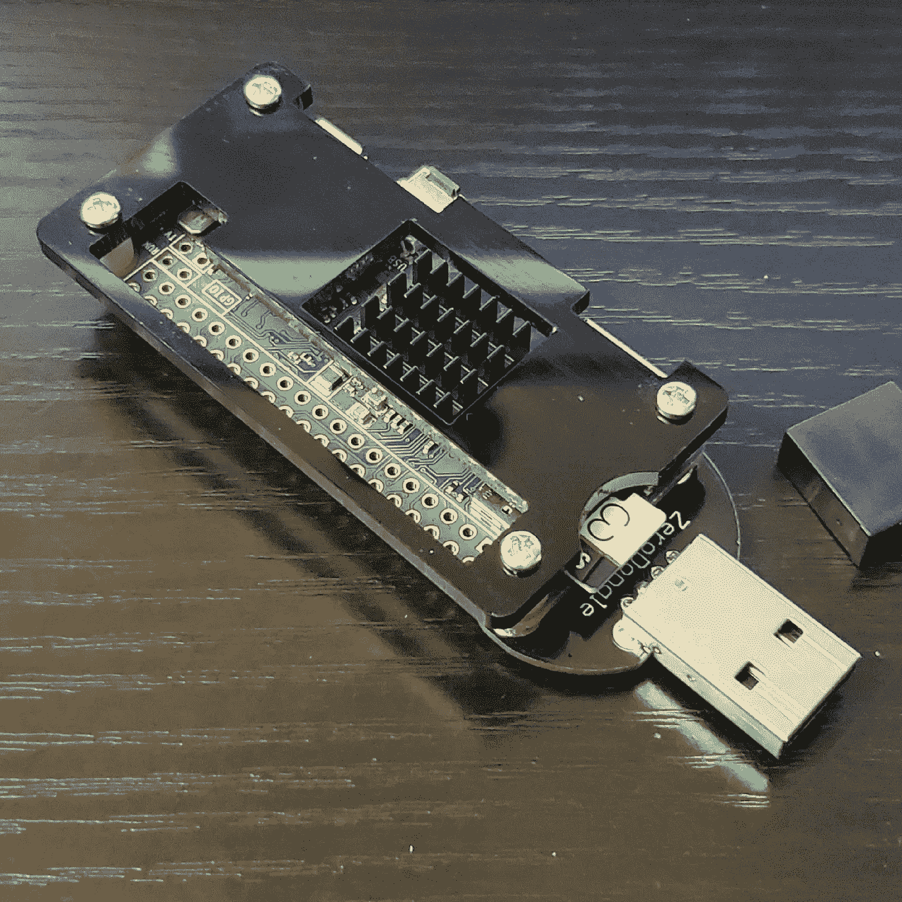

# Raspberry Pi Zero W USB Tor 调制解调器

> 原文：<https://medium.com/codex/raspberry-pi-zero-w-usb-tor-modem-2dc202819ca?source=collection_archive---------2----------------------->

## 一个插入式 USB 以太网小工具，通过 Tor 路由所有流量

树莓 Pi Zero W 带 Zero 加密狗

# 你为什么要这么做？

因为 Pi Zero W 可以用作以太网小工具，所以使用 Tor 和 iptables，您可以创建一个充当 Tor 调制解调器的设备。通过适配器路由的所有流量将通过 tor 网络路由。这是一个非常方便的…