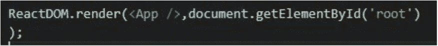
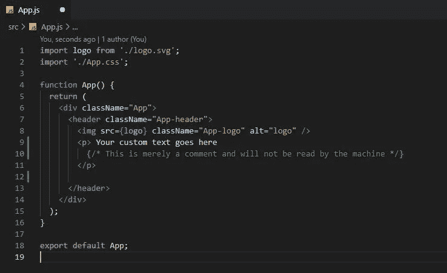
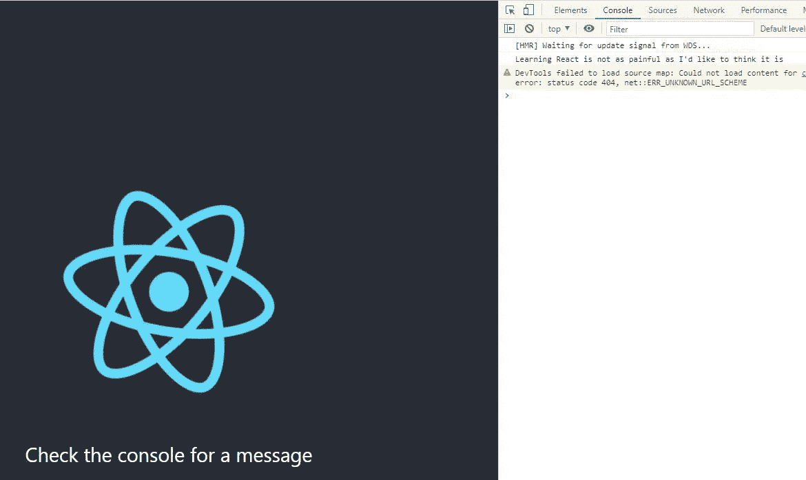

# React 基础知识:组件是怎么回事？

> 原文：<https://medium.com/codex/react-basics-components-430a7cbf1390?source=collection_archive---------19----------------------->

## 如何在 React 中构建自己的定制组件

Joshua Aragon 在 [Unsplash](https://unsplash.com?utm_source=medium&utm_medium=referral) 上的照片

在上一个教程中，我们简要地看了一下`create-react-app` starter 项目，并做了一些非常基本的定制。今天，我们将进一步研究该项目代码，以了解 React 应用程序中组件的角色。让我们开始吧。

## 那么…什么是组件呢？

组件是独立的、可重用的代码片段，它们独立工作，通过一个`render`函数返回一些 React 元素。组件可以是“基于类的”或“基于函数的”。本文将主要讨论后者。

一个好的经验法则是确保每个组件处理一个特定的任务，例如打印列表或获取用户输入。命名 React 组件时，通常每个单词都以大写字母开头，如下所示:

`MyReactComponent`

[杰克逊·苏](https://unsplash.com/@jacksonsophat?utm_source=medium&utm_medium=referral)在 [Unsplash](https://unsplash.com?utm_source=medium&utm_medium=referral) 上的照片

## 渲染组件

让我们打开上一篇文章中的示例项目，看看如何在我们的代码中使用定制组件。在项目文件夹中，导航到存储在`src`文件夹中的`index.js`文件。

`C:\Programming\my-react-app\src\index.js`

这里的语法对几个例外很熟悉。在第七行，您将看到整个应用程序中最重要的一段代码。注意我们定制的`<App />`组件的语法。

几乎在每个 React 应用程序中都可以看到的一行代码

那么，这里发生了什么？

`*ReactDOM*`是我们的 React 应用中使用的一个包，用于[操作 DOM](https://developer.mozilla.org/en-US/docs/Web/API/Document_Object_Model/Introduction) 。`Render`是`ReactDOM`的一个内置方法，它允许我们向 DOM 呈现一个组件。

`document.getElementbyID`直接取自 HTML，用于指定我们要将应用程序组件的内容呈现到的容器，在本例中为`root`。

在尖括号内，我们看到我们的自定义应用程序组件被调用。请注意，这是 React 中调用所有自定义组件的方式，尽管并非所有组件标签都是自结束的。

[安迪李](https://unsplash.com/@andasta?utm_source=medium&utm_medium=referral)在 [Unsplash](https://unsplash.com?utm_source=medium&utm_medium=referral) 上的照片

## 进口和出口

在 index.js 文件的顶部，您会看到下面的 import 语句。这允许我们使用 index.js 中的自定义 App 元素。我们希望使用的所有自定义组件必须在我们希望使用它们的每个文件的开头导入。

`import App from ‘./App’;`

正如组件需要被导入到我们希望使用它们的文件中一样，所有组件都需要一个导出语句，以便它们可以被项目中的其他文件使用。标准导出如下，尽管可能会有一些变化:

`export default app;`

## `s in` 到底是个什么分量？

如前所述，我们今天将主要关注基于功能的组件。在每个组件中，您将有一个返回一些 JSX 的函数，这是 React 的 HTML 修改版本。

组件可以简单也可以复杂，但它们必须返回一个周围的元素。在我们的例子中，这个元素是`
`标签。

离我们离开的地方很近的地方

上面我们看到了一个最基本的 React 组件。这是我们的应用程序函数的声明，它返回一些 JSX。我们在这里看到的代码除了一些语法上的不同外，几乎与 HTML 没有什么区别。

在第八行的`img`标记中，您会注意到两个基本的区别。首先，React 不使用`class`关键字进行样式化，而是使用`className`属性。

其次，我们的`src`值指向一个变量，我们用花括号`{}`将其命名为变量。随着我们对 React 的深入研究，您将会非常熟悉这种语法。

我们还可以使用花括号来实现我们希望在组件中运行的任何 Javascript。现在让我们通过在结束标记`
`后添加以下内容来尝试一下。

点击代码编辑器上的 save，按下 Chrome 上的`[Ctrl+Shift+I]`打开控制台。导航到控制台选项卡，您的自定义消息应该在那里等待。

证据在潘趣酒里

## 摘要

今天我们学习了组件是 React 项目的基本构建块。理想情况下，每个组件都应该有一个特定的用途，并且可以返回一个类或一个函数。

导入和导出语句允许我们的组件在项目文件之间移动，我们使用尖括号来调用它们(`<MyReactComponent />`)。

组件返回的所有内容都必须包装在一个周围的元素中，这个元素可以是从`
`标签到`
`标签的任何内容，甚至是另一个定制组件。

我们刚刚开始了解 React 的功能有多强大，所以请务必尝试并创建一些您自己的定制组件，以掌握我们今天在这里探索的新约定。在下一期中，我们将学习如何使用`props`的魔力在组件之间传递数据。

在那之前，编码快乐！