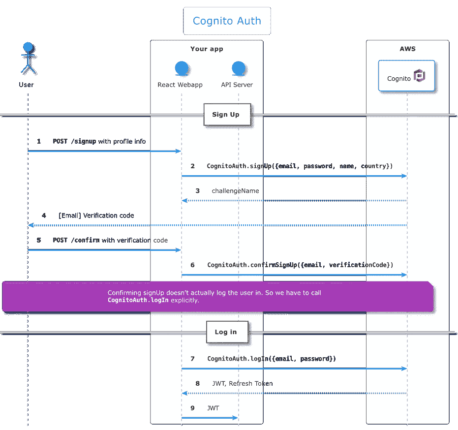

# 对…作出反应

> 原文：<https://medium.com/codex/react-cognito-f8bc43ccf404?source=collection_archive---------6----------------------->


在[x ages](https://www.xtages.com)，我们使用 [Amazon Cognito](https://aws.amazon.com/cognito/) 来管理我们的用户及其认证。

Cognito 收集用户的属性，它可以为 web 和移动应用程序实现简单、安全的用户身份验证、授权和用户管理。

在本节中，我们将从 5000 英尺的高度来看 Cognito 如何与 web 应用程序集成。



Cognito 要求用户验证他们的电子邮件或电话号码，以启用密码恢复流程。验证工作的方式是通过向用户的电子邮件或电话号码发送一个数字代码(使用 SMS ),然后用户应用程序调用`CognitoAuth.confirmSignUp`,如上图的步骤 6。

接下来，我们将了解如何:

*   使用`create-react-app`创建一个新的 React webapp
*   创建认证的和未认证的`Route`
*   使用 [Terraform](https://www.terraform.io/) 提供认知用户池

# 与 React 集成

我们可以使用 Cognito 来保护 React 应用程序的某些部分，确保只有经过身份验证的用户才能访问它们。

> 注意:您应该确保您的服务器端 API 正在适当地检查向它发出的请求是否经过了正确的身份验证和授权。有了 Cognito，当用户认证时，我们得到一个 [JWT](https://jwt.io/) 令牌，这个令牌应该传递给你的服务器或 API。在本文中，我们不会深入讨论适当的服务器 API 实现的细节，因为它高度依赖于您的服务器所使用的技术。

# 设置

我们将从使用`[create-react-app](https://create-react-app.dev)`创建一个新的 React web 应用程序开始:

```
npx create-react-app demo-app --template typescript
```

# `useAuth`钩子

这个集成的核心部分是基于[https://usehooks.com/useAuth/](https://usehooks.com/useAuth/)的`useAuth`钩子，它适应于使用 Cognito 的 API。

在安装了亚马逊的 Cognito API 包和`use-async-effect`包之后

```
npm install --save @aws-amplify/auth use-async-effect
```

我们将继续在`src/hooks/`下为我们的`useAuth`钩子创建一个新文件，我们将其命名为`useAuth.tsx`。

接下来，我们将使用 AWS 区域、co gno 用户池 Id 和 Cognito Web 客户端 Id 来配置 Cognito Auth 对象。您可以看到这些值包含在[环境变量](https://create-react-app.dev/docs/adding-custom-environment-variables)中，因此可以根据应用的运行环境(本地开发、持续集成、试运行、生产等)轻松配置我们的应用。).

现在让我们为钩子的 API 创建一些类型:

类型拥有我们期望用户拥有的属性。`User.country`属性是[认知定制属性](https://docs.aws.amazon.com/cognito/latest/developerguide/user-pool-settings-attributes.html#user-pool-settings-custom-attributes)的一个例子。

`Credentials`型将用于我们的`logIn`和`signUp`功能。

值得注意的是`CognitoUserWithChallenge`有点像我们需要的拐杖，让 Typescript 编译器高兴。由`CognitoAuth.signIn`函数返回的对象(来自`amazon-cognito-identity-js`包)可以包含一个名为`challengeName`的属性，但是在`CognitoAuth.signIn`的类型中，这个属性不存在，因此我们必须在代码中补充这个类型。`challengeName`属性用于表示用户需要响应一个挑战来验证他们的身份。例如，当用户注册时，他们会通过电子邮件收到一个代码，他们必须输入该代码作为质询响应。有关更多信息，请参见[https://docs . AWS . Amazon . com/cogn ITO/latest/developer guide/Amazon-cogn ITO-user-pools-authentic ation-flow . html](https://docs.aws.amazon.com/cognito/latest/developerguide/amazon-cognito-user-pools-authentication-flow.html)

最后，我们将讨论钩子的实现。实际上，我们有一个私有钩子`useProvideAuth`和一个，所有的钩子都是通过公共钩子`useAuth`公开的。

首先，我们将剖析拥有大部分代码的`useProvideAuth`私有钩子:

`useProvideAuth`钩子有三个公共函数:

*   `logIn`:包装`CognitoAuth.signIn`，如果调用结果有一个`challengeName`返回，否则转换返回的`CognitoUser`设置`user`状态，同时将`authInProgress`状态切换为假。
*   `logOut`:将`user`状态设置为`null`，调用`CognitoAuth.signOut`使用户令牌失效。
*   `signUp`:使用所需的用户属性和密码调用`CognitoAuth.signUp`。

关于这个钩子的另外几个有趣的地方是使用了`useAsyncEffect`(来自`use-async-effect`包)，它具有与普通`useEffect`相同的语义，但是允许使用`async`函数。我们需要这个钩子，因为我们在渲染时确定用户是否通过调用`getUser`函数登录，这个函数本身就是`async`。我们还通过 AWS `Hub`类设置了一个监听器，它将通知我们已经发生的不同的与 auth 相关的事件。

既然我们的钩子已经准备好了，我们将继续设置一个`Context`,这样我们的应用程序就可以利用这个基础设施:

在上面的代码片段中，我们创建了一个类型为`Auth | null`的`Context`，其中`Auth`是`ReturnType<typeof useProvideAuth>`，我们还创建了一个小组件`<AuthProvider>`，它将`Auth`的一个实例传递给`<AuthContext.Provider>`。最后`useAuth`包裹`useContext(AuthContext)`并确保返回的`Auth`不是`null`。

# 使用

在授权基础设施就位后，我们现在需要开始在我们的应用程序中使用，第一步是将我们的组件层次结构包装在一个`<AuthProvider>`中，就像这样:

您会注意到上面代码片段中的几点:

*   我们使用`react-router-dom`进行导航。
*   我们已经将我们的应用程序包装在刚刚创建的`<AuthProvider>`中，这意味着`useAuth`钩子现在可用于我们所有的组件。
*   我们有几个不属于`react-router-dom`的公用线路组件，即`<UnauthenticatedOnlyRoute>`和`<AuthenticatedRoute>`。

# 安全路由

下面，`<AuthenticatedRoute>`使用`useAuth`来确定身份验证是否正在进行(如果是，显示一个空页面)，如果我们有一个经过身份验证的用户，那么我们将路由到指定的组件，如果我们没有经过身份验证的用户，那么我们将重定向到`/login`页面，将`location`保留在状态中，这样一旦用户成功登录，我们就可以重定向到它。

基本上是`<AuthenticatedRoute>`的镜像，因为如果用户没有通过**认证**，它将只呈现`Route`，否则重定向到`/`。

# 登录页面

下面是一个非常简单的登录页面，仅用于说明目的，使用了`useAuth`钩子，尽管您可能希望使用一个适当的 react 表单库，也可能使用某种 UI 库。

# 使用 Terraform 提供认知

以下 Terraform 模块用于提供这篇博文中使用的 Cognito [用户池](https://docs.aws.amazon.com/cognito/latest/developerguide/cognito-user-identity-pools.html):

本模块的一些有趣部分:

*   第 24–34 行:`password_policy`块是我们配置有效密码要求的地方。为了获得更好的 UX，请确保您的注册页面表单使用相同的要求在客户端验证用户的密码。你也可以利用像`react-password-strength-bar`这样的包来提醒用户创建强密码。
*   第 37–73 行:`schema`块是我们定义用户概要文件属性的地方。自定义属性必须在其名称中使用`custom:`前缀。
*   第 80 行:`username_attributes`数组表明我们使用`email`属性作为用户的用户名。

`aws_cognito_user_pool_client`资源为我们的用户池声明了一个 web 客户端，也就是我们的 React 应用程序。这是我们为 Cognito 在第 104-111 行返回的令牌配置有效期的地方。第 119 行，`generate_secret = false`确保不为这个客户机生成秘密，这是必要的，因为浏览器 Cognito js 库不支持秘密。

第 123–134 行表示哪些属性(如用户池本身所定义的)可由 web 客户端读取和/或写入。

在用户认证和管理方面，AWS Cognito 是一个很好的选择。当你已经购买了 AWS 生态系统时，它特别有用，而且比其他一些替代产品更便宜。

集成 React 和 Cognito 并不太难，但是 Cognito 的 Javascript/Typescript 包的参考文档缺乏一些深入的细节，他们也有几个看起来重叠的包(`amplify`、`@aws-amplify/auth`和`amazon-cognito-identity-js`)，这使得很难准确指出哪一个是 Cognito 工作所必需的。当没有必要将所有代码添加到应用程序中时，亚马逊也倾向于将 Amplify 作为 auth 解决方案的一个整体。

**在**[**x ages**](https://www.xtages.com)**我们正在构建一个用于 CI/CD 和应用托管的一体化解决方案，所有这些都只需最少的配置，无需管理基础架构。我们最近推出了一个免费的** [**计划**](https://www.xtages.com/pricing) **(不需要信用卡)，让你更容易上手。**

*原载于 2021 年 11 月 6 日 https://www.xtages.com**的* [*。*](https://www.xtages.com/blog/posts/react-and-cognito/)