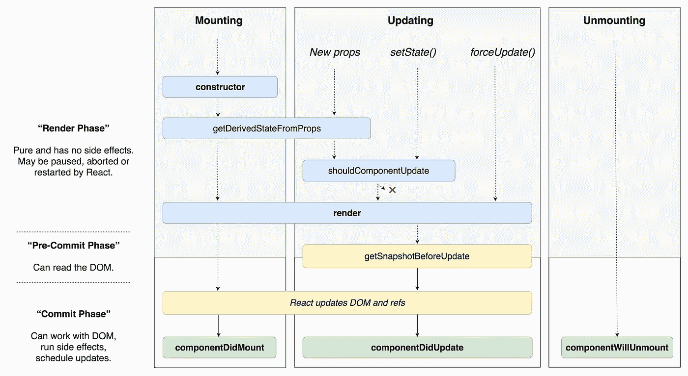

# 从新手的角度反应——使用效果

> 原文：<https://medium.com/codex/react-from-newbie-perspective-useeffect-635ae3941617?source=collection_archive---------7----------------------->

## 作为 React 的新手，我如何看待 useEffect？

克拉克·蒂布斯在 [Unsplash](https://unsplash.com?utm_source=medium&utm_medium=referral) 上拍摄的照片

毫无疑问，第二重要和有用的反应钩子是 useEffect。效果挂钩是在函数组件中执行副作用的一种方式。正如我在上一篇文章中提到的，作为一个新手，我最近开始学习 JavaScript 和 React，所以为了理解 Hooks 如何帮助和改善程序员的生活，我必须尝试理解它以前是如何工作的。在这种情况下特别说明 React 类的生命周期是如何工作的，因为效果钩子结合了 *componentDidMount* ， *componentDidUpdate* 和 *componentWillUnmount* 。以及清理和不清理的副作用是如何起作用的。

丹·阿布拉莫夫([https://twitter.com/dan_abramov/status/981712092611989509](https://twitter.com/dan_abramov/status/981712092611989509))的反应生命周期图

# 效果挂钩—一次完成更多动作

效果挂钩将 3 种生命周期方法合二为一。但是它是如何做到这一点的呢？

# 安装和卸载组件

卡斯帕·卡米尔·鲁宾在 [Unsplash](https://unsplash.com?utm_source=medium&utm_medium=referral) 上拍摄的照片

## 增加

渲染完成时，运行 useEffect 的简单版本。React 在 DOM 更新后执行 useEffect 中的代码，并在每次呈现组件时执行它。如果我们需要在组件卸载后清理，我们可以添加函数来执行这个清理作为返回值。

## 卸载

与类中的 componentWillUnmount 相反，React Effect 挂钩使用返回的函数，该函数在组件被卸载时执行。它不一定要被命名为函数，但它甚至可以是一个箭头函数。不管怎样，这个函数清理了正在运行的应用程序，使我们避免了内存泄漏错误和许多令人头疼的问题。在 React Docs 中，这一部分非常简单，我找到了马丁·马托关于 dev . to([https://dev . to/otamnitram/React-use effect-clean up-how-and-when-to-use-it-2hbm](https://dev.to/otamnitram/react-useeffect-cleanup-how-and-when-to-use-it-2hbm))的一篇非常简单的文章，其中有一个例子:

我们可以看到，添加的变量“mounted”提供了有关组件实际状态的信息，如果组件被卸载，它将运行清理功能，将此变量设置为“false”并停止执行提供的编码。

# 更新组件

正如我之前写的，useEffect 在每次渲染时都会执行。它会导致渲染循环，或者在更好的情况下，在不需要的时候执行 useEffect，浪费计算资源。这正是第二个可选参数 useEffect 出现的情况。第二个参数是因变量和函数的数组。要运行 useEffect just ones，您可以将此数组留空。在其他情况下，我们可以指定(或者 ESLint 将强制使用)变量或函数，这些变量或函数的变化将触发再次执行 useEffect。但 useEffect 仅在这些值被更改时运行，因此它将比每次渲染运行得少。

# 结论

当我们理解 React 如何与组件生命周期一起工作时，React Effect Hook 就成了编码者的最大朋友之一。与 React 组件类生命周期方法相比，它的最大优势是统一性、简单性和不重复代码。而在课堂上，我们需要三个方法，用效果钩子，我们只有一个。而这也是 Hooks 的主要目标之一，让我们的生活更轻松。