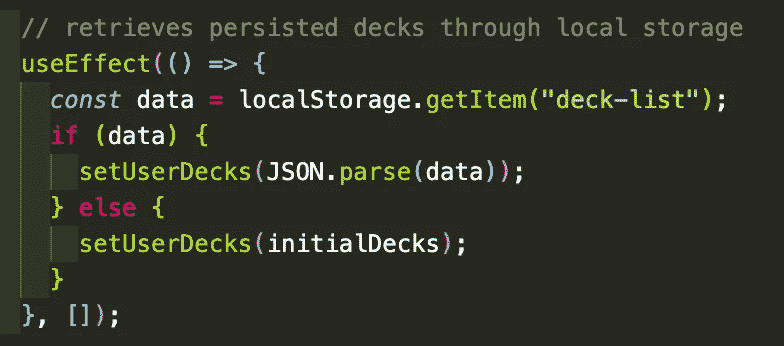

# React Hack:使用本地存储保存数据

> 原文：<https://medium.com/codex/react-hack-persisting-data-w-localstorage-237d02efc5e9?source=collection_archive---------10----------------------->

今天我要告诉你一个超级简单的技巧，它将有助于改善你的应用程序用户体验，以及你的开发体验…

很可能大多数人都有过使用应用程序的经历，无论他们是意外刷新，还是因为连接中断而导致刷新，他们都会丢失刚刚查看或输入的数据。很可能大多数 React 开发人员都遇到过这样的情况(或大量情况),他们在用户测试某个应用程序状态时，由于热重新加载或浏览器刷新而损失了几分钟时间。

仅使用两个简单的 useEffect 挂钩(或 componentDidMount 生命周期方法)，我们实际上可以将应用程序状态存储在 LocalStorage 中，并在刷新时将其重新加载到应用程序中。这个简单的任务将使您不必重复相同的用户输入 100 次来测试结果…并且还将使用户可以刷新他们的浏览器而不会丢失他们最近的输入。

最棒的是它真的很简单；它所需要的只是一个组件上的 2 个 useEffect 钩子；一个从 LocalStorage 获取数据并将其设置为 state，另一个将状态推入 LocalStorage。

这是它的工作原理——这两个 useEffect 挂钩的顺序很重要。

假设我们正在构建一个抽认卡应用程序，用户可以在其中创建卡片组，并在这些卡片组中创建卡片。在应用程序本身中，卡片组通过一个 useState 钩子存储，其中数据存储为 user deck，更新 user deck 的函数是 setUserDecks。在这个例子中，应用程序用一个名为 initialDecks 的变量初始化。

1.  第一个 useEffect 钩子将从 LocalStorage 中检索 userDecks 数据:

2.第二个 useEffect 钩子将把 userDecks 状态推入 LocalStorage:

这里要注意一些事情:当设置或从 LocalStorage 中检索时，我们使用一个字符串样式变量，在这个例子中“deck-list”是我们将状态推入 LocalStorage 的方式，因此我们也需要使用这个相同的变量从 LocalStorage 中拉出…并且我们还必须在将它推入 LocalStorage 时使用 JSON.stringify(data ),因此我们必须在将它拉出 LocalStorage 时使用 JSON.parse(data ),并将其设置为我们的应用程序状态。这个例子看起来很简单，但是功能齐全。应用程序现在存储用户面板状态，并自动存储用户所做的任何更改。如果您刷新页面，甚至关闭选项卡并重新打开它，状态会保持不变。这意味着用户现在可以创建卡片组，并在这些卡片组中创建卡片…然后离开应用程序，稍后再回来查看相同的数据！这真的是一个神奇的工具，而且实现起来非常简单。

解决一个主要问题:这不应该取代后端..显然，利用后端是最佳实践，这样用户可以在不同的设备上登录和退出您的应用程序，并查看与该用户相关的数据，而不仅仅是他们设备上的会话。但是，这确实为优化您的应用程序提供了可能性，并且通过将应用程序状态存储在 LocalStorage 中并向后端发送更多数据以便一次保存，减少了对后端的保存调用。

干杯，我希望你喜欢这个反应黑客..我很快会回来的！