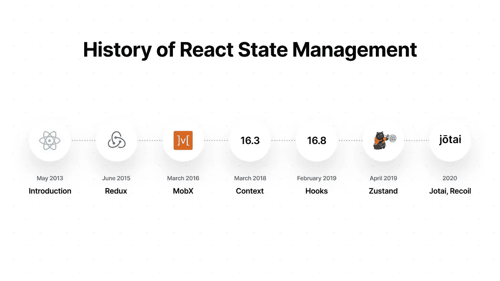

# react Hooks vs svelite——我为什么选择 svelite？

> 原文：<https://medium.com/codex/react-hooks-vs-svelte-why-i-chose-svelte-20658c62843f?source=collection_archive---------9----------------------->

我在 ZoomRx 工作，过去 10 年一直在开发 web 应用程序。ZoomRx 是一家战略医疗咨询公司。我所有的前端同事都精通 Javascript 基础知识，因此我们有能力经常采用和试验新的框架。我体验了很多 javascript 库/框架，特别是 Jquery，Ember，Mithril，React 和 React with Hooks。我喜欢这些框架中的一些方面，但我并不满足，也从未停止寻找替代方案。我只是在寻找一个开发人员友好和高性能的框架。我甚至有了构建自己框架的想法。然后在 2019 年年中，我偶然发现了 Svelte，并被 [Rich Harris 的演讲](https://youtu.be/AdNJ3fydeao)所打动(尽管现在已经是老演讲了，但还是值得一试)。Svelte 通过编译器进行反应，所有繁重的工作都由编译器完成。

React Hooks vs Svelte，关于它还有很多要讨论的，但是在这篇文章中，我将给出我对框架的两个重要方面的看法，更好的开发者体验和更好的用户体验。

反应 vs 苗条

## **更好的开发者体验**

*   ***学习曲线***

由于 Svelte 尽量遵循 web 标准，所以学习 Svelte 非常容易。作为一名 javascript 开发人员，只需花 [5 分钟就能理解](https://youtu.be/rv3Yq-B8qp4)的基本思想，几个小时就能掌握所有概念。我是那种好奇的家伙，总是在使用底层框架代码之前跳入其中。这让我在编码时更舒服。于是我分叉出苗条的编译器代码，用 TanLiHau 的[编译器](https://lihautan.com/the-svelte-compiler-handbook/) [手册](https://lihautan.com/compile-svelte-in-your-head-part-2/)了解编译器架构。整个过程花了一个周末让自己舒服。两天后，我做了一些概念验证，比如计数器、待办事项列表，构建了一个类似 trello 的应用程序和一个用于 [flatpickr](https://flatpickr.js.org/) 的包装器。

尽管我非常了解 React 类组件，但还是花了将近一周的时间来理解钩子的所有细微差别，比如为什么、在哪里以及如何有效地使用它。这篇[博客](https://the-guild.dev/blog/react-hooks-system)将帮助你[了解关于底层钩子系统的更多信息。](https://eliav2.github.io/how-react-hooks-work/)

显然，对我来说，苗条的学习曲线比 React Hooks 要小得多。有了 Svelte，任何 Javascript 开发人员都可以学习组件状态的基本原理，而不会被太多的细节所迷惑。此外，与 Redux/ React 的上下文 API/useContext /Zustand 或 Jotai 等相比，Svelte store 更容易学习和使用。,

*   ***可读性和维护***

我们在产品中使用了很多框架。所以可读性和清晰性对我来说比任何新奇的功能都重要。

> “任何傻瓜都能写出计算机能理解的代码。优秀的程序员会写出人类能理解的代码。”― **马丁·福勒**

[React](https://codesandbox.io/s/react-hook-hell-g6kos?file=/src/App.js:0-1700) Hook —捕获鼠标坐标的示例代码

[细长的](https://svelte.dev/tutorial/inline-handlers) —捕获鼠标坐标的示例代码

> “让我们忘记我们需要写多少行代码。假设您刚刚很好地了解 Javascript，您正在阅读如何在移动过程中捕获鼠标坐标。哪个代码看起来更像您实际需要的？”

从上面可以看出，Svelte 只用几行代码就做了很多事情。任何有一些 HTML/CSS/JS 基础知识的人都更容易阅读和理解。它完全删除了所有不必要的样板文件，如 useState、useRef、useCallback、useMemo 等。，从我们的应用逻辑来说。编写更少的代码将有助于我们减少维护，有更多的时间来开发新功能。在 Rich Harris 的博客上阅读更多关于可读性的内容。附带说明:如果用 React 类组件编写同一个示例，它将比用 Hooks 编写的示例可读性更好。

*   ***外部库集成***

React 使用虚拟 DOM，所以我们需要一个特殊的包装器来处理外部库组件的状态。但是，React 社区非常庞大，所以您可以很容易地找到包装器或等效的 React 实现。另一方面，Svelte 处理真正的 DOM。这使得做一些 CSS 动画和 DOM 操作变得简单和容易。您可以直接使用任何 DOM 库，也可以自己编写一个简单的包装器。

## **更好的用户体验**

*   Svelte 像外科手术一样更新 DOM，而不依赖于中间解释器或任何复杂的协调算法。经常在 UI 和 [JS 速度](https://krausest.github.io/js-framework-benchmark/current.html)上击败其他框架。它越来越多地用于各种流行的和牵引重网站的生产。
*   React 足够快，可以为大多数用例提供良好的用户体验，但当我们在渲染方面有性能需求时，尤其是当我们围绕数据可视化工作时，这是不够的。[虚拟 DOM 是一个纯粹的开销。](https://svelte.dev/blog/virtual-dom-is-pure-overhead)差分算法进化的效率有多高并不重要；它总是会耗尽客户端的硬件资源。

## **苗条就没有一点瑕疵吗？**

*   组件属性的语法对我来说有点奇怪。
*   Svelte 不会监听引用更新和数组突变，开发人员需要积极寻找并确保数组被重新分配。
*   与 Svelte 相比，React 有一个庞大的社区，你可以很容易地找到任何问题的解决方案。作为一名 React 开发人员，我也非常喜欢苗条的身材。然而，我只发现 Svelte 在轻量级的简单项目中有用。我喜欢苗条的 API 和开箱即用的反应性，但尽管它有很多优点，但与反应性相比，苗条的周围的生态系统是缺乏的。为了加快一个更复杂的网络应用程序的开发，我们需要像[svelet kit](https://kit.svelte.dev/)、svelet-query、svelet-yup 等工具/库。，但是这些还不够成熟。希望随着越来越多的人开始使用 Svelte，它的生态系统会变得更好。

## **结论**

1.  如果有 Javascript 知识和其他框架的经验，可以很快适应 Svelte。与 React 或许多其他框架相比，用 [Svelte 编码感觉毫不费力](https://www.htmlallthethings.com/podcasts/svelte-is-here-to-stay)，开发时间也非常快。
2.  根据我的经验，我发现开发人员总是很难从其他框架切换到 React Hooks。相信我，当 React hooks 推出时，我是它的忠实粉丝。我确实喜欢函数组件和钩子的想法，但是我肯定不喜欢在一个更大的项目中使用它们。
3.  看下面的历史，[反应](https://twitter.com/Rich_Harris/status/1421544403882160136) [不断进化](https://mobile.twitter.com/leeerob/status/1353523847937536000)但是在[错误的方向](https://mobile.twitter.com/dan_abramov/status/1191495127358935040)上，斯韦特只是选择了正确的道路。

