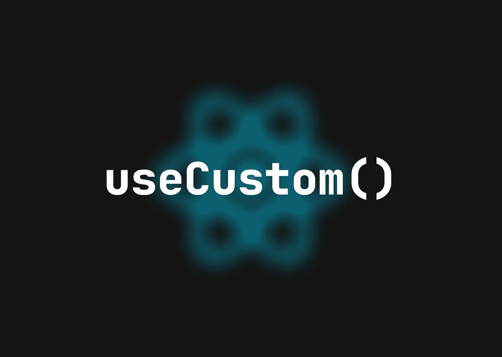

# React:如何创建和使用定制钩子

> 原文：<https://medium.com/codex/react-how-to-create-and-use-custom-hooks-aab531e5ddf9?source=collection_archive---------9----------------------->

钩子是 React 中执行各种任务的内置函数。例如，`useState()`挂钩用于存储和设置组件中的值，而`useEffect()`挂钩会在依赖数组中的任何值发生变化时导致组件重新呈现，等等。



不包含复杂功能的简单 spa 不需要后端服务器。例如，如果你设计了一个应用程序来跟踪用户的工资和支出，并计算他们的税收，React 应用程序本身可以为你计算。

```
💡 *SPA = Single Page Application*
```

但是，因为 React 主要是一个前端框架，任何后端逻辑似乎都不适合它的架构，显然您应该避免代码重复之类的代码味道——这就是定制钩子的用武之地。

在你的应用中使用定制钩子的**主要原因**是当你需要**开发带有生成**有价值数据**的逻辑的模块**时。与实际产品密切相关的逻辑**的输出在这里被称为“有价值的”。**

例如，如果您从数据数组中过滤出一些元素，您可以在组件标题中使用它:

```
❗️ **THIS IS NOT PRODUCT LOGIC, THIS IS SIMPLE UI LOGIC**const Component = () => { const data = fetched data...
  const filteredData = data.filter(item => item.id) return(
    <div>
      {filteredData.map(item => (
        <p>{item.name}</p>
      ))}
    </div>
  )
}export default Component
```

但是，如果您需要获取某些用户数据，比如收入和支出，并将其转换为税收数据，就像上面的例子一样，这将是产品逻辑，您需要使用自定义挂钩。

首先，把你的定制钩子放在你的应用程序的架构中。对我来说，理想的位置是:

```
src/hooks
```

现在创建您的第一个自定义钩子文件，它将为您计算税款:

```
src/hooks/useTax.ts
```

当然，我们将在这里使用 TypeScript。你的定制钩子将看起来像任何其他函数 React 文件，除了它不返回 JSX，它将返回数据。

```
💡 *JSX = JavaScript XML, it allows us to write HTML in React*
```

下一步是构建`useTax()`钩子的基本框架:

```
✅ **THIS WILL BE YOUR PRODUCT LOGIC, SHOULD BE IN THE CUSTOM HOOK**const useTax = () => {
  type Taxes = {
    federal: number,
    medicare: number,
    socialSecurity: number
  }
  const [result, setResult] = useState<Taxes | null>(null)
  return result
}export default useTax
```

现在，我们有了一个全功能的定制钩子。我们可以在任何想用的地方导入和使用，但是没有数据和逻辑是没有用的，所以我们来补充一些数据和计算:

```
✅ **THIS IS YOUR FINAL PRODUCT LOGIC, SHOULD BE IN THE CUSTOM HOOK**const useTax = () => {
  type Taxes = {
    federal: number,
    medicare: number,
    socialSecurity: number
  }
  const [result, setResult] = useState<Taxes | null>(null) const incomes = fetch incomes...
  const expenses = fetch expenses... useEffect(() => {
    if (!incomes || !expenses) return setResult(null)
    const federal = calculate federal tax...
    const medicare = calculate medicare tax...
    const socialSecurity = calculate social security tax...
    setResult({ federal, medicare, socialSecurity })
  }, [incomes, expenses]) return result
}export default useTax
```

这就是全部了。您可以在任何组件中单独使用导入的钩子，因为它负责获取数据，计算不同的值，并用`useEffect()`更新它们。

```
✅ **NONE OF THE PRODUCT LOGIC IMPLEMENTED IN THE UI COMPONENT**import useTax from "../hooks/useTax"const Component = () => { const taxes = useTax() return(
    <div>
      <p>Federal tax: {taxes.federal} USD</p>
      <p>Medicare tax: {taxes.medicare} USD</p>
      <p>Social security tax: {taxes.socialSecurity} USD</p>
    </div>
  )}export default Component
```

👋我希望这篇文章对你寻找新的学习材料有用。感谢您花时间阅读这篇文章！

你可以请我喝杯咖啡来支持我:https://www.buymeacoffee.com/daanworks

📯订阅我的电子邮件列表，如果你想在未来读到更多这样的故事，请在这里或在 Twitter 上关注我！