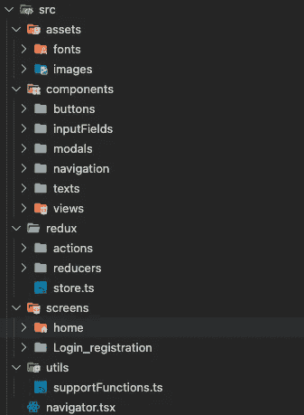

# React 本机启动项目

> 原文：<https://medium.com/codex/react-native-starter-project-a20eafd552be?source=collection_archive---------7----------------------->

## 如何设置一个初学者项目的快速指南，这样您就不必安装和设置您总是需要的库。

> 你可以在 [GitHub](https://github.com/trta2352/starter_project/tree/master) 上找到这个项目。


这篇文章正在编写中，不久将会更新。目前，我们设置了:

1.  完成:用 react-native init 初始化项目，
2.  完成:添加类型脚本支持
3.  完成:创建基本的项目结构并添加 React 导航支持
4.  TODO: Redux 支持
5.  完成:SVG 图像支持
6.  完成:安全存储支持

这听起来熟悉吗？你有一个很好的想法，你想测试一下。经过一段时间的编程，你会意识到在你有基本的设置之前要花多少时间。你失去了兴趣，决定改天继续做这个项目。

如果你和我一样，这种情况已经发生在你身上不止一次了。我决定适可而止，是时候彻底解决这个问题了。让我们创建一个启动项目，它拥有你需要的一切，可以让你马上开始开发你的想法。那么我们需要什么？我们需要某种导航和状态管理。我们也补充一下。svg 图片支持、类型脚本和加密存储，用于保护登录令牌。

## 1.使用 react-native init <<project name="">来初始化我们的项目</project>

这里没有必要重新发明轮子，让我们使用 react-native init 来初始化我们的项目。它创建了一个基本的工作应用程序，只有一个主屏幕。

```
react-native init starter_project
```


图 1:运行 react-native init 后的项目文件结构。

## 2.安装 Typescript 和 React 导航

项目初始化后不需要安装 Typescript。你可以使用 react-native 提供的 Typescript 模板(更多信息请点击[这里](https://github.com/react-native-community/react-native-template-typescript))。这样做的问题在于，你总是要检查模板的版本是否是最新的，而且它会添加我们不需要的代码。所以最好自己加 Typescript。这可以通过三个步骤轻松实现。

1.  在终端(或 cmd)中导航到您的项目，并运行以下命令:

```
npm install -D typescript @types/jest @types/react @types/react-native @types/react-test-renderer
```

2.添加 TypeScript 配置文件。在项目的根目录下创建一个 **tsconfig.json** :

```
{
  "compilerOptions": {
    "allowJs": true,
    "allowSyntheticDefaultImports": true,
    "esModuleInterop": true,
    "isolatedModules": true,
    "jsx": "react",
    "lib": ["es6"],
    "moduleResolution": "node",
    "noEmit": true,
    "strict": true,
    "target": "esnext"
  },
  "exclude": [
    "node_modules",
    "babel.config.js",
    "metro.config.js",
    "jest.config.js"
  ]
}
```

3.创建一个 **jest.config.js** 文件来配置 jest 使用 TypeScript

```
module.exports = {
  preset: 'react-native',
  moduleFileExtensions: ['ts', 'tsx', 'js', 'jsx', 'json', 'node']
};
```

你可以在官方 [React 原生网站](https://reactnative.dev/docs/typescript)上找到对这些步骤更深入的解释。

## 3.创建基本项目结构并添加 React 导航

React 原生项目应该如何构建是一个自其首次发布以来就一直存在的热门话题。人们对采用通用架构模式有些兴趣，比如 MVC(模型—视图—控制器)，这种模式最终没有多大意义，并且增加了应用程序的复杂性，却没有显著的好处。


图 2:源文件夹的基本结构。

我喜欢做的是一个基本的项目结构，由文件夹组成:“assets”、“components”、“redux”、“screens”和“utils”。名称以及文件夹包含的内容是不言自明的，但对于那些刚刚开始的人，这里有一个简短的解释:

*   资产:包含您所有的静态文件，如图片，字体，颜色和全球风格。
*   组件:包含每个组件类型的单独文件夹。例如，你可以为你的按钮，警告，模态，输入创建文件夹…
*   redux:容纳 redux 状态管理的逻辑。被进一步划分为文件夹，用于您的操作和缩减者，
*   屏幕:包含您的主屏幕/视图逻辑
*   utils:包括数据库管理、API 管理、支持功能等文件…



图 3:应用程序开发完成后源文件夹的样子。

在图 2 中，您可以看到我们有一个名为“navigator.tsx”的文件。这取决于个人喜好，但我喜欢用一个文件包含应用程序中的所有导航。React Native 已经有一个内置的导航库，用于导航移动应用程序，但很少使用。要去的库是[反应导航](https://reactnavigation.org/)和[反应本地导航](https://wix.github.io/react-native-navigation/docs/basic-navigation)。两者都做得很好，但是有一些不同。看你自己决定更喜欢哪个，觉得更好用。对我来说，最明显的赢家是 React Navigation。主要是因为它的易用性。

要安装 React 导航，请运行以下命令:

```
npm install [@react](http://twitter.com/react)-navigation/native [@react](http://twitter.com/react)-navigation/stack react-native-reanimated react-native-gesture-handler react-native-screens react-native-safe-area-context @react-native-community/masked-view
```

这将安装 React Navigation 和 Stack navigator(React-Navigation/Stack)以及它的所有依赖项。根据你的情况，你可能还需要[标签导航器](https://reactnavigation.org/docs/tab-based-navigation)和/或[抽屉导航器](https://reactnavigation.org/docs/drawer-based-navigation)。鉴于这只是一个起步项目，我们没有什么比堆栈导航器。

现在我们已经安装了所有与导航相关的东西，让我们写一些代码。我不打算详细解释 React 导航是如何工作的以及代码的哪些部分是什么意思。还有更详细的文章。

在下面的代码片段中，您可以看到我们如何导入“主屏幕”，然后创建一个“主堆栈”和主“导航器”。您可以将多个屏幕添加到 HomeStack，或者为登录/注册屏幕创建一个单独的堆栈。

我建议您创建自己的屏幕模板，其中包含您可能需要或喜欢使用的所有内容(例如类组件，而不是功能组件)

## 4.添加对 SVG 图像的支持

如果您有兴趣了解更多关于添加 SVG 图像支持的信息，您可以查看这篇文章。

要添加对 SVG 图像的支持，请运行以下命令:

```
npm i react-native-svg react-native-svg-transformerand cd ios && pod install
```

这将安装 [react-native-svg](https://github.com/react-native-svg/react-native-svg) (允许显示图像)和[react-native-svg-transformer](https://github.com/kristerkari/react-native-svg-transformer)(允许在项目中导入 SVG 文件)。

仅仅安装一个转换器本身并不会在构建项目时自动将 SVG 图像转换成 png。我们需要一种方法来告诉编译器转换图像。我们通过添加或修改 metro.config 文件来实现这一点。

```
const { getDefaultConfig } = require("metro-config");

module.exports = (async () => {
  const {
    resolver: { sourceExts, assetExts }
  } = await getDefaultConfig();
  return {
    transformer: {
      babelTransformerPath: require.resolve("react-native-svg-transformer")
    },
    resolver: {
      assetExts: assetExts.filter(ext => ext !== "svg"),
      sourceExts: [...sourceExts, "svg"]
    }
  };
})();
```

如果我们试图导入一个 SVG 文件到 TSX 文件，我们会得到一个错误。这表明项目缺少声明文件。

打开您的 declaration.d.ts 文件或创建它并添加对 SVG 文件的支持。这样，在将 SVG 图像导入 TypeScript 文件时就不会出错。

```
declare module "*.svg" {
  import React from 'react';
  import { SvgProps } from "react-native-svg";
  const content: React.FC<SvgProps>;
  export default content;
}
```

## 5.添加用于存储用户登录信息的安全存储

如果你有兴趣了解更多关于安全存储数据的不同可能性，你可以看看这篇文章。

哪些信息应该永久存储在手机上取决于每个使用案例。我们可以肯定地说，如果我们在应用程序中内置了登录功能，我们就必须存储一些关于认证用户的信息。这通常包括用户 ID、用户电子邮件/用户名以及用于与后端通信的令牌或 ID。这样，我们的后端就知道用户已经通过了身份验证。

有相当多的库可以使用。比如有 [react-native-keychain](https://github.com/oblador/react-native-keychain) 和[react-native-encrypted-storage](https://github.com/emeraldsanto/react-native-encrypted-storage)。最终，他们都使用相同的原生功能来实现目标(iOS- [钥匙链服务](https://developer.apple.com/documentation/security/keychain_services)和 Android- [共享偏好](https://developer.android.com/reference/android/content/SharedPreferences))。使用哪一个取决于个人喜好。我个人最喜欢的是[react-native-encrypted-storage](https://github.com/emeraldsanto/react-native-encrypted-storage)，但是我鼓励你也去看看其他的。

```
npm i react-native-encrypted-storageandcd ios && pod install
```

管理数据最简单的方法是创建一个[网关](https://www.martinfowler.com/eaaCatalog/tableDataGateway.html)。一般来说，我们只需要三个简单的函数来帮助我们保存、加载和删除数据。它的工作原理与异步存储非常相似。请记住，示例中的“user_session”是我们用来访问数据的键。可以是你想要的任何东西。