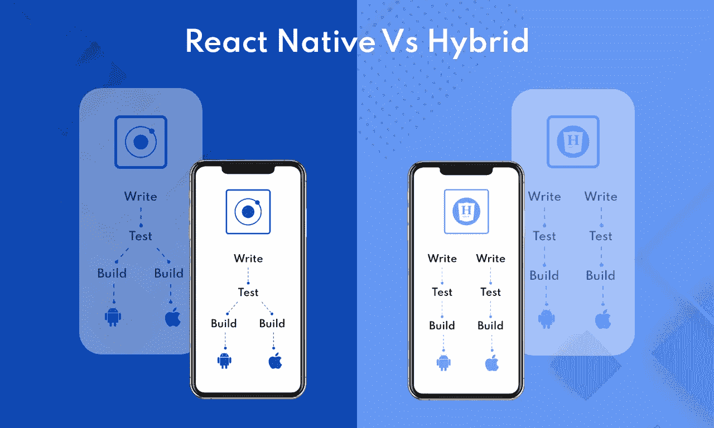
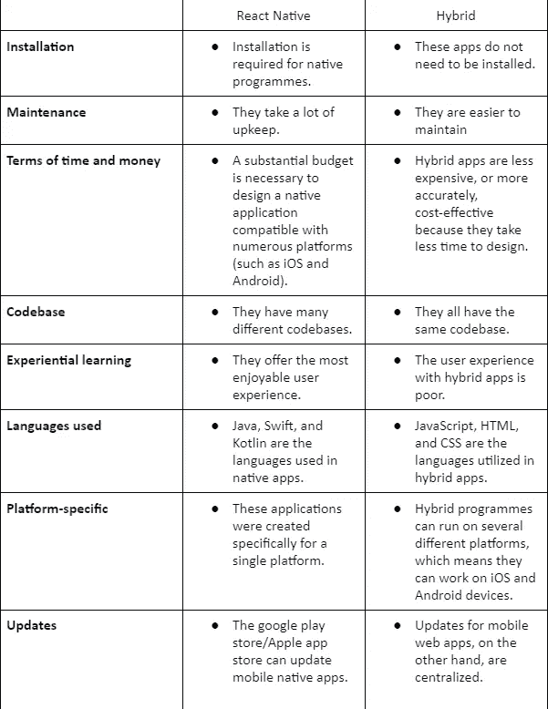

# React Native Vs Hybrid:哪个框架最适合移动应用程序开发

> 原文：<https://medium.com/codex/react-native-vs-hybrid-which-framework-is-best-for-mobile-application-development-26f8718d610c?source=collection_archive---------9----------------------->

## 这篇文章将帮助你决定你应该设计一个 Android 还是 iOS 应用程序。它将让您更好地理解这两种解决方案，以及为什么它们更适合您的业务。

当今世界，有 30 亿活跃的 Android 智能手机用户。总的来说，Android 操作系统很可能会被你的大部分观众所使用。但是，这并不能否定 iPhone 用户有 9 亿的事实。

**反应原生与混合**

这些 iOS 设备用户也被称为您的目标群体(TG ),对您公司的成败有着重大影响。

如果你不确定是否应该设计一个 Android 或 iOS 应用程序，最好的选择是两个都做。

这种程序在每个操作系统上运行，允许企业接触到他们的所有观众，不管他们使用哪种设备。但是，再一次，选择并不简单。您有两种选择来为您的业务开发一个可以在不同操作系统上使用的移动应用程序。你可以使用 react 原生 web 应用或者雇佣一个开发者来创建一个混合应用。

让我们看看这些解决方案，以及为什么我们更喜欢 React Native 而不是混合应用程序开发。

## 什么是 React 原生和混合应用？

React Native 是脸书创建的开源 JavaScript 框架，用于为 Android 和 iOS 开发跨平台移动应用**。开发人员可以通过将 React Native 与各种平台特性连接起来，并平滑地混合所需的功能，来利用 React Native 的优势。开发人员还将使用 react Native 编写 Java、JavaScript、Swift 和 Objective-C 应用程序。**

**另一方面，混合应用结合了本地和在线应用的特点。Web 应用程序运行在各种平台上，可以通过互联网访问。相比之下，本地应用程序是在为特定论坛设计之后安装在计算机上的。**

# **为什么混合 App 开发不适合创业公司？**

## **混合移动应用程序运行缓慢且跨平台不一致**

**这种方法的困难在于，所有平台的 WebView 底层组件都略有不同，无论是 Android、iOS 还是其他平台。提及市场上针对每种特定平台有许多质量不一的设备。**

*   **请这样想:你有一台 Mac、Linux 或 Windows 电脑，如果你和我一样，你至少已经安装了三个浏览器，随时可以使用。因为并非所有的网络浏览器都是一样的，仅仅因为我在 Chrome 上加载了我的应用程序并不意味着它在 Firefox 上也能运行。在任何情况下，不是您直接访问和利用应用程序作为一个本地应用程序，而是您的 web 浏览器为它服务。**

## **调试是复杂的**

**由于额外的层，在混合应用中调试是相当棘手的。开发者将不得不依赖框架来使用操作系统。**

## **用户管理**

**当你要求客户创建一个帐户并在每次加载你的应用时登录，你会发现很难收集到可以帮助你改进的使用和性能指标。另一方面，每次用户加载你的应用程序时添加一个登录屏幕可能会降低参与度，提高跳出率。**

## **缺少图形和 3D 支持。**

**如果您的应用程序需要 3D 组件或视觉上吸引人的图形设计。在这种情况下，本机应用程序是最佳选择，因为混合应用程序将缺乏有吸引力的插图和 3D 功能。如果你想在混合应用中获得 3D 支持，开发人员需要付出额外的努力，使用 Unity 3D 等第三方工具来弥合设计质量差异。**

## **最新的功能现在还不可用**

**每年，谷歌和苹果都会宣布在最新版本的移动操作系统中修改各自的平台。**

**当向混合移动应用程序添加新功能时，速度会慢一点(或慢很多);事情稍微慢了一点(或者慢了很多)。正如我前面提到的，您不能直接从 JavaScript 和 TypeScript 文件中访问本机 API。这意味着你将不得不等待插件开始支持你的特性，等待开发者为你的特性开发一个插件，或者你将不得不自己做一个。这个过程可能需要几天到几个月的时间。**

# **React Native 的优势**

## **急速**

**与其他框架相比，它速度快，并为用户和开发人员提供了功能特性。另一方面，快速开发依赖于各种参数，如部署的堆栈数量、正在开发的应用程序类型等。**

## **增强的安全性**

**基本的开发语言是 JavaScript，它减少了出错的可能性。用 React Native 创建的应用程序很难被破解，因此非常安全。**

## **支持多种平台**

**React 原生框架的最佳特性是其跨平台能力，这意味着一个单一的代码库可以用于 iOS 和 Android 平台。**

## **它节省了很多时间**

**使用这个框架进行应用程序开发的最好理由之一就是这个。如果你使用这个框架，你将不必创建两个独立的 Android 和 iOS。你不必学习或使用两种方言，而且你可以在很短的时间内创建一个应用程序。人们将节省大量时间用于测试和升级。**

## **更好的用户界面/用户体验(UI/UX)**

**移动用户界面是 React Native 的核心。与 AngularJS 等其他框架相比，这个框架看起来更像一个 JavaScript 库，而不是一个框架。**

## **原生用户体验**

**React Native 与 Cordova 等其他跨平台框架的主要区别在于，该应用是在 Web View 中用 HTML 和 JavaScript 编写的。但是，React Native 将直接联系本机平台小部件。**

## **快速重新加载选项**

**你不必用 React Native 一次又一次地执行程序(如果你必须在 React Native 框架内修改源代码的话)。得益于这一功能，您可以快速实时查看变化。**

## **良好的生长条件**

**当谈到跨平台应用程序开发时，它是所有选项中的理想环境。**

## **为什么 React Native 是创业公司最青睐的 App 开发语言？**

*   **单一代码库:在看到其 iOS 应用取得巨大成功后，脸书决定扩展其 JavaScript 库以支持 Android 平台。对于一种独特的框架方法，他们最初专门针对 iOS 平台。**
*   ****初学者和专家代码**:与更复杂的编程语言相比，JavaScript 是一种简单的编程语言。它已经被广泛使用，并拥有一个庞大的开发人员社区。**
*   ****可重用组件**:在混合应用开发中，跨平台开发者依靠 WebView 组件来补充原生组件的功能。Android 组件和原生 iOS 组件已经可以在 React Native 中使用。**
*   ****以 UI 为中心** : React Native 专注于创建移动用户界面；因此，它看起来更像是一个 JavaScript 框架，而不是一个 JavaScript 库。**
*   **预算适中:当谈到管理一家初创公司时，钱总是一个令人担忧的问题。每一家新公司都希望迅速扩张，并尽可能长久地保持市场竞争力。初创公司可以通过使用 React 本地开发人员来减少应用程序开发的时间和费用。**
*   ****改进的用户体验和安全性**:在所有移动平台上，React 原生应用提供了一致且改进的用户体验。它为客户提供了无错误的体验和可接受的加载速度，以及快速适应不同屏幕尺寸的能力。**
*   ****跨平台能力** : React 原生组织可以用相同的代码开发 iOS 和 Android 应用。开发人员可以在两个系统上获得精确的性能结果，而无需额外的成本。**
*   ****与第三方的整合:**与第三方应用的整合对于初创公司来说至关重要。使用 React Native 中即时可用的选项，可以向移动应用程序添加更多功能来增强其特性。**

## **React Native Vs Hybrid:哪个框架最适合移动应用程序开发**

****

****反应本地与混合信息图****

## **包扎**

**React Native 是软件开发中相对现代的解决方案；一些公司和创业公司已经使用了它。他们的经历可能有助于评估它是否适合你的公司。**

**然而，选择合适的技术是应用程序成功的因素之一。所以，在为你的公司做出任何技术决定之前，确保你分析了一切，并且雇佣了一家本土开发公司 。如果你仍然不确定是否采用 react native 来开发你的应用程序，联系Groovy Web 来获得最好的服务。**