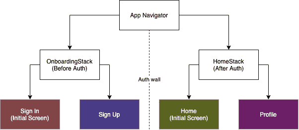

# React 导航:带身份验证的深度链接

> 原文：<https://medium.com/codex/react-navigation-deep-linking-with-authentication-9056eb4a0456?source=collection_archive---------2----------------------->

最近，我有机会使用 [React 导航](https://reactnavigation.org/)解决了一个 [React 原生](https://reactnative.dev/)应用中的深度链接。就像其他银行应用程序一样，重要的屏幕位于身份验证层之后。

# 问题

在这些应用程序中，用户每次打开应用程序时都必须进行身份验证。所有特定于用户的信息都在这堵认证墙后面。这使得深度链接有点棘手，因为一些路线在应用程序加载后就不可用了。

理想情况下，应用程序应该记得在身份验证成功时触发深层链接。但是，对于每个应用程序，成功的身份验证可能有不同的意义。

# 解决办法

我创建了一个队列上下文提供程序，它将保存一组失败的深层链接。导航器中的一个屏幕可以订阅一个事件类型，当用户成功登陆时将触发该事件类型。

# 步骤 1:检查深层链接是否失败

在这个故事发生的时候，我正在和`[@react-navigation/native = "6.0.0"](https://www.npmjs.com/package/@react-navigation/native)`一起工作。为了检查深层链接是否失败，我必须监听 URL 事件，并使用名为`checkDeepLinkResult`的客户助手函数将深层链接的 URL 与[链接模式](https://reactnavigation.org/docs/configuring-links)进行比较。

```
import { createRef } from 'react';
import {
  PartialState,
  NavigationAction,
  NavigationState,
  getStateFromPath,
  getPathFromState,
  getActionFromState,
  NavigationContainerRef,
} from '[@react](http://twitter.com/react)-navigation/native';import { linking } from '../nav';export const DeepLinkSchema = 'RNDeepLinkAuth://';
export const navigationRef = createRef<NavigationContainerRef<any>>();const cleanPathStr = (path: string) => {
  const queryVairablesIndex = path.indexOf('?');
  if (queryVairablesIndex === -1) {
    return path;
  }
  return path.substr(0, queryVairablesIndex);
};export const checkDeepLinkResult = (url: string) => {
  const extractedUrl = url.replace(DeepLinkSchema, '');const currentState = navigationRef.current?.getRootState() as NavigationState;const linkState = getStateFromPath(
    extractedUrl,
    linking.config as any,
  ) as PartialState<NavigationState>;const currentPath = cleanPathStr(getPathFromState(currentState));const linkPath = cleanPathStr(getPathFromState(linkState));const action = getActionFromState(linkState) as NavigationAction;return {
    action,
    linkPath,
    didDeepLinkLand: currentPath === linkPath,
  };
};
```

# 步骤 2:存储失败的深层链接

为了存储失败的深层链接，我创建了一个名为`DeepLinkProvider`的提供者。该提供程序将跟踪数组中所有失败的深层链接。

```
import React, {
  useState,
  createContext,
  FunctionComponent,
  useCallback,
} from 'react';import { DeepLinkEnum } from '../hooks';export interface IDeepLink {
  id: string;
  type: DeepLinkEnum;
  action: () => void | Promise<void>;
}export type DeepLinkContextType = {
  deepLinksState: IDeepLink[];
  addDeepLink: (link: IDeepLink) => void;
  removeDeepLink: (id: string) => void;
};export const DeepLinkContext = createContext<DeepLinkContextType>({
  deepLinksState: [],
  addDeepLink: () => {},
  removeDeepLink: () => {},
});export const DeepLinkProvider: FunctionComponent<unknown> = ({ children }) => {
  const [deepLinksState, setDeepLinksState] = useState<IDeepLink[]>([]);const addDeepLink = useCallback((link: IDeepLink) => {
    setDeepLinksState(prevDeepLinks => [...prevDeepLinks, link]);
  }, []);const removeDeepLink = useCallback((id: string) => {
    setDeepLinksState(prevDeepLinks =>
      prevDeepLinks.filter(link => link.id !== id),
    );
  }, []);return (
    <DeepLinkContext.Provider
      value={{ deepLinksState, addDeepLink, removeDeepLink }}>
      {children}
    </DeepLinkContext.Provider>
  );
};
```

# 步骤 3:向提供者添加失败的深层链接

```
const { 
  action,
  linkPath, 
  didDeepLinkLand,
} = checkDeepLinkResult(url);if (!didDeepLinkLand) {
  addDeepLink({
    id: linkPath,
    type: DeepLinkEnum.NAVIGATION,
    action: () => navigationRef.current?.dispatch(action),
  });
}
```

# 步骤 4:订阅失败的深层链接

一旦设置了深度链接提供者，并通过添加失败的深度链接来利用它，屏幕就可以订阅一个事件类型。一旦用户登陆订阅屏幕，深层链接将在挂载时触发。

```
useDeepLinks([DeepLinkEnum.NAVIGATION]);
```

# 示例应用程序

我已经制作了一个[示例应用程序](https://github.com/ximxim/RNDeepLinkAuth)来更详细地展示这个解决方案。该应用程序的导航设置如下:



试用示例应用程序，如果有任何问题或反馈，请留下评论。我很乐意听到其他人如何在他们的应用程序中解决类似的问题。

# 奖金

这种基础设施的一个好处是添加自定义的深层链接并订阅这些链接。例如，用户同意在登录后听到报价。我们可以添加深层链接并订阅它。

```
addDeepLink({
  id: 'someId',
  type: DeepLinkEnum.OFFER,
  action: () => showOfferModal(),
});
```

[Github](https://github.com/ximxim/RNDeepLinkAuth)